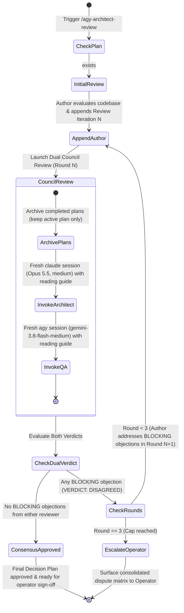

# Tri-Party Architect & QA Cross-Review Workflow (/agy-architect-review)

Use this workflow whenever the user explicitly issues `/agy-architect-review`, `/agy-review`, `/gemini-architect-review`, or asks for an architectural cross-review of an implementation plan. The council reviewers run headless: the **Architect** on **Claude Opus 5.5 (`claude-opus-5-5`, `effort: medium`)** via the `claude` CLI, and the **QA Guardian** on **Gemini 3.8 Flash Medium (`gemini-3.8-flash-medium`)** via the `agy` CLI. (The skill keeps its historical `agy`/`gemini` trigger names; the Architect seat moved from `gemini-3.8-flash-high` to Opus 5.5.)

> **Global skill — never copy it into a project.** This skill is shared by every project. Its single source of truth is
> `graph-engineering/.agents/skills/agy-architect-review/`, exposed globally through a directory junction at
> `$HOME\.gemini\config\plugins\swarm-dev-core\skills\agy-architect-review` (run `graph-engineering/scripts/link-global-skills.ps1` to recreate it).
> Always invoke the helper script through that global path from the target project's root and pass `--plan "<PLAN>"`.

---

## 📄 Plan File Argument (`--plan <path>`)
Usage: `/agy-architect-review [--plan <path>]` (also `/agy-review`, `/gemini-architect-review`); `--path` and `--file` are accepted as aliases of `--plan`.
- **`<PLAN>`** in this document means the plan file for the current run: the file the operator named for this run (see *Resolving `<PLAN>`* below; absolute, or relative to the target project's root), or `docs/draft-requisites/implementation-plan.md` when no path is given.
- `<PLAN>` must already exist for a council review; if it does not, stop and ask the operator, or run `/refine-story --plan <path>` first to create it.
- Completed plans are archived to an `archive/` folder **next to `<PLAN>`**.

### Resolving `<PLAN>` (mandatory, before any other step)
1. **Any file the operator names for this run IS `<PLAN>`** — whether passed as `--plan <path>`, `--path <path>`, `--file <path>`, or mentioned in the request text (e.g. "review the requirement in `docs/.../impl_x.md`"). That file is both the input and the output: refine it **in place**.
2. Use the default `docs/draft-requisites/implementation-plan.md` **only when the operator names no file at all**.
3. **Hard rule:** when `<PLAN>` is not the default file, never create, write, append to, or archive `docs/draft-requisites/implementation-plan.md` (or any other plan file). Every helper-script call gets `--plan "<PLAN>"` with exactly that path.
4. **Raw requirement files:** if `<PLAN>` has no `# 📋 Implementation Plan` heading, it has not been refined yet: run `/refine-story --plan "<PLAN>"` first (which converts it in place) instead of reviewing it or writing a plan elsewhere.
5. State the resolved `<PLAN>` path at the start of your first reply, and confirm the exact file you wrote at the end.

---

## 🎯 Purpose & Core Value: The Tri-Party Review Council

In complex software design, deep architectural debates between author and systems architects often risk **requirements drift**—technical optimizations, deep refactorings, or abstractions can inadvertently drop, dilute, or over-complicate the operator's original user requirements or neglect user experience.

To solve this, the review protocol establishes a **Tri-Party Review Council**:
1. **Author Agent (Synthesizer):** Drafts the initial proposal and synthesizes revisions in response to critiques.
2. **Architect (`claude-opus-5-5`, `effort: medium`):** Scrutinizes systems architecture, concurrency, pipe/lock safety, DB schema integrity, performance, and failure modes.
3. **QA Guardian (`gemini-3.8-flash-medium` via `agy`):** Acts as the **Requirements & UX/UI Guardian**. Strictly enforces that the plan remains 100% faithful to the operator's original requirements, audits the UX/UI experience (or functional correctness if no UI), and verifies Gherkin BDD testability.

### Key Invariants:
1. **Single Medium of Truth:** All communication happens **exclusively** through `<PLAN>` in the target project workspace.
2. **Live File Holds Only the Active Plan:** Completed plans are moved verbatim to `archive/<timestamp>-NN-<slug>.md` next to `<PLAN>` (one file per plan). The audit trail is preserved in the archive; the live file stays small so no reviewer re-reads finished features.
3. **Fresh Session Per Round (No Resume):** Every reviewer invocation is a new session (`claude -p --no-session-persistence` for the Architect, `agy -p` without `-c` for QA). The plan file already carries the full debate history, so resuming sessions (`-c` / `-r`) only re-sends stale context and multiplies token cost round over round.
4. **Scoped Reading:** The helper script hands each reviewer exact line ranges to read — the operator's original proposal, the current Final Decision Plan, the latest author iteration, and the reviewer's own previous review — instead of the whole file. Codebase inspection is limited to files the plan names (~8 files max) and targeted greps.
5. **Blocking vs Non-Blocking Objections:** Reviewers tag every objection `[BLOCKING]` or `[NON-BLOCKING]`. `VERDICT: AGREED` is given when no BLOCKING objections remain. BLOCKING is reserved for correctness bugs, data loss, race conditions, security holes, requirement drift, or untestable acceptance criteria.
6. **Dual Consensus Gate:** Approval requires **both** Architect and QA Guardian to issue `VERDICT: AGREED`.
7. **Hard 3-Round Cap & Guaranteed Operator Escalation:** If after 3 rounds dual agreement is not achieved, execution halts and surfaces a consolidated dispute matrix to the human operator.

---

## 🔄 Lifecycle & State Machine



---

## 🎯 Role Mandates & Rubrics

### 🏛️ Party 1: Architect (`claude-opus-5-5`, `effort: medium`)
- **Lens:** Systems Architecture, Performance, Scalability & Safety
- **Core Checks:**
  - Database schema, locking, index efficiency, migrations.
  - Subprocess pipe deadlocks, Windows buffer saturation, timeout process killing.
  - Concurrency, race conditions, async task boundaries.
  - Backward compatibility, regression risks on existing pipelines.
- **Section Appended:** `## 🏛️ Architect Review Iteration N` (legacy `## 🏛️ Gemini Architect Review Iteration N` headings are still recognized)

### 🧪 Party 2: QA Guardian (`gemini-3.8-flash-medium` via `agy`)
- **Lens:** Requirements Fidelity, UX/UI Experience & Functional Correctness
- **Core Checks:**
  - **Anti-Drift Requirement Guardian:** Cross-checks the proposal against the **user's original prompt and stated constraints**. Disallows dropping, over-abstracting, or altering the user's intent.
  - **UX/UI Experience Audit (If UI exists):** Audits layout ergonomics, interactive states (loading, empty, error, active cursor), visual hierarchy, Rich tables, and user feedback.
  - **Functional Correctness Audit (If no UI exists):** Audits behavioral correctness, input validation, error messages returned to user/logs, edge cases (cold-start, network drop, zero-division), and fail-closed safety.
  - **BDD Acceptance Criteria & Testability:** Confirms Gherkin scenarios are complete, unambiguous, and cover nominal and adversarial paths.
- **Section Appended:** `## 🧪 QA Review Iteration N (Requirements & UX/UI Guardian)` (legacy `## 🧪 Claude QA Review Iteration N (Requirements & UX/UI Guardian)` headings are still recognized)

---

## 🛠️ Step-by-Step Execution Protocol

### Step 1: Target Plan Verification
Resolve `<PLAN>` following *Resolving `<PLAN>`* above (a file named via `--plan`, `--path`, `--file`, or in the request text; the default path only when no file is named) and ensure it exists:
```powershell
<PLAN>   # e.g. docs/specs/checkout-redesign.md, or the default docs/draft-requisites/implementation-plan.md
```
If the file does not exist, prompt the user or run `/refine-story --plan "<PLAN>"` first to establish the initial proposal.
If it has no `# 📋 Implementation Plan` heading, it is still a raw requirement: run `/refine-story --plan "<PLAN>"` first.

**Never run `--archive` in this workflow.** `--archive` moves *every* plan out of the file, including the one you are about to review. Starting a new feature (and archiving the previous one) belongs to `/refine-story`. The council run below already archives older, finished plans automatically while keeping the active one.

### Step 2: Pre-Review / Counter-Proposal (Round N)
Before council review:
1. Inspect the live codebase (`grep_search`, `view_file`) to verify ground truth — only the files the plan touches.
2. Append the author's iteration to `<PLAN>`:
   ```markdown
   ## 🔍 Review Iteration N (Author Perspective)
   ### 1. Ground Truth Codebase Inspection
   ### 2. Architectural Trade-offs & Proposals
   ### 3. Edge Cases & Resilience Strategy
   ```
3. Keep **exactly one** `## 🎯 Final Decision Plan & User Story Specification` section in the active plan. When revising it, replace that section (and move it to the end of the file) instead of appending another full copy. It is the only section that may be edited in place; all iteration and review sections stay append-only, so the history of what changed lives in the iterations.

### Step 3: Council Execution (Architect + QA Guardian)
Invoke the review council non-interactively using the helper script (recommended) or direct CLI commands.

#### Option A: Via Python Helper Script (Recommended)
```powershell
python "$HOME\.gemini\config\plugins\swarm-dev-core\skills\agy-architect-review\scripts\agy_cross_review.py" --plan "<PLAN>" --max-rounds 3
```
The helper script automatically:
- Uses exactly the file given by `--plan` (aliases `--path`, `--file`). Always pass it: without it, the script falls back to searching upward for `docs/draft-requisites/implementation-plan.md`, warns on stderr, and reports `"plan_source": "default"`. If the JSON `plan_path` is not the resolved `<PLAN>`, stop and report it; do not keep working on the other file.
- Archives every completed plan except the active one into `archive/` next to the plan file.
- Builds a per-reviewer reading guide (exact line ranges) for the active plan.
- Runs the Architect (`claude --model claude-opus-5-5 --effort medium`) and then the QA Guardian (`agy --model gemini-3.8-flash-medium`), each as a fresh session.
- Parses both verdicts, surfaces `[BLOCKING]` objections, and enforces the dual consensus gate.
- Emits a structured JSON summary (`plan_path`, `plan_source`, `council_verdict`, `architect_verdict`, `qa_verdict`, `unresolved_points`, `archived_files`).

Overrides: `--architect-model`, `--architect-effort`, `--qa-model`, `--qa-effort`, `--skip-qa`, `--check-status`.

#### Option B: Direct Shell Invocations
Only when the script cannot be used. Give each reviewer the line ranges to read (see the script's reading guide) rather than the whole file.

**1. Architect Invocation:**
```powershell
$architect_prompt = @"
You are the Principal Architect conducting Round N of the Architectural Review of '<PLAN>'.
1. Read ONLY: the original proposal, the current Final Decision Plan, the latest author iteration, and your previous review (line ranges: ...).
2. Inspect only the codebase files the plan names. Do not run tests.
3. Tag every objection [BLOCKING] or [NON-BLOCKING]; BLOCKING = correctness bugs, data loss, races, security, requirement drift, untestable AC.
4. Append a new section titled:
## 🏛️ Architect Review Iteration N
Conclude with VERDICT: AGREED if there are no BLOCKING objections, otherwise VERDICT: DISAGREED.
"@
claude -p $architect_prompt --model claude-opus-5-5 --effort medium --no-session-persistence --dangerously-skip-permissions
```

**2. QA Guardian Invocation:**
```powershell
$qa_prompt = @"
You are the QA Lead & Requirements Guardian conducting Round N of the Review of '<PLAN>'.
1. Read ONLY: the original proposal, the current Final Decision Plan, the latest author iteration, and your previous review (line ranges: ...).
2. Anti-Drift Check: Ensure the plan remains 100% faithful to original requirements without scope creep or dropped invariants.
3. UX/UI & Functional Check: If UI exists, audit UX ergonomics and user feedback; if backend only, audit functional correctness and error handling.
4. Testability Check: Confirm Gherkin BDD criteria cover edge cases and failure modes.
5. Tag every objection [BLOCKING] or [NON-BLOCKING], then append a new section titled:
## 🧪 QA Review Iteration N (Requirements & UX/UI Guardian)
Conclude with VERDICT: AGREED if there are no BLOCKING objections, otherwise VERDICT: DISAGREED.
"@
agy -p $qa_prompt --model gemini-3.8-flash-medium --dangerously-skip-permissions --print-timeout 15m
```

### Step 4: Verdict Analysis & Convergence Check
Read the new review sections (not the whole file).

#### Case 1: Dual Consensus Reached (`Both AGREED`)
- Update the single `## 🎯 Final Decision Plan & User Story Specification`, folding in agreed safeguards and any NON-BLOCKING notes worth adopting.
- Mark status: **✅ APPROVED BY ARCHITECT & QA CONSENSUS**.
- Report completion and present the approved Final Decision Plan to the user.

#### Case 2: Disagreement & Round < 3
- Address the `[BLOCKING]` objections under `## 🏛️ Architect Review Iteration N` and `## 🧪 QA Review Iteration N`. NON-BLOCKING notes may be adopted or explicitly declined in one line each.
- Increment the round count (N → N+1).
- Append `## 🔍 Review Iteration N+1 (Author Response)` and replace the Final Decision Plan section.
- Return to **Step 3** to re-invoke the council for Round N+1.

#### Case 3: Cap Reached (Round == 3 with Disagreement)
- **DO NOT INVOKE COUNCIL AGAIN.**
- Append escalation marker in `<PLAN>`:
  ```markdown
  ## ⚠️ Escalation to Operator: Unresolved Architectural Discrepancies (Round 3 Cap Reached)
  ```
- Extract the exact BLOCKING points of divergence and present an **Operator Dispute Matrix** directly in the chat.

---

## 🚨 Operator Escalation Format (When Round 3 Has No Consensus)

```markdown
### ⚠️ Tri-Party Cross-Review Round 3 Escalation: Unresolved Disagreements

The Author, Architect, and QA Guardian have completed 3 iterative debate rounds via `<PLAN>` without resolving all BLOCKING objections. Execution has halted to request your architectural decision.

#### 📊 Points of Contention Matrix
| Role | Contested Item | Stance & Objections | Proposed Alternative / Risk |
| :--- | :--- | :--- | :--- |
| **Architect** | [System/Technical Item] | ... | ... |
| **QA Guardian** | [Requirement/UX Item] | ... | ... |
| **Author** | [Proposed Synthesis] | ... | ... |

#### 🎯 Action Required from Operator
Please select how you wish to proceed:
- **Option 1:** Adopt the Author proposal.
- **Option 2:** Adopt the Architect's recommendation on technical points and the QA Guardian's recommendation on requirements/UX.
- **Option 3:** Provide specific compromise or custom guidance.
```

---

## 📋 Document Section Naming Standards

In `<PLAN>`, sections MUST strictly use these headers:
- Plan title (one per feature): `# 📋 Implementation Plan: <feature>`
- Initial plan: `## 📋 Initial Implementation Proposal` (or `## 📝 Initial Draft Proposal`)
- Author reviews: `## 🔍 Review Iteration N (Author Perspective)`
- Architect reviews: `## 🏛️ Architect Review Iteration N`
- QA reviews: `## 🧪 QA Review Iteration N (Requirements & UX/UI Guardian)`
- Final decision (exactly one, replaced in place): `## 🎯 Final Decision Plan & User Story Specification`
- Escalation: `## ⚠️ Escalation to Operator: Unresolved Architectural Discrepancies`

---

## ⚡ Upstream Functional Slicing & Direct DevTest Assignment Protocol

When decomposing requirements during `/agy-architect-review` or `/refine-story`, the Tri-Party Council directly provisions issues for `devtest` execution to bypass runtime Architect triage, completely eliminating runtime token consumption.

### 1. Zero-Token Architect Bypass Invariant
- Runtime Architect Node only activates on issues with label `needs-triage`.
- Pre-refined issues are provisioned with labels `architect-processed`, `ready-for-dev`, and `queued`, consuming **0 LLM tokens** at runtime from the Architect Node.

### 2. Pattern Selection
- **Pattern A (Standalone Task, $\le 300$ LOC, $\le 4$ files):**
  - Create a single issue labeled `ready-for-dev` (no parent, no child).
  - DevTest executes directly via Fallback 1 dispatch and closes the issue upon PR merge.
- **Pattern B (Decomposed Feature Story, $> 300$ LOC):**
  - **Parent Feature Issue:** Created with label `architect-processed` and a markdown checklist `- [ ] #<child_id>` in the body.
  - **Parent Audit Comment:** Post an immediate issue comment on the parent linking all child issue numbers (`Child issues: #101, #102`) for search-lag defense.
  - **Child Slice 1:** Created with label `ready-for-dev` and body starting with `Parent: #<parent_id>`.
  - **Child Slices 2..N:** Created with label `queued` and body starting with `Parent: #<parent_id>`.
  - DevTest executes Slice 1, advances the parent checklist via native `_advance_parent_and_unlock_next_subtask`, unlocks Slice 2 to `ready-for-dev`, and marks the parent `dev-implemented` upon completion.

### 3. Strict Pre-Flight Sizing Gate
- Every functional slice must deliver a vertical capability and touch $\le 4$ files with $\le 300$ estimated LOC diff.
- If any slice exceeds this boundary, the Review Council MUST raise a BLOCKING objection and mandate further sub-slicing prior to consensus approval.

### 4. Single Active Feature Invariant (Operational Protocol)
- Only **one active feature parent story** (`architect-processed`) may be provisioned per project at a time.
- Backlog feature stories remain deferred or unprovisioned without `architect-processed` until the active feature merges and closes, preventing SQLite active story lock starvation.

### 5. Deterministic CLI Automation (`/provision-story`)
- Do NOT provision issues manually. Use the companion skill `/provision-story` or run the deterministic CLI command:
  ```powershell
  python -m orchestrator.cli story provision <project_name>
  ```
- Supports `--dry-run` for pre-flight verification, `--pattern A|B` overrides, and automatic triple-redundant comment posting.
