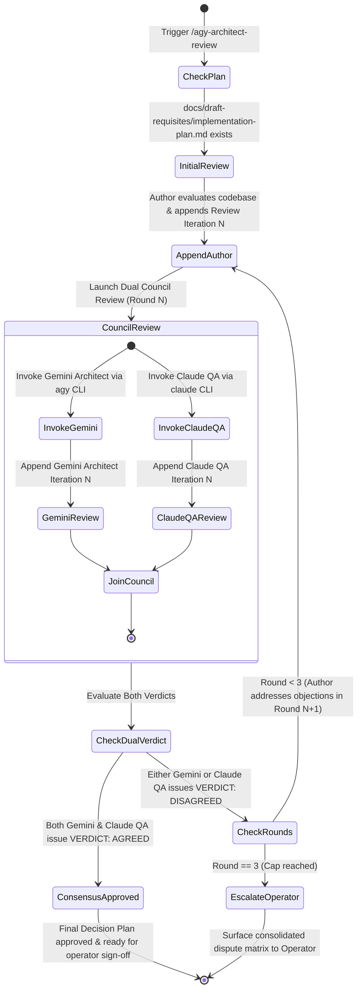

# Antigravity Tri-Party Architect & QA Cross-Review Workflow (/agy-architect-review)

Use this workflow whenever the user explicitly issues `/agy-architect-review`, `/agy-review`, `/gemini-architect-review`, or asks for an architectural cross-review of an implementation plan using the Antigravity (`agy`) CLI powered by **`gemini-3.8-flash-high`** and the Claude QA Guardian powered by **`claude` CLI (`sonnet`, `effort: low`)**.

---

## 🎯 Purpose & Core Value: The Tri-Party Review Council

In complex software design, deep architectural debates between author and systems architects often risk **requirements drift**—technical optimizations, deep refactorings, or abstractions can inadvertently drop, dilute, or over-complicate the operator's original user requirements or neglect user experience.

To solve this, the **Antigravity Review Protocol** establishes a **Tri-Party Review Council**:
1. **Author Agent (Synthesizer):** Drafts the initial proposal and synthesizes revisions in response to critiques.
2. **Gemini Architect (`gemini-3.8-flash-high` via `agy`):** Scrutinizes systems architecture, concurrency, pipe/lock safety, DB schema integrity, performance, and failure modes.
3. **Claude QA Guardian (`sonnet`, `effort: low` via `claude`):** Acts as the **Requirements & UX/UI Guardian**. Strictly enforces that the plan remains 100% faithful to the operator's original requirements, audits the UX/UI experience (or functional correctness if no UI), and verifies Gherkin BDD testability.

### Key Invariants:
1. **Single Medium of Truth:** All communication happens **exclusively** through `docs/draft-requisites/implementation-plan.md` in the target project workspace. All feedback is permanently audited in the living audit trail.
2. **Autonomous Headless Execution & Session Continuity:**
   - Gemini Architect runs via `agy` CLI with `--model gemini-3.8-flash-high --dangerously-skip-permissions -p` (resuming via `-c` in Rounds 2 & 3).
   - Claude QA runs via `claude` CLI with `--model sonnet --effort low --dangerously-skip-permissions -p` (resuming via session ID in Rounds 2 & 3).
3. **Dual Consensus Gate:** Approval requires **both** Gemini Architect (`VERDICT: AGREED`) AND Claude QA (`VERDICT: AGREED`). If either party objects, the plan is NOT approved.
4. **Hard 3-Round Cap:** The debate cannot exceed 3 rounds.
5. **Guaranteed Operator Escalation:** If after 3 rounds dual agreement is not achieved, execution halts immediately and surfaces a consolidated dispute matrix directly to the human operator.

---

## 🔄 Lifecycle & State Machine



---

## 🎯 Role Mandates & Rubrics

### 🏛️ Party 1: Gemini Architect (`gemini-3.8-flash-high`)
- **Lens:** Systems Architecture, Performance, Scalability & Safety
- **Core Checks:**
  - Database schema, locking, index efficiency, migrations.
  - Subprocess pipe deadlocks, Windows buffer saturation, timeout process killing.
  - Concurrency, race conditions, async task boundaries.
  - Backward compatibility, regression risks on existing pipelines.
- **Section Appended:** `## 🏛️ Gemini Architect Review Iteration N`

### 🧪 Party 2: Claude QA Guardian (`sonnet`, `effort: low`)
- **Lens:** Requirements Fidelity, UX/UI Experience & Functional Correctness
- **Core Checks:**
  - **Anti-Drift Requirement Guardian:** Cross-checks proposal line-by-line against the **user's original prompt and stated constraints**. Disallows dropping, over-abstracting, or altering the user's intent.
  - **UX/UI Experience Audit (If UI exists):** Audits layout ergonomics, interactive states (loading, empty, error, active cursor), visual hierarchy, Rich tables, and user feedback.
  - **Functional Correctness Audit (If no UI exists):** Audits behavioral correctness, input validation, error messages returned to user/logs, edge cases (cold-start, network drop, zero-division), and fail-closed safety.
  - **BDD Acceptance Criteria & Testability:** Confirms Gherkin scenarios are complete, unambiguous, and cover nominal and adversarial paths.
- **Section Appended:** `## 🧪 Claude QA Review Iteration N (Requirements & UX/UI Guardian)`

---

## 🛠️ Step-by-Step Execution Protocol

### Step 1: Target Plan Verification
Ensure the target project has an existing implementation plan:
```powershell
<project_root>/docs/draft-requisites/implementation-plan.md
```
If the file does not exist, prompt the user or run `/refine-story` first to establish the initial proposal.

### Step 2: Pre-Review / Counter-Proposal (Round N)
Before council review:
1. Inspect the live codebase (`grep_search`, `view_file`) to verify ground truth.
2. Append the author's iteration to `docs/draft-requisites/implementation-plan.md`:
   ```markdown
   ## 🔍 Review Iteration N (Author Perspective)
   ### 1. Ground Truth Codebase Inspection
   ### 2. Architectural Trade-offs & Proposals
   ### 3. Edge Cases & Resilience Strategy
   ```

### Step 3: Council Execution (Gemini Architect + Claude QA)
Invoke the review council non-interactively using the helper script or direct CLI commands.

#### Option A: Via Python Helper Script (Recommended)
```powershell
python .agents/skills/agy-architect-review/scripts/agy_cross_review.py --max-rounds 3
```
The helper script automatically:
- Resolves the local `docs/draft-requisites/implementation-plan.md`.
- Executes Gemini Architect (`agy --model gemini-3.8-flash-high`) with session continuity (`-c`).
- Executes Claude QA (`claude --model sonnet --effort low`) with session continuity.
- Parses both verdicts and extracts any disagreement points.
- Emits structured JSON summary and enforces the dual consensus gate.

#### Option B: Direct Shell Invocations

**1. Gemini Architect Invocation:**
```powershell
$gemini_prompt = @"
You are the Principal Architect conducting Round N of an unsparing Architectural Review of 'docs/draft-requisites/implementation-plan.md'.
1. Read the plan and inspect the live codebase using your tools.
2. Scrutinize system drawbacks, concurrency hazards, pipe safety, schema locking, and performance.
3. Append a new section titled:
## 🏛️ Gemini Architect Review Iteration N
Must conclude with: VERDICT: AGREED or VERDICT: DISAGREED.
"@

# Round 1:
agy -p $gemini_prompt --model gemini-3.8-flash-high --dangerously-skip-permissions
# Rounds 2 & 3:
agy -c -p $gemini_prompt --model gemini-3.8-flash-high --dangerously-skip-permissions
```

**2. Claude QA Guardian Invocation:**
```powershell
$qa_prompt = @"
You are the QA Lead & Requirements Guardian conducting Round N of the Review of 'docs/draft-requisites/implementation-plan.md'.
1. Read the plan and check the user's original requirements and constraints.
2. Anti-Drift Check: Ensure the plan remains 100% faithful to original requirements without scope creep or dropped invariants.
3. UX/UI & Functional Check: If UI exists, audit UX ergonomics and user feedback; if backend only, audit functional correctness and error handling.
4. Testability Check: Confirm Gherkin BDD criteria cover edge cases and failure modes.
5. Append a new section titled:
## 🧪 Claude QA Review Iteration N (Requirements & UX/UI Guardian)
Must conclude with: VERDICT: AGREED or VERDICT: DISAGREED.
"@

# Round 1:
claude -p $qa_prompt --model sonnet --effort low --dangerously-skip-permissions
# Rounds 2 & 3:
claude -p $qa_prompt --model sonnet --effort low --dangerously-skip-permissions
```

### Step 4: Verdict Analysis & Convergence Check
Read the updated `docs/draft-requisites/implementation-plan.md`.

#### Case 1: Dual Consensus Reached (`Both AGREED`)
- Update `## 🎯 Final Decision Plan & User Story Specification` incorporating all refined insights and agreed safeguards.
- Mark status: **✅ APPROVED BY ARCHITECT & QA CONSENSUS**.
- Report completion and present the approved Final Decision Plan to the user.

#### Case 2: Disagreement & Round < 3
- Analyze objections under both `## 🏛️ Gemini Architect Review Iteration N` and `## 🧪 Claude QA Review Iteration N`.
- Identify required refactorings, requirements clarifications, or UX fixes.
- Increment round count ($N 	o N+1$).
- Append `## 🔍 Review Iteration N+1 (Author Response)` addressing all objections.
- Return to **Step 3** to re-invoke the council for Round $N+1$.

#### Case 3: Cap Reached (Round == 3 with Disagreement)
- **DO NOT INVOKE COUNCIL AGAIN.**
- Append escalation marker in `docs/draft-requisites/implementation-plan.md`:
  ```markdown
  ## ⚠️ Escalation to Operator: Unresolved Architectural Discrepancies (Round 3 Cap Reached)
  ```
- Extract the exact points of divergence and present an **Operator Dispute Matrix** directly in the chat.

---

## 🚨 Operator Escalation Format (When Round 3 Has No Consensus)

```markdown
### ⚠️ Tri-Party Cross-Review Round 3 Escalation: Unresolved Disagreements

The Author, Gemini Architect, and Claude QA Guardian have completed 3 iterative debate rounds via `implementation-plan.md` without reaching 100% consensus. Execution has halted to request your architectural decision.

#### 📊 Points of Contention Matrix
| Role | Contested Item | Stance & Objections | Proposed Alternative / Risk |
| :--- | :--- | :--- | :--- |
| **Gemini Architect** | [System/Technical Item] | ... | ... |
| **Claude QA** | [Requirement/UX Item] | ... | ... |
| **Author** | [Proposed Synthesis] | ... | ... |

#### 🎯 Action Required from Operator
Please select how you wish to proceed:
- **Option 1:** Adopt the Author proposal.
- **Option 2:** Adopt Gemini Architect's recommendation on technical points and Claude QA's recommendation on requirements/UX.
- **Option 3:** Provide specific compromise or custom guidance.
```

---

## 📋 Document Section Naming Standards

In `docs/draft-requisites/implementation-plan.md`, sections MUST strictly use these headers:
- Initial plan: `## 📋 Initial Implementation Proposal`
- Author reviews: `## 🔍 Review Iteration N (Author Perspective)`
- Gemini Architect reviews: `## 🏛️ Gemini Architect Review Iteration N`
- Claude QA reviews: `## 🧪 Claude QA Review Iteration N (Requirements & UX/UI Guardian)`
- Final decision: `## 🎯 Final Decision Plan & User Story Specification`
- Escalation: `## ⚠️ Escalation to Operator: Unresolved Architectural Discrepancies`

---

## ⚡ Upstream Functional Slicing & Direct DevTest Assignment Protocol

When decomposing requirements during `/agy-architect-review` or `/refine-story`, the Tri-Party Council directly provisions issues for `devtest` execution to bypass runtime Architect triage, completely eliminating runtime token consumption.

### 1. Zero-Token Architect Bypass Invariant
- Runtime Architect Node only activates on issues with label `needs-triage`.
- Pre-refined issues are provisioned with labels `architect-processed`, `ready-for-dev`, and `queued`, consuming **0 LLM tokens** at runtime from the Architect Node.

### 2. Pattern Selection
- **Pattern A (Standalone Task, $\le 300$ LOC, $\le 4$ files):**
  - Create a single issue labeled `ready-for-dev` (no parent, no child).
  - DevTest executes directly via Fallback 1 dispatch and closes the issue upon PR merge.
- **Pattern B (Decomposed Feature Story, $> 300$ LOC):**
  - **Parent Feature Issue:** Created with label `architect-processed` and a markdown checklist `- [ ] #<child_id>` in the body.
  - **Parent Audit Comment:** Post an immediate issue comment on the parent linking all child issue numbers (`Child issues: #101, #102`) for search-lag defense.
  - **Child Slice 1:** Created with label `ready-for-dev` and body starting with `Parent: #<parent_id>`.
  - **Child Slices 2..N:** Created with label `queued` and body starting with `Parent: #<parent_id>`.
  - DevTest executes Slice 1, advances the parent checklist via native `_advance_parent_and_unlock_next_subtask`, unlocks Slice 2 to `ready-for-dev`, and marks the parent `dev-implemented` upon completion.

### 3. Strict Pre-Flight Sizing Gate
- Every functional slice must deliver a vertical capability and touch $\le 4$ files with $\le 300$ estimated LOC diff.
- If any slice exceeds this boundary, the Review Council MUST reject the slice and mandate further sub-slicing prior to consensus approval.

### 4. Single Active Feature Invariant (Operational Protocol)
- Only **one active feature parent story** (`architect-processed`) may be provisioned per project at a time.
- Backlog feature stories remain deferred or unprovisioned without `architect-processed` until the active feature merges and closes, preventing SQLite active story lock starvation.

