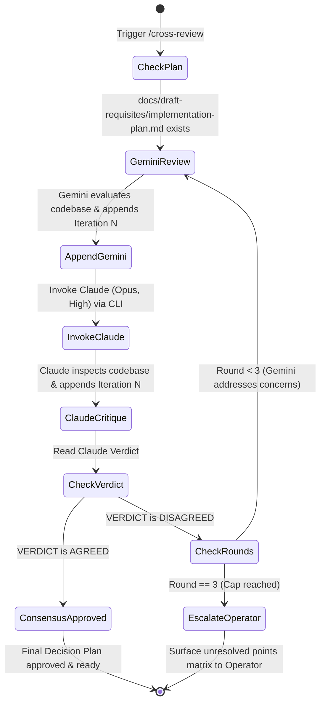

# Claude Architect Cross-Review Workflow (/cross-review)

Use this workflow whenever the user explicitly issues `/cross-review`, `/claude-review`, `/claude-architect-review`, or asks for a cross-review between Gemini and Claude on an implementation plan.

---

## 🎯 Purpose & Core Value

This skill orchestrates a rigorous, bi-directional architectural dialogue between **Gemini** and **Claude (Opus 4.5, Medium effort)** to pressure-test, critique, and align on an implementation plan.

Key invariants:
1. **Single Medium of Truth:** All communication happens **exclusively** through `docs/draft-requisites/implementation-plan.md` in the target project workspace. Neither agent communicates through ephemeral chat buffers; all feedback is permanently audited.
2. **Autonomous Headless Claude Execution:** Claude is invoked via `claude` CLI with `--model opus --effort medium --dangerously-skip-permissions -p`.
3. **Hard 3-Round Cap:** The debate cannot exceed 3 rounds.
4. **Guaranteed Operator Escalation:** If after 3 rounds agreement is not achieved (`VERDICT: AGREED`), execution halts immediately and the skill surfaces a structured dispute matrix of unresolved points directly to the human operator.

---

## 🔄 Lifecycle & State Machine



---

## 🛠️ Step-by-Step Execution Protocol

### Step 1: Target Plan Verification
Ensure the target project has an existing implementation plan:
```powershell
<project_root>/docs/draft-requisites/implementation-plan.md
```
If the file does not exist, prompt the user or run `/refine-story` first to establish the initial proposal.

### Step 2: Gemini Pre-Review / Counter-Proposal (Round N)
Before or between Claude invocations, Gemini must:
1. Inspect the live codebase (`grep_search`, `view_file`) to verify ground truth.
2. Append its architectural perspective to `docs/draft-requisites/implementation-plan.md`:
   ```markdown
   ## 🔍 Review Iteration N (Gemini Perspective)
   ### 1. Ground Truth Codebase Inspection
   ### 2. Architectural Trade-offs & Proposals
   ### 3. Edge Cases & Resilience Strategy
   ```

### Step 3: Headless Claude (Opus Medium) Execution
Invoke Claude non-interactively using the provided helper script or direct CLI command.

#### Option A: Via Python Helper Script
```powershell
python <skill_path>/scripts/cross_review.py --model opus --effort medium --max-rounds 3
```
The helper script automatically:
- Resolves the local `docs/draft-requisites/implementation-plan.md`.
- Formulates the architectural critique prompt.
- Executes `claude -p ... --model opus --effort medium --dangerously-skip-permissions`.
- Parses Claude's appended section and verdict.
- Emits structured JSON summary.

#### Option B: Direct Shell Invocation
```powershell
$prompt = @"
You are the Principal Architect conducting Round N of an unsparing, hyper-critical Architectural Review of 'docs/draft-requisites/implementation-plan.md'.
1. Read the plan and inspect the live codebase using your Read/Grep/Bash tools.
2. Scrutinize all drawbacks, architectural hazards, performance bottlenecks, schema locking, and backward-compatibility risks.
3. Append a new section to 'docs/draft-requisites/implementation-plan.md' titled:
## 🏛️ Claude Opus Review Iteration N
Must conclude with either:
VERDICT: AGREED (only if 100% sound with zero unresolved drawbacks) or VERDICT: DISAGREED.
4. Output a concise 3-5 bullet point summary to stdout.
"@

claude -p $prompt --model opus --effort medium --dangerously-skip-permissions
```

### Step 4: Verdict Analysis & Convergence Check
Read the updated `docs/draft-requisites/implementation-plan.md`.

#### Case 1: Consensus Reached (`VERDICT: AGREED`)
- Update `## 🎯 Final Decision Plan & User Story Specification` incorporating all refined insights and agreed safeguards.
- Mark status: **APPROVED BY GEMINI & CLAUDE OPUS**.
- Report completion and present the approved Final Decision Plan to the user.

#### Case 2: Disagreement & Round < 3
- Analyze Claude's objections under `## 🏛️ Claude Opus Review Iteration N`.
- Identify whether concessions, architectural refactoring, or code-grounded explanations are needed.
- Increment round count ($N \to N+1$).
- Gemini appends `## 🔍 Review Iteration N+1 (Gemini Response to Claude)` addressing every objection.
- Return to **Step 3** to re-invoke Claude for Round $N+1$.

#### Case 3: Cap Reached (Round == 3 with Disagreement)
- **DO NOT INVOKE CLAUDE AGAIN.**
- Append escalation marker in `docs/draft-requisites/implementation-plan.md`:
  ```markdown
  ## ⚠️ Escalation to Operator: Unresolved Architectural Discrepancies (Round 3 Cap Reached)
  ```
- Extract the exact points of divergence and present an **Operator Dispute Matrix** directly in the chat.

---

## 🚨 Operator Escalation Format (When Round 3 Has No Consensus)

When Round 3 finishes without consensus, output the following structured briefing directly to the operator:

```markdown
### ⚠️ Cross-Review Round 3 Escalation: Unresolved Architectural Disagreements

Gemini and Claude (Opus, High) have completed 3 iterative debate rounds via `implementation-plan.md` without reaching 100% consensus. As per protocol, execution has halted to request your architectural decision.

#### 📊 Points of Contention Matrix
| Contested Item | Gemini Stance & Rationale | Claude (Opus) Stance & Rationale | Risk / Trade-Off |
| :--- | :--- | :--- | :--- |
| **1. [Topic A]** | ... | ... | ... |
| **2. [Topic B]** | ... | ... | ... |

#### 🎯 Action Required from Operator
Please select how you wish to proceed:
- **Option 1:** Adopt Gemini's proposal for [Topic A] and [Topic B].
- **Option 2:** Adopt Claude Opus's proposal for [Topic A] and [Topic B].
- **Option 3:** Provide specific compromise or custom guidance.
```

---

## 📋 Document Section Naming Standards

In `docs/draft-requisites/implementation-plan.md`, sections MUST strictly use these headers:
- Initial plan: `## 📋 Initial Implementation Proposal`
- Gemini reviews: `## 🔍 Review Iteration N (Gemini Perspective)`
- Claude reviews: `## 🏛️ Claude Opus Review Iteration N`
- Final decision: `## 🎯 Final Decision Plan & User Story Specification`
- Escalation: `## ⚠️ Escalation to Operator: Unresolved Architectural Discrepancies`
