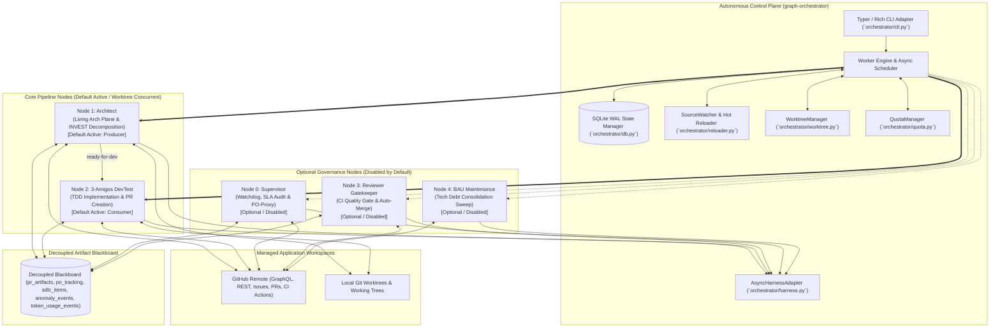
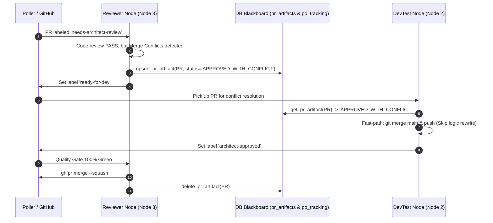
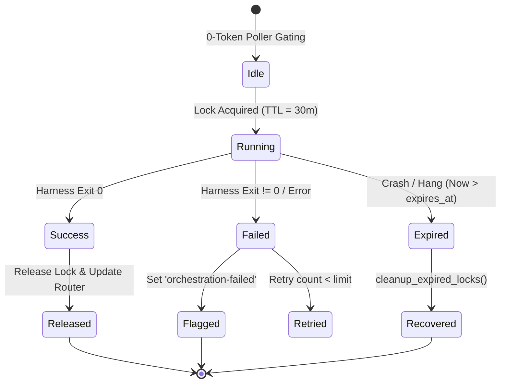
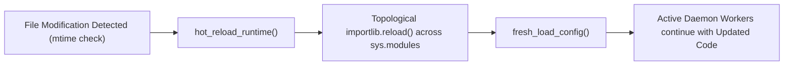

# Architecture & Engineering Standards (`.graph/architecture.md`)

**Repository**: `AntaresAndBharani/graph-engineering`  
**System**: Graph Orchestrator (`graph-orchestrator`)  
**Status**: Living Architecture Standard (Weekly Synchronized & Event-Driven)  
**Target Runtime**: Python 3.11+ | Linux / macOS / Windows  

---

## System Overview & Technology Stack

### System Overview
`graph-orchestrator` is a decoupled, local-first control-plane daemon engineered to coordinate autonomous multi-agent software engineering pipelines across distributed repositories. It establishes an intelligent bridge between local developer workspaces, cloud code hosting platforms (GitHub), and pluggable AI CLI execution harnesses (Antigravity, Claude Code, Devin).

The default operational architecture is a **Streamlined 2-Node Parallel Engine** consisting of **Architect** (Node 1: Producer) and **3-Amigos DevTest** (Node 2: Consumer) executing concurrently within isolated Git worktrees. Additional specialized governance nodes—**Supervisor** (Node 0: Watchdog & PO-Proxy), **Reviewer Gatekeeper** (Node 3: Auto-Merge Gate), and **BAU Maintenance** (Node 4: Tech Debt Sweep)—are available as modular, **optional/disabled-by-default** components that can be enabled on demand.

The architecture is governed by **Zero-Token Idle Gating**: all repository inspections, issue status checks, label audits, pull request evaluations, and mergeability scans execute deterministically via local CLI tooling (GitHub CLI `gh`, Git, SQLite WAL) with zero token consumption. External AI harnesses are dispatched strictly when actionable tasks require deep reasoning, code implementation, INVEST story decomposition, or semantic conflict resolution.



### Autonomous Pipeline Nodes & Topology Matrix

| Node | Name | Default State | Primary Responsibility | Trigger Condition | Harness / Model Tier |
|---|---|---|---|---|---|
| **Node 1** | **Architect** (`architect.py`) | **Active / Enabled** (Producer) | Living architecture sync (7-day SLA), INVEST story decomposition, subtask linking, and PR architectural reviews. | Label `needs-triage` or Weekly SLA trigger | Pluggable Research Harness (`antigravity`/`gemini-3.7-flash-high`) / Primary (`claude-sonnet-5`) |
| **Node 2** | **3-Amigos DevTest** (`devtest.py`) | **Active / Enabled** (Consumer) | Pre-flight git safety check, TDD test suite generation, clean implementation, and autonomous PR opening / auto-merge. | Label `ready-for-dev` | Primary Implementation Harness (`antigravity` / `claude`) |
| **Node 0** | **Supervisor** (`supervisor.py`) | **Optional / Disabled** | Consistency watchdog, 12h SLA audit, proactive PO-proxy requirement evaluation, SHA-256 hash gating, and anomaly self-healing. | Scheduled interval (default 1h) or Label `needs-po-review` | Fast PO Evaluation (`antigravity`/`gemini-3.7-flash-low`) + Zero-token audit |
| **Node 3** | **Reviewer Gatekeeper** (`reviewer.py`) | **Optional / Disabled** | Remote CI quality gate verification (100% green required), autonomous merge conflict resolution, and squash auto-merge. | Label `architect-approved` / `needs-architect-review` | Fast Conflict Harness (`antigravity`/`gemini-3.7-flash-low`) + Deterministic `gh` |
| **Node 4** | **BAU Maintenance** (`bau.py`) | **Optional / Disabled** | Daily 24h maintenance sweep consolidating `tech-debt` and `enhancement` tickets into structured User Stories. | Daily interval (`bau_interval_seconds`, default 24h) | Cost-effective synthesis (`antigravity`/`gemini-3.7-flash-low`) |

---

### Technology Stack Matrix

| Layer / Concern | Technology | Version / Standard | Architectural Rationale |
|---|---|---|---|
| **Runtime & Language** | Python | `>=3.11` | Modern `asyncio` primitives, `TaskGroup`, exception groups, enhanced type hinting (`typing.Self`, union `|`), and high-performance execution. |
| **Build & Packaging** | Hatchling | PEP 517 / PEP 621 | Modern declarative metadata in `pyproject.toml`, reproducible wheel distribution, zero legacy setup scripts. |
| **CLI & Terminal UX** | Typer + Rich + Textual | `typer>=0.12.0`, `rich>=13.7.0`, `textual>=0.50.0` | Declarative command routing with type annotations, interactive TUI observability dashboard (`DashboardApp`), bounded log streaming (`TextualLogHandler`), formatted terminal diagnostics, live progress rendering, and ANSI-stripped output streaming. |
| **Configuration & Validation** | Pydantic v2 | `pydantic>=2.6.0` | Rust-backed schema validation, cross-platform path resolution (`~`, `$HOME`, `%USERPROFILE%`), strict runtime validation. |
| **Persistence & State Engine** | aiosqlite (SQLite WAL) | `aiosqlite>=0.20.0` | Asynchronous file-based persistence, Write-Ahead Logging (WAL) concurrency, deterministic TTL distributed locking, and Artifact Blackboard store. |
| **Process & Subprocess Lifecycle** | psutil | `psutil>=5.9.0` | Cross-platform recursive process tree inspection, child process termination, and graceful shutdown without zombie processes. |
| **Dynamic Runtime Reloading** | importlib + mtime scanner | Standard Library | Hot reloading of configuration and in-memory Python modules without stopping the running daemon. |
| **Environment & Secrets** | python-dotenv + PyYAML | `pyyaml>=6.0.1`, `python-dotenv>=1.0.0` | Secure environment variable injection and human-readable hierarchical configuration. |
| **Testing & Quality Assurance** | pytest + pytest-asyncio | `pytest>=8.0.0`, `pytest-asyncio>=0.23.0` | Asynchronous unit, mock, and integration test coverage with zero-token assertions. |

---

## Layer Boundaries & Clean Architecture (Domain, Data, Presentation/UI separation of concerns)

The system follows a strict **Concentric Clean Architecture (Hexagonal / Ports and Adapters)**. The fundamental architectural invariant is the **Dependency Rule**: dependencies point strictly inward toward Domain and Application cores. External infrastructure, databases, and UI CLI commands must never dictate or leak into domain models.

```mermaid
graph TD
    subgraph Layer 4: Presentation & UI Adapters
        CLI_Commands["Typer CLI Commands (`orchestrator/cli.py`)"]
        TUI_Dashboard["Textual TUI Observability Dashboard (`orchestrator/ui/dashboard.py`, `orchestrator/ui/widgets.py`)"]
        Rich_Formatters["Rich Terminal Formatters, Tables & Live Views"]
    end

    subgraph Layer 3: Application Nodes & Use Cases
        SupervisorNode["Supervisor Node (`orchestrator/nodes/supervisor.py`)"]
        ArchitectNode["Architect Node (`orchestrator/nodes/architect.py`)"]
        DevTestNode["DevTest Node (`orchestrator/nodes/devtest.py`)"]
        ReviewerNode["Reviewer Node (`orchestrator/nodes/reviewer.py`)"]
        BAUNode["BAU Node (`orchestrator/nodes/bau.py`)"]
    end

    subgraph Layer 2: Infrastructure & External Adapters
        HarnessAdapter["Harness Adapter (`orchestrator/harness.py`)"]
        SQLiteManager["State & Blackboard Manager (`orchestrator/db.py`)"]
        QuotaEngine["Quota & Runway Gating Engine (`orchestrator/quota.py`)"]
        GitHubPoller["Zero-Token GitHub Poller (`orchestrator/poller.py`)"]
        Housekeeping["Label Provisioner (`orchestrator/housekeeping.py`)"]
        ReloaderWatcher["Source Watcher (`orchestrator/reloader.py`)"]
        WorktreeMgr["Worktree Manager (`orchestrator/worktree.py`)"]
    end

    subgraph Layer 1: Domain Core & Configuration
        ConfigDomain["Configuration Models (`orchestrator/config.py`)"]
        LoggingDomain["Logging Protocols & ANSI Utilities (`orchestrator/logging.py`)"]
    end

    Layer 4 --> Layer 3
    Layer 3 --> Layer 2
    Layer 3 --> Layer 1
    Layer 2 --> Layer 1
```

### Separation of Concerns

1. **Domain Core Layer (`orchestrator/config.py`, `orchestrator/logging.py`)**:
   - Holds core immutable entities, taxonomy schemas (`managed_labels`), harness definitions (`HarnessConfig`), quota configuration structures (`HarnessQuotaConfig`, `QuotaSettings`), and configuration data structures (`GlobalConfig`, `ProjectConfig`, `NodeConfig`, `SettingsConfig`).
   - Strictly isolated from concrete execution logic, database calls, and network I/O.
   - Provides pure path normalization, environment resolution functions (`resolve_path`), in-memory bounded project-scoped log buffering with `(node_name, line)` tuple storage, independent node filtering, and per-node disk-tailing fallback (`ProjectLogBufferManager`), and bounded log streaming (`TextualLogHandler`).

2. **Infrastructure & Ports/Adapters Layer (`orchestrator/db.py`, `orchestrator/harness.py`, `orchestrator/quota.py`, `orchestrator/poller.py`, `orchestrator/housekeeping.py`, `orchestrator/reloader.py`, `orchestrator/worktree.py`)**:
   - Manages state persistence and distributed locking via SQLite WAL transactions (`StateManager`).
   - Implements multi-window rolling quota calculations, velocity tracking, runway gating, and replenishment ETA projections (`QuotaManager`), decoupled from persistence through the typed `TokenUsageReader` protocol.
   - Manages creation, synchronization, safe removal, and pruning of ephemeral git worktrees per node and project with serial execution fallback (`WorktreeManager`).
   - Implements asynchronous process execution, process tree lifecycle, ANSI-sanitized log streaming with `(project_name, node_name, line)` listener callbacks, and harness-level telemetry anomaly event production (`AsyncHarnessAdapter` writing retry/timeout anomalies to `anomaly_events`).
   - Interacts with GitHub via zero-token subprocess calls (`fetch_issues_with_label`, `fetch_all_open_issues`, `fetch_open_prs`, `sync_repository_labels`).
   - Manages dynamic file modification inspection (`SourceWatcher`).

3. **Application Pipeline Nodes Layer (`orchestrator/nodes/*`)**:
   - Houses the discrete workflow engines representing each stage of the engineering lifecycle:
     - **Default Active 2-Node Parallel Engine**:
       - `node-architect` (Node 1: Producer): Story triage, INVEST decomposition, living architecture plane synchronization, and PR architectural reviews.
       - `node-devtest` (Node 2: Consumer): Pre-flight workspace validation, destructive git safety verification, test-driven implementation, local/CI verification, autonomous auto-merge, and pull request generation.
     - **Modular Optional Governance Nodes (Disabled by Default)**:
       - `node-supervisor` (Node 0: Watchdog & PO-Proxy): Watchdog auditing, 12-hour SLA tracking, PO-proxy Gherkin evaluation, and conflict self-healing.
       - `node-reviewer` (Node 3: Quality Gatekeeper): Dedicated remote CI quality gate verification (100% green requirement), autonomous merge conflict resolution, and auto-merge execution.
       - `node-bau` (Node 4: Maintenance Sweep): Daily 24-hour maintenance sweep synthesizing tech debt into structured User Stories.

4. **Presentation & CLI Layer (`orchestrator/cli.py`, `orchestrator/ui/dashboard.py`, `orchestrator/ui/widgets.py`)**:
   - Pure UI adapter handling command-line arguments, options (`--dashboard/--no-dashboard`, `--headless`), terminal dashboards (`DashboardApp`), and signal handling.
   - Encapsulates modular Textual widgets (`SDLCProgressWidget`, `AnomalyAlertsWidget`, `HarnessQuotaWidget`) as read-only consumers of the SQLite Blackboard and `QuotaManager` via Dependency Injection.
   - Commands: `run`, `watch` (with interactive Textual TUI dashboard and headless fallback), `list`, `init`, `labels`, `doctor`, `ingest`, `clean`, `logs`, `pause`, `resume`, `stop`, `reload`, `artifact`, `artifacts`, `supervisor`.
   - Coordinates parallel workers across projects (Level 1 Inter-Project Concurrency) and executes Architect (producer) and DevTest (consumer) concurrently per project via `asyncio.gather` (Level 2 Intra-Project Concurrency) with complete failure isolation and non-destructive serial fallback, while handling graceful daemon shutdown, live reloading, and non-blocking TUI observability.

---

## Directory & Package Structure Guidelines

```text
graph-engineering/
├── .github/                         # GitHub Actions CI workflows, issue templates
├── .graph/                          # Living architecture plane standards
│   └── architecture.md              # Living Architectural Standards (Weekly Synchronized)
├── docs/                            # Node and pipeline documentation specifications
│   ├── draft-requisites/            # Architectural epics and requisites specifications
│   │   └── 000000-prreviewprotocol.md # Anti-Gravity Blackboard PR protocol spec
│   ├── e2e-testing-recommendations.md # E2E testing architecture recommendations
│   ├── local-cli-pipeline.md        # Comprehensive pipeline manual and architecture guide
│   ├── node-cli.md                  # CLI & Terminal Dashboard specification
│   ├── node-supervisor.md           # Node 0 specification
│   ├── node-architect.md            # Node 1 specification
│   ├── node-devtest.md              # Node 2 specification
│   ├── node-reviewer.md             # Node 3 specification
│   └── node-bau.md                  # Node 4 specification
├── orchestrator/                    # Primary Python package root
│   ├── __init__.py                  # Package metadata and __version__
│   ├── cli.py                       # Typer CLI application entry point and daemon runner
│   ├── config.py                    # Pydantic v2 schemas and path resolution utilities
│   ├── db.py                        # Asynchronous SQLite state, distributed lock & blackboard manager
│   ├── harness.py                   # Pluggable AI CLI adapter (Claude, Antigravity, Devin)
│   ├── housekeeping.py              # GitHub label provisioning and taxonomy synchronization
│   ├── logging.py                   # Unified file and console logging with ANSI sanitization & TextualLogHandler
│   ├── poller.py                    # Zero-token GitHub CLI/GraphQL query abstraction
│   ├── quota.py                     # Multi-window rolling token quota, burn velocity & replenishment ETA engine
│   ├── reloader.py                  # Hot-reloading watcher and module re-importer
│   ├── worktree.py                  # Ephemeral git worktree manager and lifecycle fallback
│   ├── ui/                          # Presentation & TUI dashboard package
│   │   ├── __init__.py              # Subpackage exports
│   │   ├── dashboard.py             # DashboardApp Textual TUI with DataTable & RichLog
│   │   └── widgets.py               # Read-only UI widgets (SDLCProgressWidget, AnomalyAlertsWidget, HarnessQuotaWidget)
│   └── nodes/                       # Autonomous pipeline node handlers
│       ├── __init__.py              # Subpackage exports
│       ├── architect.py             # Living architecture & story decomposition node
│       ├── bau.py                   # Business-as-usual tech debt consolidation node
│       ├── devtest.py               # 3-Amigos development and testing node
│       ├── reviewer.py              # Reviewer quality gatekeeper and auto-merge node
│       └── supervisor.py            # Watchdog consistency supervisor node
├── templates/                       # Reference templates and starter configurations
│   └── config.example.yaml          # Master orchestrator configuration template (v2)
├── tests/                           # Comprehensive automated test suite
│   ├── test_architect_governance.py # Architect SLA and zero-token tests
│   ├── test_cli.py                  # CLI commands and UI diagnostics tests
│   ├── test_config.py               # Configuration loading and path expansion tests
│   ├── test_dashboard.py            # Textual dashboard, log handler, and UI tests
│   ├── test_db.py                   # State manager, TTL, and Blackboard tests
│   ├── test_harness.py              # Subprocess harness execution and timeout tests
│   ├── test_logging.py              # Log rotation and ANSI strip tests
│   ├── test_nodes.py                # Node workflow execution and boundary tests
│   ├── test_project_pause.py        # Per-project pause/resume lifecycle tests
│   ├── test_quota.py                # QuotaManager, velocity, runway gating, and token parser tests
│   ├── test_reloader.py             # Hot reloading and source watcher tests
│   ├── test_stop.py                 # Graceful daemon shutdown tests
│   ├── test_supervisor_po.py        # Supervisor PO-proxy evaluation tests
│   ├── test_worktrees.py            # WorktreeManager lifecycle, sync, and fallback tests
│   └── __init__.py                  # Test package root
├── pyproject.toml                   # PEP 517/PEP 621 build specification (Hatchling)
├── CHANGELOG.md                     # Keep a Changelog historical log
└── README.md                        # System overview and quickstart guide
```

### Module Responsibilities & Conventions

- **One Domain Per Node**: Every node in `orchestrator/nodes/` must expose a clear public entry point: `run_<nodename>_node(project, config, state_manager) -> tuple[bool, str]`.
- **Zero-Token Pre-Gating**: Node entry functions must check deterministic conditions (labels, SLAs, schedule intervals) before performing any state locking or subprocess spawning.
- **Pure Function Extraction**: Business logic (e.g. anomaly detection, git URL parsing, timestamp parsing) must be separated into pure helper functions to ensure 100% testability with unit mocks.
- **Explicit Typing**: All functions must have complete type annotations (`from __future__ import annotations`).
- **Disabled Node Resource Isolation**: CLI loops and schedulers must never allocate resources (memory buffers, git worktrees) for disabled nodes (`node.enabled == False`).
- **Startup Node Status Registry**: CLI daemon initialization must render a formatted Rich status table registering all project nodes, their enabled status, harness, and concurrency mode.

---

## Design Patterns, State Management & Dependency Injection

### 1. Decoupled Artifact Blackboard Pattern (`pr_artifacts`, `po_tracking`, `sdlc_items`, `anomaly_events` & `token_usage_events`)
To prevent brittle multi-agent state machines and communication loss between asynchronous nodes, the system implements an **Artifact Blackboard** pattern stored in SQLite WAL:
- **Routing vs. State**: GitHub Labels act as the event-driven *Router* (`poller.py`), while SQLite acts as the *Blackboard* (`pr_artifacts`, `po_tracking`, `sdlc_items`, `anomaly_events`, `token_usage_events`).
- **Context Sharing (PRs)**: When `ReviewerNode` evaluates a PR that has passing code reviews but git merge conflicts, it writes an `APPROVED_WITH_CONFLICT` decision artifact to the blackboard. `DevTestNode` reads the blackboard and performs pure conflict resolution without repeating code reviews.
- **PO Issue Tracking & Hash Gating (`po_tracking`)**: When `SupervisorNode` evaluates an issue labeled `needs-po-review`, it records its SHA-256 body hash, readiness status (`PO_APPROVED` or `NEEDS_HUMAN_CLARIFICATION`), generated Gherkin AC, and detected blockers. Subsequent cycles use the stored hash to short-circuit unchanged issues with zero LLM tokens.
- **Architect Triage Context Ingestion (`po_tracking`)**: When `ArchitectNode` evaluates an issue labeled `needs-triage`, it queries `get_po_tracking(repo, issue_number)` on the Blackboard. If a pre-approved Gherkin Acceptance Criteria artifact (`PO_APPROVED`) is found, it is injected directly into the triage prompt context, bypassing redundant requirement re-derivation and ensuring end-to-end alignment with the Product Owner's intent.
- **SDLC Item & Telemetry Synchronization (`sdlc_items` & `anomaly_events`)**: Application Pipeline Nodes (Layer 3) act as primary producers writing active issue/subtask/PR statuses (`sync_project_sdlc_items`) and domain-level anomalies into SQLite WAL, while `AsyncHarnessAdapter` (Layer 2 Infrastructure) acts as a secondary/harness-level producer writing telemetry anomalies, transient retry exceptions, and SLA violation events (`record_anomaly_event`). The TUI presentation layer (Layer 4 widgets `SDLCProgressWidget` and `AnomalyAlertsWidget`) serves as a pure read-only consumer, maintaining Zero-HTTP UI latency and strict Clean Architecture decoupling.
- **Token Usage Ledger & Multi-Window Quota Gating (`token_usage_events`)**: Execution harnesses record token consumption events into SQLite WAL (`record_token_usage_event`). `StateManager` provides zero-timezone-drift rolling-window summation (`get_window_token_usage`), single round-trip dual-window queries (`get_multi_window_usage`), and usage breakdown by project and node (`get_usage_breakdown`) to enforce global harness quota limits across multi-project workspaces.



### 2. Pluggable AI Harness Adapter Pattern (`AsyncHarnessAdapter`)
All AI execution engines (Claude Code CLI, Antigravity CLI, Devin CLI) adhere to a unified interface. The system constructs commands dynamically based on configured flags (`--model`, `--effort`, timeout limits), ensuring that swapping models requires zero code modifications.

`AsyncHarnessAdapter` incorporates an in-memory **Transient Upstream Error Retry Engine**:
- **Automatic Detection**: Captures non-zero process exits matching transient API dropouts (`503 UNAVAILABLE`, `429 RESOURCE_EXHAUSTED`, `502/504 Bad Gateway/Timeout`, connection resets).
- **Exponential Backoff & Randomized Jitter**:
  $$\text{delay} = \min(\text{max\_delay}, \text{initial\_delay} \times \text{backoff\_factor}^{\text{attempt}}) \times (0.8 + 0.4 \times \text{random}())$$
- **Fail-Fast Non-Retryable Errors**: Immediately returns on client errors (`401 Unauthorized`, `400 Bad Request`, `404 Not Found`, syntax compilation errors) without token or time waste.
- **Terminal Exhaustion Protection**: Caps retries at `max_retries` before surfacing terminal failures to the calling node.
- **Harness-Level Blackboard Telemetry Producer**: Interacts directly with `StateManager` (`record_anomaly_event`) as a harness-level producer to persist categorized transient anomalies (`http_503`, `http_429`, `http_502`, `http_504`, `connection_reset`) and execution SLA timeouts (`sla_violation`) into the SQLite WAL `anomaly_events` table for real-time dashboard observability.

```python
adapter = AsyncHarnessAdapter(harness_name, harness_cfg)
exit_code = await adapter.execute(
    prompt=prompt,
    cwd=project.local_path,
    log_file=log_file,
    model=node_cfg.model,
    effort=node_cfg.effort,
    console_prefix=f"[{project.name}:{node_name}]",
)
```

### 3. Distributed State Machine & TTL Locking (`StateManager`)
- **Write-Ahead Logging (WAL)**: SQLite runs in WAL mode (`PRAGMA journal_mode=WAL; PRAGMA busy_timeout=5000;`) ensuring concurrent non-blocking reads and serialized atomic writes across async workers.
- **TTL Lock Protection & Retry-Aware Sizing**: Every task execution is bounded by a dynamic Time-To-Live (TTL). When retry policies are enabled on harnesses, lock TTL is sized dynamically based on the full retry budget:
  $$\text{lock\_ttl} = \text{timeout\_minutes} \times (1 + \text{max\_retries}) + 5$$
  This ensures that locks do not expire prematurely while `AsyncHarnessAdapter` executes exponential backoff across retries.
- **Startup Orphan Lock Reclamation**: On daemon startup (`register_daemon`) and single-pass CLI runs, `cleanup_orphaned_running_jobs()` automatically identifies and transitions orphaned `RUNNING` locks left behind by killed or crashed processes to `FAILED`, preventing 30-minute deadlock freezes.
- **Inter-Process Communication (IPC) via DB**: Graceful daemon shutdown (`orchestrator stop`) sets a `stop_requested` flag in SQLite, allowing active workers to finish their current atomic unit without starting new nodes.
- **Per-Project Pause & Resume**: Individual project pipelines can be toggled (`orchestrator pause -p <name>` / `orchestrator resume -p <name>`) persisted across runs in the `project_states` table.



### 4. Dynamic Hot Reloading Runtime (`SourceWatcher` & `hot_reload_runtime`)
The daemon monitors both `config.yaml` and internal Python source files (`orchestrator/**/*.py`) for file modification events. When changes are detected, `hot_reload_runtime()` topologically reloads modules in `sys.modules` without terminating running worker loops.



### 5. Autonomous Git Merge Conflict Resolution Pattern
The Reviewer node implements a two-tier conflict resolution strategy:
1. **Clean Auto-Merge**: Executes `git merge origin/main` in a safe subshell. If clean, pushes immediately to origin.
2. **AI-Assisted Resolution**: If conflict markers exist (`<<<<<<< HEAD`), launches a specialized cost-effective harness (`antigravity` / `gemini-3.7-flash-low`) to reconcile diffs, verify absence of conflict markers, commit, and push.
3. **Blackboard Fallback**: Updates `pr_artifacts` with `APPROVED_WITH_CONFLICT` or flags `needs-po-review` if unresolvable.

### 6. Dependency Injection via Composition Root
Configuration is loaded once via `load_config()` at the presentation entry point (`cli.py`) and passed explicitly down the call hierarchy (`config`, `project`, `state_manager`). Modules never rely on global mutable singletons.

### 7. Multi-Window Rolling Quota & Velocity Runway Gating Pattern (`QuotaManager` & `TokenUsageReader`)
To protect against rate-limit throttling and API cost overruns across multi-project workspaces, the control plane enforces a proactive, multi-window quota gating engine (`QuotaManager` in Layer 2 Infrastructure):
- **Decoupled State Access via Typed Protocol (`TokenUsageReader`)**: `QuotaManager` interacts with the SQLite state engine strictly through the `@runtime_checkable` `TokenUsageReader` Protocol (`get_window_token_usage`, `get_multi_window_usage`, `get_usage_breakdown`, `get_token_usage_events`), ensuring clean architectural decoupling and eliminating runtime duck-typing.
- **Fail-Fast Composition**: `QuotaManager` strictly validates injected dependencies (`GlobalConfig` | `QuotaSettings` and `TokenUsageReader`), raising `TypeError` on invalid configurations instead of masking errors with silent defaults.
- **Pure Function Extraction**: Core mathematical calculations (`calculate_required_runway`, `calculate_remaining`, `calculate_velocity`, `calculate_replenishment_eta`, `extract_token_usage`) are isolated as pure functions without database or subprocess side effects.
- **Global Harness Pooling & Shared Gating**: Gating checks (`check_harness_capacity`) evaluate total consumption across all projects sharing the same AI execution harness (e.g. `claude`, `antigravity`, `devin`). If the remaining quota within the configured rolling window ($W_{\text{hours}}$) is insufficient for the required safety runway ($R_{\text{runway}} = \text{avg\_tokens\_per\_hour} \times \frac{\text{buffer\_minutes}}{60}$), the harness is throttled before subprocess dispatch.
- **Replenishment Countdown ETA**: When throttled, `calculate_replenishment_eta()` computes the exact seconds remaining until aging token usage events roll out of the sliding window, providing precise countdown telemetry to the dashboard.

### 8. Ephemeral Worktree Isolation & Fallback Pattern (`WorktreeManager`)
To enable safe concurrent node execution (e.g. Architect living documentation updates while DevTest is implementing code), `WorktreeManager` allocates dedicated, isolated worktrees under `.graph/worktrees/<project>/<node>`:
- **Zero-Interference Workspace**: Each node operates on its own HEAD branch and working directory, avoiding dirty index clashes and working tree locking.
- **Lifecycle Cleanup**: Completed or aborted runs automatically release and prune worktrees.
- **Serial Fallback**: If git worktree creation fails or is not supported by the underlying repository configuration, the orchestrator seamlessly falls back to serialized project-level execution without aborting tasks.

### 9. Single-Pass Bulk PR State & CI Status Rollup Extraction Pattern (`poller.py`)
To minimize GitHub CLI rate limit consumption and round-trip latency, `poller.py` extracts open PR metadata, mergeability status, and CI check statuses (`statusCheckRollup`) in a single bulk GraphQL/CLI query per cycle:
- **Atomic Inspection**: Obtains CI state, branch names, labels, and merge conflicts simultaneously.
- **Zero-Token Status Surfacing**: Populates the Blackboard (`sdlc_items`) and TUI dashboard without initiating additional network requests or LLM queries.

---

## Architectural Constraints & Anti-Patterns (e.g. No circular dependencies, No UI logic in Domain)

### Strict Constraints

1. **Zero LLM Token Waste on Idle**:
   - Never call an AI harness to check if work needs to be done.
   - Always verify GitHub issues, PRs, and branch states via local CLI (`gh`, `git`) first.
2. **Destructive Git Safety Gate**:
   - `DevTest` pre-flight reset is strictly forbidden unless `verify_git_safety()` confirms that `local_path` is a valid git repository matching the configured `project.repo`.
3. **No Circular Dependencies**:
   - Modules in `orchestrator/nodes/` must never import `orchestrator/cli.py`.
   - Domain models in `orchestrator/config.py` must never import node handlers or database adapters.
4. **No Unsanitized ANSI Streaming**:
   - AI CLI subprocess output contains rich terminal ANSI escape codes. All stdout streams written to disk or parsed for structured JSON must pass through `strip_ansi()` to avoid corruption and log bloat.
5. **No Orphaned Subprocesses**:
   - When a harness execution times out or is cancelled, `_kill_process_tree()` must recursively terminate the parent process and all child processes using `psutil`.
6. **Idempotent Label Provisioning**:
   - Label synchronization via `sync_repository_labels` must use `gh label create --force` to prevent duplicate or conflicting label definitions.
7. **Non-Blocking SQLite Access**:
   - Always configure SQLite with `PRAGMA journal_mode=WAL;` and `PRAGMA busy_timeout=5000;` to prevent database locks across asynchronous coroutines.
8. **Disabled Node Resource Isolation**:
   - When a node is disabled in `config.yaml` (`enabled: false`), the orchestrator cycle must completely bypass its execution, worktree allocation, and memory buffer initialization.

### Anti-Patterns to Avoid

| Anti-Pattern | Violation | Required Architecture Solution |
|---|---|---|
| **Speculative LLM Polling** | Prompting an LLM on every loop cycle to see if an issue needs attention. | Deterministic GitHub GraphQL/CLI label filtering (0 tokens). |
| **Framework Bleed into Domain** | Importing Typer, Rich, or Textual inside `orchestrator/config.py` or `orchestrator/db.py`. | Keep presentation formatting exclusively inside `orchestrator/cli.py` and `orchestrator/ui/`. |
| **Unbounded Process Execution** | Running CLI subprocesses without timeout guards. | Strict timeout wrapping with `asyncio.wait_for` and `psutil` process tree termination. |
| **Blind Git Operations** | Modifying working trees without verifying remote origin identity. | Remote origin URL verification in `verify_git_safety`. |
| **Tight Polling on Background Tasks** | Polling subprocess status in a tight loop. | Async line-by-line stream reading (`await process.stdout.readline()`). |
| **Tightly Coupled State Machines** | Hardcoding sequential transitions between nodes. | Decoupled Router (GitHub Labels) + Blackboard (SQLite). |
| **Hardcoded Platform Paths** | Using raw `/home/...` or `C:\...` strings. | Cross-platform normalization via `resolve_path()` supporting `~`, `$HOME`, `%USERPROFILE%`. |
| **Silent Failure Masking in DI** | Falling back to silent dummy objects when DI fails. | Strict fail-fast typing assertions (`isinstance(dep, ExpectedType)`) raising `TypeError`. |

---

## 📋 Definition of Done (DoD) for Architecture Updates

When modifying system architecture or implementing new nodes:
1. **Automated Verification**: All unit and async tests in `tests/` must pass 100% green (`pytest -v`).
2. **Zero-Token Idle Assertion**: New nodes must have explicit unit test coverage asserting 0-token idle exits when no trigger labels are present.
3. **Documentation Sync**: Any changes to node lifecycle or configuration options must be reflected in `docs/node-<name>.md` and `.graph/architecture.md`.
4. **Changelog Entry**: Add a summary of architectural changes to `CHANGELOG.md` under `## [Unreleased]`.
