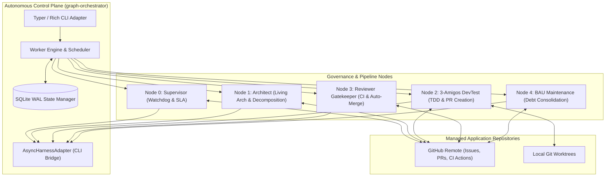
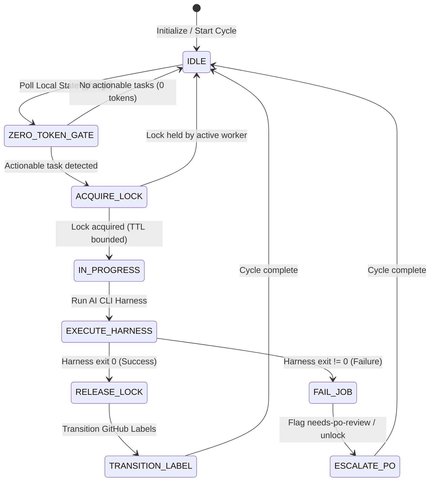

# Architecture & Engineering Standards (`.graph/architecture.md`)

**Repository**: `AntaresAndBharani/graph-engineering`  
**System**: Graph Orchestrator (`graph-orchestrator`)  
**Status**: Living Architecture Standard (Weekly Synchronized)  
**Target Runtime**: Python 3.11+ | Linux / macOS / Windows  

---

## 🏛️ System Overview & Technology Stack

### System Overview
`graph-orchestrator` is a decoupled, local-first control-plane daemon engineered to coordinate autonomous multi-agent software engineering pipelines across distributed repositories. It decouples workflow automation, governance, and quality gating from managed application repositories.

The architecture operates on **Zero-Token Idle Gating**: all repository scans, issue polling, pull request validations, and state audits are performed deterministically via local CLI tooling (GitHub CLI `gh`, Git, SQLite) without making speculative LLM calls. External AI CLI harnesses (Antigravity `agy`, Claude Code `claude`, Devin `devin`) are invoked strictly when actionable tasks require deep reasoning, code generation, or structural refactoring.



### Technology Stack Matrix

| Layer / Concern | Technology | Version / Standard | Rationale |
|---|---|---|---|
| **Runtime & Language** | Python | `>=3.11` | Exception groups, TaskGroups, enhanced typing syntax, native performance optimizations. |
| **Build & Packaging** | Hatchling | PEP 621 / PEP 517 | Standardized modern metadata in `pyproject.toml`, deterministic wheel builds. |
| **CLI & User Interface** | Typer + Rich | `typer>=0.12.0`, `rich>=13.7.0` | Declarative command routing with type annotations, formatted terminal diagnostics, live ANSI-stripped output streaming. |
| **Configuration & Schemas** | Pydantic v2 | `pydantic>=2.6.0` | High-performance Rust-backed schema validation, cross-platform path resolution, strict typing. |
| **State & Concurrency Control** | aiosqlite (SQLite WAL) | `aiosqlite>=0.20.0` | Asynchronous file-based persistence, Write-Ahead Logging (WAL) concurrency, deterministic TTL distributed locking. |
| **Process Management** | psutil | `psutil>=5.9.0` | Cross-platform process tree inspection, child cleanup, and graceful daemon shutdown. |
| **Environment & Secrets** | python-dotenv + PyYAML | `pyyaml>=6.0.1`, `dotenv>=1.0.0` | Local environment injection without leaking credentials into source control. |
| **Testing & Quality** | pytest + pytest-asyncio | `pytest>=8.0.0`, `pytest-asyncio>=0.23.0` | Asynchronous unit, mock, and integration test coverage. |

---

## 🧱 Layer Boundaries & Clean Architecture (Domain, Data, Presentation/UI separation of concerns)

The system follows a strict **Concentric Clean Architecture (Hexagonal / Ports and Adapters)**. The fundamental architectural rule is the **Dependency Rule**: dependencies point strictly inward toward the Domain and Application cores. External infrastructure, databases, and UI CLI commands must never dictate or leak into domain models.

```mermaid
graph TD
    subgraph Layer 4: Presentation & UI Adapters
        CLI_Commands["Typer CLI Commands (`orchestrator/cli.py`)"]
        Rich_Formatters["Rich Terminal Formatters & Panels"]
    end

    subgraph Layer 3: Application Nodes & Use Cases
        SupervisorNode["Supervisor Node (`orchestrator/nodes/supervisor.py`)"]
        ArchitectNode["Architect Node (`orchestrator/nodes/architect.py`)"]
        DevTestNode["DevTest Node (`orchestrator/nodes/devtest.py`)"]
        ReviewerNode["Reviewer Node (`orchestrator/nodes/reviewer.py`)"]
        BAUNode["BAU Node (`orchestrator/nodes/bau.py`)"]
    end

    subgraph Layer 2: Infrastructure & External Adapters
        HarnessAdapter["Harness Adapter (`orchestrator/harness.py`)"]
        SQLiteManager["State Manager (`orchestrator/db.py`)"]
        GitHubPoller["GitHub Poller (`orchestrator/poller.py`)"]
        Housekeeping["Label Provisioner (`orchestrator/housekeeping.py`)"]
    end

    subgraph Layer 1: Domain Core & Configuration
        ConfigDomain["Configuration Models (`orchestrator/config.py`)"]
        LoggingDomain["Logging Protocols & ANSI Utilities (`orchestrator/logging.py`)"]
    end

    Layer 4 --> Layer 3
    Layer 3 --> Layer 2
    Layer 3 --> Layer 1
    Layer 2 --> Layer 1
```

### Separation of Concerns

1. **Domain Core Layer (`orchestrator/config.py`, `orchestrator/logging.py`)**:
   - Holds core entity definitions, workflow taxonomy (`managed_labels`), harness definitions, and immutability rules.
   - Strictly isolated from concrete execution logic and network I/O.
   - Provides pure path normalization and environment resolution functions (`resolve_path`).

2. **Infrastructure & Ports/Adapters Layer (`orchestrator/db.py`, `orchestrator/harness.py`, `orchestrator/poller.py`)**:
   - Manages state persistence via SQLite WAL transactions (`StateManager`).
   - Implements asynchronous process execution, process tree lifecycle, and ANSI-sanitized log streaming (`AsyncHarnessAdapter`).
   - Interacts with GitHub via zero-token subprocess calls (`fetch_issues_with_label`, `fetch_open_prs`).

3. **Application Pipeline Nodes Layer (`orchestrator/nodes/*`)**:
   - Houses the discrete workflow engines representing each stage of the engineering lifecycle:
     - `node-supervisor`: Watchdog auditing, 12-hour SLA tracking, and conflict self-healing.
     - `node-architect`: Story triage, INVEST decomposition, and living architecture synchronization.
     - `node-devtest`: Pre-flight workspace validation, test-driven implementation, and pull request generation.
     - `node-reviewer`: Remote CI quality gate verification (100% green requirement) and auto-merge execution.
     - `node-bau`: Daily 24-hour maintenance sweep synthesizing tech debt into structured User Stories.

4. **Presentation & CLI Layer (`orchestrator/cli.py`)**:
   - Pure UI adapter handling command-line arguments, options, terminal dashboards, and signal handling.
   - Coordinates parallel workers across projects and handles graceful shutdown (`stop`, `watch`, `run`).

---

## 📁 Directory & Package Structure Guidelines

```text
graph-engineering/
├── .github/                      # GitHub Actions CI workflows, issue templates
├── docs/                         # Node and pipeline documentation specifications
│   ├── node-supervisor.md        # Node 0 specification
│   ├── node-architect.md         # Node 1 specification
│   ├── node-devtest.md           # Node 2 specification
│   ├── node-reviewer.md          # Node 3 specification
│   └── node-bau.md               # Node 4 specification
├── orchestrator/                 # Primary Python package root
│   ├── __init__.py               # Package metadata and __version__
│   ├── cli.py                    # Typer CLI application entry point and daemon runner
│   ├── config.py                 # Pydantic v2 schemas and path resolution utilities
│   ├── db.py                     # Asynchronous SQLite state and distributed lock manager
│   ├── harness.py                # Pluggable AI CLI adapter (Claude, Antigravity, Devin)
│   ├── housekeeping.py           # GitHub label provisioning and taxonomy synchronization
│   ├── logging.py                # Unified file and console logging with ANSI sanitization
│   ├── poller.py                 # Zero-token GitHub CLI/GraphQL query abstraction
│   └── nodes/                    # Autonomous pipeline node handlers
│       ├── __init__.py           # Subpackage exports
│       ├── architect.py          # Living architecture & story decomposition node
│       ├── bau.py                # Business-as-usual tech debt consolidation node
│       ├── devtest.py            # 3-Amigos development and testing node
│       ├── reviewer.py           # Remote CI quality gatekeeper and auto-merge node
│       └── supervisor.py         # Watchdog consistency supervisor node
├── templates/                    # Reference templates and starter configurations
│   └── config.example.yaml       # Master orchestrator configuration template (v2)
├── tests/                        # Comprehensive automated test suite
│   ├── test_architect_governance.py
│   ├── test_cli.py
│   ├── test_config.py
│   ├── test_db.py
│   ├── test_harness.py
│   ├── test_logging.py
│   ├── test_nodes.py
│   └── test_stop.py
├── pyproject.toml                # PEP 517/PEP 621 build specification (Hatchling)
├── CHANGELOG.md                  # Keep a Changelog historical log
└── README.md                     # System overview and quickstart guide
```

### Module Responsibilities & Conventions
- **One Domain Per Node**: Every node in `orchestrator/nodes/` must expose a clear public entry point: `run_<nodename>_node(project, config, state_manager) -> tuple[bool, str]`.
- **Zero-Token Pre-Gating**: Node entry functions must check deterministic conditions (labels, SLAs, schedule intervals) before performing any state locking or subprocess spawning.
- **Pure Function Extraction**: Business logic (e.g. anomaly detection, git URL parsing, timestamp parsing) must be separated into pure helper functions to ensure 100% testability with unit mocks.

---

## 🎨 Design Patterns, State Management & Dependency Injection

### 1. Pluggable Adapter Pattern (`AsyncHarnessAdapter`)
All AI execution engines (Claude Code CLI, Antigravity CLI, Devin CLI) adhere to a unified interface. The system constructs commands dynamically based on configured flags (`--model`, `--effort`, timeout limits), ensuring that swapping models requires zero code modifications.

```python
adapter = AsyncHarnessAdapter(harness_name, harness_cfg)
exit_code = await adapter.execute(
    prompt=prompt,
    cwd=project.local_path,
    log_file=log_file,
    model=node_cfg.model,
    effort=node_cfg.effort,
)
```

### 2. Distributed State Machine & TTL Locking (`StateManager`)
- **Write-Ahead Logging (WAL)**: SQLite runs in WAL mode (`PRAGMA journal_mode=WAL; PRAGMA busy_timeout=5000;`) ensuring concurrent non-blocking reads and serialized atomic writes across async workers.
- **TTL Lock Protection**: Every task execution is bounded by a Time-To-Live (TTL). If a daemon crashes or an agent hangs, subsequent worker cycles automatically detect expired locks, transition their state to `FAILED`, and recover execution safely.
- **Inter-Process Communication (IPC) via DB**: Graceful daemon shutdown (`orchestrator stop`) sets a `stop_requested` flag in SQLite, allowing active workers to finish their current atomic unit without starting new nodes.



### 3. Reactive Chaining with Debounce
- In daemon mode (`orchestrator watch`), worker loops execute sequentially within a project.
- **Active Transition**: When a node completes work (e.g., Architect breaks down a story to `ready-for-dev`), `run_project_cycle` returns `True`, triggering an immediate follow-up pass (1-second debounce).
- **Idle Backoff**: When all nodes report idle, the worker sleeps for the full configured `poll_interval_seconds` (default: 300s).

### 4. Dependency Injection via Composition Root
Configuration is loaded once via `load_config()` and passed explicitly down the call hierarchy (`config`, `project`, `state_manager`). Modules do not rely on global mutable state or singletons.

---

## 🚫 Architectural Constraints & Anti-Patterns (e.g. No circular dependencies, No UI logic in Domain)

### Strict Constraints
1. **Zero LLM Token Waste on Idle**:
   - Never call an AI harness to check if work needs to be done.
   - Always verify GitHub issues, PRs, and branch states via local CLI (`gh`, `git`) first.
2. **Destructive Git Safety Gate**:
   - `DevTest` pre-flight reset is strictly forbidden unless `verify_git_safety()` confirms that `local_path` is a valid git repository matching the configured `project.repo`.
3. **No Circular Dependencies**:
   - Modules in `orchestrator/nodes/` must never import `orchestrator/cli.py`.
   - Domain models in `orchestrator/config.py` must never import node handlers or database adapters.
4. **No Unsanitized ANSI Streaming**:
   - AI CLI subprocess output contains rich terminal ANSI escape codes. All stdout streams written to disk or parsed for structured JSON must pass through `strip_ansi()` to avoid corruption and log bloat.
5. **No Orphaned Subprocesses**:
   - When a harness execution times out or is cancelled, `_kill_process_tree()` must recursively terminate the parent process and all child processes using `psutil`.

### Anti-Patterns to Avoid

| Anti-Pattern | Violation | Required Architecture Solution |
|---|---|---|
| **Speculative LLM Polling** | Prompting an LLM on every loop cycle to see if an issue needs attention. | Deterministic GitHub GraphQL/CLI label filtering (0 tokens). |
| **Framework Bleed into Domain** | Importing Typer or Rich inside `orchestrator/config.py` or `orchestrator/db.py`. | Keep presentation formatting exclusively inside `orchestrator/cli.py`. |
| **Unbounded Process Execution** | Running CLI subprocesses without timeout guards. | Strict timeout wrapping with `asyncio.wait_for` and `psutil` process tree termination. |
| **Blind Git Operations** | Modifying working trees without verifying remote origin identity. | Remote origin URL verification in `verify_git_safety`. |
| **Tight Polling on Background Tasks** | Polling subprocess status in a tight loop. | Async line-by-line stream reading (`await process.stdout.readline()`). |

---

## 📋 Definition of Done (DoD) for Architecture Updates

When modifying system architecture or implementing new nodes:
1. **Automated Verification**: All unit and async tests in `tests/` must pass 100% green (`pytest -v`).
2. **Zero-Token Idle Assertion**: New nodes must have explicit unit test coverage asserting 0-token idle exits when no trigger labels are present.
3. **Documentation Sync**: Any changes to node lifecycle or configuration options must be reflected in `docs/node-<name>.md` and `.graph/architecture.md`.
4. **Changelog Entry**: Add a summary of architectural changes to `CHANGELOG.md` under `## [Unreleased]`.
