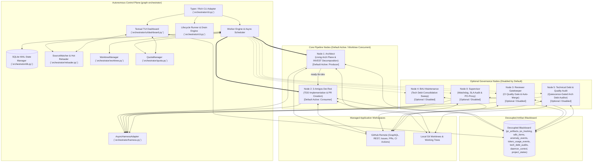
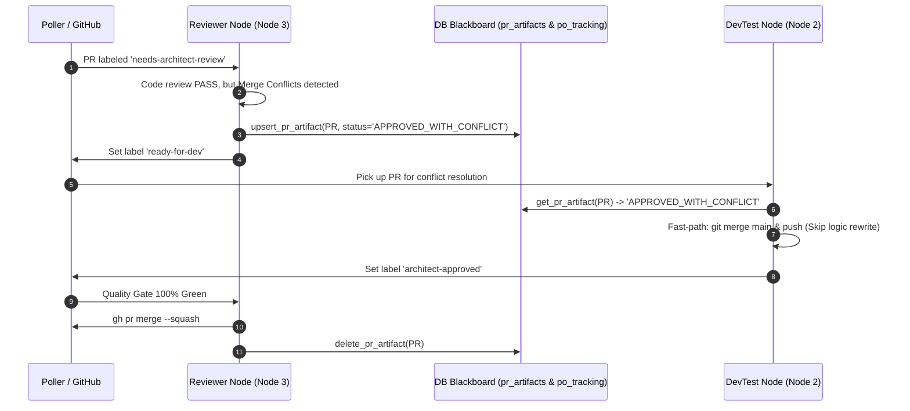
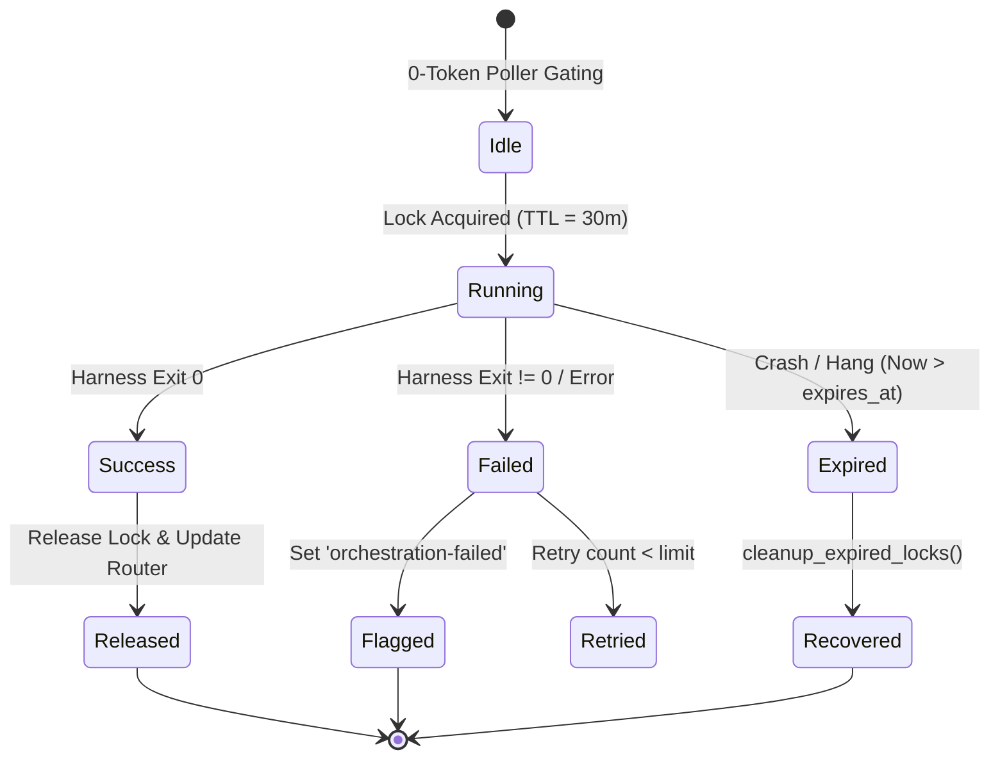
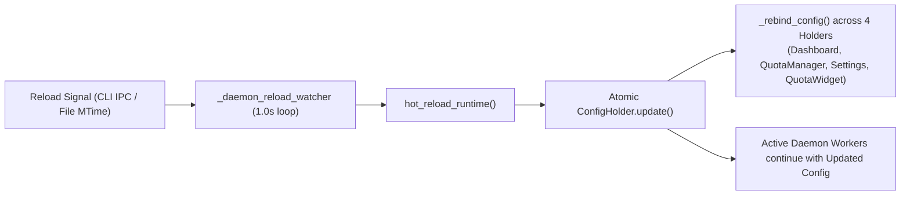

# Architecture & Engineering Standards (`.graph/architecture.md`)

**Repository**: `AntaresAndBharani/graph-engineering`  
**System**: Graph Orchestrator (`graph-orchestrator`)  
**Status**: Living Architecture Standard (Weekly Synchronized & Event-Driven)  
**Target Runtime**: Python 3.11+ | Linux / macOS / Windows  

---

## System Overview & Technology Stack

### System Overview
`graph-orchestrator` is a decoupled, local-first control-plane daemon engineered to coordinate autonomous multi-agent software engineering pipelines across distributed repositories. It establishes an intelligent bridge between local developer workspaces, cloud code hosting platforms (GitHub), and pluggable AI CLI execution harnesses (Antigravity, Claude Code, Devin).

The default operational architecture is a **Streamlined 2-Node Parallel Engine** consisting of **Architect** (Node 1: Producer) and **3-Amigos DevTest** (Node 2: Consumer) executing concurrently within isolated Git worktrees. Additional specialized governance nodes—**Supervisor** (Node 0: Watchdog & PO-Proxy), **Reviewer Gatekeeper** (Node 3: Auto-Merge Gate), **BAU Maintenance** (Node 4: Tech Debt Sweep), and **Technical Debt & Quality Audit** (Node 5: Fail-Closed Architectural Auditor)—are modular, **optional/disabled-by-default** components that can be enabled on demand.

The architecture is governed by **Zero-Token Idle Gating**: all repository inspections, issue status checks, label audits, pull request evaluations, mergeability scans, and development quiescence gates execute deterministically via local CLI tooling (GitHub CLI `gh`, Git, SQLite WAL) with zero token consumption. External AI harnesses are dispatched strictly when actionable tasks require deep reasoning, code implementation, INVEST story decomposition, semantic conflict resolution, or fail-closed architectural debt auditing during complete development quiescence.

Furthermore, under the **Upstream Functional Slicing & Direct DevTest Assignment Protocol**, pre-refined requirements (whether Standalone Tasks or INVEST-sliced stories) bypass runtime Architect node triage completely, saving 100% of runtime triage and decomposition LLM tokens.



### Autonomous Pipeline Nodes & Topology Matrix

| Node | Name | Default State | Primary Responsibility | Trigger Condition | Harness / Model Tier |
|---|---|---|---|---|---|
| **Node 1** | **Architect** (`architect.py`) | **Active / Enabled** (Producer) | Living architecture sync (7-day SLA, configurable via `research_enabled`), INVEST story decomposition, subtask linking, and PR architectural reviews. | Label `needs-triage` or Weekly SLA trigger | Pluggable Research Harness (`antigravity`/`gemini-3.8-flash-high`) / Primary (`claude-sonnet-5`) |
| **Node 2** | **3-Amigos DevTest** (`devtest.py`) | **Active / Enabled** (Consumer) | Worktree-safe pre-flight git reset, deterministic lowest-ID task pickup (`issue_number ASC`), TDD test suite generation, clean implementation, autonomous PR opening, and auto-merge. | Label `ready-for-dev` or active story `queued` | Primary Implementation Harness (`antigravity` / `claude`) |
| **Node 0** | **Supervisor** (`supervisor.py`) | **Optional / Disabled** | Consistency watchdog, proactive PO-proxy requirement evaluation, SHA-256 hash gating, and anomaly self-healing. Open issues remain valid regardless of age (legacy 12h SLA removed). | Scheduled interval (default 1h) or Label `needs-po-review` | Fast PO Evaluation (`antigravity`/`gemini-3.8-flash-high`) + Zero-token audit |
| **Node 3** | **Reviewer Gatekeeper** (`reviewer.py`) | **Optional / Disabled** | Remote CI quality gate verification (100% green required), autonomous merge conflict resolution, and squash auto-merge. | Label `architect-approved` / `needs-architect-review` | Fast Conflict Harness (`antigravity`/`gemini-3.8-flash-high`) + Deterministic `gh` |
| **Node 4** | **BAU Maintenance** (`bau.py`) | **Optional / Disabled** | Daily 24h maintenance sweep consolidating `tech-debt` and `enhancement` tickets into structured User Stories. | Daily interval (`bau_interval_seconds`, default 24h) | Cost-effective synthesis (`antigravity`/`gemini-3.8-flash-high`) |
| **Node 5** | **Technical Debt** (`tech_debt.py`) | **Optional / Disabled** | Fail-closed architectural technical debt and test gap auditor dispatching validated User Stories into the SDLC backlog. | Development Quiescence (0 locks, 0 active items/labels, 0 PRs) + Cooldown / New Commit SHA | Dedicated Audit Harness (`claude`/`claude-sonnet-5` effort: low) |

---

### Technology Stack Matrix

| Layer / Concern | Technology | Version / Standard | Architectural Rationale |
|---|---|---|---|
| **Runtime & Language** | Python | `>=3.11` | Modern `asyncio` primitives, `TaskGroup`, exception groups, enhanced type hinting (`typing.Self`, union `|`), and high-performance execution. |
| **Build & Packaging** | Hatchling | PEP 517 / PEP 621 | Modern declarative metadata in `pyproject.toml`, reproducible wheel distribution, zero legacy setup scripts. |
| **CLI & Terminal UX** | Typer + Rich + Textual | `typer>=0.12.0`, `rich>=13.7.0`, `textual>=0.50.0` | Declarative command routing with type annotations, interactive TUI observability dashboard (`DashboardApp`), bounded log streaming (`TextualLogHandler`), viewport scroll pinning, space-bar toggle, resize storm zero-geometry absorption, watchdog liveness heartbeat, and ANSI-stripped output streaming. |
| **Configuration & Validation** | Pydantic v2 | `pydantic>=2.6.0` | Rust-backed schema validation, cross-platform path resolution (`~`, `$HOME`, `%USERPROFILE%`), strict runtime validation, and hot-reload model rebuilding (`OrchestratorBaseModel`, `TechDebtConfig`). |
| **Persistence & State Engine** | aiosqlite (SQLite WAL) | `aiosqlite>=0.20.0` | Asynchronous file-based persistence, Write-Ahead Logging (WAL) concurrency, deterministic TTL distributed locking, idempotent migrations, watchdog heartbeat persistence, and Artifact Blackboard store. |
| **Process & Subprocess Lifecycle** | psutil | `psutil>=5.9.0` | Cross-platform recursive process tree inspection, child process termination, graceful daemon shutdown, and PID liveness validation. |
| **Dynamic Runtime Reloading** | importlib + SQLite IPC | Standard Library | Deterministic hot reloading of configuration and in-memory Python modules without stopping the running daemon via centralized single-consumer watcher (`_daemon_reload_watcher`). |
| **Environment & Secrets** | python-dotenv + PyYAML | `pyyaml>=6.0.1`, `python-dotenv>=1.0.0` | Secure environment variable injection and human-readable hierarchical configuration. |
| **Testing & Quality Assurance** | pytest + pytest-asyncio + pytest-mock | `pytest>=8.0.0`, `pytest-asyncio>=0.23.0`, `pytest-mock>=3.12.0` | Asynchronous unit, mock, BDD, and integration test coverage with zero-token assertions. |

---

## Layer Boundaries & Clean Architecture (Domain, Data, Presentation/UI separation of concerns)

The system follows a strict **Hexagonal Architecture (Ports and Adapters)** / Concentric Clean Architecture. The fundamental architectural invariant is the **Dependency Inversion Rule**: dependencies point strictly inward toward Domain and Application cores. External infrastructure, databases, network clients, and UI CLI commands must never dictate or leak into domain models.

```mermaid
graph TD
    subgraph Layer 4: Presentation & UI Adapters (Inbound Adapters)
        CLI_Commands["Typer CLI Commands (`orchestrator/cli.py`)"]
        TUI_Dashboard["Textual TUI Observability Dashboard (`orchestrator/ui/dashboard.py`)"]
        UI_Widgets["Textual Widgets (`orchestrator/ui/widgets.py`)\n- ConfigStatusBanner\n- SDLCProgressWidget\n- HarnessQuotaWidget\n- AnomalyAlertsWidget"]
        Rich_Formatters["Rich Terminal Formatters, Tables & Live Views"]
    end

    subgraph Layer 3: Application Nodes & Use Cases (Application Core)
        SupervisorNode["Supervisor Node (`orchestrator/nodes/supervisor.py`)"]
        ArchitectNode["Architect Node (`orchestrator/nodes/architect.py`)"]
        DevTestNode["DevTest Node (`orchestrator/nodes/devtest.py`)"]
        ReviewerNode["Reviewer Node (`orchestrator/nodes/reviewer.py`)"]
        BAUNode["BAU Node (`orchestrator/nodes/bau.py`)"]
        TechDebtNode["Tech Debt Node (`orchestrator/nodes/tech_debt.py`)"]
        LifecycleRunner["Lifecycle Runner & Drain Engine (`orchestrator/cli.py`)"]
    end

    subgraph Layer 2: Infrastructure & External Adapters (Outbound Adapters)
        HarnessAdapter["AsyncHarnessAdapter (`orchestrator/harness.py`)"]
        SQLiteManager["State & Blackboard Manager (`orchestrator/db.py`)"]
        QuotaEngine["Quota & Runway Gating Engine (`orchestrator/quota.py`)"]
        GitHubPoller["Zero-Token GitHub Poller (`orchestrator/poller.py`)"]
        Housekeeping["Label Provisioner (`orchestrator/housekeeping.py`)"]
        ReloaderWatcher["Deterministic Reloader (`orchestrator/reloader.py`)"]
        WorktreeMgr["Worktree Manager (`orchestrator/worktree.py`)"]
    end

    subgraph Layer 1: Domain Core & Configuration (Inward Entities & Protocols)
        ConfigDomain["Configuration Models & Schemas (`orchestrator/config.py`)"]
        LoggingDomain["Logging Protocols, LogQueryResult & ANSI Utilities (`orchestrator/logging.py`)"]
        TokenUsageProtocol["TokenUsageReader Protocol (`orchestrator/quota.py`)"]
    end

    Layer 4 --> Layer 3
    Layer 3 --> Layer 2
    Layer 3 --> Layer 1
    Layer 2 --> Layer 1
```

### Separation of Concerns

1. **Domain Core Layer (`orchestrator/config.py`, `orchestrator/logging.py`, `TokenUsageReader` protocol)**:
   - Holds core immutable entities, taxonomy schemas (`managed_labels`), harness definitions (`HarnessConfig`), quota configuration structures (`HarnessQuotaConfig`, `WindowLimitConfig`, `QuotaSettings`), and configuration data structures (`GlobalConfig`, `ProjectConfig`, `NodeConfig`, `TechDebtConfig`, `SettingsConfig`).
   - Strictly isolated from concrete execution logic, database calls, and network I/O.
   - Defines the `@runtime_checkable` `TokenUsageReader` Protocol decoupling quota mathematics from SQLite persistence.
   - Provides pure path normalization, cross-platform environment resolution (`resolve_path`), in-memory bounded project-scoped log buffering with `(node_name, line)` tuple storage, compound node family scope matching (`matches_node_scope`), independent node filtering, disk-tailing fallback (`ProjectLogBufferManager`), bounded log streaming (`TextualLogHandler`), and typed result contracts (`LogQueryResult`).

2. **Infrastructure & Outbound Adapters Layer (`orchestrator/db.py`, `orchestrator/harness.py`, `orchestrator/quota.py`, `orchestrator/poller.py`, `orchestrator/housekeeping.py`, `orchestrator/reloader.py`, `orchestrator/worktree.py`)**:
   - Manages state persistence, idempotent migrations, distributed locking, watchdog heartbeat telemetry (`record_heartbeat`), and Blackboard artifacts via SQLite WAL transactions (`StateManager`).
   - Implements multi-window rolling quota calculations, dual-window (short/weekly) status evaluation, predictive operational runway forecasting, human-readable replenishment countdown formatting, burn velocity tracking, and replenishment ETA projections (`QuotaManager`).
   - Manages creation, synchronization, safe removal, stash protection (`git stash push -u`), and pruning of ephemeral git worktrees per node and project with serial execution fallback (`WorktreeManager`). Hardened with 30.0s subprocess timeout guards and detached HEAD upstream checkout (`checkout_detached_upstream`) to prevent branch collision deadlocks (`fatal: 'main' is already checked out`).
   - Implements asynchronous process execution, process tree lifecycle, ANSI-sanitized log streaming with `(project_name, node_name, line)` listener callbacks, console stream safety during TUI mode (`_tui_mode`, `is_tui_mode`, `set_tui_mode`), and harness-level telemetry anomaly event production (`AsyncHarnessAdapter` writing retry/timeout anomalies to `anomaly_events`).
   - Interacts with GitHub via zero-token subprocess calls (`fetch_issues_with_label`, `fetch_all_open_issues`, `fetch_open_prs`, `fetch_issue_by_number`, `sync_repository_labels`), with dormant node polling bypass.
   - Manages dynamic file modification inspection and module reloading (`SourceWatcher`, `ConfigHolder`, `hot_reload_runtime`).

3. **Application Pipeline Nodes & Use Cases Layer (`orchestrator/nodes/*`, `orchestrator/cli.py:lifecycle`)**:
   - Houses the discrete workflow engines representing each stage of the engineering lifecycle:
     - **Default Active 2-Node Parallel Engine**:
       - `node-architect` (Node 1: Producer): Story triage, mandatory INVEST decomposition for complex specifications, living architecture plane synchronization (7-day SLA, configurable via `research_enabled`), and PR architectural reviews.
       - `node-devtest` (Node 2: Consumer): Pre-flight worktree-safe git reset (`git fetch origin main && git reset --hard origin/main`), deterministic lowest-ID task pickup (`StateManager.get_next_devtest_task`), test-driven implementation, local/CI verification, autonomous auto-merge, pull request generation, and sequential parent advancement (`_advance_sequential_subtask`).
     - **Modular Optional Governance Nodes (Disabled by Default)**:
       - `node-supervisor` (Node 0: Watchdog & PO-Proxy): Watchdog auditing, PO-proxy Gherkin evaluation, SHA-256 hash gating, and conflict self-healing. Open issues remain valid regardless of age.
       - `node-reviewer` (Node 3: Quality Gatekeeper): Dedicated remote CI quality gate verification (100% green requirement), autonomous merge conflict resolution, and auto-merge execution.
       - `node-bau` (Node 4: Maintenance Sweep): Daily 24-hour maintenance sweep synthesizing tech debt into structured User Stories.
       - `node-tech-debt` (Node 5: Quality Audit): Fail-closed architectural technical debt and test gap auditor dispatching validated User Stories into the SDLC backlog during development quiescence (`is_project_fully_quiescent`), with decoupled commit SHA caching (`origin/main`) and cooldown interval throttling (`tech_debt_interval_seconds: 14400`).
     - **Lifecycle Drain Engine (`orchestrator start`)**:
       - Executes worker passes with `exit_when_idle=True`, evaluating `is_project_queue_drained`. Gated to prevent premature exit while feature-branch PR CI checks are running (`RUNNING`, `PENDING`, `PASS`), continuing through CI verification, auto-merge, and subsequent sequential subtasks. Tracks dedicated `lifecycle_pid` in SQLite `daemon_control`.

4. **Presentation & CLI Layer (`orchestrator/cli.py`, `orchestrator/ui/dashboard.py`, `orchestrator/ui/widgets.py`)**:
   - Pure UI adapter handling command-line arguments, options (`--dashboard/--no-dashboard`, `--headless`), terminal dashboards (`DashboardApp`), and signal handling.
   - Encapsulates modular Textual widgets (`ConfigStatusBanner`, `SDLCProgressWidget`, `AnomalyAlertsWidget`, `HarnessQuotaWidget`) as read-only consumers of the SQLite Blackboard, `ConfigHolder`, and `QuotaManager` via Dependency Injection.
   - Commands: `run`, `start` (dedicated node lifecycle with queue drain through pending PR CI), `watch` (with interactive Textual TUI dashboard and headless fallback), `list`, `init`, `labels`, `doctor`, `ingest`, `clean`, `logs`, `pause`, `resume`, `stop`, `config reload`, `reload`, `artifact`, `artifacts`, `supervisor`.
   - Advanced TUI Observability Architecture:
     - **Resize Storm Resilience & Zero-Geometry Absorption**: Absorbs momentary `0x0` geometry transitions during display renegotiation/docking without unhandled crashes, triggering full layout recalculation and widget re-sync upon non-zero dimension recovery.
     - **Watchdog Liveness Heartbeat**: 1.0s periodic timer recording heartbeat timestamps in SQLite via `record_heartbeat`.
     - **Manual Redraw Action**: Bound to `f5` and `ctrl+r` (`action_redraw_display`) forcing immediate layout recalculation and repainting.
     - **Native Viewport Scroll Pinning & Space-Bar Toggle**: Employs Textual's native `RichLog.is_vertical_scroll_end` and `auto_scroll` toggle (bound to `space`) to prevent viewport yanking while preserving live append.
     - **Console Stream Safety**: Automatically activates `set_tui_mode(True)` on startup and resets on teardown, muting raw console prints while streaming lines cleanly to Textual listeners.
     - **Stream-Disk Coordination Latch**: Debounce latch skipping disk polls if live stream data arrived within 2.0 seconds.
     - **Edge-Triggered Completion Boundary Marker**: Appends `[dim]── Execution completed ──[/dim]` exactly once when a project transitions from `RUNNING` to `IDLE`.
     - **Binary-Mode Incremental Disk Tailer**: Seeks strictly by byte offsets in `"rb"` mode and decodes UTF-8 with error replacement to eliminate line duplication, dropped chunks, or Windows CRLF encoding stalls.
     - **DataTable Dual-Event Binding**: Dual-bound to both `RowHighlighted` (instant navigation) and `RowSelected` (explicit click/Enter), with deterministic compound lane selection for parent projects vs nested child nodes (`└─ devtest`).

---

## Directory & Package Structure Guidelines

```text
graph-engineering/
├── .github/                         # GitHub Actions CI workflows, issue templates
│   └── workflows/
│       └── ci.yml                   # CI pipeline (Python 3.11 & 3.12, pytest, build)
├── .graph/                          # Living architecture plane standards
│   └── architecture.md              # Living Architectural Standards (Weekly Synchronized)
├── docs/                            # Node and pipeline documentation specifications
│   ├── draft-requisites/            # Architectural epics and requisites specifications
│   │   ├── 000000-prreviewprotocol.md # Anti-Gravity Blackboard PR protocol spec
│   │   ├── crosstrainingapp-pipeline-deprecation.md # Deprecation plan
│   │   └── implementation-plan.md   # Evolutionary audit trail & approved plans
│   ├── e2e-testing-recommendations.md # E2E testing architecture recommendations
│   ├── local-cli-pipeline.md        # Comprehensive pipeline manual and architecture guide
│   ├── node-cli.md                  # CLI & Terminal Dashboard specification
│   ├── node-supervisor.md           # Node 0 specification (Optional / Disabled)
│   ├── node-architect.md            # Node 1 specification (Default Active: Producer)
│   ├── node-devtest.md              # Node 2 specification (Default Active: Consumer)
│   ├── node-reviewer.md             # Node 3 specification (Optional / Disabled)
│   ├── node-bau.md                  # Node 4 specification (Optional / Disabled)
│   └── node-tech-debt.md            # Node 5 specification (Optional / Disabled)
├── orchestrator/                    # Primary Python package root
│   ├── __init__.py                  # Package metadata and __version__
│   ├── cli.py                       # Typer CLI application, daemon runner & lifecycle engine
│   ├── config.py                    # Pydantic v2 schemas and path resolution utilities
│   ├── db.py                        # Asynchronous SQLite state, distributed lock & blackboard manager
│   ├── harness.py                   # Pluggable AI CLI adapter with retry engine and TUI stream safety
│   ├── housekeeping.py              # GitHub label provisioning and taxonomy synchronization
│   ├── logging.py                   # Unified file/console logging, ANSI sanitization, LogQueryResult
│   ├── poller.py                    # Zero-token GitHub CLI/GraphQL query abstraction
│   ├── quota.py                     # Multi-window rolling token quota, burn velocity & replenishment ETA
│   ├── reloader.py                  # Hot-reloading watcher, ConfigHolder & module re-importer
│   ├── worktree.py                  # Ephemeral git worktree manager, detached HEAD checkout & fallback
│   ├── ui/                          # Presentation & TUI dashboard package
│   │   ├── __init__.py              # Subpackage exports
│   │   ├── dashboard.py             # DashboardApp Textual TUI with DataTable, RichLog & watchdog
│   │   └── widgets.py               # Read-only UI widgets (SDLCProgressWidget, AnomalyAlertsWidget, etc.)
│   └── nodes/                       # Autonomous pipeline node handlers
│       ├── __init__.py              # Subpackage exports
│       ├── architect.py             # Living architecture & story decomposition node (Node 1)
│       ├── bau.py                   # Business-as-usual tech debt consolidation node (Node 4)
│       ├── devtest.py               # 3-Amigos development and testing node (Node 2)
│       ├── reviewer.py              # Reviewer quality gatekeeper and auto-merge node (Node 3)
│       ├── supervisor.py            # Watchdog consistency supervisor node (Node 0)
│       └── tech_debt.py             # Fail-closed technical debt & quality audit node (Node 5)
├── templates/                       # Reference templates and starter configurations
│   └── config.example.yaml          # Master orchestrator configuration template (v2)
├── tests/                           # Comprehensive automated test suite
│   ├── conftest.py                  # Pytest fixtures and mock configurations
│   ├── test_agy_cross_review.py     # Tri-Party Review Council & Claude QA Guardian tests
│   ├── test_architect_governance.py # Architect SLA, decomposition, and zero-token tests
│   ├── test_cli.py                  # CLI commands, lifecycle drain, and UI diagnostics tests
│   ├── test_config.py               # Configuration loading and path expansion tests
│   ├── test_console_stream_safety.py # TUI mode console silencing and listener streaming tests
│   ├── test_dashboard.py            # Textual dashboard, log handler, offset handoff, and UI tests
│   ├── test_dashboard_resilience.py # TUI terminal resize storms, zero geometry absorption, and redraw tests
│   ├── test_db.py                   # State manager, TTL, lowest-ID dispatch, and Blackboard tests
│   ├── test_devtest_refactor.py     # DevTest ascending pickup, ref lookups, and auto-merge tests
│   ├── test_docs_taxonomy.py        # Documentation and label taxonomy harmonization tests
│   ├── test_harness.py              # Subprocess harness execution, retry, and timeout tests
│   ├── test_housekeeping.py         # 1-pass label sync, case-folding, and purge guard tests
│   ├── test_logging.py              # Log rotation, LogQueryResult, and ANSI strip tests
│   ├── test_nodes.py                # Node workflow execution and boundary tests
│   ├── test_poller.py               # Zero-token GitHub CLI/GraphQL poller tests
│   ├── test_poller_quota.py         # Poller quota integration tests
│   ├── test_project_pause.py        # Per-project pause/resume lifecycle tests
│   ├── test_quota.py                # QuotaManager, velocity, runway gating, and token parser tests
│   ├── test_reloader.py             # Hot reloading, ConfigHolder, and source watcher tests
│   ├── test_sequential_pipeline.py  # Story locking, ascending dispatch, and advancement tests
│   ├── test_stop.py                 # Graceful daemon shutdown and lifecycle kill tests
│   ├── test_supervisor_po.py        # Supervisor PO-proxy evaluation tests
│   ├── test_tech_debt_node.py       # Tech debt node quiescence and audit tests
│   ├── test_widgets.py              # Widget layout, column ordering, [LOCKED] badge tests
│   ├── test_worktrees.py            # WorktreeManager lifecycle, sync, detached HEAD, and timeout tests
│   └── __init__.py                  # Test package root
├── pyproject.toml                   # PEP 517/PEP 621 build specification (Hatchling)
├── CHANGELOG.md                     # Keep a Changelog historical log
└── README.md                        # System overview and quickstart guide
```

### Module Responsibilities & Conventions

- **One Domain Per Node**: Every node in `orchestrator/nodes/` must expose a clear public entry point: `run_<nodename>_node(project, config, state_manager) -> tuple[bool, str]`.
- **Zero-Token Pre-Gating**: Node entry functions must check deterministic conditions (labels, SLAs, schedule intervals, quiescence states) before performing any state locking or subprocess spawning.
- **Pure Function Extraction**: Business logic (e.g. anomaly detection, git URL parsing, timestamp parsing, mathematical runway forecasting, CI status rollup derivation) must be separated into pure helper functions to ensure 100% testability with unit mocks.
- **Explicit Typing**: All functions must have complete type annotations (`from __future__ import annotations`).
- **Disabled Node Resource Isolation**: CLI loops, pollers, and schedulers must never allocate resources (memory buffers, git worktrees, network polls) for disabled nodes (`node.enabled == False`).
- **Startup Node Status Registry**: CLI daemon initialization must render a formatted Rich status table registering all project nodes, their repository, enabled status, harness, concurrency mode, and pure harness-agnostic agent model in a dedicated 7th column.
- **Non-Blocking Startup Barrier**: Background operations (such as repository label provisioning) run asynchronously on startup with an `asyncio.Event` worker barrier, ensuring the UI mounts in under 1.0s without blocking.

---

## Design Patterns, State Management & Dependency Injection

### 1. Decoupled Artifact Blackboard Pattern (`pr_artifacts`, `po_tracking`, `sdlc_items`, `anomaly_events`, `token_usage_events` & `tech_debt_audits`)
To prevent brittle multi-agent state machines and communication loss between asynchronous nodes, the system implements an **Artifact Blackboard** pattern stored in SQLite WAL:
- **Routing vs. State**: GitHub Labels act as the event-driven *Router* (`poller.py`), while SQLite acts as the *Blackboard* (`pr_artifacts`, `po_tracking`, `sdlc_items`, `anomaly_events`, `token_usage_events`, `tech_debt_audits`).
- **Context Sharing (PRs)**: When `ReviewerNode` evaluates a PR that has passing code reviews but git merge conflicts, it writes an `APPROVED_WITH_CONFLICT` decision artifact to the blackboard. `DevTestNode` reads the blackboard and performs pure conflict resolution without repeating code reviews.
- **PO Issue Tracking & Hash Gating (`po_tracking`)**: When `SupervisorNode` evaluates an issue labeled `needs-po-review`, it records its SHA-256 body hash, readiness status (`PO_APPROVED` or `NEEDS_HUMAN_CLARIFICATION`), generated Gherkin AC, and detected blockers. Subsequent cycles use the stored hash to short-circuit unchanged issues with zero LLM tokens.
- **Architect Triage Context Ingestion (`po_tracking`)**: When `ArchitectNode` evaluates an issue labeled `needs-triage`, it queries `get_po_tracking(repo, issue_number)` on the Blackboard. If a pre-approved Gherkin Acceptance Criteria artifact (`PO_APPROVED`) is found, it is injected directly into the triage prompt context, bypassing redundant requirement re-derivation.
- **SDLC Item & Telemetry Synchronization (`sdlc_items` & `anomaly_events`)**: Application Pipeline Nodes (Layer 3) act as primary producers writing active issue/subtask/PR statuses (`sync_project_sdlc_items`) and domain-level anomalies into SQLite WAL, while `AsyncHarnessAdapter` (Layer 2 Infrastructure) acts as a secondary/harness-level producer writing telemetry anomalies, transient retry exceptions, and SLA violation events (`record_anomaly_event`). The TUI presentation layer (Layer 4 widgets `SDLCProgressWidget` and `AnomalyAlertsWidget`) serves as a pure read-only consumer, maintaining Zero-HTTP UI latency and strict Clean Architecture decoupling.
- **Token Usage Ledger & Multi-Window Quota Gating (`token_usage_events`)**: Execution harnesses record token consumption events into SQLite WAL (`record_token_usage_event`). `StateManager` provides zero-timezone-drift rolling-window summation (`get_window_token_usage`), single round-trip dual-window queries (`get_multi_window_usage`), and usage breakdown by project and node (`get_usage_breakdown`) to enforce global harness quota limits across multi-project workspaces.
- **Tech Debt Audit Tracking (`tech_debt_audits`)**: SQLite stores per-project tech debt inspection artifacts (`commit_sha`, `audited_at`, `status`, `issue_number`, `details`), enabling maintenance and audit workflows to track when audits ran, avoid redundant scans on unchanged commits, and link discovered issues.



### 2. Dedicated Node Lifecycle Command & Queue Drain Engine (`orchestrator start`)
The `orchestrator start <project> [-n <node>]` command provides a dedicated, self-terminating lifecycle runner for automation pipelines, container jobs, and CI/CD agents:
- **Queue Drain Predicate (`is_project_queue_drained`)**: Workers evaluate complete project backlog drainage across active stories, queued subtasks, standalone tasks, and pending PRs.
- **Feature-Branch PR CI Gating**: Workers do not prematurely exit when a task has been implemented; they wait for open PR CI checks (`RUNNING`, `PENDING`, `PASS`), continuing through CI verification, autonomous auto-merge, and subsequent sequential subtasks.
- **Deterministic Exit Codes**:
  - `0`: Project queue fully drained and all tasks/PRs completed.
  - `1`: Stop requested via IPC (`orchestrator stop`) or global stop active.
  - `2`: Configuration error, unhandled fatal exception, or exceeded `max_passes` (default 50).
- **Lifecycle PID Tracking (`lifecycle_pid`)**: Registered in SQLite `daemon_control` (`register_lifecycle`, `get_lifecycle_pid`, `unregister_lifecycle`) without clobbering daemon PID or control flags. `orchestrator stop --force` terminates lifecycle runners recursively alongside daemon processes.

### 3. Deterministic Lowest-ID Subtask Dispatch & Sequential Advancement
To prevent multi-agent task competition, pipeline stalls, and out-of-order execution:
- **Ascending Task Pickup (`issue_number ASC`)**: In `StateManager.get_next_devtest_task`, open child subtasks under the active locked parent story are evaluated strictly by `issue_number ASC` regardless of label (`queued` or `ready-for-dev`), eliminating deadlocks caused by label mismatch.
- **Fallback 1 Window**: Queries up to `LIMIT 10` standalone tasks and iterates skipping blocked (`_is_blocked`) or in-progress (`_is_in_progress`) items to prevent pipeline stalls.
- **Sequential Advancement (`_advance_sequential_subtask`)**: Strictly excludes merged, closed, and blocked subtasks and selects `min(number)` for safe sequential parent story advancement.
- **Duplicate PR Prevention Guard**: DevTest Phase 3 checks `linked_pr` in `sdlc_items` and open GitHub PR refs (`gh pr list --head feat/issue-<id>`) to prevent redundant LLM harness re-dispatch while waiting for Phase 2 CI verification.

### 4. Upstream Functional Story Slicing & Direct DevTest Assignment Protocol
To maximize efficiency and eliminate unnecessary LLM token consumption:
- **Zero-Token Architect Bypass**: Requirements refined and approved upstream via the 3-Amigos architectural council are provisioned directly to GitHub and SQLite with `ready-for-dev` labels, bypassing runtime Architect node triage (`needs-triage`) completely and saving 100% of runtime triage tokens.
- **Pattern A (Standalone Task $\le 300$ LOC)**: Directly labeled `ready-for-dev` without parent/child overhead.
- **Pattern B (Decomposed Feature Story $> 300$ LOC)**: Parent issue labeled `architect-processed`, immediate parent comment linking child issue IDs for search-lag defense, Child Slice 1 labeled `ready-for-dev`, and Child Slices 2..N labeled `queued`.
- **Single Active Feature Invariant**: Exactly one parent feature story is actively unlocked per project at any given time, preventing worktree collisions and lock contention.

### 5. Tri-Party Review Council & Claude QA Guardian Protocol (`agy-architect-review`)
For architectural refinement of complex epics:
- **Tri-Party Council**: Consists of Author Agent (proposal formulation), Gemini Architect (`gemini-3.8-flash-high` via `agy` CLI evaluating concurrency, scalability, and system architecture), and Claude QA Guardian (`sonnet` with `low` effort via `claude` CLI evaluating requirements fidelity, anti-drift, and UX/UI / functional correctness).
- **Single Medium of Truth**: All debate rounds iterate strictly through `docs/draft-requisites/implementation-plan.md`.
- **Dual-Consensus Approval Gate**: Requires unanimous agreement (`VERDICT: AGREED` from both Gemini Architect and Claude QA Guardian) before a plan is approved for provisioning.
- **Persistent Session Continuity**: Native session resumption (`agy -c` / `claude -r`) preserves context across debate rounds while maximizing prompt caching and slashing token costs by ~60–70%.

### 6. Pluggable AI Harness Adapter & Upstream Retry Engine (`AsyncHarnessAdapter`)
All AI execution engines (Claude Code CLI, Antigravity CLI, Devin CLI) adhere to a unified interface. The system constructs commands dynamically based on configured flags (`--model`, `--effort`, timeout limits), ensuring that swapping models requires zero code modifications.

`AsyncHarnessAdapter` incorporates an in-memory **Transient Upstream Error Retry Engine**:
- **Automatic Detection**: Captures non-zero process exits matching transient API dropouts (`503 UNAVAILABLE`, `429 RESOURCE_EXHAUSTED`, `502/504 Bad Gateway/Timeout`, connection resets).
- **Exponential Backoff & Randomized Jitter**:
  $$\text{delay} = \min(\text{max\_delay}, \text{initial\_delay} \times \text{backoff\_factor}^{\text{attempt}}) \times (0.8 + 0.4 \times \text{random}())$$
- **Fail-Fast Non-Retryable Errors**: Immediately returns on client errors (`401 Unauthorized`, `400 Bad Request`, `404 Not Found`, syntax compilation errors) without token or time waste.
- **Terminal Exhaustion Protection**: Caps retries at `max_retries` before surfacing terminal failures to the calling node.
- **Harness-Level Blackboard Telemetry Producer**: Interacts directly with `StateManager` (`record_anomaly_event`) to persist categorized transient anomalies and execution timeouts into `anomaly_events`.

### 7. Console Stream Safety & TUI Presentation Mode Isolation
When running the Textual TUI observability dashboard (`orchestrator watch`):
- **Console Stream Safety**: Activated globally via `set_tui_mode(True)` in `orchestrator/cli.py` and `AsyncHarnessAdapter.set_tui_mode(True)`. Mutes module-level console prints (`_console.quiet = True`) and guards stdout/stderr emissions with `if not AsyncHarnessAdapter.is_tui_mode():`.
- **Stream Listener Multiplexing**: While raw console output is muted to prevent corrupting the TUI terminal screen, lines continue to be broadcast in real time to registered `_stream_listeners` for live rendering in the Textual `RichLog` pane.
- **Fail-Safe Mode Reset**: Cleanly resets `set_tui_mode(False)` upon `DashboardApp.teardown()` and within `finally` blocks, restoring normal terminal output.

### 8. Terminal Resize Resilience, Zero Geometry Absorption & Watchdog Heartbeat
- **Zero-Geometry Absorption (`on_resize`)**: Terminal resize events generated by docking/undocking, monitor switching, or tiling window managers often produce momentary `0x0` dimensions. `DashboardApp.on_resize()` intercepts `event.size`, absorbs non-positive dimensions gracefully without crashing or throwing exceptions, and triggers full layout recalculation (`self.refresh(layout=True, repaint=True)`) and widget re-sync once valid geometry returns.
- **Operator Redraw Action (`action_redraw_display`)**: Bound to `f5` and `ctrl+r`, allowing operators to manually force an immediate display refresh, clearing visual glitches and synchronizing all tables and log panes.
- **Watchdog Liveness Heartbeat**: A dedicated 1.0s periodic timer (`_watchdog_beat`) updates `_last_heartbeat_at` and persists the epoch timestamp to SQLite via `StateManager.record_heartbeat`, providing an authoritative audit of daemon responsiveness and preventing false stall detections.

### 9. Native RichLog Viewport Pinning & Space-Bar Auto-Scroll Toggle Integration
- **Native Viewport Pinning**: Live stream writes evaluate Textual's native `log_view.is_vertical_scroll_end`. If the operator scrolls upward to inspect history, incoming lines append without yanking the scrollbar back to the bottom.
- **Space-Bar Auto-Scroll Toggle**: Pressing `space` toggles `self.auto_scroll`. When auto-scroll is disabled, new lines append silently at the bottom while preserving operator viewport position. When enabled and the operator scrolls to the bottom, automatic pinning resumes seamlessly.

### 10. Stream-Disk Coordination Latch & Edge-Triggered Completion Marker
- **Stream-Disk Coordination Latch**: A debounce dictionary (`_stream_activity`) tracks the last live stream timestamp per `(project_name, node_name)`. Disk polling (`_poll_active_log_file`) skips disk reads if elapsed time is $< 2.0$ seconds, eliminating redundant disk I/O and race conditions during active harness execution while preserving a 2.0s fallback window for purely disk-based updates.
- **Edge-Triggered Completion Boundary Marker**: When a project transitions from `RUNNING` to `IDLE`, `DashboardApp` appends `[dim]── Execution completed ──[/dim]` exactly once via `_completion_marker_rendered`. Subsequent 2.0s refresh ticks while remaining idle do not duplicate the boundary marker, and new executions reset the latch.

### 11. Binary-Mode Incremental Disk Tailer & Buffer Manager `force_disk` Semantics
- **Binary-Mode Incremental Tailer**: `_poll_active_log_file` opens log files strictly in binary mode (`"rb"`), seeks to byte offset `_last_tail_offset`, reads raw bytes, updates byte offset via `f.tell()`, and decodes content with `.decode("utf-8", errors="replace")`. This eliminates `UnicodeDecodeError`, handles Windows CRLF translations safely, and prevents multi-byte UTF-8 split character stalls.
- **Fail-Closed File Lock Resilience**: Catches `PermissionError` caused by active harness file locks, rendering a retry warning without corrupting offsets or crashing the event loop.
- **Buffer Manager `force_disk` Parameter**: `ProjectLogBufferManager.get_project_logs(force_disk=True)` fetches logs directly from disk via `tail_latest_project_logs()` without polluting or duplicating entries in the in-memory `PROJECT_BUFFERS`.

### 12. DataTable Dual-Event Binding & Deterministic Compound Lane Selection
- **Dual-Binding**: `#projects_table` binds both `DataTable.RowHighlighted` (instant, non-blocking log hydration upon arrow-key navigation) and `DataTable.RowSelected` (explicit clicks or `Enter` key presses forcing a fresh disk re-read with `force_disk=True`).
- **Deterministic Compound Lane Selection**: Selecting a parent project row deterministically selects the first active running job sorted alphabetically by `node_type` ascending (`matching_jobs.sort(key=lambda j: str(j.get("node_type", "")))`). Selecting a nested child row (`└─ devtest`) explicitly binds and hydrates logs for that child node (`<project>::devtest`).

### 13. Distributed State Machine & TTL Locking (`StateManager`)
- **Write-Ahead Logging (WAL)**: SQLite runs in WAL mode (`PRAGMA journal_mode=WAL; PRAGMA busy_timeout=5000;`) ensuring concurrent non-blocking reads and serialized atomic writes across async workers.
- **Dynamic TTL Lock Sizing**: Every task execution is bounded by a dynamic Time-To-Live (TTL), calculated dynamically based on harness retry budgets:
  $$\text{lock\_ttl} = \text{timeout\_minutes} \times (1 + \text{max\_retries}) + 5$$
- **Startup Orphan Lock Reclamation**: On daemon startup (`register_daemon`) and single-pass CLI runs, `cleanup_orphaned_running_jobs()` automatically transitions orphaned `RUNNING` locks left behind by killed processes to `FAILED`, preventing deadlock freezes.
- **Inter-Process Communication (IPC) via DB**: Graceful daemon shutdown (`orchestrator stop`) sets a `stop_requested` flag in SQLite, allowing active workers to finish their current atomic unit without starting new nodes.
- **Per-Project Pause & Resume**: Individual project pipelines can be toggled (`orchestrator pause -p <name>` / `orchestrator resume -p <name>`) persisted across runs in the `project_states` table.



### 14. Centralized Config Reload Watcher, Shared ConfigHolder & Reactive 4-Holder Rebind
- **Centralized Single-Owner Watcher (`_daemon_reload_watcher`)**: A dedicated 1.0s background watcher task in `orchestrator/cli.py` serves as the sole consumer of `reload_requested` signals in SQLite `daemon_control`, completely eliminating worker reload race conditions.
- **Shared Thread-Safe `ConfigHolder` (`orchestrator/reloader.py`)**: The active configuration is held within a thread/async-safe `ConfigHolder` instance. Project worker loops read from this holder on each cycle without calling `hot_reload_runtime`.
- **Topological Module & Schema Reload (`hot_reload_runtime`)**: Topologically reloads modified modules in `sys.modules` and parses fresh configuration.
- **Reactive 4-Holder Rebind (`_rebind_config`)**: Upon successful reload, `_rebind_config` updates `DashboardApp.config`, `QuotaManager.config`, `QuotaManager.quota_settings`, and triggers `HarnessQuotaWidget.update_quotas`, while updating `ConfigStatusBanner` with the resolved config path, local timestamp, and reload trigger.
- **Fail-Safe Config Retention**: If a reload encounters malformed syntax or schema errors, `last_reload_status='FAILED'` is recorded in `daemon_control`, the previous valid configuration is retained in `ConfigHolder`, and `reload_requested` is cleared.



### 15. Multi-Window Rolling Quota & Velocity Runway Gating Pattern (`QuotaManager` & `TokenUsageReader`)
- **Decoupled State Access via Typed Protocol (`TokenUsageReader`)**: `QuotaManager` interacts with the SQLite state engine strictly through the `@runtime_checkable` `TokenUsageReader` Protocol (`get_window_token_usage`, `get_multi_window_usage`, `get_usage_breakdown`, `get_token_usage_events`), ensuring clean architectural decoupling and eliminating runtime duck-typing.
- **Fail-Fast Composition**: `QuotaManager` strictly validates injected dependencies (`GlobalConfig` | `QuotaSettings` and `TokenUsageReader`), raising `TypeError` on invalid configurations instead of masking errors with silent defaults.
- **Pure Function Extraction**: Core mathematical calculations (`calculate_required_runway`, `calculate_remaining`, `calculate_velocity`, `calculate_replenishment_eta`, `extract_token_usage`) are isolated as pure functions without database or subprocess side effects.
- **Global Harness Pooling & Shared Gating**: Gating checks evaluate total consumption across all projects sharing the same execution harness. If the remaining quota within the sliding window ($W_{\text{hours}}$) is insufficient for the required safety runway ($R_{\text{runway}} = \text{avg\_tokens\_per\_hour} \times \frac{\text{buffer\_minutes}}{60}$), the harness is throttled before subprocess dispatch.
- **Replenishment Countdown ETA**: Computes the exact seconds remaining until aging token usage events roll out of the sliding window, providing real-time telemetry to the dashboard.

### 16. Ephemeral Worktree Isolation, Subprocess Timeout Hardening & Detached HEAD Synchronization
- **Zero-Interference Workspace**: Dedicated worktrees under `.graph/worktrees/<project>/<node>` allow concurrent node execution (e.g. Architect living documentation updates while DevTest implements code) without dirty working directory clashes.
- **Process Safety & Subprocess Timeout Hardening**: All git commands invoke `run_git_command(args, cwd, timeout=30.0)`. Upon `asyncio.TimeoutError`, `_kill_process_tree(proc)` recursively terminates child processes, calls `proc.kill()`, and awaits `proc.wait()`, preventing orphaned git processes from holding `.git/index.lock` on Windows.
- **Detached HEAD Upstream Synchronization (`checkout_detached_upstream`)**: Synchronizes worktrees by fetching `origin/<branch>`, detaching HEAD (`git checkout --detach origin/<branch>`), and hard resetting (`git reset --hard origin/<branch>`), completely eliminating branch collision errors (`fatal: '<branch>' is already checked out`).
- **Non-Destructive Stash Protection**: `clean_worktree` executes `git stash push -u` before checkouts and resets to ensure uncommitted developer work is never permanently lost.
- **Serial Fallback**: Falls back gracefully to serialized project-level execution if worktrees are unsupported.

### 17. Smart 1-Pass Label Provisioning, Case-Folded Normalization & One-Shot Purge Guard
- **1-Pass Query & Color Normalization**: Synchronizes managed repository labels using a single `gh label list --json name,color,description --limit 200` query, normalizing colors with `color.lstrip('#').casefold()` to eliminate false-positive drift and redundant creation calls.
- **One-Shot Purge Guard**: Legacy label purge passes run at most once per repository, recorded as `legacy_purge_done:{repo}` in SQLite `daemon_control`.
- **Non-Blocking Startup**: Label synchronization runs in the background on startup with an `asyncio.Event` first-cycle worker barrier (timeout 60s), ensuring instant UI mounting.

### 18. Dependency Injection via Composition Root (`cli.py`)
Configuration is loaded once via `load_config()` at the presentation entry point (`cli.py`), which acts as the **Composition Root**. Dependencies (`config`, `project`, `state_manager`, `quota_manager`, `worktree_manager`, `buffer_manager`) are instantiated and explicitly injected down the call hierarchy into use cases, nodes, and widgets. Modules never rely on global mutable singletons.

---

## Architectural Constraints & Anti-Patterns (e.g. No circular dependencies, No UI logic in Domain)

### Strict Architectural Constraints

1. **Zero LLM Token Waste on Idle**:
   - Never call an AI harness to check if work needs to be done.
   - Always verify GitHub issues, PRs, branch states, and quiescence via local CLI (`gh`, `git`, SQLite) first.
2. **Destructive Git Safety Gate**:
   - `DevTest` pre-flight reset is strictly forbidden unless `verify_git_safety()` confirms that `local_path` is a valid git repository matching the configured `project.repo`.
3. **No Circular Dependencies**:
   - Modules in `orchestrator/nodes/` must never import `orchestrator/cli.py` or `orchestrator/ui/`.
   - Domain models in `orchestrator/config.py` must never import node handlers, UI widgets, or database adapters.
4. **No Unsanitized ANSI Streaming**:
   - AI CLI subprocess output contains rich terminal ANSI escape codes. All stdout streams written to disk or parsed for structured JSON must pass through `strip_ansi()` to avoid corruption and log bloat.
5. **No Orphaned Subprocesses**:
   - When a harness or git execution times out or is cancelled, `_kill_process_tree()` must recursively terminate the parent process and all child processes using `psutil`.
6. **Smart Single-Pass Label Provisioning & Purge Guard**:
   - Label synchronization inspects labels in a single query, normalizes colors with `casefold()`, and issues `gh label create --force` only when necessary. Legacy label deletion passes run at most once per repository, guarded by `legacy_purge_done:{repo}` in `daemon_control`.
7. **Non-Blocking SQLite Access**:
   - Always configure SQLite with `PRAGMA journal_mode=WAL;` and `PRAGMA busy_timeout=5000;` to prevent database locks across asynchronous coroutines.
8. **Disabled Node Resource Isolation**:
   - When a node is disabled in `config.yaml` (`enabled: false`), the orchestrator cycle must completely bypass its execution, worktree allocation, poller queries, and memory buffer initialization.
9. **Pure Harness-Agnostic Agent Representation**:
   - Model and reasoning effort formatting must use `format_node_agent_spec(model, effort)` with zero harness-specific branching or hardcoded strings, rendering `<model> (<effort>)` when effort is specified, `<model>` when omitted, and `—` for idle rows. Rendered in a dedicated 7th column `Agent Model` across CLI and TUI tables.
10. **Centralized Reload Ownership & Multi-Worker Race Elimination**:
    - The reload signal (`reload_requested`) must be consumed solely by the dedicated `_daemon_reload_watcher` task. Worker loops must never call `hot_reload_runtime` or clear reload flags. Configuration state is shared via the thread/async-safe `ConfigHolder`.
11. **SDLC Table Column Prioritization & Ellipsis Overflow**:
    - In `SDLCProgressWidget`, column ordering is strictly prioritized as `["ID", "PR Status", "Title", "Status/Label"]`. Root parent story `[LOCKED]` badges are placed in Column 0 (ID). Titles are truncated at width 45 with ellipsis (`...`) to preserve visibility without horizontal viewport scrolling.
12. **Lifecycle Completion Predicate & PR CI Gating**:
    - The `orchestrator start` lifecycle loop must not declare queue drained or terminate while feature-branch PR CI checks are running (`RUNNING`, `PENDING`, `PASS`), continuing through CI verification, auto-merge, and subsequent sequential subtasks.
13. **Fail-Closed Quiescence Gating & Decoupled Commit SHA Auditing**:
    - The `tech_debt` node must strictly evaluate full repository quiescence (`is_project_fully_quiescent`) across SQLite active jobs/story locks, active SDLC items, pipeline active labels, and open GitHub PRs. If GitHub CLI times out or errors, it must fail closed and halt execution with zero token consumption. Audits are decoupled by upstream commit SHA (`origin/main`) and throttled by cooldown intervals (`tech_debt_interval_seconds: 14400`), guaranteeing 0 tokens consumed when commits are already audited.
14. **Console Stream Safety During TUI Mode**:
    - Raw terminal stdout prints (`_console.print`) must be silenced via `set_tui_mode(True)` during TUI execution (`orchestrator watch`). Streaming lines must route exclusively to registered Textual stream listeners to prevent terminal screen corruption.
15. **Terminal Resize Zero-Geometry Absorption & Heartbeat Telemetry**:
    - TUI resize handlers (`on_resize`) must absorb momentary `0x0` dimensions without crashing, triggering layout recalculations upon dimension recovery. Heartbeat telemetry must record periodic timestamps in SQLite via `record_heartbeat` to audit liveness.
16. **Worktree Branch Collision Elimination via Detached Upstream Synchronization**:
    - Worktrees and DevTest pre-flight checkouts must use detached HEAD synchronization (`git checkout --detach origin/<branch>` / `git reset --hard origin/<branch>`) instead of direct local branch checkout to prevent `fatal: 'main' is already used by worktree at ...` collisions.

---

### Anti-Patterns to Avoid

| Anti-Pattern | Violation | Required Architecture Solution |
|---|---|---|
| **Speculative LLM Polling** | Prompting an LLM on every loop cycle to see if an issue needs attention. | Deterministic GitHub GraphQL/CLI label filtering (0 tokens). |
| **Framework Bleed into Domain** | Importing Typer, Rich, or Textual inside `orchestrator/config.py` or `orchestrator/db.py`. | Keep presentation formatting exclusively inside `orchestrator/cli.py` and `orchestrator/ui/`. |
| **Direct DB Calls from Widgets** | Calling raw SQL or SQLite queries directly within Textual widget render methods. | Inject domain models, `ConfigHolder`, or `QuotaManager` abstractions. |
| **Unbounded Process Execution** | Running CLI subprocesses without timeout guards. | Strict timeout wrapping with `asyncio.wait_for` and `psutil` process tree termination (`_kill_process_tree`). |
| **Blind Git Operations** | Modifying working trees without verifying remote origin identity. | Remote origin URL verification in `verify_git_safety`. |
| **Tight Polling on Background Tasks** | Polling subprocess status in a tight loop. | Async line-by-line stream reading (`await process.stdout.readline()`). |
| **Tightly Coupled State Machines** | Hardcoding sequential transitions between nodes. | Decoupled Router (GitHub Labels) + Blackboard (SQLite). |
| **Hardcoded Platform Paths** | Using raw `/home/...` or `C:\...` strings. | Cross-platform normalization via `resolve_path()` supporting `~`, `$HOME`, `%USERPROFILE%`. |
| **Silent Failure Masking in DI** | Falling back to silent dummy objects when DI fails. | Strict fail-fast typing assertions (`isinstance(dep, ExpectedType)`) raising `TypeError`. |
| **Raw Dict Serialization in DB** | Persisting raw Python dictionaries or GitHub API responses directly into text columns. | Sanitize and normalize fields (e.g. `normalize_labels`, `sanitize_labels`) prior to persistence. |
| **Premature Lifecycle Exit** | Exiting a lifecycle runner upon code generation while PR CI is still in progress. | Gate lifecycle completion with `is_project_queue_drained` evaluating pending PR CI status. |
| **Raw Console Prints in TUI Mode** | Emitting stdout prints during interactive Textual dashboard sessions. | Guard stdout prints with `if not is_tui_mode():` and stream to registered listeners. |
| **Unhandled 0x0 Resize Geometry** | Raising layout exceptions or crashing when terminal dimensions momentarily drop to `0x0`. | Guard `on_resize` with dimension checks (`width <= 0 or height <= 0: return`). |
| **Branch Collision on Worktree Reset** | Running `git checkout main` inside an ephemeral worktree when `main` is checked out on root. | Use detached HEAD checkout (`git checkout --detach origin/main`) and hard reset. |

---

## 📋 Definition of Done (DoD) for Architecture Updates

When modifying system architecture or implementing new nodes:
1. **Automated Verification**: All unit, mock, and BDD tests in `tests/` must pass 100% green (`pytest -v`).
2. **Zero-Token Idle Assertion**: New nodes must have explicit unit test coverage asserting 0-token idle exits when no trigger labels are present.
3. **Documentation Sync**: Any changes to node lifecycle or configuration options must be reflected in `docs/node-<name>.md` and `.graph/architecture.md`.
4. **Changelog Entry**: Add a summary of architectural changes to `CHANGELOG.md` under `## [Unreleased]`.
