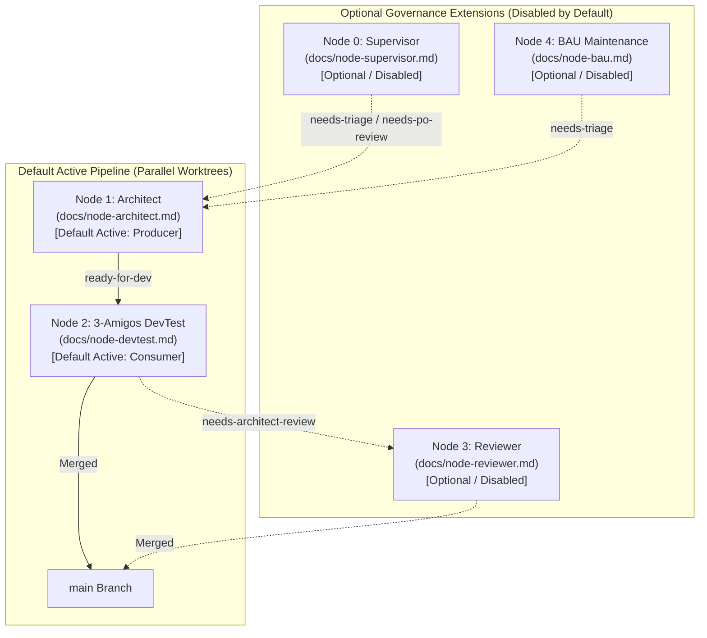

# Graph Orchestrator (`graph-orchestrator`)

A decoupled, local-first Python CLI daemon for autonomous multi-agent engineering pipelines. The orchestrator decouples workflow automation from application repositories, providing zero-token idle polling via batched GitHub CLI/GraphQL queries, pluggable AI CLI harnesses, and state locking via SQLite with TTL protection.

---

## ✨ Features

- **Zero-Token Polling**: Deterministic GitHub CLI checks run first. If no issues or pull requests match trigger labels, **0 LLM tokens are consumed**.
- **Streamlined 2-Node Parallel Engine**: Default parallel execution of **Architect** (Node 1: Producer) and **3-Amigos DevTest** (Node 2: Consumer) within isolated Git worktrees (`.graph/worktrees/`), providing high-throughput, non-blocking delivery.
- **Agnostic AI Harnesses**: Swap between Claude Code CLI (`claude`), Antigravity CLI (`agy`), Devin CLI (`devin`), or custom tools via simple string configuration changes without code modifications.
- **Repository Isolation**: Managed repositories contain only application code and standard GitHub issues/PRs. Orchestrator logic lives strictly in the control plane.
- **Modular Governance Extensions**: Dedicated **Supervisor** (Node 0: Watchdog & PO-Proxy), **Reviewer Gatekeeper** (Node 3: Auto-Merge Gate), and **BAU Maintenance** (Node 4: Daily Tech Debt Sweep) nodes available as optional extensions (disabled by default).
- **Concurrency & Parallel Workers**: An `aiosqlite` state database prevents duplicate execution across nodes, while independent async workers process multiple repositories concurrently in parallel.
- **Reactive Back-to-Back Chaining**: When a node completes active work, downstream nodes trigger immediately without waiting for the cooldown interval.

---

## 📋 Prerequisites

- **Python 3.11+**
- **Git**
- **GitHub CLI (`gh`)** authenticated with repository access (`gh auth login`)
- Local CLI AI agent(s) logged in under active developer subscriptions:
  - **Claude Code CLI** (`claude`)
  - **Antigravity CLI** (`agy`)
  - **Devin CLI** (`devin`, optional)

---

## 📦 Installation

Clone the repository and install the orchestrator in editable mode using a virtual environment:

### PowerShell (Windows)
```powershell
# Create and activate virtual environment
python -m venv .venv
.\.venv\Scripts\Activate.ps1

# Install package and dependencies in editable mode
pip install -e .
```

### Bash (macOS / Linux)
```bash
# Create and activate virtual environment
python3 -m venv .venv
source .venv/bin/activate

# Install package and dependencies in editable mode
pip install -e .
```

---

## ⚙️ Configuration

The orchestrator relies on a global configuration file located at `%USERPROFILE%\.orchestrator\config.yaml` (Windows) or `~/.config/orchestrator/config.yaml` (macOS/Linux).

To initialize your configuration, copy the provided template:

```powershell
# Windows
New-Item -ItemType Directory -Force -Path "$HOME\.orchestrator"
Copy-Item .\templates\config.example.yaml "$HOME\.orchestrator\config.yaml"
```

```bash
# Linux / macOS
mkdir -p ~/.config/orchestrator
cp templates/config.example.yaml ~/.config/orchestrator/config.yaml
```

### Configuration Example
```yaml
version: 2

settings:
  poll_interval_seconds: 300          # 5 minutes idle cooldown
  supervisor_interval_seconds: 3600   # 1 hour supervisor audit
  bau_interval_seconds: 86400         # 24 hours daily BAU sweep
  db_path: "~/.config/orchestrator/state.db"
  log_dir: "~/.config/orchestrator/logs"

harnesses:
  claude:
    command: "claude"
    args: ["-p", "{prompt}", "--dangerously-skip-permissions"]
    timeout_minutes: 30
  antigravity:
    command: "agy"
    args: ["-p", "{prompt}", "--dangerously-skip-permissions", "--print-timeout", "45m"]
    timeout_minutes: 45

projects:
  - name: "crosstrainingapp"
    repo: "AntaresAndBharani/crosstrainingapp"
    local_path: "c:/Users/rogal/workspaces/ws-setups/crosstrainingapp"
    nodes:
      architect:
        enabled: true                 # Default enabled (Producer)
        harness: "claude"
        model: "claude-sonnet-5"
        effort: "medium"
        label_trigger: "needs-triage"
        label_output: "ready-for-dev"
      devtest:
        enabled: true                 # Default enabled (Consumer)
        harness: "antigravity"
        model: "gemini-3.7-flash-medium"
        label_trigger: "ready-for-dev"
        label_output: "needs-architect-review"
        auto_merge_approved: true
      supervisor:
        enabled: false                # Optional / Disabled by default
        harness: "antigravity"
        model: "gemini-3.7-flash-low"
      reviewer:
        enabled: false                # Optional / Disabled by default
        harness: "claude"
        model: "claude-sonnet-5"
        label_trigger: "needs-architect-review"
        auto_merge_approved: true
      bau:
        enabled: false                # Optional / Disabled by default
        harness: "antigravity"
        model: "gemini-3.7-flash-low"
```

---

## 💻 CLI Commands

Built with `typer` and `rich` for live diagnostics and formatted tables:

| Command | Description |
|---------|-------------|
| `orchestrator doctor` | Verifies system prerequisites, tool availability in PATH (`gh`, `git`, `claude`, `agy`), and database connectivity. |
| `orchestrator list` | Displays a formatted table of all registered repositories, paths, and active harness assignments. |
| `orchestrator init` | Initializes the SQLite state database and provisions managed labels across repositories. |
| `orchestrator labels` | Idempotently synchronizes workflow taxonomy labels on GitHub. |
| `orchestrator run [--project <NAME>] [--node <NAME>] [--force]` | Executes an on-demand evaluation pass across all active projects or a targeted repository, rendering the startup Node Status Registry. |
| `orchestrator watch [--interval <SEC>]` | Starts continuous background polling with parallel workers and automatic source/config hot-reload. |
| `orchestrator reload` | Hot-reloads in-memory configuration and Python runtime modules without restarting the daemon. |
| `orchestrator stop [--force]` | Gracefully halts running background daemons, prevents new nodes from starting, and cleans up active AI agents. |
| `orchestrator logs <PROJECT> [--lines <N>]` | Streams recent execution traces and stdout/stderr from AI subprocesses for troubleshooting. |
| `orchestrator clean [--stale-only]` | Forces a cleanup of stale/expired locks in the SQLite state database. |

---

## 🏛️ Node Architecture



- **[Architect (Node 1)](docs/node-architect.md)** *(Default Active)*: Ingests raw User Stories (`needs-triage`), performs multi-category classification, and decomposes complex features into atomic subtasks (`ready-for-dev`).
- **[3-Amigos DevTest (Node 2)](docs/node-devtest.md)** *(Default Active)*: Validates git working trees, implements code and tests, verifies builds, and creates / auto-merges Pull Requests into `main`.
- **[Supervisor (Node 0)](docs/node-supervisor.md)** *(Optional / Disabled by Default)*: Audits repository methodology compliance, detects git merge conflicts, heals orphaned locks, and evaluates PO-proxy requirements.
- **[Reviewer Gatekeeper (Node 3)](docs/node-reviewer.md)** *(Optional / Disabled by Default)*: Dedicated gatekeeper evaluating PRs against remote CI (100% green requirement) and executing squash auto-merges into `main`.
- **[BAU Maintenance (Node 4)](docs/node-bau.md)** *(Optional / Disabled by Default)*: Periodic sweep under `gemini-3.7-flash-low` consolidating `tech-debt` and `enhancement` issues into cohesive User Stories.

---

## 🧪 Testing & CI

Run unit and integration tests:
```bash
pytest -v
```
All commits to `main` and Pull Requests are automatically verified across Python 3.11 and 3.12 via GitHub Actions.
