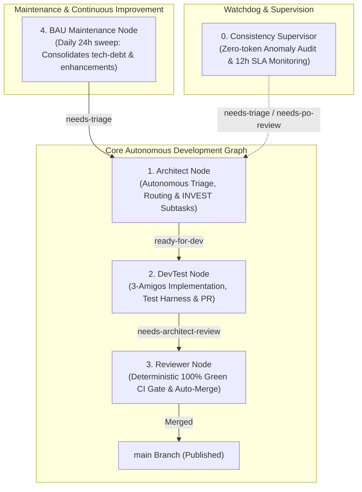

# Graph Engineering — Autonomous Agentic SDLC

**Graph Engineering** is a decoupled, model-agnostic multi-agent orchestration framework that automates the complete Software Development Lifecycle (SDLC) as a directed state graph.

It runs locally on the developer's machine using active developer OAuth subscriptions (`Claude Code`, `Google Antigravity`, `Devin`) to execute autonomous agent loops with **zero per-token API fees**.

---

## 🏛️ Autonomous 5-Node Architecture



| Node | Role | Trigger Label / Cadence | Output Label / Action | Harness / Model |
|------|------|-------------------------|-----------------------|-----------------|
| **Supervisor** | Watchdog & SLA monitor | Every 1 hour (periodic) | Flags `needs-triage` (missing label) or `needs-po-review` (> 12h SLA) | Deterministic ($0) + `gemini-3.7-flash-low` |
| **Architect** | Triage & Decomposition | `needs-triage` | Classifies tasks, creates subtasks (`ready-for-dev`), sets parent `architect-processed` | `claude` (`claude-sonnet-5`) |
| **DevTest** | 3-Amigos Implementation | `ready-for-dev` | Writes code & tests, opens PR (`needs-architect-review`), marks subtask `dev-implemented` | `antigravity` (`gemini-3.7-flash-medium`) |
| **Reviewer** | CI Gatekeeper & Merger | `needs-architect-review` | Verifies CI is 100% green, squash-merges PR, deletes branch | Deterministic ($0) + `claude-sonnet-5` |
| **BAU** | Backlog Consolidation | Every 24 hours (periodic) | Groups `tech-debt` & `enhancement` into new stories (`needs-triage`), auto-closes old issues | `antigravity` (`gemini-3.7-flash-low`) |

---

## 🚀 Quick Start

### 1. Prerequisites
- **Python 3.11+**
- **Git** & **GitHub CLI (`gh`)** authenticated (`gh auth login`)
- Local CLI agent(s) installed and logged in:
  - **Claude Code CLI**: `claude` (Anthropic subscription)
  - **Antigravity CLI**: `agy` (Google Antigravity subscription)
  - **Devin CLI** (Optional): `devin`

### 2. Installation
Clone and install the package in editable mode:
```bash
git clone https://github.com/AntaresAndBharani/graph-engineering.git
cd graph-engineering
pip install -e .
```

### 3. Verify Environment (`doctor`)
Run system diagnostics to verify CLI binaries, GitHub CLI authentication, SQLite state DB, and configured project paths:
```bash
orchestrator doctor
```

### 4. Initialize Configuration & Provision GitHub Labels
```bash
# Creates ~/.config/orchestrator/config.yaml if not already present
orchestrator init

# Idempotently syncs all 9 workflow labels on configured GitHub repositories
orchestrator labels
```

### 5. Run the Autonomous Orchestrator
```bash
# Start continuous autonomous daemon
orchestrator watch

# Or trigger an on-demand single evaluation pass
orchestrator run --project crosstrainingapp
```

---

## 🏷️ Standard Workflow Taxonomy Labels

| Label | Color | Purpose |
|-------|-------|---------|
| `needs-triage` | `#E2B7E1` | Raw or consolidated story waiting for Architect triage |
| `ready-for-dev` | `#0E8A16` | Actionable technical subtask ready for DevTest implementation |
| `needs-architect-review` | `#FBCA04` | Open PR ready for Reviewer / CI evaluation |
| `dev-implemented` | `#C2E0C6` | Subtask whose code has been implemented and PR opened |
| `architect-processed` | `#D4C5F9` | Parent User Story whose subtasks have been created |
| `orchestration-failed` | `#B60205` | Task where execution encountered a harness error or timeout |
| `needs-po-review` | `#D93F0B` | Merge conflicts, ambiguous requirements, or issues open > 12 hours |
| `tech-debt` | `#FBCA04` | Non-blocking technical debt or refactoring item for BAU Node |
| `enhancement` | `#A2EEEF` | Feature improvement or enhancement for BAU Node |

---

## ⚙️ Configuration Example (`~/.config/orchestrator/config.yaml`)

```yaml
version: "1.0"

settings:
  poll_interval_seconds: 300
  supervisor_interval_seconds: 3600
  bau_interval_seconds: 86400
  db_path: "~/.config/orchestrator/state.db"
  log_dir: "~/.config/orchestrator/logs"

harnesses:
  claude:
    command: "claude"
    args: ["-p", "{prompt}", "--dangerously-skip-permissions"]
    timeout_minutes: 30
  antigravity:
    command: "agy"
    args: ["-p", "{prompt}", "--dangerously-skip-permissions", "--print-timeout", "45m"]
    timeout_minutes: 45

projects:
  - name: "crosstrainingapp"
    repo: "AntaresAndBharani/crosstrainingapp"
    local_path: "c:/Users/rogal/workspaces/ws-setups/crosstrainingapp"
    nodes:
      supervisor:
        enabled: true
        harness: "antigravity"
        model: "gemini-3.7-flash-low"
      architect:
        enabled: true
        harness: "claude"
        model: "claude-sonnet-5"
        label_trigger: "needs-triage"
        label_output: "ready-for-dev"
      devtest:
        enabled: true
        harness: "antigravity"
        model: "gemini-3.7-flash-medium"
        label_trigger: "ready-for-dev"
        label_output: "needs-architect-review"
      reviewer:
        enabled: true
        harness: "claude"
        model: "claude-sonnet-5"
        label_trigger: "needs-architect-review"
        auto_merge_approved: true
      bau:
        enabled: true
        harness: "antigravity"
        model: "gemini-3.7-flash-low"
```

---

## 🧪 Testing & Quality Gates

Run the local test suite:
```bash
pytest -v
```

All Pull Requests and commits to `main` are automatically verified by GitHub Actions (`.github/workflows/ci.yml`) against Python 3.11 and 3.12.
