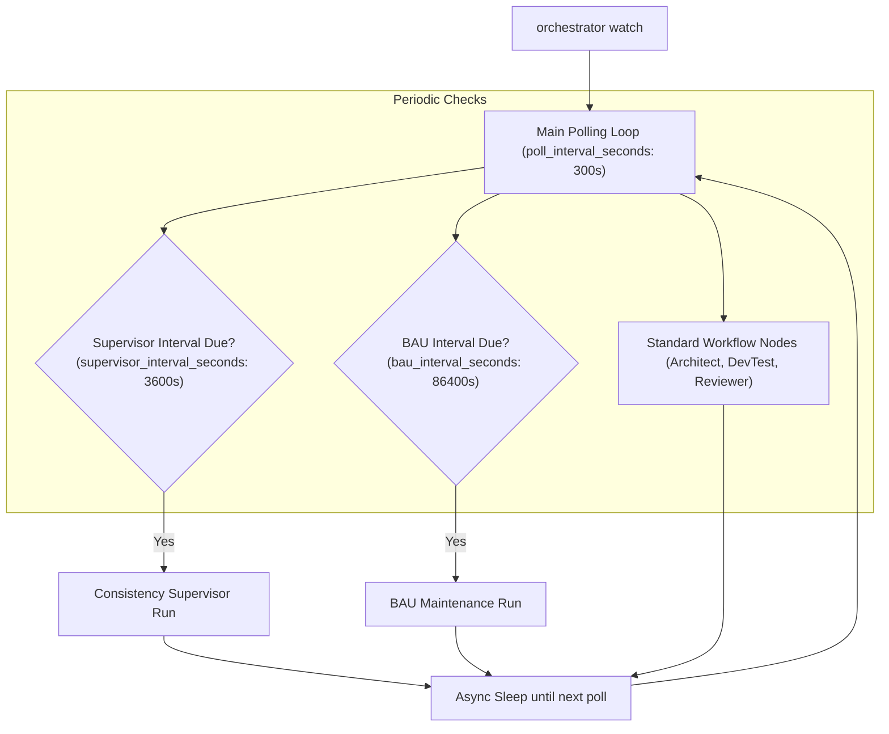

# Orchestration Daemon & Scheduling Migration

This document details the transition from legacy OS/IDE task schedulers to the unified, self-contained **Python Orchestration Daemon (`orchestrator watch`)**.

---

## 📜 Historical Context & Why Schedulers Were Replaced

Historically, the pipeline evaluated scheduled tasks through two legacy approaches:
1. **IDE-Scheduled Tasks**: Bound to specific IDE instances, lacking model flexibility, and incurring session setup overhead.
2. **OS Task Scheduler (Windows Task Scheduler / cron)**: Relied on platform-specific PowerShell scripts (`.ps1`), fragile single-flight flags, and complex OS permission configurations.

### The Unified Solution: `orchestrator watch`
All scheduling is now integrated directly into the `graph-orchestrator` Python CLI. A single daemon manages all polling intervals, lock lifetimes, and multi-project lifecycles asynchronously.

---

## ⏱️ Daemon Architecture & Scheduling Intervals



---

## ⚙️ Scheduling Configuration

All interval values are configured in `~/.config/orchestrator/config.yaml` (or `%USERPROFILE%\.orchestrator\config.yaml` on Windows):

```yaml
settings:
  # Polling interval for standard active workflow nodes (Architect, DevTest, Reviewer)
  poll_interval_seconds: 300       # 5 minutes

  # Interval between Consistency Supervisor audits
  supervisor_interval_seconds: 3600 # 1 hour

  # Interval between BAU maintenance sweeps (consolidating tech-debt & enhancements)
  bau_interval_seconds: 86400       # 24 hours (once a day)

  # State database path for persistent timestamps and locks
  db_path: "~/.config/orchestrator/state.db"
```

---

## 🚀 Running the Daemon

Run the daemon in any terminal or headless background service:

```bash
# Start continuous autonomous monitoring across all projects
orchestrator watch

# Or execute a single synchronous pass on demand
orchestrator run --project crosstrainingapp
```

### Advantages:
- **Zero OS Schedulers Needed**: No PowerShell scripts, crontabs, or Task Scheduler XML definitions required.
- **Cross-Platform**: Operates identically on Windows, macOS, and Linux.
- **Self-Healing SQLite State**: Execution timestamps and active locks are persisted across restarts in `state.db`.
- **Zero-Token Idle Polling**: Consumes 0 LLM tokens when no issues match trigger labels.
