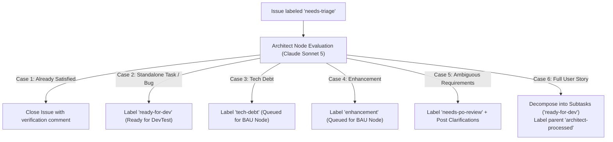

# Architect & Triage Node (`run_architect_node`)

The **Architect Node** is the autonomous technical reasoning and classification engine of the Graph Engineering pipeline. It triages raw requirements, classifies incoming work, and decomposes complex User Stories into testable subtasks.

---

## 🏛️ Autonomous Triage & Routing Matrix

When an issue carrying `needs-triage` is detected, the Architect evaluates the issue and routes it through one of 6 distinct operational paths:



---

## 🔑 Operational Rules

1. **Zero-Token Gating**:
   - Checks GitHub CLI for open issues matching `needs-triage`.
   - When no issues are present, exits immediately consuming **0 tokens**.

2. **INVEST Subtask Decomposition**:
   - Decomposes complex user stories into minimal, testable technical subtasks.
   - Each child subtask is created with **Gherkin acceptance criteria** and labeled **`ready-for-dev`**.
   - Links the parent story (`Parent: #<issue_id>`).

3. **Subtask Reconciliation & Idempotence**:
   - If subtasks already exist on GitHub, ensures all open child issues carry `ready-for-dev` without creating duplicates.
   - Updates the parent issue to **`architect-processed`** and removes `needs-triage`.

4. **Deterministic Post-Execution Safety Gate**:
   - Inspects the issue state via GitHub CLI immediately after the AI harness runs.
   - If the harness fails or times out, the issue is safely escalated to **`needs-po-review`** or **`orchestration-failed`** with a diagnostic comment.

---

## ⚙️ Configuration Example

Configured in `~/.config/orchestrator/config.yaml`:

```yaml
projects:
  - name: "crosstrainingapp"
    repo: "AntaresAndBharani/crosstrainingapp"
    local_path: "c:/Users/rogal/workspaces/ws-setups/crosstrainingapp"
    context_files:
      - "architecture.md"
    nodes:
      architect:
        enabled: true
        harness: "claude"
        model: "claude-sonnet-5"
        effort: "medium"
        label_trigger: "needs-triage"
        label_output: "ready-for-dev"
        processed_label: "architect-processed"
```
