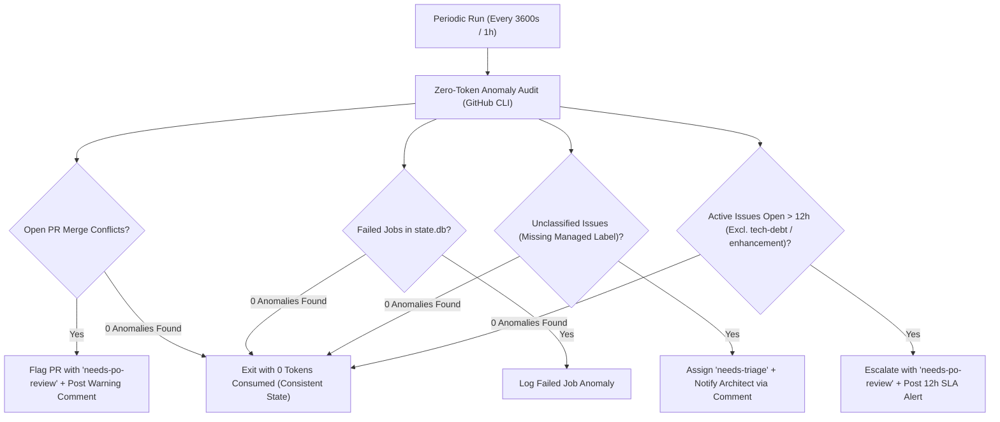

# Consistency Supervisor Node (`run_supervisor_node`)

The **Consistency Supervisor Node** is the autonomous watchdog of the Graph Engineering pipeline. It continuously audits repository health, detects methodology anomalies, and monitors issue SLA compliance.

---

## 🏛️ Operational Flow



---

## 🔑 Core Responsibilities

1. **Deterministic Zero-Token Audits**:
   - Queries GitHub metadata for open PRs and issues using `gh` CLI JSON format.
   - Evaluates rules purely deterministically in Python without invoking any LLM unless complex synthesis is requested.

2. **Issue Status & Taxonomy Validation**:
   - Ensures all open issues carry a valid managed workflow label (`needs-triage`, `ready-for-dev`, `dev-implemented`, `architect-processed`, `needs-po-review`, `orchestration-failed`, `tech-debt`, `enhancement`).
   - If an unclassified issue is opened without labels, the Supervisor automatically assigns **`needs-triage`** so the **Architect Node** can triage and classify it.

3. **12-Hour Stale Issue SLA Monitoring**:
   - Calculates the age of all active issues from `createdAt`.
   - **Excludes** `tech-debt` and `enhancement` issues (which are safely queued for the daily BAU Node).
   - If an active workflow item remains open for **longer than 12 hours**, the Supervisor flags it with **`needs-po-review`** and posts a diagnostic warning comment.

4. **PR Merge Conflict Detection**:
   - Checks the `mergeable` status of all open pull requests.
   - If a PR encounters git merge conflicts (`CONFLICTING`), it attaches `needs-po-review` to prevent review node deadlock.

---

## ⚙️ Configuration Example

Configured under `nodes.supervisor` in `~/.config/orchestrator/config.yaml`:

```yaml
projects:
  - name: "crosstrainingapp"
    repo: "AntaresAndBharani/crosstrainingapp"
    nodes:
      supervisor:
        enabled: true
        harness: "antigravity"
        model: "gemini-3.7-flash-low"
```
