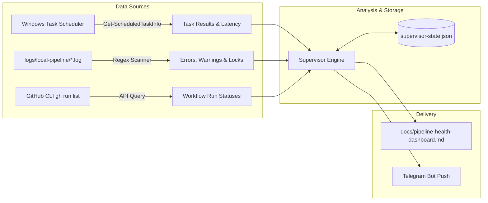

# Consistency Supervisor Node

**Added 2026-08-27.** A dedicated watchdog node responsible for cross-project health verification, anomaly detection, log analysis, and incident alerting across all Graph Engineering pipelines (e.g. `crosstrainingapp` and `darwin-trader`).

```
+-----------------------------------------------------------------------------------+
|                        Consistency Supervisor Node                                |
|           (Deterministic Engine + Optional gemini-3.7-flash-low)                   |
+-----------------------------------------------------------------------------------+
       |                                |                                   |
       v                                v                                   v
[1. Local Scheduled Tasks]     [2. Local Pipeline Logs]        [3. GitHub Actions CI Runs]
 - CTA-Architect / DT-*          - logs/local-pipeline/*.log     - Merge & Backlog runs
 - Exit codes (0 vs non-zero)    - [ERROR] & fatal crashes       - PR Snapshot builds
 - State & NextRunTime           - Git index.lock collisions     - Failed workflows
       \                                |                                   /
        \                               |                                  /
         v                              v                                 v
+-----------------------------------------------------------------------------------+
|                     Supervisor Evaluation & State Engine                          |
|             (Health Categorization, State Cache & Deduplication)                 |
+-----------------------------------------------------------------------------------+
                                        |
                 +----------------------+----------------------+
                 |                                             |
                 v                                             v
     [Channel 1: Health Dashboard]                 [Channel 2: Telegram Bot]
   - docs/pipeline-health-dashboard.md          - Instant mobile push alerts
   - Matrix of all nodes & projects             - Tiered: 🚨 CRITICAL / ⚠️ WARN / 🟢 OK
   - Actionable PO recommendations              - Anti-spam deduplication cache
```

---

## 1. Why this Node Exists

The Graph Engineering pipeline operates autonomous agent loops (Architect, Backlog Triage, Three Amigos, Dev & Test, PR Review) running via local Windows Task Scheduler tasks and remote GitHub Actions runners.

As the number of target repositories grew from one (`crosstrainingapp`) to multiple (`darwin-trader`, `stock-manager-cli`), silent failures can occur without immediate visibility:
1. **Git lock collisions:** Overlapping task execution or crashed background processes leaving `.git/index.lock` behind, blocking subsequent polls.
2. **Local runner crashes:** Process termination, token limits, or unhandled CLI exceptions exiting with code `1` or `128`.
3. **Remote CI failures:** Broken GitHub Action runs during PR Snapshot builds or Merge workflows.
4. **Stalled pipelines:** Tasks stopped mid-cycle due to rate limits or unhandled edge cases.

The **Consistency Supervisor Node** solves this by operating as a lightweight, reliable watchdog that inspects the health of all systems, compiles a unified status dashboard, and notifies the Product Owner via Telegram when immediate intervention is needed.

---

## 2. Core Operational Principles

### A. Zero-Token Deterministic Core
Routine health checks, log scanning, exit code verification, and status synthesis run entirely deterministically via PowerShell and the GitHub CLI (`gh`). No LLM tokens are consumed for nominal checks or routine dashboard refreshes.

### B. Multi-Project Scope
The supervisor monitors all repositories adopting the Graph Engineering architecture simultaneously. Active projects include:
- **`AntaresAndBharani/crosstrainingapp`** (Android Jetpack Compose application)
- **`AntaresAndBharani/darwin-trader`** (Algorithmic Trading & MetaTrader platform)
- Easily extensible to additional projects via centralized repository configuration.

### C. Anti-Spam State Deduplication
To prevent notification fatigue, the supervisor maintains a state cache (`logs/local-pipeline/supervisor-state.json`). It records acknowledged error signatures and only triggers Telegram notifications when:
- A **new error** or anomaly is discovered.
- A previously failing node transitions to **recovered (🟢 HEALTHY)**.
- A critical escalation persists beyond a configured alert threshold.

---

## 3. Inspection Layers



### Layer 1: Windows Scheduled Tasks Audit
- Discovers tasks matching `CTA-*` and `DT-*`.
- Queries task state (`Ready`, `Running`, `Disabled`).
- Evaluates `LastTaskResult`:
  - `0` / `0x0`: Success.
  - `1` / `0x1` / `128`: Unhandled script crash or git execution error.
  - `0x41301`: Task is currently running.
- Evaluates `LastRunTime` vs `NextRunTime` to detect missed schedules.

### Layer 2: Local Pipeline Log Scanning
- Scans active and recent rolling logs in `<repo>/logs/local-pipeline/*.log` (e.g. `architect-*.log`, `backlog-triage-*.log`, `three-amigos-and-dev-test-*.log`, `pr-review-*.log`).
- Identifies critical error patterns:
  - `[ERROR]` or `Unhandled error`
  - `fatal: Unable to create '.../index.lock': File exists`
  - `failed with exit code 128`
  - `gh: API rate limit exceeded` or auth failures
  - Stalled polls (runs started without a closing completion marker).

### Layer 3: Remote GitHub Actions Runner Verification
- Executes `gh run list --repo <repo> --limit 10 --json databaseId,name,conclusion,status,url,updatedAt`.
- Tracks conclusions:
  - `success`: Nominal.
  - `failure` / `timed_out` / `startup_failure`: Flags the workflow name, commit message, and run URL.
  - `in_progress`: Flags hung runners exceeding 15 minutes duration.

---

## 4. Communication & Reporting Channels

### Channel 1: Unified Health Dashboard (`pipeline-health-dashboard.md`)
The supervisor generates a self-contained Markdown dashboard containing:
1. **System Health Status Banner** (🟢 All Nominal, 🟡 Warnings, 🔴 Critical Issues).
2. **Cross-Project Matrix**: Summary of all scheduled tasks, their latest exit codes, last run timestamps, and log error tallies.
3. **Detailed Anomaly Log**: Direct code-block snippets of exact errors, file paths, and timestamps.
4. **Actionable Remediation Checklist**: Prescriptive commands to fix detected issues (e.g. `Remove-Item .git/index.lock`).

### Channel 2: Telegram Bot Instant Push Alerts
Using Telegram's Bot API (`sendMessage`), alerts are dispatched directly to the PO's mobile device:

- **🚨 Critical Alert Format:**
  ```text
  🚨 [Graph Engineering Alert] 🚨
  Project: crosstrainingapp
  Node: Backlog Triage (CTA-BacklogTriage)
  Status: CRITICAL (Exit Code 1)
  
  Details:
  Git index lock collision: Unable to create '.git/index.lock': File exists.
  
  Action Required:
  Clear stale lock file or check for overlapping background git tasks.
  ```

- **🟢 Recovery Alert Format:**
  ```text
  🟢 [Graph Engineering Recovery]
  Project: crosstrainingapp
  Node: Backlog Triage (CTA-BacklogTriage)
  Status: Back to HEALTHY (Exit Code 0)
  ```

---

## 5. Extensibility: Optional LLM Reasoning (Gemini 3.7 Flash Low)

While the supervisor's primary telemetry and alerting is 100% deterministic, it includes a modular execution hook for `gemini-3.7-flash-low`:
- When an unknown or multi-line complex stack trace is detected in the logs, the supervisor can dispatch a single judgment-only prompt (`agy.exe --model gemini-3.7-flash-low --print`) to synthesize the root cause and recommend an automated fix.
- Routine polls with zero errors or known deterministic errors bypass the LLM entirely.

---

## 6. Execution & Scheduling

The supervisor is registered as a scheduled task (`GE-ConsistencySupervisor`) running every **15 minutes**:

```powershell
.\scripts\register-supervisor-task.ps1 -IntervalMinutes 15
```

Manual execution / on-demand audit:
```powershell
.\scripts\run-consistency-supervisor.ps1 -Verbose
```
