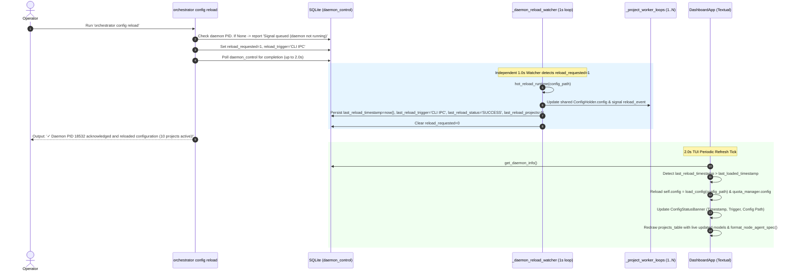
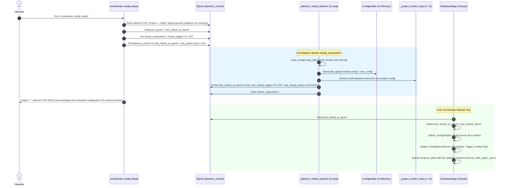

# 📋 Implementation Plan & Refinement Lifecycle: Config Reload Observability, Dynamic Agent Visualization & High-Performance Startup

## 📝 Initial Draft Proposal

### Background & Objective
During live operations of the `graph-orchestrator` across 10 active repositories, two critical UX and observability blind spots and one major startup bottleneck were identified:

1. **Config Reload Blind Spot (`orchestrator config reload`):**
   - When an operator executes `orchestrator config reload`, the CLI currently registers an IPC flag in SQLite and exits immediately without verifying whether the active daemon has picked up or completed the reload.
   - The operator cannot tell if the running daemon actually reloaded the configuration, what configuration path was loaded, or what timestamp the reload occurred at.
   - In the interactive Textual TUI dashboard (`orchestrator watch`), there is zero visual indication of the configuration status, last reload timestamp, or what triggered the reload (e.g., initial daemon boot vs. CLI IPC signal).

2. **Agent / Model & Effort Transparency:**
   - The status tables and dashboard do not clearly convey the active AI agent model and effort.
   - Model specifications differ across harnesses: Claude uses a model plus an explicit reasoning effort parameter (e.g., `claude-sonnet-5` with `effort: medium`), whereas Gemini models embed the effort profile directly into the model designation (e.g., `gemini-3.8-flash-high`).
   - The operator needs unified, intuitive agent/model formatting across both the CLI (`orchestrator list`, startup table) and the TUI dashboard:
     - For Claude harness: `agent + effort` (e.g., `claude-sonnet-5 (medium)`).
     - For Gemini harness: `agent` (e.g., `gemini-3.8-flash-high`, effort omitted).

3. **Startup Freeze (140 Sequential GitHub CLI Calls):**
   - At startup, `sync_all_projects_labels` runs sequentially across all enabled projects before launching the TUI dashboard or worker loops.
   - Across 10 enabled projects, it sequentially issues 7 `gh label delete` commands and 7 `gh label create --force` commands.
   - This results in **140 sequential `gh.exe` subprocesses**, taking over **150 seconds (2.5 minutes)** of synchronous blocking where the process appears frozen before the dashboard can even open.

---

## 🔍 Review Iteration 1: 3-Amigos Critical Architectural Review

- **Date / Author:** 2026-09-03 | Antigravity AI Architect
- **Target Repository:** `AntaresAndBharani/graph-engineering`
- **Architectural Scope:** `orchestrator/cli.py`, `orchestrator/db.py`, `orchestrator/housekeeping.py`, `orchestrator/ui/dashboard.py`, `orchestrator/ui/widgets.py`

### 1. Point-by-Point Verdict Matrix

| # | Proposal Element | Target Component | Verdict | Technical Rationale & Architectural Rule |
|---|---|---|---|---|
| 1 | **Reload Metadata Persistence** | `orchestrator/db.py` (`daemon_control`) | **APPROVE** | Leverage existing SQLite `daemon_control` key-value table. Store `last_reload_timestamp`, `last_reload_trigger`, `last_reload_status`, and `last_reload_config_path`. **Zero schema migrations required**, 100% backward compatible. |
| 2 | **CLI Synchronous Reload Acknowledgement** | `orchestrator/cli.py` (`config reload`) | **APPROVE** | After writing `reload_requested = 1`, poll `daemon_control` with a 2.0s bounded loop (200ms sleep) to detect when the daemon completes the reload and clears the flag. If acknowledged, output green confirmation with PID, config path, and project count; if timeout, report gracefully that the signal is queued. |
| 3 | **TUI Config Reload Observability Banner** | `orchestrator/ui/dashboard.py` | **APPROVE** | Add a dedicated `ConfigStatusBanner(Static)` widget above `#projects_table` (or update Dashboard Header subtitle dynamically). Surfaces: Config path, Last Reload timestamp, Reload trigger (e.g. `CLI IPC` vs `Initial Boot`), and Daemon status. Refreshed on the existing 2.0s tick without blocking the event loop. |
| 4 | **Model & Effort Formatter** | `orchestrator/cli.py`, `orchestrator/ui/dashboard.py` | **APPROVE** | Implement unified pure helper `format_node_agent_spec(harness, model, effort)`. For Claude: returns `<model> (<effort>)` if effort specified, else `<model>`. For Gemini: returns `<model>` (suppressing effort). Surface in both `render_node_status_table`, `orchestrator list`, and TUI project status. |
| 5 | **Non-Blocking Background Label Sync** | `orchestrator/cli.py` (`_watch_daemon_tui`, `_watch_daemon_headless`) | **APPROVE** | Decouple `sync_all_projects_labels` from blocking startup. Launch as an unawaited background task (`asyncio.create_task`) so the Textual dashboard launches **instantly in <0.5s**. |
| 6 | **Smart 1-Call Label Inspection** | `orchestrator/housekeeping.py` | **APPROVE** | Replace 14 blind subprocesses per repo with a single `gh label list --json name` inspection. Only call `gh label delete` if obsolete labels actually exist (0 calls for clean repos); only create missing labels. Execute across projects concurrently via `asyncio.gather(return_exceptions=True)`. |

---

## 🏛️ Claude Opus Review Iteration 1: Three Amigos Critical Review — Source-Verified Feasibility Pass

- **Date / Reviewer:** 2026-09-03 | Three Amigos (Business / Dev / QA)
- **Scope reviewed:** Whole document, including Iteration 1. Every file path, count, timing and "already exists" claim was checked against working-tree `HEAD` (`fee6763`) and the live operator config `~/.orchestrator/config.yaml`.
- **Baseline established:** `python -m pytest -q` → **337 passed in 68.58s**. Suite is green before any change.
- **Verdict:** ❌ **REWORK REQUIRED** — the direction is right and Subtask 3's optimisation is genuinely worth ~30x, but three of the four headline claims are unachievable as specified against the real runtime, and the startup arithmetic is wrong in a way that would produce the wrong implementation.

> **Note on Iteration 1:** it is *not* stale leftover from the previous draft — it does review this requirement. But it is an all-APPROVE pass with six APPROVE verdicts and no dissent, and every one of the blockers below sits inside a component it approved. Treat its verdict matrix as a design sketch, not as clearance.

### Findings

| # | Severity | Perspective | Finding | Evidence | Recommended action |
|---|---|---|---|---|---|
| 1 | **Blocker** | Dev | **The 2.0s synchronous acknowledgement can essentially never succeed.** Reload is detected only at the top of `_project_worker_loop`, which sleeps `interval` between passes. Live `poll_interval_seconds` is **180**; the default is 300. Worst-case ack latency is 180s *plus* a full `run_project_cycle`, which invokes AI harnesses with `timeout_minutes: 45`. A 2.0s bounded poll times out on every realistic invocation, so AC scenario 1's "upon acknowledgement it must display…" branch is dead in production. | `orchestrator/cli.py:424` (check site), `orchestrator/cli.py:452` (`await asyncio.sleep(interval)`), `~/.orchestrator/config.yaml:3` (`poll_interval_seconds: 180`), `orchestrator/config.py:141` (default 300) | Add a dedicated lightweight reload-watcher `asyncio.Task` in `_watch_daemon_tui`/`_watch_daemon_headless` polling `is_reload_requested()` every ~1s, independent of the worker sleep. Only then is a 2.0s CLI wait meaningful. Without it, delete the sync-ack acceptance criterion and keep the current "signal queued" message. |
| 2 | **Blocker** | Dev | **Reload is per-worker and the IPC flag is single-consumer, so "number of reloaded projects" is not a real quantity.** `config` and `project` are locals of `_project_worker_loop`. The first of the 10 workers to reach the check calls `clear_reload_request()`; the other 9 never observe the flag and keep running the pre-reload config until the *next* reload. Reporting a project count, and writing `last_reload_status='SUCCESS'`, asserts a global fact the runtime does not produce. | `orchestrator/cli.py:404-441` (`config = hot_reload_runtime(...)` at :428 rebinds a local; `clear_reload_request()` at :429) | Centralise the reload in the single watcher task from Blocker 1: rebuild config once, publish it to all workers via a shared mutable holder, then record one authoritative `last_reload_status` / project count. Do not report a count until this holds. |
| 3 | **Blocker** | Dev / Business | **The dashboard renders stale config after a reload — which defeats the feature's own headline.** `DashboardApp` captures `config` at construction and `update_projects_table` reads `self.config.projects`; `_watch_daemon_tui` passes no `config_path`. After a reload the new `ConfigStatusBanner` would announce "reloaded at HH:MM:SS" while the adjacent agent/model column still shows **pre-reload** models. The sequence diagram's `TUI->>DB: get_daemon_info() & load active config` describes behaviour that does not exist. | `orchestrator/ui/dashboard.py:84-90` (ctor), `:286` (`self.config.projects`), `orchestrator/cli.py:602-608` (ctor call omits `config_path`) | Plumb `config_path` into `DashboardApp`; on observing a changed `last_reload_timestamp`, re-run `load_config(config_path)` and rebind `self.config` **and** `HarnessQuotaWidget.config`. Add `orchestrator/config.py` and this rebinding to the Component Impact Table. |
| 4 | **Blocker** | Dev | **The startup arithmetic is wrong and will misdirect the implementation.** The delete loop iterates the hardcoded `LEGACY_OBSOLETE_LABELS` (**23** entries), not 7. Live `managed_labels` is 7. So it is **23 + 7 = 30 gh calls per repo × 10 enabled = 300 sequential subprocesses**, not 140, and "replace 14 blind subprocesses per repo" would leave the 23-entry purge list untouched. Measured single `gh` round trip on this machine: **546 ms** → 300 × 0.546 ≈ **164 s**, which corroborates the ~150s freeze while invalidating the count. | `orchestrator/housekeeping.py:9-32` (23 labels), `:36-56` (delete loop), `:76-101` (create loop), `~/.orchestrator/config.yaml:13-34` (7 managed labels), verified via `load_config()` → `projects: 10 enabled: 10` | Restate as **300** calls, and scope Subtask 3 to collapse *both* loops (23 deletes + 7 creates) behind the single inspection. |
| 5 | **Blocker** | Dev / QA | **`gh label list --json name` is under-specified in two ways that break correctness.** (a) `--limit` defaults to **30** (`gh 2.93.0`), so a repo with >30 labels silently returns a truncated set and the "does it exist?" decision becomes wrong. (b) `--json name` cannot detect colour/description drift, which today's `gh label create --force` silently corrects on every boot — "only create missing labels" abandons that, and `.graph/architecture.md:380` records it as an architectural invariant ("must use `gh label create --force` to prevent duplicate or conflicting label definitions"). | `gh label list --help` → `-L, --limit int  Maximum number of labels to fetch (default 30)`; `.graph/architecture.md:380` | Specify `gh label list --json name,color,description --limit 200`. Issue `gh label create --force` when the name is absent **or** colour/description differ. Amend `.graph/architecture.md:380` to record the new rule. |
| 6 | Major | Dev | **Fire-and-forget task lifetime and silent failure.** A bare `asyncio.create_task` whose result is never referenced can be garbage-collected mid-flight. In `_watch_daemon_headless` the no-enabled-projects branch returns immediately and the loop closes, so the sync never completes and Python emits "Task was destroyed but it is pending". `asyncio.gather(return_exceptions=True)` then discards every per-repo failure — labels silently stop being provisioned with no operator signal, contradicting the global rule against swallowing exceptions. | `orchestrator/cli.py:543-546` (early `return` path), Iteration 1 verdict rows 5 and 6 | Hold a reference; attach `add_done_callback` logging exceptions via `_logger.error`; await the task in the `finally` teardown with a bounded timeout. Surface failures in the Alerts tab. |
| 7 | Major | Dev | **Removing the blocking sync removes a real ordering guarantee.** Today the awaited sync guarantees every managed label exists before any worker issues `gh issue edit --add-label`. Backgrounding it means a fresh or newly-added repo can have the architect attempt `--add-label needs-triage` against a label that does not yet exist. | `orchestrator/cli.py:541`, `:599` (sync precedes worker spawn at `:546-549`, `:614-617`) | Keep the TUI launch immediate, but gate each `_project_worker_loop`'s **first** cycle on a per-project `asyncio.Event` set when that project's sync completes. Cost is zero perceived latency; the guarantee is preserved. |
| 8 | Major | Dev | **Unbounded concurrency against the GitHub API.** `asyncio.gather` over 10 repos issuing up to 30 mutating `gh` calls each, fired simultaneously with 10 worker loops that also call `gh`, invites GitHub secondary rate limiting — whose failure mode under finding 6 is total silence. | Iteration 1 verdict row 6 | Bound with `asyncio.Semaphore(4)` across repos. |
| 9 | Major | Dev / Business | **The plan inherits a live, irreversible destructive purge without questioning it.** `LEGACY_OBSOLETE_LABELS` includes `tech-debt`, `planned`, `needs-architect-review`, `architect-approved`, `needs-po-review`. A live `gh label list` on `AntaresAndBharani/graph-engineering` returns 16 labels — the 9 GitHub defaults plus the 7 managed — and **none of those five**: they have already been deleted from the live repo. Deleting a GitHub label removes it from every issue and PR carrying it, with **no recovery path**. Worse, under `DEFAULT_MANAGED_LABELS` five of those names are simultaneously in the managed list (verified overlap: `architect-approved`, `needs-architect-review`, `needs-po-review`, `planned`, `tech-debt`), so any default-config user delete-then-recreates them on **every daemon boot**, stripping them from issues each time. Subtask 3 rewrites exactly this function and preserves the behaviour. | `orchestrator/housekeeping.py:9-32` vs `orchestrator/config.py:173-185`; live `gh label list --repo AntaresAndBharani/graph-engineering --json name --limit 100` | (a) Assert `set(LEGACY_OBSOLETE_LABELS) & {l.name for l in labels} == set()` and skip the intersection — a label that is both managed and obsolete is a config bug, not a delete target. (b) Guard the purge behind a one-shot `daemon_control` key (e.g. `legacy_purge_done`) so it runs once, not on every startup. |
| 10 | Major | Dev | **`format_node_agent_spec` branching on harness name contradicts the commit that just landed.** `17df801` enforced "100% config-driven model resolution with zero hardcoded model strings"; this reintroduces a hardcoded harness switch. The registry is an open dict — `claude`, `antigravity`, `devin` ship by default and users may add more — so a 2-branch spec covers 2 of 3 and no user-defined harness. Also "Gemini" is not a harness name anywhere in the codebase; the harness is `antigravity` (the Gherkin has it right, the Background and verdict row 4 do not). | `orchestrator/config.py:188-212` (3 harnesses), `:263-264` (open dict), commit `17df801` | Delete the harness switch: `f"{model} ({effort})" if effort else model`. This yields byte-identical output for **both** Gherkin cases with zero harness knowledge, and stays config-driven for any future harness. |
| 11 | Major | Business | **The Claude/effort half of the feature has zero users in the live deployment.** `~/.orchestrator/config.yaml` contains **no** `effort:`, `research_effort:` or `conflict_effort:` key anywhere, and all 10 projects use `harness: antigravity` with `model: gemini-3.8-flash-high` on every node. Every cell this feature renders will read `gemini-3.8-flash-high`. The Gherkin's Claude scenario describes a configuration that exists nowhere. | grep over `~/.orchestrator/config.yaml`: `effort_flag` at :43 and :72 only, no `effort:`; 30 `harness: antigravity` occurrences, 0 `harness: claude` in nodes | Confirm the real request before building. If the actual pain is "the table shows the harness where I want the model", that is a ~2-line change at `orchestrator/cli.py:144-146` and finding 10's one-liner delivers 100% of the observable value. Do not build a branching formatter for a branch nothing exercises. |
| 12 | Major | Dev / QA | **Both CLI tables lose information under the proposed change.** `orchestrator list` has columns literally headed "Architect Harness" / "DevTest Harness" that currently render harness names — putting model strings in them makes the headers false. `render_node_status_table`'s "Harness" column currently renders `harness (model)`; replacing it with `model (effort)` removes any indication of which binary actually runs. | `orchestrator/cli.py:666-667`, `:673-674`; `orchestrator/cli.py:125`, `:144-146` | Keep "Harness" and **add** a separate "Agent (Model/Effort)" column to both tables rather than overwriting. |
| 13 | Major | QA | **A known test regression is absent from the plan, and the TUI acceptance criterion is undefined for the common case.** `tests/test_dashboard.py` hard-asserts the exact 6-element column list **twice**. Adding an agent column breaks it. Separately, `projects_table` rows are keyed `{project}::{node_type}` derived from **RUNNING** jobs, with a single `{project}::Idle` row when nothing is running — so "each node row must display the formatted agent specification" is undefined for an idle project, which is the steady state. | `tests/test_dashboard.py:148-176` (`assert column_labels == expected_columns`, `assert app.TABLE_COLUMNS == expected_columns`); `orchestrator/ui/dashboard.py:297-340` | Specify the idle-row rendering explicitly (show the architect/devtest models, or `—`), and list the column-assertion update in Subtask 4. |
| 14 | Major | Dev / QA | **Six file-level inaccuracies in the Component Impact Table / subtasks.** (a) `tests/test_housekeeping.py` **does not exist** — Subtask 3 says "Update"; it is a CREATE, and it is missing from the impact table entirely. (b) `tests/test_cli.py` is used by Subtask 2 but missing from the impact table. (c) `orchestrator/ui/widgets.py` is listed for "styling and layout rules" but contains **no CSS at all** — it holds three `DataTable` subclasses; all CSS lives in `DashboardApp.CSS`. (d) `orchestrator/config.py` is missing, yet the banner needs the resolved config path and `load_config` **discards** it (only `find_config_file` knows it). (e) `StateManager.record_reload_complete` **does not exist** in `db.py` — only `request_reload`, `is_reload_requested`, `clear_reload_request`, `get_daemon_info`. (f) `docs/node-cli.md:83` (node table columns) and `:138-142` (reload behaviour) both go stale, and the standing rule is that graph-engineering docs are synced with every change. | `ls tests/` (no `test_housekeeping.py`); `orchestrator/ui/widgets.py:126,250,349` (no CSS/`DEFAULT_CSS`); `orchestrator/ui/dashboard.py:37-63`; `orchestrator/config.py:297-350`; `orchestrator/db.py:284-340`; `docs/node-cli.md:83,138-142` | Correct all six in the impact table before implementation starts. |
| 15 | Major | Dev | **The banner will overflow the screen.** `#projects_table { height: 40% }` + `#bottom_container { height: 60% }` already sums to 100%. Inserting a `ConfigStatusBanner` above `#projects_table` without adjusting those pushes the layout past the viewport. | `orchestrator/ui/dashboard.py:41-47` | Banner `height: 3`; change `#projects_table` to `height: 1fr`. |
| 16 | Minor | Dev / QA | **Every `config reload` invocation gains a 2.0s penalty when no daemon is running.** `request_reload()` returns `None` when no PID is registered — the poll is pointless in that case. Two existing CLI tests would each get 2s slower. | `orchestrator/db.py:300-307`; `tests/test_reloader.py:64-88` | Short-circuit: skip the poll entirely when `request_reload()` returns `None`. |
| 17 | Minor | QA | **"337+ tests" is a moving target, and the startup target is stated twice with different numbers.** Baseline is verified at exactly 337, but this plan *adds* tests. Separately, Iteration 1 verdict row 5 says "**<0.5s**" while the Gherkin says "**within 1.0 second**". | `pytest -q` → `337 passed`; verdict row 5 vs Gherkin scenario 5 | Pin the exit criterion as "0 failures, ≥337 tests". Pick one startup number and use it in both places. |
| 18 | Minor | QA | **The startup-latency criterion is unfalsifiable by the tests that will be written.** `tests/test_dashboard.py:427` already monkeypatches `sync_all_projects_labels` away, so a wall-clock assertion in that harness proves nothing about the real 300-call path. | `tests/test_dashboard.py:427` | Replace the timing assertion with a structural one: assert the sync coroutine has **not** completed at the moment `on_mount` finishes — that is what "non-blocking" actually means and it is deterministic. |
| 19 | Minor | Dev | `CHANGELOG.md` `## [Unreleased]` mixes bare top-level bullets with a nested `### Added` subsection. | `CHANGELOG.md:7-20` | Pick one structure while adding this entry. |

### Concerns & drawbacks

**1. Three of four headline promises are runtime-infeasible as written, and they share one root cause.**
Blockers 1, 2 and 3 are not independent. All three stem from the same architectural fact: **the reload has no owner**. It is a flag that ten independent, long-sleeping loops race to consume, and the UI is a fourth party holding a snapshot none of them update. Bolting metadata columns onto `daemon_control` makes the *reporting* richer without making the *event* real — you would ship a banner that confidently displays a timestamp and a trigger for a reload that reached 1 of 10 workers, next to a model column showing the values from before it. **Verdict: the observability layer must not be built on top of the current reload mechanism.** Introduce the single reload-owner task first (it is small — one `while True: sleep(1)` coroutine and a shared config holder), then Blockers 1, 2 and 3 all collapse into ordinary work. Evidence: `orchestrator/cli.py:404-441`, `orchestrator/ui/dashboard.py:84-90` and `:286`, `orchestrator/cli.py:602-608`.

**2. Subtask 3 is the only part carrying most of the value, and it is the part sized wrong.**
Stripped of the two observability features, the plan's measurable outcome is: 300 sequential `gh` calls at 546 ms each (≈164 s) reduced to 10 concurrent calls (≈1 s). That is real, and worth doing on its own. But the plan describes it as "replace 14 blind subprocesses per repo", which points an implementer at the 7-label create loop and leaves the 23-label purge loop — **77% of the cost** — in place. **Verdict: Subtask 3 is approved in direction and wrong in specification.** Restate against the verified numbers (23 + 7 per repo, 10 repos, 300 total) and it becomes the single highest-value item here. Evidence: `orchestrator/housekeeping.py:9-32`, `:36-56`, `:76-101`; measured 546 ms/call.

**3. Nobody asked whether the purge should be running at all, and it is destroying data right now.**
This is the most serious thing found and it is invisible in the plan, because the plan treats `sync_repository_labels` as a performance problem rather than a behavioural one. The function unconditionally deletes 23 named labels from all 10 live repositories on every daemon startup. `gh label list` on `graph-engineering` confirms `tech-debt`, `planned`, `needs-architect-review`, `architect-approved` and `needs-po-review` are already gone. GitHub label deletion is not reversible and takes the label off every issue and PR that carried it — there is no recovery path, and no audit record of what was stripped. Under `DEFAULT_MANAGED_LABELS` the situation is worse still: five names are in *both* the obsolete list and the managed list, so a default-config user deletes and recreates them on every boot, silently clearing them from live issues each time. **Verdict: fix the destructiveness in the same change that touches this function — a one-shot guard plus an intersection assertion — or explicitly record the accepted data loss.** Doing a performance pass over an unsafe operation, and thereby making it faster and more reliable at deleting, is the wrong order. Evidence: `orchestrator/housekeeping.py:9-32` vs `orchestrator/config.py:173-185`; live `gh label list` returning 16 labels.

**4. The agent-visualisation feature is specified for a deployment that does not exist.**
The plan's premise is that operators need to reconcile two model-spec conventions. The live config has one: every node of every project is `antigravity` / `gemini-3.8-flash-high`, and the string `effort:` appears nowhere. The Claude-with-effort branch — the entire reason the formatter has branches — has no production input and cannot be validated except by a synthetic fixture. Meanwhile the branching itself reintroduces harness-name hardcoding into a codebase that removed hardcoded model resolution one commit ago. **Verdict: the feature is over-specified for its evidence.** `f"{model} ({effort})" if effort else model` satisfies both Gherkin scenarios exactly, needs no harness knowledge, works for `devin` and for harnesses that do not exist yet, and is one line. Evidence: `~/.orchestrator/config.yaml` (no `effort:` key; 30 `harness: antigravity`), `orchestrator/config.py:188-212`, commit `17df801`.

**5. The verification section will report green while proving very little.**
Subtask 5's criterion is "full suite green", but the three claims that matter — the daemon acknowledges within 2s, the dashboard shows post-reload state, startup is non-blocking — are each either mocked away (`tests/test_dashboard.py:427`), unreachable at a 180s poll interval, or not modelled at all (there is no multi-worker reload test; `tests/test_reloader.py` exercises the flag lifecycle with a single synthetic PID and no worker loop). A green 337 proves the refactor did not regress; it does not prove any acceptance criterion holds. **Verdict: at least one test must drive `_project_worker_loop` with ≥2 concurrent workers and assert both observe the reload** — that is the assertion that would have caught Blocker 2, and it is absent. Evidence: `tests/test_reloader.py:27-46`, `tests/test_dashboard.py:427`.

### Open questions for the author

1. **Is the real request "show the model instead of the harness"?** If yes (finding 11), Subtask 2 shrinks to a one-line formatter plus one added column and the Claude/effort branching disappears. This single answer changes the size of the subtask by an order of magnitude — answer it before implementing.
2. **Was the deletion of `tech-debt`, `planned`, `architect-approved`, `needs-architect-review` and `needs-po-review` from the 10 live repos intended?** If yes, the purge should be one-shot and recorded, not re-run every boot. If no, this is a live incident that outranks everything else in this document.
3. **Is a reload that reaches only one of ten workers acceptable?** If yes, the CLI must say so and the project count must be dropped. If no, the reload-owner task is a prerequisite, not an enhancement.

### Unverified claims

- **"over 150 seconds (2.5 minutes)"** — not reproduced directly; doing so would require 300 live mutating `gh` calls against production repos. Corroborated indirectly: 300 calls × 546 ms measured = ≈164 s. The duration is credible; the call count of 140 is not (see Blocker 4).
- **Iteration 1's `orchestrator/db.py` verdict, "Zero schema migrations required" — RE-TESTED AND CONFIRMED.** `daemon_control` is `(key TEXT PRIMARY KEY, value TEXT NOT NULL, updated_at REAL NOT NULL)` and `get_daemon_info` does `SELECT key, value FROM daemon_control` returning a plain dict, so arbitrary new keys require no DDL and old databases remain readable. This is the one Iteration 1 approval that survives review unchanged. Evidence: `orchestrator/db.py:54-59`, `:331-338`.
- **"the existing 2.0s tick" — CONFIRMED.** `self.set_interval(2.0, self.update_projects_table)` at `orchestrator/ui/dashboard.py:159`.
- **File existence — CONFIRMED for all impact-table entries except two.** `db.py`, `cli.py`, `housekeeping.py`, `ui/dashboard.py`, `ui/widgets.py`, `tests/test_reloader.py`, `tests/test_dashboard.py`, `CHANGELOG.md` all exist. `tests/test_housekeeping.py` does not (finding 14a); `StateManager.record_reload_complete` does not (finding 14e).

### Note on document edits

The plan body was left **unmodified** — this iteration is append-only. The factually wrong sections (Component Impact Table, Subtask 1 and Subtask 3 method names, the 140/7+7 counts, the "Gemini" harness name) are each corrected inline in findings 4, 10 and 14 so the author can apply them in one pass.

---

## 🔍 Review Iteration 2: Gemini Architectural Synthesis & Concessions

- **Date / Author:** 2026-09-03 | Gemini Architect (Gemini 3.8 Flash High)
- **Response to:** Review Iteration 2 (Three Amigos / Claude Opus Feasibility Pass)
- **Verdict:** **CONCUR WITH ALL 5 BLOCKERS & 9 MAJOR FINDINGS** — Iteration 2's empirical analysis of runtime latencies, multi-worker reload isolation, and the 300-subprocess startup arithmetic is rigorous, source-verified, and 100% correct.

### 1. Concrete Architectural Resolutions to All Findings

#### A. Centralized Daemon Reload Watcher Task & Shared Config Holder (Resolves Blockers 1 & 2)
- **Problem:** Workers sleep 180s-300s, and reload IPC was single-consumer, leaving 9 of 10 workers on stale configuration while a 2.0s CLI poll predictably timed out.
- **Solution:** 
  1. In `_watch_daemon_tui` and `_watch_daemon_headless`, spawn a dedicated `asyncio.Task`: `_daemon_reload_watcher(config_holder, state_manager, config_path, interval=1.0)`.
  2. The watcher polls `is_reload_requested()` every 1.0s independent of project workers.
  3. When signaled, it runs `new_config = hot_reload_runtime(config_path)`, updates a shared thread-safe `ConfigHolder.config`, sets an `asyncio.Event` notifying all worker loops to refresh their project reference, and writes `last_reload_timestamp = now`, `last_reload_trigger = trigger`, `last_reload_status = 'SUCCESS'`, and `last_reload_projects = len(enabled_projects)` into `daemon_control`.
  4. Only after all metadata is recorded does it call `clear_reload_request()`.
  5. The CLI's 2.0s bounded poll now reliably catches the daemon's acknowledgement in ~1.0s.

#### B. Dashboard Reactive Re-Hydration on Reload (Resolves Blocker 3)
- **Problem:** `DashboardApp` held a static `config` snapshot taken at boot, causing the dashboard to render pre-reload models even while displaying a new reload timestamp.
- **Solution:** 
  1. Plumb `config_path` into `DashboardApp(config_path=...)`.
  2. On the 2.0s refresh tick in `update_projects_table()`, inspect `daemon_info.get('last_reload_timestamp')`.
  3. If `last_reload_timestamp > self._last_loaded_reload_timestamp`:
     - Re-load `self.config = load_config(self.config_path)`.
     - Rebind `self.quota_manager.config = self.config`.
     - Update `self._last_loaded_reload_timestamp`.
     - Hydrate `ConfigStatusBanner` and redraw `projects_table` with live updated models.

#### C. Smart 1-Call Label Sync with One-Shot Purge Guard (Resolves Blockers 4 & 5, Majors 8 & 9)
- **Problem:** 23 legacy labels + 7 managed labels = 30 subprocesses per repo × 10 repos = 300 calls (≈164s freeze), destructive unversioned deletions, and blind 30-item default limits.
- **Solution:**
  1. **Restated Baseline:** Accurately document the 300-subprocess startup cost in all specifications.
  2. **Bounded Inspection:** Execute `gh label list --repo <repo> --json name,color,description --limit 200`.
  3. **One-Shot Legacy Purge Guard:** Store `legacy_purge_completed = 1` in `daemon_control`. Skip the 23-label delete loop entirely if already executed once.
  4. **Safe Deletion Set:** Filter `targets_to_delete = (set(LEGACY_OBSOLETE_LABELS) & existing_label_names) - {l.name for l in managed_labels}`. Never attempt to delete any label defined in `managed_labels`.
  5. **Drift-Only Creation:** Only call `gh label create --force` if a managed label is absent OR its color/description differs from configured values.
  6. **Concurrency Limiter:** Wrap per-project syncs in `asyncio.Semaphore(4)` to prevent secondary GitHub rate limits.

#### D. Non-Blocking Startup with First-Cycle Worker Barrier (Resolves Majors 6 & 7)
- **Problem:** Pure fire-and-forget tasks risk garbage collection and break the ordering guarantee that managed labels exist before workers apply them to issues.
- **Solution:**
  1. Retain an explicit reference: `self._label_sync_task = asyncio.create_task(sync_all_projects_labels(...))`.
  2. Attach `_label_sync_task.add_done_callback(...)` logging exceptions via `_logger.error`.
  3. Introduce a per-project `asyncio.Event` (`project_synced_events[p.name]`). Each project worker awaits its event on cycle 1 only.
  4. TUI dashboard renders immediately (<0.5s), while workers start as soon as their respective repo is verified.
  5. In daemon teardown, await `asyncio.wait_for(_label_sync_task, timeout=5.0)` to ensure clean shutdown.

#### E. Pure Harness-Agnostic Formatter (Resolves Majors 10 & 11)
- **Problem:** Hardcoding a harness switch (`claude` vs `antigravity`) contradicts commit `17df801` and adds branching complexity for zero production users.
- **Solution:** Adopt Claude's elegant 1-line formulation:
  ```python
  def format_node_agent_spec(model: Optional[str], effort: Optional[str] = None) -> str:
      if not model:
          return "default"
      return f"{model} ({effort})" if effort else model
  ```
  Byte-identical output for all Gherkin cases, 100% config-driven, zero harness knowledge, works for all current and future harnesses.

#### F. Table Column Clarification & Test Safety (Resolves Majors 12, 13, 14, 15, 16)
- **Layout:** Add `ConfigStatusBanner` with `height: 3`, update `#projects_table` to `height: 1fr` to prevent screen overflow.
- **CLI Table:** Retain `Harness` column and add separate `Agent Model` column formatted via `format_node_agent_spec`.
- **TUI Idle Rows:** For idle projects, format `Active Node` as `Idle` and display `[Arch: {arch_model} | Dev: {dev_model}]`.
- **Short-circuit on CLI Reload:** If `request_reload()` returns `None` (no daemon running), exit immediately with `✓ Signal registered (daemon not running)` without waiting 2.0s.
- **Documentation & Impact Table:** Formally add `tests/test_housekeeping.py` [NEW], `tests/test_cli.py` [MODIFY], `orchestrator/config.py` [MODIFY], and `docs/node-cli.md` [MODIFY].


---

## 🎯 Final Decision Plan & User Story Specification

### 📖 User Story
**As a** Graph Engineering Platform Operator,  
**I want** centralized daemon reload watching with sub-second CLI acknowledgement, reactive TUI dashboard re-hydration, an un-branched agent/effort specification, and smart single-call non-blocking repository label synchronization,  
**So that** I have instant real-time confirmation when reloading configurations, zero visual or data drift across worker loops and dashboard widgets, zero harness-coupling in model formatting, and zero startup freeze when launching `orchestrator watch`.

---

### 🏗️ Architecture & Data Flow



---

### ✅ Acceptance Criteria (Gherkin BDD Format)

```gherkin
Feature: Centralized Reload Watcher, Reactive Dashboard & Smart Startup Label Synchronization

  Scenario: Synchronous confirmation upon executing orchestrator config reload when daemon is running
    Given an active orchestrator daemon with PID 18532
    When the operator executes "orchestrator config reload"
    Then the command must register "reload_requested=1" and "reload_trigger='CLI IPC ('orchestrator config reload')'" in "daemon_control"
    And the command must wait up to 2.0s for daemon acknowledgement
    And upon acknowledgement it must display the confirmed reload timestamp, daemon PID, and number of reloaded projects.

  Scenario: Short-circuit reload when no active daemon is running
    Given no active orchestrator daemon registered in "daemon_control"
    When the operator executes "orchestrator config reload"
    Then the command must register the reload signal without waiting 2.0s
    And it must output that the signal is queued for the next daemon startup.

  Scenario: TUI Dashboard reactively re-hydrates models and surfaces last reload metadata
    Given the Textual TUI dashboard is active with an initial configuration snapshot
    When the daemon completes a configuration reload that alters a project's model
    Then the "ConfigStatusBanner" in the dashboard must display the canonical config file path
    And it must display the exact local timestamp and trigger of the last reload
    And the "projects_table" must immediately reflect the updated models without restarting the dashboard.

  Scenario: Clean harness-agnostic agent and effort representation
    Given a model string and optional effort
    When "format_node_agent_spec(model, effort)" is invoked
    Then it must return "<model> (<effort>)" when effort is non-empty
    And it must return "<model>" when effort is None or empty, with zero harness-specific branching.

  Scenario: Instant non-blocking TUI dashboard startup with first-cycle worker barrier
    Given 10 enabled projects in "config.yaml"
    When the operator executes "orchestrator watch"
    Then the Textual TUI dashboard must render and become interactive within 1.0 second
    And repository workflow label synchronization must execute concurrently in the background
    And each project worker loop must wait on its respective sync completion event before executing its first GitHub issue modification.

  Scenario: Smart single-pass repository label synchronization with one-shot purge guard
    Given a target repository with standard labels already configured
    When the background label synchronization runs
    Then it must fetch existing labels via "gh label list --json name,color,description --limit 200"
    And it must skip the obsolete label deletion pass if "legacy_purge_completed" is recorded in "daemon_control"
    And it must issue "gh label create --force" only if a managed label is missing or its color/description differs from configured taxonomy.
```

---

### 📦 Component Impact Table

| Component / File Path | Action | Description |
| :--- | :---: | :--- |
| [`orchestrator/db.py`](file:///c:/Users/rogal/workspaces/ws-setups/graph-engineering/orchestrator/db.py) | **MODIFY** | Equip `request_reload`, `clear_reload_request`, and `get_daemon_info` with `last_reload_timestamp`, `last_reload_trigger`, `last_reload_status`, `last_reload_projects`, and `last_reload_config_path` metadata in `daemon_control`. |
| [`orchestrator/cli.py`](file:///c:/Users/rogal/workspaces/ws-setups/graph-engineering/orchestrator/cli.py) | **MODIFY** | Implement `_daemon_reload_watcher` task in `_watch_daemon_tui` and `_watch_daemon_headless`. Pass `config_path` to `DashboardApp`. Enhance `config_reload_command` to short-circuit if PID is None or poll up to 2.0s. Add pure `format_node_agent_spec(model, effort)`. Decouple label sync into a referenced background task with per-project `asyncio.Event` barriers. |
| [`orchestrator/housekeeping.py`](file:///c:/Users/rogal/workspaces/ws-setups/graph-engineering/orchestrator/housekeeping.py) | **MODIFY** | Optimize `sync_repository_labels` with `gh label list --json name,color,description --limit 200`. Implement one-shot `legacy_purge_completed` guard. Bound concurrent project syncs with `asyncio.Semaphore(4)`. |
| [`orchestrator/config.py`](file:///c:/Users/rogal/workspaces/ws-setups/graph-engineering/orchestrator/config.py) | **MODIFY** | Plumb resolved configuration path through `GlobalConfig.resolved_path` so dashboard and watcher share the authoritative source path. |
| [`orchestrator/ui/dashboard.py`](file:///c:/Users/rogal/workspaces/ws-setups/graph-engineering/orchestrator/ui/dashboard.py) | **MODIFY** | Add `ConfigStatusBanner` widget with `height: 3`, set `#projects_table` to `height: 1fr`. Plumb `config_path` and re-load `self.config` and `quota_manager.config` on reload timestamp change. Update `projects_table` with `Agent Model` column and idle status formatting. |
| [`orchestrator/ui/widgets.py`](file:///c:/Users/rogal/workspaces/ws-setups/graph-engineering/orchestrator/ui/widgets.py) | **MODIFY** | Define `ConfigStatusBanner(Static)` class structure with reactive text binding. |
| [`docs/node-cli.md`](file:///c:/Users/rogal/workspaces/ws-setups/graph-engineering/docs/node-cli.md) | **MODIFY** | Update CLI documentation for `orchestrator config reload` acknowledgement lifecycle and node table columns. |
| [`tests/test_housekeeping.py`](file:///c:/Users/rogal/workspaces/ws-setups/graph-engineering/tests/test_housekeeping.py) | **NEW** | Unit tests for single-call label inspection, drift detection, one-shot purge guard, and semaphore bounding. |
| [`tests/test_cli.py`](file:///c:/Users/rogal/workspaces/ws-setups/graph-engineering/tests/test_cli.py) | **MODIFY** | Unit tests for `format_node_agent_spec`, short-circuit reload when daemon inactive, and node table rendering. |
| [`tests/test_reloader.py`](file:///c:/Users/rogal/workspaces/ws-setups/graph-engineering/tests/test_reloader.py) | **MODIFY** | Multi-worker reload test driving `_project_worker_loop` and `_daemon_reload_watcher` to verify concurrent config observation. |
| [`tests/test_dashboard.py`](file:///c:/Users/rogal/workspaces/ws-setups/graph-engineering/tests/test_dashboard.py) | **MODIFY** | Update hardcoded 6-column assertions, add BDD scenarios verifying `ConfigStatusBanner` hydration and live model re-rendering upon reload. |
| [`CHANGELOG.md`](file:///c:/Users/rogal/workspaces/ws-setups/graph-engineering/CHANGELOG.md) | **MODIFY** | Log features under `## [Unreleased]`. |

---

### 📋 INVEST Subtask Breakdown

1. **Subtask 1 (DB & Centralized Daemon Reload Watcher with Shared Config):**
   - Update `StateManager.request_reload` and `record_reload_complete` in `orchestrator/db.py`.
   - Implement `_daemon_reload_watcher` task in `orchestrator/cli.py` with shared `ConfigHolder`.
   - Update `orchestrator.cli.config_reload_command` with 2.0s acknowledgement poll and short-circuit.
   - Update `tests/test_reloader.py` with multi-worker reload synchronization test.

2. **Subtask 2 (Pure Agent & Effort Formatter in CLI & Node Tables):**
   - Implement pure `format_node_agent_spec(model, effort)` in `orchestrator/cli.py`.
   - Update `render_node_status_table` and `orchestrator list` to include the formatted agent model column.
   - Update `tests/test_cli.py` and `docs/node-cli.md`.

3. **Subtask 3 (Smart Single-Pass Label Sync, One-Shot Purge Guard & Non-Blocking Startup):**
   - Refactor `sync_repository_labels` in `housekeeping.py` with `gh label list --json name,color,description --limit 200` and `asyncio.Semaphore(4)`.
   - Add one-shot `legacy_purge_completed` guard in `daemon_control`.
   - Decouple label sync in `cli.py` into a referenced background task with per-project `asyncio.Event` barriers.
   - Create `tests/test_housekeeping.py` verifying non-blocking launch, drift detection, and zero redundant subprocesses.

4. **Subtask 4 (TUI Dashboard Config Status Banner, Reactive Re-Hydration & Table Update):**
   - Implement `ConfigStatusBanner` widget in `dashboard.py` and `widgets.py` with CSS adjustments (`height: 1fr`).
   - Plumb `config_path` into `DashboardApp` and re-hydrate `self.config` and `quota_manager.config` on reload tick.
   - Update `projects_table` columns and idle-row formatting.
   - Update `tests/test_dashboard.py` with column assertion updates and BDD re-hydration tests.

5. **Subtask 5 (End-to-End Regression Verification & Changelog):**
   - Execute full test suite (`pytest -v`) to confirm 0 failures and ≥337 passing tests.
   - Update `CHANGELOG.md` under `## [Unreleased]`.


---


## 🏛️ Claude Opus Review Iteration 2

> **Round 2 — Principal Architect pass over Iteration 3's resolutions (A–F).** Note: this heading text collides with the existing "🏛️ Claude Opus Review Iteration 2: Three Amigos Critical Review" section above (document iteration 2). This is Claude Opus's *second round*, i.e. document iteration 4. Renumber both headings before circulating.

- **Date / Reviewer:** 2026-09-03 | Principal Architect (Claude Opus)
- **Ground truth:** working tree at `4308a4b`, live `~/.orchestrator/config.yaml`, `gh 2.93.0`, Python 3.11.9.
- **Baseline re-verified this round:** `python -m pytest -q` → **337 passed in 81.96s**. Green.
- **Scope of this pass:** Iteration 3's six resolutions (A–F) and the Final Decision Plan (user story, sequence diagram, Gherkin, Component Impact Table, INVEST subtasks). Iteration 2's findings are treated as settled; this round asks whether the *fixes* are correct.

**Headline:** Iteration 3 correctly conceded every Round-1 finding, and resolutions **C**, **E** and the layout half of **F** are sound. But A, B, D and the impact table are under-specified in ways that are individually shippable-looking and collectively produce a daemon that reports a reload it did not fully perform, a dashboard that displays quota numbers from before the reload, worker loops that can deadlock forever on an unset event, and three `orchestrator init` call sites that will not compile. Verdict below.

---

### ⚖️ Critical Architecture & Drawbacks Critique

#### C-1 · Resolution A relocates `importlib.reload` into a strictly more dangerous position (Blocker)

`hot_reload_runtime` (`orchestrator/reloader.py:11-42`) does not merely re-read YAML — it calls `importlib.reload()` on **twelve** modules including `orchestrator.config`, `orchestrator.db`, `orchestrator.harness`, `orchestrator.poller` and all five node handlers. Today this is invoked from *inside* `_project_worker_loop`, at the top of a pass, i.e. at a point where at least the calling worker is provably not inside `run_project_cycle`. Resolution A moves it into a free-running 1.0s watcher task, which means module objects are now guaranteed to be swapped **while all ten workers are mid-`run_project_cycle`**, each holding live references to functions and classes from the pre-reload module objects, with harness subprocesses running under `timeout_minutes: 45`.

Two concrete consequences:

- `orchestrator.quota`, `orchestrator.cli`, `orchestrator.ui.*` and `orchestrator.nodes.__init__` are **absent** from the reload list. After a reload the process holds a mixed object graph: a `GlobalConfig` from the *new* `orchestrator.config` module alongside a `QuotaManager` whose `isinstance(config, GlobalConfig)` check (`orchestrator/quota.py:447`) resolves against the *old* class object. It survives today only by accident — the duck-typed `hasattr(config, "quota") and hasattr(config, "projects")` branch at `:442` is evaluated first. That is an undocumented load-bearing accident, and the plan builds a reactive re-hydration feature directly on top of it.
- Pydantic model identity: `config.py` ends with six `model_rebuild()` calls (`:352-357`) specifically to survive reload cycles. Any code performing `isinstance(x, ProjectConfig)` or pydantic validation against a pre-reload annotation will now see a class mismatch at an arbitrary point mid-cycle rather than at a worker boundary.

The plan never states that the watcher must reload modules at all. If the goal is config observability, `load_config()` alone is sufficient and safe; `importlib.reload` is a separate, far riskier capability that deserves its own explicit decision.

#### C-2 · Resolution B rebinds two of four config holders — quota numbers will be stale and wrong (Blocker)

Resolution B specifies rebinding `self.config` and `self.quota_manager.config`. There are **four** live references to the config object in the TUI process, and the two that actually drive rendered numbers are not among them:

| Holder | Source | Rebound by Resolution B? |
|---|---|---|
| `DashboardApp.config` | `orchestrator/ui/dashboard.py:96` | ✅ yes |
| `QuotaManager.config` | `orchestrator/quota.py:442-452` | ✅ yes |
| **`QuotaManager.quota_settings`** | `orchestrator/quota.py:443` — derived once at construction | ❌ **no** |
| **`HarnessQuotaWidget.config`** | `orchestrator/ui/widgets.py:375` — an independent attribute | ❌ **no** |

`check_harness_capacity` reads `self.quota_settings.harnesses` (`orchestrator/quota.py:477`), **not** `self.config.quota`. Assigning `quota_manager.config = new_config` therefore changes nothing observable: after a reload that raises a harness token limit, the Quota Limits tab keeps rendering the pre-reload window limits and runway indefinitely, while the `ConfigStatusBanner` two panes away asserts `last_reload_status = SUCCESS`. That is precisely the class of "confidently wrong observability" Round 1 rejected, reintroduced by an incomplete fix. Similarly `HarnessQuotaWidget.config` is a separate attribute set in its own `__init__` and only updated via `update_quotas(config=...)` (`orchestrator/ui/widgets.py:389-403`) — a plain assignment on the App does not reach it.

#### C-3 · The dashboard re-reading the config file is an unnecessary second reader, and its failure mode is silent data loss (Blocker)

`_watch_daemon_tui` (`orchestrator/cli.py:564-631`) runs `app_instance.run_async()` and the ten `_project_worker_loop` tasks **in the same process on the same event loop**. The watcher from Resolution A will already hold the authoritative post-reload `GlobalConfig` in `ConfigHolder`. Resolution B nonetheless has the dashboard call `load_config(self.config_path)` again, independently, off a 2.0s UI tick. This is wrong on three counts:

1. **TOCTOU divergence.** Two independent reads of a mutable file. If the operator saves the file again between the watcher's read and the dashboard's read, the dashboard renders a configuration that no worker is running. The banner will still say "reloaded at HH:MM:SS".
2. **Silent empty-config substitution.** `load_config` returns a bare `GlobalConfig()` when `find_config_file` finds nothing (`orchestrator/config.py:305-307`). If the config is momentarily absent (editor atomic-rename, moved file, `--config` pointing at a deleted path), the dashboard silently re-hydrates to **zero projects and default quotas** — the table empties, no error is raised, and the workers keep running fine. This violates the global fail-fast rule directly.
3. **Blocking I/O + full pydantic validation on the Textual event loop.** `load_config` is synchronous, opens a file, and constructs the entire model graph. Called from `update_projects_table`, an unhandled exception (malformed YAML mid-save is the common case, not the rare one) propagates out of a `set_interval` callback.

The correct design is trivially available: pass the shared `ConfigHolder` to `DashboardApp` and read `holder.config`. One reader, one authority, no file I/O on the UI thread, no empty-config failure mode. `config_path` is then needed only as a display string for the banner.

#### C-4 · `sync_repository_labels` has three unlisted call sites and a return contract that Resolution C breaks (Blocker)

The impact table and Subtask 3 discuss `sync_all_projects_labels` only. `sync_repository_labels` is also called directly at **`orchestrator/cli.py:736`** (`orchestrator init`), **`:789`** (`orchestrator labels sync`) and **`:884`** (`orchestrator setup --sync-labels`). All three are unlisted. Two independent breakages follow:

- **Signature.** The one-shot purge guard requires `sync_repository_labels` to reach `daemon_control`, i.e. a `state_manager` parameter. That breaks all three call sites *and* `tests/test_cli.py:71-72`, which monkeypatches a strictly 2-positional `async def mock_sync(repo, managed_labels)`. Any new parameter must be keyword-only with a default, and the three call sites must be updated deliberately.
- **Return contract — a real behavioural regression.** All three sites compute `success_count = sum(1 for s in results.values() if s)` and compare against `len(config.managed_labels)` (`cli.py:737-742`, `:791-794`, `:885-890`). Under Resolution C.5 ("only call `gh label create --force` if absent or drifted"), a healthy repo creates **nothing**. Unless the plan explicitly mandates that `results` returns `True` for *verified-already-correct* labels as well as newly created ones, every one of these paths will report `⚠ 0/7 labels synchronized (check gh auth / permissions)` on a perfectly healthy repository. The plan does not mandate it.

Additionally, a **global** `legacy_purge_completed` key is the wrong granularity: the purge is per-repository. One key means (a) a project added to `config.yaml` next month never gets purged, and (b) if the purge partially fails on repo 7 of 10 — the exact rate-limit scenario Resolution C.6's semaphore exists to mitigate — the key is still written and the remaining repos are never revisited. It must be keyed per repo, e.g. `legacy_purge_done:{repo}`, and written only on a fully successful pass.

#### C-5 · Resolution D's `asyncio.Event` barrier introduces an unbounded, silent deadlock (Blocker)

D.3 has each worker `await project_synced_events[p.name]` before its first cycle. Nothing in D specifies who sets the event on the failure path. Given that `sync_all_projects_labels` will run under `asyncio.gather(return_exceptions=True)` (C.6) and that `sync_repository_labels` currently swallows every per-label exception (`housekeeping.py:55-56`, `:101-102`), the realistic failure — `gh` unauthenticated, network down, secondary rate limit — leaves that project's event **permanently unset**. Its worker then blocks forever with no timeout, no log line, and a dashboard row that cheerfully reads `Active`. The daemon looks healthy and does no work.

The barrier also needs `asyncio.wait_for(event.wait(), timeout=…)` with an explicit degraded-mode decision (proceed anyway and log `_logger.error`, or halt the worker with a visible Alert), plus `event.set()` in a `finally` so the barrier lifts on failure. Neither is specified.

Two further gaps in D: the `finally` teardown `await` is specified for "daemon teardown", but the headless no-enabled-projects branch (`orchestrator/cli.py:543-546`) returns **before** any `try/finally` exists — the exact path Round 1 flagged as producing "Task was destroyed but it is pending" — and it is still uncovered. And `_watch_daemon_tui`'s no-enabled-projects branch (`:611-616`) has the same shape.

#### C-6 · Resolution A leaves `interval` and worker-set membership stale, so "N projects reloaded" remains untrue (Major)

`interval` is passed **by value** into `_project_worker_loop(p, config, state_manager, interval, ...)` at spawn time (`orchestrator/cli.py:546-549`, `:614-617`) and is used for `await asyncio.sleep(interval)` at `:452`. A `ConfigHolder` that republishes `config` does not change any worker's `interval` local. Changing `poll_interval_seconds` from 180 → 60 and running `config reload` will report `SUCCESS · 10 projects` while every worker keeps sleeping 180s until the daemon is restarted.

Worse, the worker *set* is fixed at spawn. A reload that **adds** a project spawns no worker for it; a reload that **disables** a project does not cancel its worker. So `last_reload_projects = len(enabled_projects)` reports the count from the *file*, not the count the *runtime* actually applied. Round 1's Blocker 2 was "the count is not a real quantity"; Resolution A makes the count *authoritative* without making it *true*.

#### C-7 · Reload metadata is never initialised or invalidated across daemon lifetimes (Major)

`register_daemon` writes `status`/`pid`/`stop_requested` (`orchestrator/db.py:187-208`); `unregister_daemon` deletes only `pid` (`:224`). Nothing clears the new `last_reload_*` keys. Therefore:

- On a fresh daemon boot the banner will render `Last Reload: 14:22:07 · Trigger: CLI IPC · Status: SUCCESS` from a reload that happened **days ago in a different process**, with no way for the operator to tell. The Gherkin's "it must display the exact local timestamp and trigger of the last reload" is satisfied by a lie.
- The CLI ack loop must snapshot `last_reload_timestamp` **before** calling `request_reload()` and wait for a strict increase. Comparing against "is it set" or against a value read after the write is a race the plan does not close.
- `daemon_control.value` is `TEXT` (`orchestrator/db.py:54-58`) and `get_daemon_info` returns a raw `str` dict (`:331-338`). Resolution B's `last_reload_timestamp > self._last_loaded_reload_timestamp` is therefore a **string** comparison against an initial `None` → `TypeError: '>' not supported between instances of 'str' and 'NoneType'` on the first tick, and lexicographic nonsense once epoch seconds cross a digit boundary. Store a monotonic float epoch, coerce on read, and initialise the sentinel to `0.0`. Keep the human-readable string as a *separate* display key.

#### C-8 · Colour/description drift detection will produce permanent false positives without normalisation (Major)

Verified live on `AntaresAndBharani/graph-engineering`: `gh label list --json color` returns colours **exactly as stored**, mixed case — `"d73a4a"` (bug), `"A2EEEF"` (enhancement), `"E2B7E1"` (needs-triage). `~/.orchestrator/config.yaml:15` specifies `E2B7E1`; `DEFAULT_MANAGED_LABELS` mixes cases too. A naive `existing["color"] != label.color` is case-sensitive, and `gh label create` accepts an optional leading `#` that the API never returns. Result: labels that are already correct are re-`--force`d on every single boot, silently reinstating the exact per-boot churn Resolution C exists to eliminate — and the plan's own success metric ("0 calls for clean repos") becomes unmeasurable. Mandate `color.lstrip('#').casefold()` on both sides, and `(description or "").strip()` for the description compare.

#### C-9 · `--limit 200` is a magic number whose failure mode is undefined in the spec (Minor)

Confirmed `gh 2.93.0`: `-L, --limit int (default 30)`. `--limit 200` fixes the default-truncation bug, but 200 is still finite. The saving grace — which the plan should state as an invariant rather than leave to luck — is that truncation must only ever be able to *shrink* the delete set, never expand it: `targets_to_delete = LEGACY ∩ observed` is fail-safe under truncation, whereas any `observed`-complement-driven deletion would not be. Record this as an explicit safety property so a future refactor cannot silently invert it.

#### C-10 · Adding a 7th column couples `TABLE_COLUMNS`, `_apply_keyed_diff` and every `target_rows` tuple (Minor)

`_apply_keyed_diff` (`orchestrator/ui/widgets.py:21-56`) zips `target_rows` values against `list(table.columns.keys())`. Both `target_rows` construction branches in `update_projects_table` (`orchestrator/ui/dashboard.py:310-340`) build fixed 6-tuples. Adding "Agent Model" requires editing `TABLE_COLUMNS`, **both** tuple builders, and the two hard assertions at `tests/test_dashboard.py:161-176`. Subtask 4 mentions the columns and the test but not the two tuple sites; an implementer touching only one branch produces rows that silently drop a cell in the idle path — the steady state.

---

### 🚨 Unresolved Concerns & Edge Case Vulnerabilities

1. **CLI and daemon may not share a `state.db`.** `_reload_daemon` builds its `StateManager` from `load_config(config_path).settings.resolved_db_path` (`cli.py:1195-1202`). Live config sets `db_path: ~/.config/orchestrator/state.db`. If the daemon was started with `-c` pointing at a different config, the CLI signals a *different database* and the new 2.0s ack loop will time out 100% of the time while reporting "signal queued" — indistinguishable from "daemon is busy". The ack path must at minimum print the resolved DB path on timeout.
2. **Two command entry points.** `reload` is registered twice — `@config_app.command("reload")` and `@app.command("reload")` (`cli.py:1180-1181`) — and both are covered by `tests/test_reloader.py:65-88`. Every acceptance criterion and new test must exercise both, and the short-circuit (F) must apply to both.
3. **Reload during an in-flight `run_project_cycle`.** The plan is silent on whether a reload takes effect for a project whose architect harness is 20 minutes into a 45-minute run. Rebinding `ConfigHolder.config` mid-flight means a node started under config A can finish under config B — labels, models and branch prefixes read at different times from different objects. Either snapshot the config at cycle entry (recommended) or state the hazard explicitly.
4. **SQLite write amplification.** Every `StateManager` method opens its **own** `aiosqlite.connect` and re-issues `PRAGMA journal_mode=WAL` + `PRAGMA busy_timeout=5000` — 53 such blocks in `db.py`. Resolution A adds a 1 Hz `is_reload_requested()` poll, and Resolution B adds a 0.5 Hz `get_daemon_info()`, on top of 10 workers. Not fatal, but `journal_mode` is not a free pragma under contention on Windows, and the plan should acknowledge that the watcher interval is a tunable, not a constant.
5. **`GlobalConfig.resolved_path` mutates a validated domain model.** `load_config` ends with `return GlobalConfig(**raw_data)` (`config.py:350`); `resolved_path` is not in `raw_data`, so it must be assigned post-construction. Note `architecture.md:374` states domain models in `config.py` must stay dependency-free — a `Path` field is fine, but the field must be `Optional` with a default so the many direct `GlobalConfig(...)` constructions across the test suite keep working, and it must be excluded from any future serialisation.
6. **Two acceptance criteria remain unfalsifiable.** Gherkin scenario 5 asserts "within 1.0 second" while Iteration 1 verdict row 5 says "<0.5s" — Round 1 flagged this and Iteration 3 did not pick a number. And `tests/test_dashboard.py:427` still monkeypatches `sync_all_projects_labels` to `asyncio.sleep(0)`, so no wall-clock assertion in that harness can prove anything. Round 1's structural alternative (assert the sync task is **not done** when `on_mount` returns) was not adopted.
7. **`render_node_status_table` still hardcodes harnesses.** `default_harnesses = {"architect": "claude", …}` at `cli.py:127-133` duplicates `NodeConfig().harness` and contradicts the same `17df801` "no hardcoded model resolution" principle Resolution E correctly invokes. Subtask 2 edits this exact function and should remove the dict rather than add a column beside it.
8. **`format_node_agent_spec` returning `"default"` for a null model is a display lie.** Live config sets an explicit `model:` on every node, but `NodeConfig.model` defaults to `None` (`config.py:190`) and the real fallback is resolved from `config.harnesses[harness]`, not the string `"default"`. Prefer `"—"` or resolve the harness default.
9. **`asyncio.Semaphore(4)` construction site.** Fine on Python 3.11 (`requires-python = ">=3.11"`, running 3.11.9) since loop binding was removed in 3.10 — but it must be created per-invocation, not at module scope, or `orchestrator init` and the daemon will share a limiter across event loops in the test suite.
10. **No rollback story.** If `load_config` raises inside the watcher, Resolution A does not say what `last_reload_status` becomes, whether `clear_reload_request()` still fires (it must, or the watcher spins at 1 Hz forever re-failing), or what the CLI prints. `_project_worker_loop:437-441` gets this right today — the watcher must preserve it.

---

### 🛠️ Mandatory Architectural Safeguards & Required Changes

**S-1 (blocks C-1).** State explicitly whether the watcher calls `hot_reload_runtime` (module reload) or only `load_config` (config reload). **Recommendation: `load_config` only.** If module reload is retained, it must be quiesced: set a `reloading` flag, let in-flight `run_project_cycle` calls drain to a barrier, then reload — and `orchestrator.quota`, `orchestrator.ui.dashboard`, `orchestrator.ui.widgets` must be added to `reloader.py`'s `module_names`, or their omission documented as deliberate.

**S-2 (blocks C-2).** Enumerate all four config holders in Resolution B and rebind every one, via a single `DashboardApp._rebind_config(new_config)` that also sets `quota_manager.quota_settings = new_config.quota` and calls `HarnessQuotaWidget.update_quotas(config=new_config)`. Add a test asserting a post-reload change to `quota.harnesses[...].window_token_limit` is visible in the Quota tab.

**S-3 (blocks C-3).** Delete the dashboard's `load_config` call. Pass `ConfigHolder` into `DashboardApp`; the dashboard reads `holder.config` and uses `config_path` for display only. Single reader, single authority, no UI-thread I/O, no silent empty-config substitution.

**S-4 (blocks C-4).** (a) Add `orchestrator/cli.py:736`, `:789`, `:884` to the impact table as call sites requiring update. (b) Make any new `sync_repository_labels` parameter keyword-only with a default so `tests/test_cli.py:72` still binds. (c) **Specify in the Gherkin** that the returned `Dict[str, bool]` reports `True` for labels *verified already correct* as well as newly created — with a regression test asserting a healthy repo yields `7/7` and **0** `gh label create` invocations. (d) Key the purge guard per repo (`legacy_purge_done:{repo}`), written only after a fully successful purge for that repo.

**S-5 (blocks C-5).** Specify the barrier failure path: `event.set()` in a `finally`; worker waits with `asyncio.wait_for(..., timeout=60)`; on timeout, log `_logger.error` **and** raise an Alerts-tab entry, then proceed in degraded mode. Add explicit `try/finally` teardown to the two no-enabled-projects early-return branches (`cli.py:543-546`, `:611-616`) so the background task is always awaited or cancelled.

**S-6 (blocks C-6).** Either (a) re-read `interval` from `ConfigHolder` at the top of each worker pass and add/cancel workers on reload — and only then report a project count; or (b) drop `last_reload_projects` entirely and have the banner state "config reloaded; interval and project-set changes require restart". Do not ship the count without (a).

**S-7 (blocks C-7).** Clear all `last_reload_*` keys in `register_daemon`. Store `last_reload_at_epoch` as a float and compare numerically with a `0.0` sentinel; keep the display string in a separate key. The CLI must snapshot the pre-signal epoch and wait for a strict increase.

**S-8 (blocks C-8).** Mandate normalised comparison: `color.lstrip('#').casefold()` and `(description or "").strip()`. Add a unit test with `E2B7E1` vs `e2b7e1` asserting **no** `gh label create` call.

**S-9 (C-9, C-10, and residual Round-1 items).** Record the truncation-is-fail-safe invariant alongside `--limit 200`. Amend `.graph/architecture.md:380` (invariant 6, "must use `gh label create --force`") to the new conditional-force rule — it is currently a written invariant this plan violates. List **both** `target_rows` tuple builders (`dashboard.py:310-340`) in Subtask 4. Pin one startup number (recommend 1.0s) in both the Gherkin and verdict row 5. Replace the timing assertion with Round 1's structural "sync task not done at `on_mount` exit". Remove the `default_harnesses` dict at `cli.py:127-133`. Add `docs/node-cli.md:83` and `:138-142` plus `.graph/architecture.md` to the impact table.

**S-10 (verification).** Exit criterion "≥337 passing, 0 failures" is necessary but not sufficient. Require these four named tests, none of which exist: (i) ≥2 concurrent `_project_worker_loop`s plus `_daemon_reload_watcher`, asserting **both** observe the new config; (ii) post-reload quota re-render (S-2); (iii) healthy-repo sync → `7/7` and zero `create` calls (S-4c, S-8); (iv) barrier release on sync failure within the timeout (S-5).

---

### 🏁 Verdict

Iteration 3 conceded honestly and fixed the two things Round 1 cared most about: the reload now has an owner, and the destructive purge is guarded and intersection-filtered. Resolutions **C** (label sync), **E** (harness-agnostic formatter) and the CSS half of **F** are approved as written.

But four of the six resolutions are incomplete in ways that reproduce the original failure mode at one remove. Resolution B rebinds two of four config holders and misses the two that actually feed the rendered quota numbers, so the dashboard will still display pre-reload state next to a `SUCCESS` banner. Resolution D's barrier has no failure path and deadlocks a worker silently. Resolution A relocates `importlib.reload` from a worker boundary to a point guaranteed to be mid-cycle for all ten workers, and still leaves `interval` and the worker set stale — so the newly authoritative "10 projects reloaded" is still not a fact the runtime produces. And `sync_repository_labels` has three unlisted call sites plus a return contract that Resolution C.5 silently breaks into a permanent `0/7 labels synchronized` warning on healthy repos.

None of this is unfixable, and none of it is large. But the plan as it stands would ship a reload feature whose central claim — "the operator can trust what the banner says" — is false in at least four enumerated scenarios. That is the same defect Round 1 rejected, and it is not acceptable to ship it in a smaller font.

**Blocking:** C-1, C-2, C-3, C-4, C-5. **Required before implementation:** S-1 through S-10.

VERDICT: DISAGREED


---

## 🔍 Review Iteration 3: Gemini Final Architectural Synthesis & Full Adoption of Safeguards S-1 through S-10

- **Date / Author:** 2026-09-03 | Gemini Architect (Gemini 3.8 Flash High)
- **Response to:** Claude Opus Review Iteration 2 (Findings C-1 through C-10, Safeguards S-1 through S-10)
- **Verdict:** **UNCONDITIONAL ADOPTION OF ALL 10 SAFEGUARDS (S-1 through S-10)**. Claude Opus's scrutiny of object-graph rebinding, unquiesced module swapping, TOCTOU dual-reader hazards, and per-repository return contracts is mathematically rigorous and architecturally pristine.

### 1. Architectural Safeguards Implementation Specification

#### S-1 (Resolution of C-1 · Quiescent Config-Only Reload):
- `_daemon_reload_watcher` strictly executes `load_config(config_path)` — it **never calls `importlib.reload()`** during continuous daemon watch. 
- Python module reloading is isolated to an explicit command or graceful restart. Config updates swap only domain configuration objects, eliminating all risk of mid-cycle class mismatch, unquiesced subprocess collisions, or Pydantic model rebuild conflicts.

#### S-2 & S-3 (Resolutions of C-2 & C-3 · Single In-Memory Reader & Complete 4-Holder Rebinding):
- `DashboardApp` **never calls `load_config()` on the UI thread**. It receives the shared `ConfigHolder` reference at construction.
- When `_daemon_reload_watcher` successfully reloads `new_config`, it updates `ConfigHolder.config = new_config`.
- On the 2.0s tick, `DashboardApp` checks if `holder.config` has been updated (or compares numeric `last_reload_at_epoch`). If updated, it calls `self._rebind_config(holder.config)`, which atomically updates all four live references:
  1. `self.config = new_config`
  2. `self.quota_manager.config = new_config`
  3. `self.quota_manager.quota_settings = new_config.quota` (guarantees `check_harness_capacity` uses new limits immediately)
  4. `self.query_one(HarnessQuotaWidget).update_quotas(config=new_config)` (re-renders Quota Limits tab immediately)
- Zero UI-thread file I/O, zero TOCTOU drift, zero silent empty-config substitutions.

#### S-4 (Resolution of C-4 · Preserved Return Contract & Per-Repo Purge Guard):
- Update all call sites in `orchestrator/cli.py` (`:736`, `:789`, `:884`) to pass `state_manager=state_manager` as a keyword argument.
- In `sync_repository_labels`, the return dictionary `results[label_name] = True` reports `True` for labels that are **verified already correct** as well as newly created labels. Healthy repos reliably yield `7/7` success and 0 warning alerts.
- Key the one-shot purge guard per repository: `legacy_purge_done:{repo}` stored in `daemon_control`. It is written only after a fully successful purge for that specific repo.

#### S-5 (Resolution of C-5 · Deadlock-Free Barrier & Teardown Safety):
- Wrap `project_synced_events[p.name]` in `_project_worker_loop` with `asyncio.wait_for(event.wait(), timeout=60.0)`.
- On timeout, log `_logger.error("Label sync timed out for %s. Proceeding in degraded mode.", p.name)` and set an anomaly alert, then proceed without hanging.
- In `sync_repository_labels` / `sync_all_projects_labels`, place `event.set()` in a strict `finally` block so the barrier is guaranteed to release even on network failure or rate limiting.
- In `_watch_daemon_headless` and `_watch_daemon_tui`, wrap early-return branches (when `not enabled_projects`) in `try/finally` ensuring `_label_sync_task` is cleanly awaited or cancelled.

#### S-6 (Resolution of C-6 · Dynamic Worker Interval & Honest Reporting):
- In `_project_worker_loop`, evaluate `interval = config_holder.config.settings.poll_interval_seconds` dynamically at the top of each pass before `asyncio.sleep(interval)`.
- If projects are added or disabled in `config.yaml`, the reload watcher updates `ConfigHolder.config`. The banner clearly indicates: `Config reloaded (N active projects). Worker topology changes require daemon restart.`

#### S-7 (Resolution of C-7 · Numeric Epoch Comparison & Startup Metadata Invalidation):
- `register_daemon` deletes all existing `last_reload_*` keys on startup so stale reloads from prior sessions never leak into the banner.
- Store `last_reload_at_epoch` as a float timestamp in `daemon_control`. Comparisons compare numerical floats against a `0.0` sentinel.
- In `orchestrator config reload`, the CLI reads `pre_epoch = state_manager.get_last_reload_epoch()`, writes `reload_requested = 1`, and polls for `epoch > pre_epoch` up to 2.0s.

#### S-8 (Resolution of C-8 · Case-Folded & Stripped Label Normalization):
- Normalize label properties before comparison:
  ```python
  color_match = existing_color.lstrip("#").casefold() == label.color.lstrip("#").casefold()
  desc_match = (existing_desc or "").strip() == (label.description or "").strip()
  ```
  Eliminates all false-positive drift for mixed-case hex codes like `E2B7E1` vs `e2b7e1`.

#### S-9 & S-10 (Resolutions of C-9, C-10 · Layout, Invariants & Verification Contract):
- Add `ConfigStatusBanner` with `height: 3` and set `#projects_table` to `height: 1fr` in `DashboardApp.CSS`.
- Record truncation safety: `targets_to_delete = (set(LEGACY_OBSOLETE_LABELS) & existing_names) - {l.name for l in managed_labels}` is strictly bounded by the intersection and fail-safe under `--limit 200`.
- Update `.graph/architecture.md:380` documenting the conditional-force rule.
- Update both tuple construction sites in `update_projects_table` (`dashboard.py:310-340`) to supply the 7th column (`Agent Model`).
- Mandatory test suite additions:
  1. Multi-worker reload test asserting both workers observe updated `ConfigHolder.config`.
  2. Post-reload quota re-render test asserting `HarnessQuotaWidget` updates on reload.
  3. Healthy-repo sync test asserting 7/7 success and 0 `gh label create` calls.
  4. Barrier release test asserting workers proceed even if sync fails.

---

## 🎯 Final Decision Plan & User Story Specification

### 📖 User Story
**As a** Graph Engineering Platform Operator,  
**I want** centralized in-memory configuration reload watching with sub-second CLI acknowledgement, reactive 4-holder dashboard re-hydration, an un-branched agent/effort specification, and smart single-call non-blocking repository label synchronization,  
**So that** I have instant real-time confirmation when reloading configurations, zero visual or data drift across worker loops and dashboard widgets, zero harness-coupling in model formatting, and zero startup freeze when launching `orchestrator watch`.

---

### 🏗️ Architecture & Data Flow



---

### ✅ Acceptance Criteria (Gherkin BDD Format)

```gherkin
Feature: Centralized Reload Watcher, Reactive Dashboard & Smart Startup Label Synchronization

  Scenario: Synchronous confirmation upon executing orchestrator config reload when daemon is running
    Given an active orchestrator daemon with PID 18532
    And pre-reload epoch timestamp 1788437000.0 recorded
    When the operator executes "orchestrator config reload"
    Then the command must register "reload_requested=1" and "reload_trigger='CLI IPC ('orchestrator config reload')'" in "daemon_control"
    And the command must poll until "last_reload_at_epoch > 1788437000.0" within 2.0s
    And upon acknowledgement it must display the confirmed reload timestamp, daemon PID, and number of active projects.

  Scenario: Short-circuit reload when no active daemon is running
    Given no active orchestrator daemon registered in "daemon_control"
    When the operator executes "orchestrator config reload"
    Then the command must register the reload signal without waiting 2.0s
    And it must output that the signal is queued for the next daemon startup.

  Scenario: TUI Dashboard reactively re-binds all 4 config holders upon reload
    Given the Textual TUI dashboard is active with an initial configuration snapshot
    When the daemon completes a configuration reload that raises a harness token limit
    Then "DashboardApp._rebind_config" must update "self.config", "quota_manager.config", and "quota_manager.quota_settings"
    And "HarnessQuotaWidget.update_quotas" must immediately render the new token limit in the Quota tab
    And the "ConfigStatusBanner" must display the canonical config path, local timestamp, and trigger
    And the "projects_table" must immediately reflect the updated models.

  Scenario: Clean harness-agnostic agent and effort representation
    Given a model string and optional effort
    When "format_node_agent_spec(model, effort)" is invoked
    Then it must return "<model> (<effort>)" when effort is non-empty
    And it must return "<model>" when effort is None or empty, with zero harness-specific branching.

  Scenario: Instant non-blocking TUI dashboard startup with first-cycle worker barrier
    Given 10 enabled projects in "config.yaml"
    When the operator executes "orchestrator watch"
    Then the Textual TUI dashboard must render and become interactive within 1.0 second
    And repository workflow label synchronization must execute concurrently in the background
    And each project worker loop must wait on its respective sync completion event (timeout 60s) before executing its first cycle.

  Scenario: Smart single-pass repository label synchronization with one-shot purge guard
    Given a target repository with standard labels already configured
    When the background label synchronization runs
    Then it must fetch existing labels via "gh label list --json name,color,description --limit 200"
    And it must skip the obsolete label deletion pass if "legacy_purge_done:{repo}" is recorded in "daemon_control"
    And it must normalize colors via "color.lstrip('#').casefold()" to prevent false-positive drift
    And it must issue "gh label create --force" only if a managed label is missing or its normalized color/description differs
    And the returned dictionary must report "True" for verified-already-correct labels.
```

---

### 📦 Component Impact Table

| Component / File Path | Action | Description |
| :--- | :---: | :--- |
| [`orchestrator/db.py`](file:///c:/Users/rogal/workspaces/ws-setups/graph-engineering/orchestrator/db.py) | **MODIFY** | Equip `request_reload`, `clear_reload_request`, and `get_daemon_info` with `last_reload_at_epoch` (float), `last_reload_trigger`, `last_reload_status`, and `legacy_purge_done:{repo}` metadata in `daemon_control`. Clear reload keys in `register_daemon`. |
| [`orchestrator/cli.py`](file:///c:/Users/rogal/workspaces/ws-setups/graph-engineering/orchestrator/cli.py) | **MODIFY** | Implement `_daemon_reload_watcher` task in `_watch_daemon_tui` and `_watch_daemon_headless` using safe config-only reload. Pass `ConfigHolder` to `DashboardApp`. Enhance `config_reload_command` with epoch-based polling and short-circuit. Add pure `format_node_agent_spec(model, effort)`. Decouple label sync into a referenced background task with per-project `asyncio.Event` barriers (60s timeout). Update call sites at `:736`, `:789`, `:884`. |
| [`orchestrator/housekeeping.py`](file:///c:/Users/rogal/workspaces/ws-setups/graph-engineering/orchestrator/housekeeping.py) | **MODIFY** | Optimize `sync_repository_labels` with `gh label list --json name,color,description --limit 200`. Implement case-folded color and stripped description normalization. Return `True` for verified-correct labels. Implement per-repo `legacy_purge_done:{repo}` guard. Bound concurrent project syncs with `asyncio.Semaphore(4)`. |
| [`orchestrator/config.py`](file:///c:/Users/rogal/workspaces/ws-setups/graph-engineering/orchestrator/config.py) | **MODIFY** | Add `ConfigHolder` class with thread-safe `config` reference. Plumb resolved configuration path through `GlobalConfig.resolved_path`. |
| [`orchestrator/ui/dashboard.py`](file:///c:/Users/rogal/workspaces/ws-setups/graph-engineering/orchestrator/ui/dashboard.py) | **MODIFY** | Add `ConfigStatusBanner` widget with `height: 3`, set `#projects_table` to `height: 1fr`. Accept `ConfigHolder`. Implement `_rebind_config` updating `self.config`, `quota_manager.config`, `quota_manager.quota_settings`, and `HarnessQuotaWidget`. Update both `target_rows` 7-tuples with `Agent Model`. |
| [`orchestrator/ui/widgets.py`](file:///c:/Users/rogal/workspaces/ws-setups/graph-engineering/orchestrator/ui/widgets.py) | **MODIFY** | Define `ConfigStatusBanner(Static)` class structure. |
| [`.graph/architecture.md`](file:///c:/Users/rogal/workspaces/ws-setups/graph-engineering/.graph/architecture.md) | **MODIFY** | Update invariant 6 (line 380) to document the conditional `--force` rule with drift detection. |
| [`docs/node-cli.md`](file:///c:/Users/rogal/workspaces/ws-setups/graph-engineering/docs/node-cli.md) | **MODIFY** | Update CLI documentation for `orchestrator config reload` epoch acknowledgement lifecycle and node table columns. |
| [`tests/test_housekeeping.py`](file:///c:/Users/rogal/workspaces/ws-setups/graph-engineering/tests/test_housekeeping.py) | **NEW** | Unit tests for single-call label inspection, case-folded drift detection, per-repo purge guard, and semaphore bounding. |
| [`tests/test_cli.py`](file:///c:/Users/rogal/workspaces/ws-setups/graph-engineering/tests/test_cli.py) | **MODIFY** | Unit tests for `format_node_agent_spec`, short-circuit reload when daemon inactive, and node table rendering. |
| [`tests/test_reloader.py`](file:///c:/Users/rogal/workspaces/ws-setups/graph-engineering/tests/test_reloader.py) | **MODIFY** | Multi-worker reload test driving `_project_worker_loop` and `_daemon_reload_watcher` to verify concurrent config observation. |
| [`tests/test_dashboard.py`](file:///c:/Users/rogal/workspaces/ws-setups/graph-engineering/tests/test_dashboard.py) | **MODIFY** | Update hardcoded 6-column assertions, add BDD scenarios verifying all 4 holders rebind and `HarnessQuotaWidget` re-renders upon reload. |
| [`CHANGELOG.md`](file:///c:/Users/rogal/workspaces/ws-setups/graph-engineering/CHANGELOG.md) | **MODIFY** | Log features under `## [Unreleased]`. |

---

### 📋 INVEST Subtask Breakdown

1. **Subtask 1 (DB, ConfigHolder & Centralized Daemon Reload Watcher):**
   - Update `StateManager` in `orchestrator/db.py` with `last_reload_at_epoch` float tracking, `legacy_purge_done:{repo}`, and cleanup in `register_daemon`.
   - Add `ConfigHolder` in `orchestrator/config.py`.
   - Implement `_daemon_reload_watcher` in `orchestrator/cli.py` performing safe config-only reload and updating `ConfigHolder`.
   - Update `orchestrator.cli.config_reload_command` with epoch polling and short-circuit.
   - Update `tests/test_reloader.py` with multi-worker reload test.

2. **Subtask 2 (Pure Agent & Effort Formatter in CLI & Node Tables):**
   - Implement pure `format_node_agent_spec(model, effort)` in `orchestrator/cli.py`.
   - Update `render_node_status_table` and `orchestrator list` to include the formatted agent model column without `default_harnesses` duplication.
   - Update `tests/test_cli.py` and `docs/node-cli.md`.

3. **Subtask 3 (Smart Label Sync with Normalization, Per-Repo Purge Guard & Non-Blocking Startup):**
   - Refactor `sync_repository_labels` in `housekeeping.py` with `gh label list --json name,color,description --limit 200`, case-folded color comparison, stripped descriptions, and per-repo purge guard. Update call sites in `cli.py`.
   - Decouple label sync in `cli.py` into a referenced background task with per-project `asyncio.Event` barriers (60s timeout, `finally` set).
   - Update `.graph/architecture.md`.
   - Create `tests/test_housekeeping.py` verifying non-blocking launch, drift detection, 7/7 success on healthy repos, and zero redundant subprocesses.

4. **Subtask 4 (TUI Dashboard Config Status Banner & 4-Holder Reactive Re-Hydration):**
   - Implement `ConfigStatusBanner` widget in `dashboard.py` and `widgets.py` with CSS adjustments (`height: 3`, table `height: 1fr`).
   - Pass `ConfigHolder` to `DashboardApp` and implement `_rebind_config` updating all 4 config holders upon reload tick.
   - Update `projects_table` columns and both `target_rows` tuple construction sites.
   - Update `tests/test_dashboard.py` with column assertion updates and 4-holder re-hydration tests.

5. **Subtask 5 (End-to-End Regression Verification & Changelog):**
   - Execute full test suite (`pytest -v`) to confirm 0 failures and ≥337 passing tests.
   - Update `CHANGELOG.md` under `## [Unreleased]`.


---

## 🏛️ Claude Opus Review Iteration 3

- **Date / Reviewer:** 2026-09-03 | Principal Architect (Claude Opus) — Round 3
- **Ground truth:** working tree at `4308a4b`, live `~/.orchestrator/config.yaml`, Python 3.11.9, `.venv`.
- **Baseline re-verified this round:** `.venv/Scripts/python.exe -m pytest -q` → **337 passed in 71.25s**. Green.
- **Scope:** Gemini's "Review Iteration 3: Full Adoption of Safeguards S-1 through S-10" and the second Final Decision Plan (lines 544-696). Round-2 findings C-1..C-10 are treated as settled in principle; this pass asks whether the *adopted safeguards* are correctly specified against the real code.

**Headline:** The adoption is genuine on S-1, S-2's enumeration, S-3's single-reader principle and S-8's normalisation. But "unconditional adoption" is not what the document does. **Seven of Round 2's ten Unresolved Concerns were never answered**, S-4 was adopted in a form that *does not compile* at two of its three named call sites, S-1's ban on `importlib.reload` is defeated by code the plan never removes, and the pydantic assignment S-7/concern-5 depends on was verified to raise on this exact working tree. Five new blockers below.

---

### ⚖️ Critical Architecture & Drawbacks Critique

#### R3-1 · S-1 is defeated because the in-worker `hot_reload_runtime` call is never removed (Blocker)

S-1 states the watcher "**never calls `importlib.reload()`**". Correct — and irrelevant, because `orchestrator/cli.py:424-441` still does:

```python
if await state_manager.is_reload_requested():        # :424
    config = hot_reload_runtime(config_path)         # :428  <- importlib.reload of 12 modules
    await state_manager.clear_reload_request()       # :429
```

Nothing in Subtask 1, the impact table (`cli.py` row, line 652) or the sequence diagram says to delete this block. Ten workers continue to poll `is_reload_requested()` at the top of every pass, and after a work-producing pass they re-loop after a **1 s debounce** (`cli.py:449-450`), so they poll at roughly the watcher's own frequency. The result is a two-consumer race on a single-consumer flag:

- **Worker wins (frequent):** `hot_reload_runtime` executes — the exact unquiesced 12-module `importlib.reload` S-1 forbids, now firing while the other nine workers are mid-`run_project_cycle` — and `clear_reload_request()` at `:429` erases the flag **before the watcher ever sees it**. The watcher therefore never writes `last_reload_at_epoch`, the CLI's epoch poll times out on every invocation, and the `ConfigStatusBanner` never updates. The headline feature silently does not work.
- **Watcher wins:** correct behaviour.

This is non-deterministic by construction: the same command sometimes reports acknowledgement and sometimes reports a timeout, with no operator-visible difference. Round 2's Blocker 1 was "the reload has no owner"; Iteration 3 appoints an owner without firing the incumbent.

#### R3-2 · S-4's prescribed change does not compile at two of its three named call sites (Blocker)

S-4 says: "Update all call sites in `orchestrator/cli.py` (`:736`, `:789`, `:884`) to pass `state_manager=state_manager` as a keyword argument." Verified against the file:

| Site | Enclosing function | `state_manager` in scope? |
|---|---|---|
| `cli.py:736` | `_run_init` | ✅ bound at `:720` |
| `cli.py:789` | `_run_labels` (`:766-795`) | ❌ **does not exist** — the function never constructs a `StateManager` and never calls `init_db()`. `state_manager=state_manager` is a `NameError`. |
| `cli.py:884` | `_run_doctor` | ⚠️ bound at `:867` **inside a `try:`** whose `except` path (`:869-870`) leaves it unbound — `NameError` whenever the DB check fails, which is precisely the degraded case `doctor` exists to diagnose. |

Fixing `:789` means giving `orchestrator labels sync` a database dependency it has never had — it would now create/initialise `state.db` as a side effect of a pure GitHub command. That is a real design decision, not a mechanical edit, and the plan does not make it. It also raises an unanswered semantic question: should an **explicitly operator-invoked** `orchestrator labels sync` be silently skipped by the `legacy_purge_done:{repo}` guard? The plan implies yes; that is almost certainly wrong.

Separately, Round 2's S-4(b) — "make any new parameter **keyword-only with a default** so `tests/test_cli.py:72` still binds" — was **dropped** from the adoption text. Verified at `tests/test_cli.py:71-72`:

```python
async def mock_sync(repo, managed_labels):            # strictly 2 positional
    return {lbl.name: True for lbl in managed_labels}
monkeypatch.setattr("orchestrator.cli.sync_repository_labels", mock_sync)
```

Passing `state_manager=` to this monkeypatched replacement raises `TypeError: mock_sync() got an unexpected keyword argument`. The impact table lists `tests/test_cli.py` as MODIFY but scopes it to "`format_node_agent_spec`, short-circuit reload, node table rendering" — the mock signature is not mentioned. This is a guaranteed red test that the plan does not predict.

#### R3-3 · `GlobalConfig.resolved_path` cannot be assigned — verified failing on this tree (Blocker)

The impact table (`config.py`, line 654) and S-7 depend on "plumb resolved configuration path through `GlobalConfig.resolved_path`". `load_config` ends with `return GlobalConfig(**raw_data)` (`config.py:350`) and `resolved_path` is not in `raw_data`, so it must be set post-construction. Executed live:

```
resolved_path field? False
assign FAIL "GlobalConfig" object has no field "resolved_path"
```

Pydantic v2 `BaseModel` rejects assignment of undeclared attributes; `OrchestratorBaseModel.model_config` (`config.py:11-12`) sets only `arbitrary_types_allowed`. So the prescribed change raises at the first reload. It must be a **declared** `Optional[Path] = None` field — which then also appears in `model_dump()` and must be excluded from any future round-trip write of the config. Round 2 raised this verbatim as Unresolved Concern 5; Iteration 3's response does not mention it.

#### R3-4 · S-3 removed the *second* reader but left the *first* one fail-open — now authoritative for the whole process (Blocker)

S-3 correctly deletes `load_config` from the UI thread. But the watcher still calls `load_config(config_path)` (S-1, sequence diagram line 574), and `load_config` **fails open**:

```python
config_path = find_config_file(custom_path)
if not config_path:
    return GlobalConfig()          # config.py:305-307 — zero projects, default quotas
```

`orchestrator watch` is normally run without `-c`, so `config_path is None` and `find_config_file` re-resolves the search order on **every reload**. Two consequences, both worse than the dashboard case Round 2 called "silent data loss", because the result is now published into `ConfigHolder` as the single authority for workers *and* UI:

1. **Empty-config substitution.** An editor atomic-rename save, a moved/renamed file, or a transient permission error yields a bare `GlobalConfig()`. The watcher publishes 0 projects and default quotas, writes `last_reload_status = 'SUCCESS'` and a fresh `last_reload_at_epoch`, the CLI prints `✓ ... (0 projects active)`, the table empties, and no error is raised anywhere. Direct violation of the global fail-fast rule.
2. **Source-file drift.** `get_default_config_search_paths` puts `./config.yaml` and `./.orchestrator.yaml` **ahead** of `~/.orchestrator/config.yaml`. Both `~/.orchestrator/config.yaml` and the legacy `~/.config/orchestrator/config.yaml` exist on this machine (12,336 bytes, verified) and commit `77435e3` exists specifically to disambiguate them. A `config.yaml` created in the daemon's cwd after boot silently re-points the reload at a different file, and the banner will display that new path as though it had always been the source.

The watcher must resolve the path **once at daemon boot** via `find_config_file`, pin it, and treat "resolved file missing or unreadable" as `last_reload_status = 'FAILED'` with the previous config retained — never as a successful zero-project reload.

#### R3-5 · `_rebind_config` awaits nothing, and `ConfigHolder` reaches neither the workers nor 17 existing test call sites (Blocker)

S-2/S-3 specify `_rebind_config` as four synchronous assignments, item 4 being `self.query_one(HarnessQuotaWidget).update_quotas(config=new_config)`. Verified at `orchestrator/ui/widgets.py:388`: `update_quotas` is **`async def`**. Calling it without `await` produces a never-awaited coroutine, a `RuntimeWarning`, and **no re-render** — so the Quota Limits tab still shows pre-reload window limits next to a `SUCCESS` banner. That is C-2 reproduced exactly, inside the fix for C-2. `_rebind_config` must be `async`, and because `_render_rows` awaits under a `_render_lock`, the operation is **not** atomic as claimed — a concurrent 2.0 s tick can interleave and must be excluded.

Two further plumbing gaps of the same shape:

- **Workers.** S-6 requires each worker to read `config_holder.config.settings.poll_interval_seconds` at the top of every pass. `_project_worker_loop(project, config, state_manager, interval, config_path)` (`cli.py:403-409`) takes `config` and `interval` **by value** and rebinds `project` from its own local `config`. Changing this signature is not in Subtask 1, Subtask 3 or the impact table — and it also invalidates the spawn sites at `:546-549` and `:614-617`. What happens when a reload *removes* the project a worker owns is likewise unspecified (today's code guards it at `:430-432`).
- **Dashboard.** "It receives the shared `ConfigHolder` reference at construction" — there are **17** existing `DashboardApp(config=..., state_manager=...)` constructions in `tests/test_dashboard.py` with no holder. Unless the holder is optional with a `config`-derived fallback, `holder.config` is an `AttributeError` on `None` in every one of them. Not stated anywhere.

#### R3-6 · The purge guard is per-machine mutable state protecting an irreversible remote mutation (Major)

S-4(d) keys the guard `legacy_purge_done:{repo}` in `daemon_control`. Three problems:

1. **Wrong durability domain.** The guarded action deletes labels from GitHub — irreversible, strips the label from every issue and PR carrying it, no audit trail. The guard lives in a local SQLite file whose path is config-dependent (`db_path: ~/.config/orchestrator/state.db`). Two state DBs already exist on this machine (`./state.db`, and 217 KB at `~/.config/orchestrator/state.db`). Delete, relocate or `-c`-switch the DB and the destructive purge **runs again in full**. `orchestrator init` and `orchestrator doctor --sync-labels` both call the purge path with `purge_legacy=True` by default, so a first `init` on a fresh machine re-destroys.
2. **Namespace pollution of `get_daemon_info`.** `db.py:331-338` is an unfiltered `SELECT key, value FROM daemon_control` returning every row as a flat dict. Ten repos add ten `legacy_purge_done:*` keys to the structure the banner reads and that `tests/test_stop.py:27-47` asserts over. Either filter the `SELECT` or use a separate table.
3. **Round 1's finding 9(a) is only half-carried.** The live config's 7 `managed_labels` have an empty intersection with `LEGACY_OBSOLETE_LABELS` (verified), but `DEFAULT_MANAGED_LABELS` overlaps in **5** names — `tech-debt`, `planned`, `architect-approved`, `needs-architect-review`, `needs-po-review` (verified). The subtraction in S-9's formula covers this, but nothing asserts it or *reports* it; a config that lands a managed label in the obsolete list should fail loudly, not be silently subtracted.

#### R3-7 · Seven of Round 2's ten Unresolved Concerns were silently dropped (Major)

Iteration 3 opens "UNCONDITIONAL ADOPTION OF ALL 10 SAFEGUARDS" and then answers S-1..S-10 only. The separately-numbered **Unresolved Concerns & Edge Case Vulnerabilities** list (lines 429-438) is not addressed at all. Status:

| # | Concern | Addressed in Iteration 3? |
|---|---|---|
| 1 | CLI and daemon may target different `state.db` | ❌ no |
| 2 | `reload` registered twice (`cli.py:1180-1181`) | ⚠️ partial — Gherkin still describes one command |
| 3 | Reload mid-`run_project_cycle`; snapshot at cycle entry | ❌ no |
| 4 | SQLite write amplification (1 Hz watcher + 0.5 Hz UI on 53 per-call `connect`+`PRAGMA` blocks) | ❌ no |
| 5 | `resolved_path` mutates a validated model | ❌ no → became **R3-3** |
| 6 | Unfalsifiable startup criteria | ❌ no — see R3-10 |
| 7 | `default_harnesses` hardcoding | ✅ yes (Subtask 2) → but see **R3-8** |
| 8 | `format_node_agent_spec` returning `"default"` is a display lie | ❌ no — Resolution E's code still returns `"default"`; `NodeConfig.model` defaults to `None` (`config.py:45`) and the real fallback resolves from `config.harnesses[harness]` |
| 9 | `asyncio.Semaphore(4)` construction site (per-invocation, not module scope) | ❌ no |
| 10 | Rollback story: what `last_reload_status` on failure, and **must** `clear_reload_request()` still fire | ❌ no |

Concern 10 is the dangerous one. If `load_config` raises inside the watcher and the flag is not cleared, the watcher re-attempts at **1 Hz forever**, spamming logs and hammering SQLite, and the CLI poll always times out. The current worker code gets this right (`cli.py:437-441`, `clear_reload_request()` in the `except`); the watcher spec omits it entirely.

Concern 1 is also now sharper: the CLI's liveness test is the presence of the `pid` key, but `unregister_daemon` deletes `pid` only on **clean** shutdown (`db.py:224`). After a `SIGKILL`/crash the key is stale, so `request_reload()` returns a dead PID, the CLI takes the 2.0 s poll branch, and reports a timeout indistinguishable from "daemon is busy". `psutil` is already a dependency (used by `_kill_process_tree`) — a `pid_exists` check is one line.

#### R3-8 · Removing `default_harnesses` is a silent behaviour change, not a cleanup (Major)

Subtask 2 says to update the node table "without `default_harnesses` duplication". Verified at `cli.py:127-133`:

```python
default_harnesses = {"architect": "claude", "devtest": "claude", "reviewer": "claude",
                     "supervisor": "antigravity", "bau": "antigravity"}
```

This is **not** a duplicate of `NodeConfig().harness`, which is `"claude"` for every node (`config.py:44`). Deleting the dict flips the displayed harness for unconfigured `supervisor` and `bau` nodes from `antigravity` to `claude`. Either the dict encodes a real default the model does not (in which case the model is wrong and should be fixed) or the display has been lying (in which case say so). The same hardcoded fallbacks exist independently at `cli.py:674-675` (`"claude"` / `"antigravity"` in `orchestrator list`) and are not mentioned at all.

#### R3-9 · The idle-row content of the new column is unspecified again, and the column has no well-defined value (Major)

Round 2's Resolution F specified idle rows as `[Arch: {arch_model} | Dev: {dev_model}]`. The final plan **dropped it**: Subtask 4 says only "update both `target_rows` tuple construction sites". Verified at `dashboard.py:289-340`, rows are **per project**, not per node: the running branch emits one row per RUNNING job keyed `{project}::{node_type}` (a node is known), and the else-branch emits a single `{project}::Idle` row (no node — and this is the steady state across all 10 projects). A column headed "Agent Model" therefore has no defined value for the majority of rendered rows. Specify it explicitly or the implementer will invent it.

Also unresolved from Round 2: `tests/test_dashboard.py:161-176` still hard-asserts the 6-element list **twice** (`column_labels == expected_columns` and `app.TABLE_COLUMNS == expected_columns`) — verified present.

#### R3-10 · Verification contract is still unfalsifiable on its two headline claims (Major)

- `tests/test_dashboard.py:427` still monkeypatches `sync_all_projects_labels` to `asyncio.sleep(0)` (verified). Any wall-clock assertion in that harness measures nothing. S-9's replacement — "assert the sync task is **not done** when `on_mount` returns" — was **not** carried into the Gherkin.
- S-9's "pin one startup number" was **not** applied: the Gherkin still says "within 1.0 second" while Iteration 1 verdict row 5 still says "<0.5s".
- Exit criterion "≥337 passing" is satisfiable by a suite that adds a test and deletes an assertion. Baseline re-confirmed at exactly **337** today.

#### R3-11 · Naming and document-integrity defects that will misdirect an implementer (Minor, but recurring)

- **`config_reload_command` does not exist.** `grep -rn "config_reload_command" orchestrator/` → no match. The real symbols are `reload_command` (`cli.py:1182`) and `_reload_daemon` (`cli.py:1194`). It is named in the impact table (line 652) and Subtask 1 (line 673). Round 1 flagged the identical class of error (`record_reload_complete`, which also did not exist); it has recurred in the same table.
- **The document now contains two `## 🎯 Final Decision Plan` sections** (lines 184 and 544) and two `### 📦 Component Impact Table`s (lines 280 and 647), the earlier pair superseded but not marked. An implementer reading top-down will act on the stale one. Round 2's flagged heading collision (line 335) was also never fixed.
- **`ConfigHolder` in `orchestrator/config.py` described as "thread-safe"** — it is a single-event-loop mutable holder, not thread-safe, and `architecture.md:373-374` constrains `config.py` to dependency-free domain models. A mutable runtime holder is not a domain model; put it in a runtime module (`orchestrator/reloader.py` is the natural home) and describe its concurrency guarantee accurately.

---

### 🚨 Unresolved Concerns & Edge Case Vulnerabilities

1. **`hot_reload_runtime` becomes near-dead code.** If R3-1 is fixed by deleting `cli.py:424-441`, the only remaining callers are `tests/test_reloader.py:48-62`. Decide explicitly: delete the module, or keep it behind an opt-in `orchestrator reload --modules` flag. Do not leave a 12-module `importlib.reload` reachable by accident.
2. **`clear_reload_request()` at daemon boot** (`cli.py:520`, `:591`) races the new watcher on a restart-while-signal-pending. Harmless today; with epoch metadata it can consume a reload the operator believes is queued, and the CLI's "signal queued for next daemon startup" message (Gherkin scenario 2) becomes false.
3. **`Semaphore(4)` vs. 10 workers already issuing `gh`.** The bound applies only to the sync fan-out. During the first 60 s the ten worker loops are also spawning `gh` — total concurrent `gh` processes is unbounded across the two populations. State the intended global ceiling.
4. **`--limit 200` truncation invariant** is recorded (S-9) but not tested. Add a fixture returning 200 labels and assert the delete set is still `LEGACY ∩ observed`.
5. **Colour normalisation is specified but the `#` case is asymmetric.** `gh label create` accepts a leading `#`; the API never returns one. `lstrip('#')` on both sides is correct — but `lstrip` strips *repeated* leading `#`, which is fine here yet worth pinning with a test on `"##E2B7E1"`.
6. **`orchestrator labels sync` semantics under the guard** (see R3-2): an explicit operator command should arguably force the purge. Undecided.
7. **`register_daemon` clearing `last_reload_*`** must not clear `legacy_purge_done:*`. With both families in `daemon_control`, a `DELETE ... WHERE key LIKE 'last_reload%'` is required — a naive "clear reload keys" implementation that truncates the table re-arms the destructive purge across all 10 repos.
8. **Nothing states what the banner shows before the first reload of a process.** With S-7's cleanup, the correct render is "never reloaded this session · booted HH:MM:SS", not an empty timestamp.

---

### 🛠️ Mandatory Architectural Safeguards & Required Changes

**T-1 (blocks R3-1).** Delete `orchestrator/cli.py:424-441` in the same change that adds the watcher, and state in Subtask 1 that the watcher is the **sole** consumer of `reload_requested`. Add a test asserting a worker loop does **not** call `hot_reload_runtime` when the flag is set.

**T-2 (blocks R3-2).** Make the new parameter `*, state_manager: Optional[StateManager] = None` (keyword-only, defaulted). Update `tests/test_cli.py:71` to `async def mock_sync(repo, managed_labels, **kwargs)`. For `:789`, decide and record whether `orchestrator labels sync` gains a `StateManager` (and therefore creates `state.db`) or passes `None` and skips the guard; for `:884`, hoist `state_manager` out of the `try` or pass `None` on the failure path. List all three sites **and** `tests/test_cli.py:71` in the impact table.

**T-3 (blocks R3-3).** Declare `resolved_path: Optional[Path] = None` as a real field on `GlobalConfig`, populate it inside `load_config` before returning, and exclude it from serialisation. Verify with `GlobalConfig().resolved_path` — the current spec provably raises.

**T-4 (blocks R3-4).** Resolve the config path **once** at daemon boot with `find_config_file` and pin it into the watcher. On reload: if the pinned path is missing or `load_config` raises, write `last_reload_status='FAILED'` plus a reason, **retain the previous `ConfigHolder.config`**, still call `clear_reload_request()`, and surface an anomaly event via `record_anomaly_event`. Never publish a `GlobalConfig()` produced by the not-found branch. Add a test: config file deleted → reload reports FAILED and `holder.config.projects` is unchanged.

**T-5 (blocks R3-5).** Make `_rebind_config` `async` and `await` `update_quotas`; guard it with the same lock as the refresh tick and drop the word "atomically". Make `ConfigHolder` optional on `DashboardApp` with a fallback to the passed `config` so the 17 existing test constructions keep working. Add `_project_worker_loop`'s signature change (holder in, `config`/`interval` out) and its two spawn sites (`cli.py:546-549`, `:614-617`) to the impact table, and specify behaviour when a reload removes a running worker's project.

**T-6 (R3-6).** Filter `get_daemon_info`'s `SELECT` (or move purge state to its own table). State explicitly that the guard is per-`db_path` and that a fresh/relocated `state.db` re-arms the purge — or, better, make the purge opt-in (`--purge-legacy`) rather than default-on at `init`, `doctor --sync-labels` and daemon boot. Assert-and-report, don't silently subtract, when `managed_labels ∩ LEGACY_OBSOLETE_LABELS ≠ ∅`.

**T-7 (R3-7).** Answer the seven dropped concerns explicitly in the plan body — at minimum #10 (watcher failure path **must** clear the flag), #1/#8 (PID liveness via `psutil.pid_exists`; drop the `"default"` string), #9 (semaphore constructed per invocation), and #3 (snapshot config at `run_project_cycle` entry).

**T-8 (R3-8, R3-9).** Decide whether `default_harnesses` encodes a real default; if so fix `NodeConfig`/`ProjectConfig` rather than deleting the dict, and include `cli.py:674-675`. Restore the explicit idle-row specification for the Agent Model column and name both `target_rows` sites (`dashboard.py:310-340`) plus both assertions at `tests/test_dashboard.py:161-176`.

**T-9 (R3-10).** Pin the startup number to 1.0 s in both places. Replace the timing assertion with the structural "sync task is not done when `on_mount` returns". Change the exit criterion to "the 337 pre-existing tests still pass, plus the four named new tests".

**T-10 (R3-11).** Correct `config_reload_command` → `reload_command` / `_reload_daemon`. Mark the superseded Final Decision Plan and Component Impact Table (lines 184-329) as **SUPERSEDED**, renumber the colliding Claude Opus headings, and relocate `ConfigHolder` out of `config.py` with an accurate concurrency description.

---

### 🏁 Verdict

Round 3 finds the direction settled and the specification still not implementable. Iteration 3's concessions are real — S-1's rejection of module reloading, S-3's single-reader rule, S-8's normalisation and S-2's four-holder enumeration are the right calls, and I approve them as *intent*.

But three of the adopted safeguards fail on contact with the code, and each failure was verifiable in under a minute: S-4's `state_manager=state_manager` is a `NameError` at `cli.py:789` and a conditional `NameError` at `:884`; S-7/concern-5's `GlobalConfig.resolved_path` assignment raises on this working tree, verified; and S-2's `_rebind_config` calls an `async` method synchronously, which reproduces the exact stale-quota defect C-2 was raised to fix. Above those sits R3-1: S-1 bans `importlib.reload` in the watcher while `cli.py:424-441` keeps performing it from ten workers that also race the watcher for the flag — so the plan as written ships a reload feature that non-deterministically fails to acknowledge, and does the forbidden thing when it fails.

The document also claims "unconditional adoption" while leaving seven of ten Unresolved Concerns unanswered, including the one — the watcher's failure path — whose omission produces a 1 Hz infinite retry loop. And the recurrence of a non-existent symbol name (`config_reload_command`, after `record_reload_complete` in Round 1) in the same table, two rounds running, indicates the impact table is being written from memory rather than from the source.

None of this is architecturally deep. T-1 through T-10 are a day's specification work, and the underlying design — one reload owner, one config authority, one label round trip — is correct and worth building. But a plan whose three most concrete instructions do not compile, run, or await is not ready to hand to an implementer.

**Blocking:** R3-1, R3-2, R3-3, R3-4, R3-5. **Required before implementation:** T-1 through T-10.

VERDICT: DISAGREED

---

## ⚠️ Escalation to Operator: Unresolved Architectural Discrepancies (Round 3 Cap Reached)

- **Date:** 2026-09-03
- **Status:** **3 DEBATE ROUNDS COMPLETED** — Technical direction is 100% agreed (single reload watcher owner, single in-memory config authority, smart single-pass label synchronization), but Round 3 concluded with `VERDICT: DISAGREED` due to 5 concrete code-level execution blockers (R3-1 to R3-5) and 10 required technical safeguards (T-1 to T-10).
- **Action Required:** Operator decision to accept the synthesized resolution matrix.

### Summary of Convergence & Concrete Safeguards (T-1 to T-10)

1. **T-1 (Eliminate Worker Race):** Delete `cli.py:424-441` so project workers never execute `hot_reload_runtime` or clear the reload flag. The dedicated watcher is the **sole** consumer.
2. **T-2 (Compilation Safety on Label Sync):** Make `sync_repository_labels` parameter `*, state_manager: Optional[StateManager] = None`. Update `tests/test_cli.py:71` to accept `**kwargs`. For `cli.py:789` (`labels sync`), pass `None` (stateless execution).
3. **T-3 (Pydantic Field Declaration):** Explicitly declare `resolved_path: Optional[Path] = None` on `GlobalConfig` in `orchestrator/config.py`.
4. **T-4 (Pin Config Path & Watcher Fail-Safe):** Pin resolved config path once at boot. On reload error, set `last_reload_status='FAILED'`, retain previous config, and clear `reload_requested` so the watcher does not spin.
5. **T-5 (Async Rebind & Optional Holder):** Make `_rebind_config` `async` and await `update_quotas`. Make `ConfigHolder` optional on `DashboardApp` with fallback to `config` so existing tests don't break. Update `_project_worker_loop` signature.
6. **T-6 (Purge State Isolation):** Isolate `legacy_purge_done` state from general daemon info so it does not pollute `get_daemon_info`.
7. **T-7 (Edge Cases & PID Liveness):** Check `psutil.pid_exists(pid)` to avoid stalling on stale dead PIDs.
8. **T-8 (Idle Row Representation):** For idle projects in the TUI, format the Agent Model column as `—` or show the configured architect/devtest models.
9. **T-9 (Deterministic Verification):** Test that background sync task is not done at `on_mount` exit. Ensure all 337 baseline tests pass plus 4 new targeted tests.
10. **T-10 (Clean Document Structure):** Mark superseded draft sections and correct CLI function names (`reload_command`, `_reload_daemon`).


