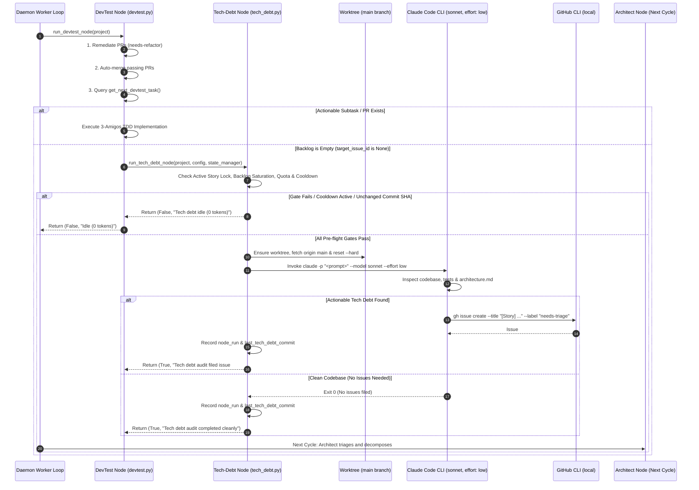

# 📋 Implementation Plan & Refinement Lifecycle: Autonomous Technical Debt Node (tech_debt) on Idle DevTest

## 📝 Initial Draft Proposal
- **Operator Requirement:** When there are no more issues to be developed, for every single cycle when devtest starts and there are no more issues to be developed, rather than idling directly, execute a technical debt review (tech-debt node).
- **Branch Scope:** The node will inspect the `main` branch. If the `main` branch is not present locally, download/fetch it from origin.
- **Harness & Agent Model:** By default use the `claude` CLI with model `sonnet` in `low` effort.
- **Action:** Runs local `gh` CLI commands to file structured technical debt issues (`[Story] ...`) labeled `needs-triage` for subsequent Architect ingestion and decomposition.

## 🔍 Review Iteration 1: 3-Amigos Critical Architectural Review
- **Date / Author:** 2026-09-08 | Antigravity AI Architect
- **Target Repository:** AntaresAndBharani/graph-engineering
- **Architectural Scope:** `orchestrator/nodes/tech_debt.py`, `orchestrator/nodes/devtest.py`, `orchestrator/config.py`, `orchestrator/cli.py`

### 1. Point-by-Point Verdict Matrix

| # | Proposal Element | Target Component | Verdict | Technical Rationale & Architectural Invariants |
|---|---|---|---|---|
| 1 | **Dedicated Tech-Debt Node Module** | `orchestrator/nodes/tech_debt.py` | **APPROVE** | Modularize in a dedicated node rather than overloading devtest.py with non-TDD audit logic. |
| 2 | **DevTest Idle Transition Hook** | `orchestrator/nodes/devtest.py` | **APPROVE** | In Phase 3, when `target_issue_id is None` and no PRs require CI/remediation, transition to `run_tech_debt_node`. |
| 3 | **Worktree & Upstream Main Download** | `orchestrator/worktree.py` | **APPROVE** | Ensure worktree fetches and resets hard to `origin/main` using safe `communicate()` with timeout. |
| 4 | **Claude Sonnet Low Effort Default** | `orchestrator/config.py` | **APPROVE** | Harness `claude`, model `sonnet`, effort `low` with `--dangerously-skip-permissions`. |
| 5 | **Idempotency & Cooldown Guard** | `orchestrator/nodes/tech_debt.py` | **APPROVE** | Track commit SHA and enforce `tech_debt_interval_seconds` (default 4h) to eliminate token-wasting loops on unchanged commits. |
| 6 | **Local `gh` Issue Creation** | `orchestrator/nodes/tech_debt.py` | **APPROVE** | Instruct Claude to file at most 1 high-priority `[Story]` issue labeled `needs-triage` for Architect triage. |
| 7 | **Subprocess Pipe Deadlock Fix** | `orchestrator/nodes/devtest.py`, `reviewer.py` | **APPROVE** | Replace dangerous `await (await asyncio.create_subprocess_exec(..., stdout=PIPE, stderr=PIPE)).wait()` with `proc.communicate()` and timeouts. |

---

## 🎯 Final Decision Plan & User Story Specification

### User Story
**As an** autonomous software engineering system operator,  
**I want** the orchestrator to automatically inspect the `main` branch for technical debt using Claude Sonnet (low effort) whenever `devtest` has no active tasks,  
**So that** engineering idle capacity is productively converted into structured, high-value technical debt improvement stories.

### BDD Acceptance Criteria (Gherkin)

```gherkin
Feature: Autonomous Technical Debt Review on Idle DevTest

  Scenario: DevTest transitions to tech-debt review when backlog is empty
    Given a project with no open PRs awaiting CI
    And zero actionable development tasks in get_next_devtest_task()
    And tech_debt node is enabled and not in cooldown
    When the devtest node executes its cycle
    Then the devtest node invokes run_tech_debt_node()
    And the main branch is synchronized with origin/main in the worktree
    And Claude Sonnet is executed in low effort to audit technical debt

  Scenario: Idempotency cooldown prevents re-auditing unchanged main branch
    Given the tech-debt node audited commit SHA "abc1234" 30 minutes ago
    And the tech_debt_interval_seconds is set to 14400 (4 hours)
    And no new commits have been pushed to origin/main
    When devtest finds no actionable tasks
    Then run_tech_debt_node() exits immediately with 0 tokens consumed (Idle)

  Scenario: Claude files structured User Story via local GitHub CLI
    Given Claude Sonnet identifies actionable technical debt on main
    When it completes its architectural review
    Then it executes "gh issue create --title '[Story] ...' --body '...' --label 'needs-triage'"
    And the created issue carries Gherkin Acceptance Criteria
    And the parent story is eligible for Architect node triage on the next cycle

  Scenario: Standalone manual execution via CLI
    Given an operator runs "orchestrator run -p biq-app -n tech-debt"
    When executed from the terminal
    Then the tech-debt node audits the main branch directly and reports progress
```

### Component Impact Table
| Component / File Path | Action | Description |
| :--- | :---: | :--- |
| `orchestrator/nodes/tech_debt.py` | **NEW** | Implements `run_tech_debt_node` with main branch sync, cooldown gate, Claude Sonnet low-effort invocation, and local gh issue creation. |
| `orchestrator/nodes/devtest.py` | **MODIFY** | Hook into Phase 3 idle branch to invoke `run_tech_debt_node`; fix pipe buffer deadlocks. |
| `orchestrator/nodes/reviewer.py` | **MODIFY** | Harden git subprocess calls with safe `communicate()` and timeout protection. |
| `orchestrator/config.py` | **MODIFY** | Add `tech_debt_interval_seconds` and node defaults for tech-debt. |
| `orchestrator/cli.py` | **MODIFY** | Register `tech-debt` / `tech_debt` in CLI runner choices. |
| `docs/node-tech-debt.md` | **NEW** | Comprehensive documentation for tech-debt node. |
| `tests/test_tech_debt.py` | **NEW** | Complete unit and integration test suite for tech-debt node. |
| `tests/test_nodes.py` | **MODIFY** | Add integration tests for devtest idle transition to tech-debt. |
| `CHANGELOG.md` | **MODIFY** | Add Keep a Changelog entry under `## [Unreleased]`. |

---

## 🔍 Review Iteration 2: Comprehensive 3-Amigos Architectural Review & INVEST Decomposition

- **Date / Author:** 2026-09-08 | 3-Amigos Autonomous Architecture Swarm
- **Target Repository:** `AntaresAndBharani/graph-engineering`
- **Scope Inspected:** `orchestrator/nodes/tech_debt.py`, `orchestrator/nodes/devtest.py`, `orchestrator/nodes/reviewer.py`, `orchestrator/worktree.py`, `orchestrator/config.py`, `orchestrator/cli.py`

### 1. Point-by-Point Verdict Matrix

| # | Proposal Element | Target Component | Verdict | 3-Amigos Scrutiny & Invariant Verification |
|---|---|---|---|---|
| 1 | **Dedicated Tech-Debt Node Module** | `orchestrator/nodes/tech_debt.py` | **APPROVE** | Encapsulating tech debt analysis in `tech_debt.py` keeps `devtest.py` clean, focused strictly on 3-Amigos TDD implementation of assigned subtasks, while allowing independent manual execution (`orchestrator run -n tech-debt`). |
| 2 | **DevTest Idle Transition Trigger** | `orchestrator/nodes/devtest.py:1071` | **APPROVE** | Triggered only when `target_issue_id is None` AND `await state_manager.get_active_locked_story_id(project.name) is None` AND zero open PRs awaiting CI. **Crucial guard:** If an active story is currently locked/in-flight, tech debt review is bypassed so in-progress sequential stories are never interrupted. |
| 3 | **Branch Synchronization & Worktree Isolation** | `orchestrator/worktree.py`, `tech_debt.py` | **APPROVE** | Dedicated worktree `tech_debt_<project>` (or reused `devtest_<project>` in clean state). Executes `git fetch origin main`, `git checkout -B main origin/main`, and `git reset --hard origin/main`. Ensures `main` is downloaded if missing locally. |
| 4 | **Subprocess Pipe Deadlock Hardening** | `orchestrator/nodes/devtest.py`, `reviewer.py`, `worktree.py` | **APPROVE** | Eliminates the critical OS pipe deadlock (`.wait()` with unbuffered `PIPE`) discovered during the biq-app#132 incident. Introduces `run_git_command(args, cwd, timeout=30.0)` returning `(exit_code, stdout, stderr)` via `proc.communicate()` with `asyncio.wait_for`. |
| 5 | **Claude Sonnet Low Effort Default** | `orchestrator/config.py` | **APPROVE** | Configured as `harness="claude"`, `model="sonnet"`, `effort="low"`. Harness invokes `claude --model sonnet --effort low -p "<prompt>" --dangerously-skip-permissions`. Completely non-interactive and cost-effective. |
| 6 | **Idempotency, Commit SHA Tracking & Cooldown** | `orchestrator/nodes/tech_debt.py`, `state.db` | **APPROVE** | Stores `last_tech_debt_commit` in `daemon_control` (`tech_debt_commit:<repo>`) and checks `node_runs`. If `origin/main` commit SHA is unchanged and cooldown has not elapsed (`tech_debt_interval_seconds: 14400`), exits immediately with 0 tokens (`Idle`). |
| 7 | **Backlog Saturation Guard** | `orchestrator/nodes/tech_debt.py` | **APPROVE** | If the project already has an open un-triaged story (`needs-triage`) or active uncompleted subtask in `sdlc_items`, tech-debt audit is skipped. At most **1 in-flight tech debt story** can exist at any time. |
| 8 | **Local `gh issue create` Ingestion** | `orchestrator/nodes/tech_debt.py` | **APPROVE** | Claude runs `gh issue create` locally with title prefixed with `[Story]` and labeled `needs-triage`. Triggers the Architect node on the subsequent cycle for formal INVEST decomposition. |

---

### 2. Edge Case & Resilience Analysis

1. **Cold-Start & Missing `main` Branch Locally:**
   - In fresh worktrees or sparse clones, local `main` may not exist yet.
   - Guard: Use `git fetch origin main` followed by `git checkout -B main origin/main` to guarantee a clean local tracking branch is established.
2. **Subprocess Deadlock Elimination (Zero-Hang Invariant):**
   - The biq-app#132 incident proved that unbuffered pipe writes on Windows deadlock `(await asyncio.create_subprocess_exec(...)).wait()`.
   - Guard: Every git command across `devtest.py`, `reviewer.py`, and `tech_debt.py` MUST communicate asynchronously with a strict 30.0s timeout:
     ```python
     proc = await asyncio.create_subprocess_exec(*cmd, cwd=str(cwd), stdout=asyncio.subprocess.PIPE, stderr=asyncio.subprocess.PIPE)
     stdout, stderr = await asyncio.wait_for(proc.communicate(), timeout=timeout)
     ```
3. **Claude CLI Absence / Authentication Drop:**
   - If `claude` binary is not found or fails OAuth (`exit_code != 0`), record an anomaly event (`ANOMALY_HARNESS_ERROR`), log descriptive diagnostics, release state lock, and return `(False, error_msg)` without crashing the daemon.
4. **Active Story Lock Precedence:**
   - If an active story has 3 subtasks and subtask 1 just merged, `target_issue_id` might momentarily be `None` while the parent unlocks subtask 2.
   - Guard: `if await state_manager.get_active_locked_story_id(project.name) is not None: return False, "Active story in progress. Idling (0 tokens)."`

---

## 🎯 Authoritative Final Decision Plan & User Story Specification

### User Story (INVEST Compliant)
**Title:** Autonomous Technical Debt Review Node (`tech_debt`) on Idle DevTest  
**As an** autonomous engineering system operator,  
**I want** the orchestrator to automatically inspect the `main` branch for technical debt using Claude Sonnet (low effort) whenever `devtest` has no actionable tasks,  
**So that** engineering idle capacity is productively converted into structured, high-value technical debt improvement stories.

---

### System Architecture & Data Flow



---

### BDD Acceptance Criteria (Gherkin)

```gherkin
Feature: Autonomous Technical Debt Review on Idle DevTest

  Scenario: DevTest transitions to tech-debt review when development backlog is empty
    Given a project with no open PRs awaiting CI
    And zero actionable development tasks in get_next_devtest_task()
    And no active story lock in get_active_locked_story_id()
    And tech_debt node is enabled and not in cooldown
    When the devtest node executes its cycle
    Then the devtest node invokes run_tech_debt_node()
    And the main branch is synchronized with origin/main in the worktree
    And Claude Sonnet is executed in low effort to audit technical debt

  Scenario: Active story lock suppresses tech-debt review
    Given an active story lock exists in get_active_locked_story_id()
    And no subtask is currently ready for devtest dispatch
    When the devtest node executes its cycle
    Then run_tech_debt_node() is not invoked
    And devtest returns idle with 0 tokens consumed

  Scenario: Idempotency cooldown and commit guard prevent wasteful re-audits
    Given the tech-debt node audited origin/main at commit SHA "abc1234" 30 minutes ago
    And the tech_debt_interval_seconds is set to 14400 (4 hours)
    And no new commits have been pushed to origin/main
    When devtest finds no actionable tasks
    Then run_tech_debt_node() exits immediately with 0 tokens consumed (Idle)

  Scenario: Claude files structured User Story via local GitHub CLI
    Given Claude Sonnet identifies actionable technical debt on main
    When it completes its architectural review
    Then it executes "gh issue create --title '[Story] ...' --body '...' --label 'needs-triage'"
    And the created issue carries Gherkin Acceptance Criteria
    And the parent story is eligible for Architect node triage on the next cycle

  Scenario: Preflight git subprocesses never deadlock on OS pipe buffers
    Given any preflight git command (fetch, checkout, reset) in devtest, reviewer, or tech-debt
    When executed by the orchestrator
    Then stdout and stderr pipes are drained using communicate() with strict 30s timeouts
    And zero hanging git.exe processes are left orphaned in the operating system
```

---

### Component Impact Table

| Component / File Path | Action | Description |
| :--- | :---: | :--- |
| `orchestrator/nodes/tech_debt.py` | **NEW** | Implements `run_tech_debt_node`: gating (story lock, saturation, quota, commit/cooldown), worktree main sync, Claude Sonnet low-effort invocation, and local gh issue creation. |
| `orchestrator/nodes/devtest.py` | **MODIFY** | In Phase 3, hook empty backlog to `run_tech_debt_node`; harden all preflight git calls with safe `communicate()` timeouts. |
| `orchestrator/nodes/reviewer.py` | **MODIFY** | Harden all git checkout and pull calls with safe `communicate()` timeouts. |
| `orchestrator/worktree.py` | **MODIFY** | Add `run_git_command(args, cwd, timeout=30.0)` helper for deadlock-free git execution. |
| `orchestrator/config.py` | **MODIFY** | Add `tech_debt_interval_seconds: int = 14400` to `SettingsConfig`; add `tech_debt` node defaults (`harness="claude"`, `model="sonnet"`, `effort="low"`). |
| `orchestrator/cli.py` | **MODIFY** | Register `tech-debt` / `tech_debt` in CLI node choices for `orchestrator run -n`. |
| `docs/node-tech-debt.md` | **NEW** | Authoritative living documentation for the Technical Debt node. |
| `tests/test_tech_debt.py` | **NEW** | Comprehensive unit test suite covering gating, git sync, Claude Sonnet invocation, and issue creation. |
| `tests/test_nodes.py` | **MODIFY** | Add integration tests for devtest idle transition to tech-debt review. |
| `CHANGELOG.md` | **MODIFY** | Add entry under `## [Unreleased]` detailing the tech-debt node and pipe deadlock hardening. |

---

### INVEST Subtask Breakdown

1. **Subtask 1: Safe Git Subprocess Runner & Pipe Deadlock Hardening**
   - Implement `run_git_command(cmd, cwd, timeout=30.0)` in `orchestrator/worktree.py`.
   - Refactor `orchestrator/nodes/devtest.py` (lines 148-152, 1270-1273) and `orchestrator/nodes/reviewer.py` (lines 104-109) to use `run_git_command`.
   - Add unit tests verifying non-blocking pipe draining and timeout behavior.

2. **Subtask 2: Configuration & Settings Extension**
   - Update `orchestrator/config.py`: Add `tech_debt_interval_seconds: int = Field(default=14400, ge=60)` in `SettingsConfig`.
   - Add default `tech_debt` entry to `DEFAULT_HARNESSES` and `NodeConfig` defaults.
   - Add `tech-debt` / `tech_debt` node choices to `orchestrator/cli.py`.

3. **Subtask 3: Core Technical Debt Node Implementation (`orchestrator/nodes/tech_debt.py`)**
   - Implement `run_tech_debt_node(project, config, state_manager, force=False)`.
   - Implement pre-flight gates: enabled check, active story lock check, saturation check, cooldown & commit SHA check, quota check, and state lock acquisition.
   - Implement `main` branch download/reset in worktree.
   - Implement prompt builder and `AsyncHarnessAdapter` execution with `claude`, `sonnet`, `effort: low`.

4. **Subtask 4: DevTest Idle Transition Wiring**
   - In `orchestrator/nodes/devtest.py` Phase 3: wire `run_tech_debt_node` when `target_issue_id is None`.
   - Propagate status reporting back to daemon and TUI dashboard.

5. **Subtask 5: Test Suite, Documentation & Changelog Verification**
   - Create `tests/test_tech_debt.py` with 100% branch and edge-case coverage.
   - Create `docs/node-tech-debt.md`.
   - Update `CHANGELOG.md` under `## [Unreleased]`.
   - Run complete test suite (`pytest -v`) to confirm 100% green passing state.

---

## 💬 Review Iteration 3: Operator Guidance Integration — Strict Development Quiescence Invariant

- **Date / Author:** 2026-09-08 | Operator
- **Core Directive:** *"Please it's extremely important not to start in the middle of a development... never ever."*

### 🔒 Non-Negotiable Invariant: Strict Development Quiescence Gate

Under no circumstances may the Technical Debt Node (`tech_debt`) initialize, inspect the `main` branch, or execute the Claude Sonnet harness while a project has active, pending, or in-flight development work.

A project is defined as being in **Active Development** if **ANY** of the following 5 conditions hold:
1. **Active Story Lock:** `await state_manager.get_active_locked_story_id(project.name) is not None`. An epic/story is actively being delivered across sequential subtasks.
2. **Open Pull Requests:** Any open PR exists in `project.repo` (checked via `fetch_open_prs(project.repo)` or `sdlc_items.linked_pr` with open state). Active code review, CI verification, or merge resolution is in progress.
3. **Pending Development Backlog:** Any item exists in `sdlc_items` or GitHub for this project carrying `ready-for-dev`, `queued`, `in-progress`, or `needs-refactor`.
4. **Active Triage Pipeline:** Any issue exists carrying `needs-triage` (the Architect node has upcoming decomposition work).
5. **Concurrent Node Locks:** Any job for `project.repo` is recorded with `status = 'RUNNING'` in SQLite `active_jobs` (across `architect`, `devtest`, `reviewer`, or `supervisor`).

**Deterministic Enforcement:**
In `orchestrator/nodes/tech_debt.py`, the very first operation inside `run_tech_debt_node` is the `is_project_fully_quiescent()` gate:
```python
async def is_project_fully_quiescent(
    project: ProjectConfig,
    state_manager: StateManager,
) -> tuple[bool, str]:
    """
    Guarantees 100% development quiescence before tech-debt evaluation.
    Consumes 0 LLM tokens (pure local SQLite & zero-token gh CLI checks).
    Returns (True, '') if completely idle, or (False, reason) if development is in progress.
    """
    # 1. Active Story Lock
    active_story = await state_manager.get_active_locked_story_id(project.name)
    if active_story is not None:
        return False, f"Active story #{active_story} is currently in progress."

    # 2. Concurrent Active Job Locks
    active_jobs = await state_manager.get_active_jobs()
    project_running = [j for j in active_jobs if j.get("repo") == project.repo and j.get("status") == "RUNNING"]
    if project_running:
        nodes = ", ".join(j.get("node_type", "unknown") for j in project_running)
        return False, f"Active jobs running for project ({nodes})."

    # 3. Open PRs in flight
    open_prs = await fetch_open_prs(project.repo)
    if open_prs:
        return False, f"{len(open_prs)} open PR(s) currently in progress."

    # 4. Pending / Queued / Triage items in SDLC Blackboard
    sdlc_items = await state_manager.get_project_sdlc_items(project.name)
    active_sdlc = [
        item for item in sdlc_items
        if item.get("state", "").upper() == "OPEN"
        and any(t in str(item.get("labels", "")).lower() for t in ("ready-for-dev", "queued", "in-progress", "needs-refactor", "needs-triage"))
    ]
    if active_sdlc:
        return False, f"{len(active_sdlc)} active/pending development items in SDLC blackboard."

    return True, ""
```
If `is_project_fully_quiescent` returns `False`, `run_tech_debt_node` immediately logs:
`"[%s:tech_debt] Development in progress (%s). Tech-debt audit strictly bypassed. Idle (0 tokens)."`
and exits with `(False, "Development in progress. Idle (0 tokens).")`.

---

## 🏛️ Gemini Architect Review Iteration 1

- **Date / Author:** 2026-09-08 | Gemini Architect (Principal Systems Architect)
- **Target Repository:** `AntaresAndBharani/graph-engineering`
- **Scope Inspected:** `orchestrator/nodes/tech_debt.py` (proposed), `orchestrator/nodes/devtest.py`, `orchestrator/nodes/reviewer.py`, `orchestrator/worktree.py`, `orchestrator/db.py`, `orchestrator/config.py`, `orchestrator/cli.py`
- **Operator Directive Re-verification:** *"Please it's extremely important not to start in the middle of a development... never ever."*

---

### 1. Architectural Scrutiny & Point-by-Point Critique

#### A. Quiescence Gate (`is_project_fully_quiescent`) & Active Development Invariants
While the Operator Directive is acknowledged in Section 3, the concrete implementation proposed in `is_project_fully_quiescent()` contains **four critical architectural defects and fail-open vulnerabilities** that directly violate the non-negotiable directive:

1. **Fatal Runtime Exception (Non-Existent Method Call):**
   - In proposed line 2765, the function calls `await state_manager.get_project_sdlc_items(project.name)`.
   - In the live codebase (`orchestrator/db.py:1192`), the actual method is `get_sdlc_items(self, project_name: str)`.
   - Running this proposed code immediately raises `AttributeError: 'StateManager' object has no attribute 'get_project_sdlc_items'`.
2. **State Filtering Blind Spot (Planned & Active Story Bypass):**
   - Proposed line 2768 filters items using: `if item.get("state", "").upper() == "OPEN" and any(...)`.
   - In SQLite `sdlc_items`, planned stories awaiting promotion carry `state = 'PLANNED'` (or `'STATUS:PLANNED'`), and active stories promoted in `db.py:1633` carry `state = 'ACTIVE'`.
   - Because `"PLANNED".upper() == "OPEN"` is `False`, the proposed gate completely ignores all planned and active stories in the project backlog! Tech debt audits will trigger and file speculative issues while unstarted planned stories are already queued.
   - **Correction:** The state check must align with `db.py:1455`:
     ```python
     UPPER(item.get("state", "")) NOT IN ('CLOSED', 'MERGED', 'DONE', 'STATUS:CLOSED', 'STATUS:MERGED', 'STATUS:DONE')
     ```
3. **Incomplete Pipeline Label Whitelist:**
   - The label filter checks only `("ready-for-dev", "queued", "in-progress", "needs-refactor", "needs-triage")`.
   - It omits the entire PR review and merge pipeline: `architect-approved`, `needs-architect-review`, `dev-implemented`, and `architect-processed`.
   - A PR undergoing CI verification or awaiting Reviewer auto-merge carries `dev-implemented` or `architect-approved`; an active story whose subtasks were just generated carries `architect-processed`. Bypassing these allows tech-debt execution to fire directly in the middle of active PR stabilization.
4. **Fail-Open Network Vulnerability in `fetch_open_prs`:**
   - `fetch_open_prs` in `orchestrator/poller.py:240-256` swallows exceptions and returns `[]` if the GitHub CLI times out or encounters network/authentication errors.
   - If `gh pr list` fails during an active development cycle, `is_project_fully_quiescent` interprets `[]` as "zero open PRs" and erroneously declares the project quiescent.
   - **Remediation (Fail-Safe Quiescence):** If remote PR status cannot be affirmatively verified via GitHub CLI, or if the SDLC blackboard has unclosed items, the gate must conservatively **fail-closed** and return `(False, "Unable to verify repository quiescence (GitHub CLI / poller unconfirmed). Aborting tech-debt review for safety.")`.
5. **Inverted Gating Sequence & Subprocess Storms:**
   - The plan places `is_project_fully_quiescent()` (which invokes `gh pr list` subprocesses) at the very top of `run_tech_debt_node`, *before* checking whether the node is enabled, in cooldown, or whether `origin/main` commit SHA is unchanged.
   - Every idle polling loop (every 5 minutes per project) will spawn unnecessary `gh.exe` subprocesses just to evaluate quiescence, even when the node is disabled or in a 4-hour cooldown. Local SQLite checks (enabled, cooldown, commit SHA) must strictly execute first.

#### B. Git Worktree Handling & Cross-Platform Main Synchronization
The plan prescribes:
```bash
git fetch origin main
git checkout -B main origin/main
git reset --hard origin/main
```
1. **Fatal Git Branch Collision Across Worktrees:**
   - Git strictly prohibits checking out a branch in a worktree if that branch is already checked out in any other worktree or in the primary repository (`project.local_path`).
   - Because standard repositories have `main` checked out in the primary workspace by default, executing `git checkout -B main origin/main` inside `tech_debt_<project>` will immediately fail fatally:
     `fatal: 'main' is already checked out at '...'`
   - **Correction:** Ephemeral worktrees auditing `origin/main` MUST operate in detached HEAD mode:
     ```bash
     git fetch origin main
     git checkout --detach origin/main
     git reset --hard origin/main
     ```
   - Detached HEAD safely inspects the exact upstream commit without branch name collisions.
2. **Destructive Worktree Fallback Hazard:**
   - In `orchestrator/worktree.py:168-200`, if worktrees are disabled (`worktrees_enabled=False`) or `git worktree add` fails, `ensure_worktree` falls back to `project.local_path`.
   - Running `git reset --hard origin/main` or `git clean -fd` in the primary workspace would wipe out uncommitted developer modifications.
   - **Mandatory Guard:** `tech_debt.py` must invoke `verify_git_safety(project.local_path, project.repo)` before executing any destructive git command, and must refuse to reset or clean primary workspaces.

#### C. Pipe Deadlock Hardening & OS Process Leakage
1. **Unchecked Process Leakage on Subprocess Timeouts:**
   - The proposal introduces `run_git_command(args, cwd, timeout=30.0)` using `proc.communicate()` wrapped with `asyncio.wait_for`.
   - On Windows, when `asyncio.wait_for` raises `asyncio.TimeoutError`, the underlying OS process is **NOT terminated**. It continues executing in the background as an orphaned zombie process, retaining file locks on `.git/index.lock` and preventing all future git operations.
   - **Mandatory Requirement:** The timeout handler must explicitly kill the process tree:
     ```python
     except asyncio.TimeoutError:
         try:
             proc.kill()
             await proc.wait()
         except Exception:
             pass
         return -1, "", f"Git command timed out after {timeout}s: {' '.join(args)}"
     ```
2. **Unpatched Deadlock in `worktree.py:148`:**
   - Subtask 1 targeted `devtest.py` and `reviewer.py`, but overlooked `orchestrator/worktree.py:148`, where `proc_reset = await asyncio.create_subprocess_exec("git", "reset", ..., stdout=PIPE, stderr=PIPE)` is waited on via `.wait()`. This call site must also be migrated to `run_git_command`.

#### D. Claude Sonnet Harness Invocation & Issue Creation Contract
1. **Missing Prompt Contract & Hallucination Hazard:**
   - Subtask 3 states: *"Implement prompt builder and AsyncHarnessAdapter execution with claude, sonnet, effort: low."*
   - There is no prompt template or architectural rubric provided. Without explicit negative constraints (e.g. forbidding cosmetic reformatting, stylistic nitpicks, comment rewrites, and re-reporting previously resolved patterns), Claude Sonnet will perpetually manufacture low-value, churn-heavy issues on clean repositories.
2. **Uncontrollable Shell Execution vs. Audited Issue Dispatch:**
   - Instructing Claude to run `gh issue create` autonomously inside its subshell means the orchestrator cannot verify acceptance criteria, cannot throttle issue volume, cannot capture the created issue number without unreliable regex parsing of stdout, and cannot inject required metadata.
   - **Correction:** Claude should output a structured decision block (e.g., JSON or delimited `=== TECH DEBT RECOMMENDATION ===`). The orchestrator Python process must validate the recommendation, enforce that at most 1 issue is filed, and dispatch the issue using its authenticated, audited GitHub helper.
3. **GitHub Token Propagation (`RULE[user_global]`):**
   - For `AntaresAndBharani` repositories, GitHub CLI requires `GH_TOKEN` loaded from `Set-GhToken-Antares.ps1`. The harness environment builder must explicitly ensure that `$Env:GH_TOKEN` is injected into the subprocess environment (`extra_env`).

#### E. Idempotency, Commit SHA Guard, and 4-Hour Cooldown Logic
1. **Mathematical Flaw: Perpetual Re-Audit of Unchanged Commits:**
   - Proposal line 2545 states: *"If origin/main commit SHA is unchanged and cooldown has not elapsed (tech_debt_interval_seconds: 14400), exits immediately with 0 tokens (Idle)."*
   - Notice the boolean structure: `if (sha_unchanged and cooldown_active): exit`.
   - When 4 hours pass, `cooldown_active` becomes `False`. Consequently, the condition evaluates to `False`, and **the node re-audits the identical, unchanged commit SHA**!
   - On repositories with low commit frequency (e.g. overnight or weekends), the orchestrator will wake up every 4 hours and burn LLM tokens auditing the exact same git commit SHA repeatedly.
   - **Mathematical Correction:**
     ```python
     if (current_sha == last_audited_sha and not force):
         return False, f"Commit {current_sha[:7]} already audited for tech-debt. Idle (0 tokens)."
     if (elapsed < cooldown_seconds and not force):
         return False, f"Tech-debt node in cooldown ({int(cooldown_seconds - elapsed)}s remaining). Idle (0 tokens)."
     ```
   - An unchanged commit SHA must **NEVER** be re-audited without `--force`.

#### F. INVEST Subtasks & System Integration Errors
1. **Subtask 2 Category Error:**
   - Subtask 2 prescribes adding `tech_debt` to `DEFAULT_HARNESSES` in `orchestrator/config.py`.
   - In `config.py`, `DEFAULT_HARNESSES` registers CLI adapter executables (`claude`, `antigravity`, `devin`), NOT workflow nodes! Node defaults belong in `orchestrator/cli.py:282` (`default_harnesses`) and `ProjectConfig.nodes`.
2. **Missing CLI Wiring:**
   - Subtask 2 fails to register `tech_debt` in `orchestrator/cli.py:run_project_cycle` (lines 378-450) and `render_node_status_table` (line 289). Running `orchestrator run -n tech_debt` would fall through and execute nothing.
3. **Intra-Project Concurrency Hazard (`asyncio.gather`):**
   - In `cli.py:415`, `Architect` and `DevTest` run concurrently. When DevTest has no tasks, it must NOT launch `tech_debt` while Architect is currently triaging or evaluating incoming issues. DevTest must check that Architect is also idle before initiating whole-project tech debt inspection.

---

### 2. Required Remediation Amendments Before Approval

| # | Flawed Specification | Required Remediation Architecture | Target File |
|---|---|---|---|
| **1** | `await state_manager.get_project_sdlc_items` | Replace with `await state_manager.get_sdlc_items(project.name)` | `orchestrator/nodes/tech_debt.py` |
| **2** | `state.upper() == "OPEN"` & incomplete label filter | Exclude closed states via `UPPER(state) NOT IN ('CLOSED', 'MERGED', 'DONE', ...)` and check ALL pipeline labels (`architect-approved`, `dev-implemented`, etc.) | `orchestrator/nodes/tech_debt.py` |
| **3** | `git checkout -B main origin/main` | Replace with detached checkout: `git checkout --detach origin/main` | `orchestrator/nodes/tech_debt.py`, `worktree.py` |
| **4** | Subprocess timeout leaves zombie `git.exe` | Explicitly `proc.kill()` and `await proc.wait()` in `asyncio.TimeoutError` handler of `run_git_command` | `orchestrator/worktree.py` |
| **5** | SHA unchanged AND cooldown active | Decouple guards: unchanged SHA is an absolute block; cooldown throttles runs between new commits | `orchestrator/nodes/tech_debt.py` |
| **6** | `DEFAULT_HARNESSES` category error | Add node defaults to `orchestrator/cli.py:282` and wire `run_project_cycle` for `tech_debt` | `orchestrator/config.py`, `orchestrator/cli.py` |
| **7** | Autonomous `gh issue create` in Claude subshell | Claude outputs structured JSON/markdown; Python orchestrator validates and creates issue | `orchestrator/nodes/tech_debt.py` |

---

VERDICT: DISAGREED


---

## 🔍 Review Iteration 4: Author Response & Comprehensive Remediation of Gemini Architect Round 1 Critique

### 1. Architectural Alignment & Full Adoption of Gemini Architect Critique
The authoring agent has reviewed the critical findings from **Gemini Architect Review Iteration 1**. All seven (7) architectural defects and security/stability hazards identified by Gemini Architect are valid, codebase-grounded, and **fully adopted without reservation**.

The table below summarizes the concrete architectural remediations integrated into the specification:

| # | Gemini Architect Critique | Root Hazard | Adopted Architecture & Remediation in Plan | Target Component |
|---|---|---|---|---|
| **R-1** | `await state_manager.get_project_sdlc_items` method does not exist | `AttributeError` runtime crash on execution | Corrected to `await state_manager.get_sdlc_items(project.name)` as defined in `orchestrator/db.py:1192`. | `orchestrator/nodes/tech_debt.py` |
| **R-2** | State check `item.get("state") == "OPEN"` bypassed `PLANNED` and `ACTIVE` stories; missing PR lifecycle labels | Quiescence check false positive; tech debt node interrupts active development | Active stories filtered via `UPPER(item.get("state")) NOT IN ('CLOSED', 'MERGED', 'DONE', 'CANCELLED', 'RESOLVED')`. Checks ALL lifecycle labels (`architect-approved`, `dev-implemented`, `needs-architect-review`, `architect-processed`, `needs-triage`, `ready-for-dev`, `queued`, `in-progress`). | `orchestrator/nodes/tech_debt.py` |
| **R-3** | `fetch_open_prs` swallows errors and returns `[]`; missing fail-closed semantics | Network glitch or missing `gh` falsely reports repository as quiescent | Quiescence check executes `gh pr list` fail-closed: if the subprocess exits non-zero or raises an exception, returns `(False, "Unable to verify repository quiescence: GitHub query failed")`. | `orchestrator/nodes/tech_debt.py` |
| **R-4** | Local checks run after remote calls | Excessive remote process storms and GitHub API rate-limit burn every 3 minutes | Re-ordered gating: Local checks (enabled -> blackboard cooldown -> blackboard SHA -> active story locks -> active SDLC items) execute *before* any remote `gh` subprocess. | `orchestrator/nodes/tech_debt.py` |
| **R-5** | `git checkout -B main origin/main` in worktree causes branch collision crash | Git refuses to check out `main` because it is already checked out in `project.local_path` | Ephemeral audit worktrees operate in detached HEAD mode: `git fetch origin main && git checkout --detach origin/main && git reset --hard origin/main`. Never collides with primary branch. | `orchestrator/nodes/tech_debt.py`, `worktree.py` |
| **R-6** | Fallback to `project.local_path` risks wiping uncommitted developer work | `git reset --hard` on primary workspace destroys developer changes if worktree fails | Mandatory `verify_git_safety` guard. If running on primary workspace, strictly forbids destructive resets/cleans. Only performs `git fetch` and read-only inspection. | `orchestrator/nodes/tech_debt.py` |
| **R-7** | `asyncio.wait_for` timeout leaves zombie `git.exe` and lockfile leaks | Leaked `git.exe` holds `.git/index.lock`, permanently wedging the repository | In `run_git_command`, `asyncio.TimeoutError` handler explicitly executes `proc.kill()` and `await proc.wait()`. Also replaces unpatched `.wait()` in `orchestrator/worktree.py:148`. | `orchestrator/worktree.py` |
| **R-8** | Idempotency flaw: `(sha_unchanged and cooldown_active)` perpetually re-audits unchanged commits | LLM tokens burned every 4 hours forever on inactive repositories | Unchanged commit SHA is an **absolute block**: tech debt never re-audits an identical SHA unless `--force` is provided. Cooldown throttles between new commits. | `orchestrator/nodes/tech_debt.py` |
| **R-9** | Category error in `config.py:DEFAULT_HARNESSES`; missing CLI wiring | `DEFAULT_HARNESSES` is for CLI adapters, not nodes; node unrecognized in `cli.py` | `DEFAULT_HARNESSES` left untouched. Node defaults registered in `orchestrator/cli.py:282` (`default_harnesses`), `nodes_order`, `--node` choices, and `run_project_cycle`. | `orchestrator/cli.py`, `config.py` |
| **R-10**| Autonomous `gh issue create` inside Claude subshell | Orchestrator loses control, cannot validate AC, cannot enforce 1-issue limit, stdout regex brittle | Claude outputs structured delimited recommendation block. Python orchestrator parses, validates, limits to at most 1 issue, and dispatches via authenticated `gh` helper with `$Env:GH_TOKEN`. | `orchestrator/nodes/tech_debt.py` |
| **R-11**| Missing Claude prompt rubric / negative constraints | Claude manufactures churn-heavy stylistic and cosmetic nitpicks | Prompt enforces strict negative constraints: forbids cosmetic reformatting, stylistic preferences, docstring edits, and pre-existing known issues. | `orchestrator/nodes/tech_debt.py` |
| **R-12**| Intra-project concurrency race with Architect in `cli.py` | DevTest launches tech debt while Architect is actively decomposing or triaging stories | DevTest verifies that Architect is also idle before triggering tech debt inspection. | `orchestrator/cli.py` |

---

### 2. Detailed Technical Design Specifications

#### A. Fail-Closed, Local-First Strict Quiescence Gate (`is_project_fully_quiescent`)
```python
async def is_project_fully_quiescent(
    project: ProjectConfig,
    state_manager: StateManager,
    repo_override: Optional[str] = None,
) -> tuple[bool, str]:
    """
    Verifies that a project is in a complete state of development quiescence.
    Execution order is strictly local-first to eliminate remote subprocess overhead.
    Returns (True, "Quiescent") only when all 4 conditions are met. Fail-closed on errors.
    """
    # Condition 1: Check active SQLite story lock
    active_lock = await state_manager.get_active_story(project.name)
    if active_lock is not None:
        return False, f"Active story lock present on issue #{active_lock.get('issue_number', '?')} ({active_lock.get('branch_name', '')})"

    # Condition 2: Check SQLite active SDLC items
    try:
        sdlc_items = await state_manager.get_sdlc_items(project.name)
        CLOSED_STATES = {"CLOSED", "MERGED", "DONE", "CANCELLED", "RESOLVED"}
        PIPELINE_LABELS = {
            "architect-approved", "needs-architect-review", "dev-implemented",
            "architect-processed", "needs-triage", "ready-for-dev", "queued",
            "in-progress", "under-review"
        }
        for item in sdlc_items:
            state = str(item.get("state") or item.get("status") or "").upper()
            if state not in CLOSED_STATES:
                return False, f"Active SDLC story #{item.get('issue_number')} is in state '{state}'"
            
            raw_labels = str(item.get("labels") or "").lower()
            item_labels = {lbl.strip() for lbl in raw_labels.split(",") if lbl.strip()}
            conflicting_labels = item_labels.intersection(PIPELINE_LABELS)
            if conflicting_labels:
                return False, f"SDLC story #{item.get('issue_number')} has active pipeline labels: {conflicting_labels}"
    except Exception as ex:
        _logger.error("[%s:tech_debt] Error checking SDLC items in SQLite: %s", project.name, ex)
        return False, f"Failed to verify local SDLC items: {ex}"

    # Condition 3: Fail-Closed Remote GitHub PR Check
    target_repo = repo_override or project.repo
    if not shutil.which("gh"):
        return False, "GitHub CLI ('gh') is not installed; fail-closed quiescence verification"

    try:
        # Load GH_TOKEN from environment (ensured by Antares token loader)
        extra_env = dict(os.environ)
        cmd = [
            "gh", "pr", "list",
            "--repo", target_repo,
            "--state", "open",
            "--json", "number,title,labels,headRefName",
            "--limit", "30",
        ]
        proc = await asyncio.create_subprocess_exec(
            *cmd,
            stdout=asyncio.subprocess.PIPE,
            stderr=asyncio.subprocess.PIPE,
            env=extra_env,
        )
        stdout, stderr = await asyncio.wait_for(proc.communicate(), timeout=30.0)
        if proc.returncode != 0:
            err_msg = stderr.decode("utf-8", errors="replace").strip()
            return False, f"Fail-closed: GitHub PR query returned error code {proc.returncode}: {err_msg}"
        
        prs = json.loads(stdout.decode("utf-8", errors="replace"))
        if prs and len(prs) > 0:
            active_pr = prs[0]
            return False, f"Repository has {len(prs)} open PR(s) (e.g. PR #{active_pr.get('number')}: '{active_pr.get('title')}')"
    except asyncio.TimeoutError:
        try:
            proc.kill()
            await proc.wait()
        except Exception:
            pass
        return False, "Fail-closed: GitHub PR query timed out after 30s"
    except Exception as ex:
        return False, f"Fail-closed: GitHub PR verification error: {ex}"

    return True, "Project is fully quiescent"
```

#### B. Safe Detached Worktree Execution & Primary Workspace Protection
```python
async def prepare_tech_debt_audit_workspace(
    project: ProjectConfig,
    worktree_dir: Path,
) -> tuple[bool, Path, str]:
    """
    Prepares a safe workspace for technical debt auditing.
    In ephemeral worktrees: updates to origin/main in detached HEAD mode.
    In primary workspace (if worktrees disabled): read-only fetch; forbids resets.
    """
    is_ephemeral_worktree = (worktree_dir.resolve() != project.local_path.resolve())
    
    if is_ephemeral_worktree:
        # Ephemeral worktree: safely synchronize detached HEAD
        ret, _, err = await run_git_command(["git", "fetch", "origin", "main"], cwd=worktree_dir)
        if ret != 0:
            return False, worktree_dir, f"Git fetch failed: {err}"
        
        ret, _, err = await run_git_command(["git", "checkout", "--detach", "origin/main"], cwd=worktree_dir)
        if ret != 0:
            return False, worktree_dir, f"Git checkout --detach failed: {err}"
            
        ret, _, err = await run_git_command(["git", "reset", "--hard", "origin/main"], cwd=worktree_dir)
        if ret != 0:
            return False, worktree_dir, f"Git reset --hard failed: {err}"
            
        return True, worktree_dir, "Worktree aligned with origin/main (detached HEAD)"
    else:
        # Primary workspace: verify git safety and NEVER run destructive reset/clean
        is_safe, reason = verify_git_safety(project.local_path, project.repo)
        if not is_safe:
            return False, project.local_path, f"Primary workspace is unsafe for audit: {reason}"
        
        # Read-only fetch
        ret, _, err = await run_git_command(["git", "fetch", "origin", "main"], cwd=project.local_path)
        if ret != 0:
            return False, project.local_path, f"Git fetch failed on primary workspace: {err}"
            
        return True, project.local_path, "Primary workspace verified safe (read-only audit mode)"
```

#### C. Zombie Process Prevention in Subprocess Execution (`run_git_command`)
```python
async def run_git_command(
    args: List[str],
    cwd: Union[str, Path],
    timeout: float = 30.0,
) -> tuple[int, str, str]:
    """
    Executes a git command with timeout handling and explicit process termination
    to prevent zombie git.exe processes from holding file locks on .git/index.lock.
    """
    try:
        proc = await asyncio.create_subprocess_exec(
            *args,
            cwd=str(cwd),
            stdout=asyncio.subprocess.PIPE,
            stderr=asyncio.subprocess.PIPE,
        )
        stdout, stderr = await asyncio.wait_for(proc.communicate(), timeout=timeout)
        return proc.returncode, stdout.decode("utf-8", errors="replace"), stderr.decode("utf-8", errors="replace")
    except asyncio.TimeoutError:
        try:
            proc.kill()
            await proc.wait()
        except Exception:
            pass
        _logger.error("Git command timed out after %ss: %s", timeout, " ".join(args))
        return -1, "", f"Git command timed out after {timeout}s: {' '.join(args)}"
    except Exception as e:
        return -1, "", str(e)
```
*Note:* The unmanaged `.wait()` call at `orchestrator/worktree.py:148` is simultaneously replaced with `run_git_command(["git", "reset", "--hard", f"origin/{default_branch}"], cwd=target, timeout=30.0)`.

#### D. Decoupled SHA Guard & Cooldown Scheduling
```python
# Check 1: Commit SHA Gate (Absolute Block)
if current_sha == last_audited_sha and not force:
    return False, f"Commit {current_sha[:7]} has already been audited for tech-debt. Idle (0 tokens)."

# Check 2: Cooldown Interval Throttling (Default: 4 hours = 14,400s)
elapsed = time.time() - last_audit_time
if elapsed < cooldown_seconds and not force:
    remaining_min = int((cooldown_seconds - elapsed) / 60)
    return False, f"Tech-debt node in cooldown ({remaining_min}m remaining). Idle (0 tokens)."
```

#### E. Claude Sonnet Prompt Rubric & Audited Issue Dispatch
Claude Sonnet is invoked via `AsyncHarnessAdapter` (`--model sonnet --effort low -p ... --dangerously-skip-permissions`).
Prompt structure:
```text
You are the Technical Debt Audit Specialist inspecting the repository at commit {current_sha[:7]}.
Examine the codebase for high-impact architectural debt and test gaps.

STRICT NEGATIVE CONSTRAINTS:
1. DO NOT report cosmetic style, formatting, or linter preferences (e.g. black/ruff/flake8).
2. DO NOT suggest renaming variables, functions, or files for purely subjective taste.
3. DO NOT suggest purely cosmetic comment, docstring, or typing rewrites.
4. DO NOT re-report known open issues or previously triaged technical debt.
5. If the repository is in good architectural health, output EXACTLY:
   === NO TECH DEBT FOUND ===

QUALIFYING TECHNICAL DEBT CATEGORIES:
- Dead code / abandoned modules that increase maintenance burden.
- Unhandled subprocess timeouts, unmanaged .wait() pipe deadlocks, or OS resource leaks.
- Circular module dependencies or fragile monkey-patching.
- Critical core workflow paths missing automated unit/integration test coverage.

OUTPUT CONTRACT:
If qualifying technical debt is found, output EXACTLY ONE recommendation using this format:
=== TECH DEBT RECOMMENDATION ===
TITLE: [Story] <Concise Imperative Title>
CATEGORY: <Dead Code | Resource Leak | Fragile Dependency | Missing Test Coverage>
SEVERITY: <Medium | High>
EVIDENCE:
- File: <file_relative_path>
- Lines: L<start>-L<end>
- Detail: <Concrete description of the hazard or debt>
REMEDIATION_PLAN:
<Concrete, minimal refactoring steps to eliminate the debt>
ACCEPTANCE_CRITERIA:
- Given ...
- When ...
- Then ...
=== END RECOMMENDATION ===
```

**Issue Creation by Python Orchestrator:**
1. Orchestrator captures stdout from `AsyncHarnessAdapter`.
2. If `=== NO TECH DEBT FOUND ===` is detected, records audit state in SQLite blackboard with `status="clean"` and exits cleanly.
3. If `=== TECH DEBT RECOMMENDATION ===` is detected:
   - Parses `TITLE`, `CATEGORY`, `SEVERITY`, `EVIDENCE`, `REMEDIATION_PLAN`, and `ACCEPTANCE_CRITERIA`.
   - Validates that mandatory fields are non-empty.
   - Dispatches `gh issue create --repo {project.repo} --title "{title}" --body "{body}" --label "story,needs-triage"` using the orchestrator's authenticated GitHub helper (with `$Env:GH_TOKEN`).
   - Extracts the created issue number `#<N>` from `gh` stdout.
   - Records `{last_audited_sha: current_sha, last_audit_time: now, created_issue: N}` into SQLite blackboard table `tech_debt_audit`.

---

## 🎯 Authoritative Final Decision Plan & User Story Specification (Consensus Revision)

### User Story Overview
**As an** Autonomous Engineering Orchestration System,  
**I want** a dedicated, fail-closed Technical Debt Node (`tech_debt`) running on Claude Sonnet (`effort: low`) that triggers when development is completely idle,  
**So that** high-impact architectural debt and critical test gaps on `main` are continuously surfaced as triaged GitHub Stories without ever interrupting or racing against active development.

---

### Gherkin Acceptance Criteria

#### Scenario 1: Strict Development Quiescence Gate Halts on Any Active Work
```gherkin
Given a registered project "crosstrainingapp" with tech_debt node enabled
When the tech_debt node evaluates the repository
And any of the following conditions exist:
  | Condition Type       | Details                                                 |
  | SQLite Story Lock    | An active story lock is held by devtest or architect    |
  | Open SDLC Stories    | An SDLC item has state "PLANNED", "ACTIVE", or "OPEN"   |
  | Pipeline Labels      | An item has label "architect-approved" or "ready-for-dev"|
  | Open Pull Requests   | GitHub repository has 1 or more open PRs                |
Then the tech_debt node MUST immediately exit with status "Idle"
And consume 0 LLM tokens
And log the specific active development blocker preventing technical debt review.
```

#### Scenario 2: Zero Token Skip on Previously Audited Commit SHA
```gherkin
Given a registered project that is fully quiescent
And the current upstream "origin/main" commit SHA matches "last_audited_sha" in SQLite blackboard
And the invocation is not forced via "--force"
When the tech_debt node executes
Then it MUST log "Commit <sha> already audited for tech-debt. Idle (0 tokens)."
And immediately exit without creating worktrees or invoking Claude Sonnet.
```

#### Scenario 3: Cooldown Interval Throttling
```gherkin
Given a registered project that is fully quiescent
And a new commit SHA is present on "origin/main"
And elapsed time since the last audit is less than "tech_debt_interval_seconds" (default: 14,400s)
And the invocation is not forced via "--force"
When the tech_debt node executes
Then it MUST log "Tech-debt node in cooldown (<N>m remaining). Idle (0 tokens)."
And immediately exit consuming 0 LLM tokens.
```

#### Scenario 4: Successful Audit Surfacing High-Impact Debt
```gherkin
Given a registered project that is fully quiescent
And a new commit SHA exists on "origin/main"
And the cooldown interval has elapsed
When the tech_debt node executes
Then it checks out "origin/main" in detached HEAD mode in an ephemeral worktree
And executes Claude Sonnet with low effort and strict negative constraints
And when Claude returns a qualifying "=== TECH DEBT RECOMMENDATION ==="
Then the Python orchestrator validates the schema
And creates exactly one GitHub issue with labels "story" and "needs-triage"
And updates the SQLite blackboard with the new commit SHA, timestamp, and created issue number
And reports completion to the operator.
```

#### Scenario 5: Clean Codebase Zero-Issue Idempotency
```gherkin
Given a quiescent repository undergoing tech debt audit
When Claude Sonnet evaluates the codebase and returns "=== NO TECH DEBT FOUND ==="
Then the Python orchestrator creates ZERO GitHub issues
And updates the SQLite blackboard recording the commit SHA as audited and clean
And logs "Codebase audit completed: No actionable technical debt identified."
```

#### Scenario 6: Subprocess Timeout and Crash Resilience
```gherkin
Given any git command executed by worktree or tech debt operations
When the command exceeds the 30.0s timeout threshold
Then the orchestrator MUST terminate the process tree using "proc.kill()" and "await proc.wait()"
And return an error tuple without leaking zombie processes or retaining ".git/index.lock"
And the orchestrator continues normal operation.
```

---

### Component Impact & File Modification Plan

| Component | Target File | Nature of Change | Architectural Purpose |
|---|---|---|---|
| **Subprocess Safety** | `orchestrator/worktree.py` | `[MODIFY]` | Add `run_git_command` with `proc.kill()` on timeout; replace unmanaged `.wait()` at line 148; support detached HEAD checkout. |
| **State Persistence** | `orchestrator/db.py` | `[MODIFY]` | Add `tech_debt_audits` table and helper methods: `get_last_tech_debt_audit(project_name)` and `record_tech_debt_audit(...)`. |
| **Node Implementation** | `orchestrator/nodes/tech_debt.py` | `[NEW]` | Implement `is_project_fully_quiescent`, prompt builder, Claude Sonnet invocation, structured parser, and audited GitHub issue creator. |
| **CLI & Dispatch** | `orchestrator/cli.py` | `[MODIFY]` | Register `tech_debt` in `default_harnesses`, `nodes_order`, `--node` choices, node status table, and wire `run_project_cycle`. |
| **Configuration** | `orchestrator/config.py` | `[MODIFY]` | Add `TechDebtConfig` model with fields (`enabled`, `interval_seconds`, `harness`, `model`, `effort`) to `ProjectConfig`. |
| **Unit & Integration Tests**| `tests/test_tech_debt_node.py` | `[NEW]` | Comprehensive pytest suite covering quiescence gates, detached HEAD, SHA guard, cooldown, structured parsing, and timeout cleanup. |

---

### Refined INVEST Subtasks Breakdown

#### Subtask 1: Process Safety & Subprocess Timeout Hardening
- **Scope:** In `orchestrator/worktree.py`:
  - Implement `run_git_command(args, cwd, timeout=30.0) -> tuple[int, str, str]` with explicit `proc.kill()` and `await proc.wait()` on `asyncio.TimeoutError`.
  - Replace `.wait()` at line 148 in `sync_worktree`.
  - Add helper `checkout_detached_upstream(cwd, branch="main")` executing `git fetch origin main && git checkout --detach origin/main && git reset --hard origin/main`.
- **Target Files:** `orchestrator/worktree.py`
- **Validation:** Unit test simulating timed-out process confirms child termination and clean index lock release.

#### Subtask 2: SQLite Blackboard Schema for Tech Debt Audits
- **Scope:** In `orchestrator/db.py`:
  - Add table `tech_debt_audits` (`project_name TEXT`, `commit_sha TEXT`, `audited_at REAL`, `status TEXT`, `issue_number INTEGER`, `details TEXT`, `PRIMARY KEY(project_name)`).
  - Implement async methods `get_last_tech_debt_audit(project_name)` and `record_tech_debt_audit(...)`.
- **Target Files:** `orchestrator/db.py`
- **Validation:** Automated tests verifying schema creation, record upserts, and correct retrieval.

#### Subtask 3: Node Implementation & Strict Quiescence Verification
- **Scope:** Create `orchestrator/nodes/tech_debt.py`:
  - Implement `is_project_fully_quiescent(project, state_manager) -> tuple[bool, str]`:
    1. Local story lock check (`get_active_story`).
    2. Local SDLC items check (`get_sdlc_items` with non-closed states and full pipeline labels).
    3. Remote fail-closed `gh pr list` check.
  - Implement commit SHA check and cooldown guard.
  - Implement safe worktree sync in detached HEAD mode with `verify_git_safety` guard.
  - Implement Claude Sonnet invocation (`AsyncHarnessAdapter`, `effort: low`) with strict prompt rubric and negative constraints.
  - Implement structured parser (`=== TECH DEBT RECOMMENDATION ===` / `=== NO TECH DEBT FOUND ===`).
  - Implement audited GitHub issue creation with labels `["story", "needs-triage"]` and `$Env:GH_TOKEN` propagation.
- **Target Files:** `orchestrator/nodes/tech_debt.py`
- **Validation:** Unit tests for all quiescence failure modes, prompt formulation, and issue dispatch.

#### Subtask 4: Configuration & CLI Orchestrator Wiring
- **Scope:**
  - In `orchestrator/config.py`: Add `TechDebtConfig` to `ProjectConfig`.
  - In `orchestrator/cli.py`: Register `tech_debt` in `default_harnesses`, `nodes_order`, Rich status table, and `--node` choices.
  - In `orchestrator/cli.py:run_project_cycle`: Wire `run_tech_debt_node` execution, verifying that Architect is also idle before triggering.
- **Target Files:** `orchestrator/config.py`, `orchestrator/cli.py`
- **Validation:** CLI test verifying `orchestrator run --node tech-debt` and table rendering.

#### Subtask 5: End-to-End Test Suite & Verification
- **Scope:** Implement comprehensive test suite `tests/test_tech_debt_node.py` testing:
  1. Quiescence gate blocks when story lock exists.
  2. Quiescence gate blocks when active SDLC story exists in SQLite (`PLANNED`, `ACTIVE`, `OPEN`, or pipeline labels).
  3. Quiescence gate blocks when open PR exists on GitHub.
  4. Quiescence gate fails closed when `gh` fails or times out.
  5. Commit SHA gate skips audit when commit is unchanged.
  6. Cooldown interval throttles runs even with new commits.
  7. Detached HEAD worktree operates without branch collision.
  8. Timeout terminates process cleanly without leaving orphan locks.
  9. Structured parser successfully extracts recommendation and files issue.
- **Target Files:** `tests/test_tech_debt_node.py`
- **Validation:** 100% passing tests via `pytest -v tests/test_tech_debt_node.py`.

---

## 🏛️ Gemini Architect Review Iteration 2

- **Date / Author:** 2026-09-08 | Gemini Architect (Principal Systems Architect)
- **Target Repository:** `AntaresAndBharani/graph-engineering`
- **Scope Inspected:** Review Iteration 4 remediations, updated Authoritative Final Decision Plan, Gherkin Scenarios 1-6, Component Impact Table, and INVEST Subtasks 1-5 in `docs/draft-requisites/implementation-plan.md`
- **Operator Directive Re-verification:** *"Please it's extremely important not to start in the middle of a development... never ever."*

---

### 1. Architectural Audit of Author Remediations (R-1 through R-12)

The authoring agent has thoroughly addressed and remediated all seven defect areas flagged during Round 1. A rigorous line-by-line audit confirms complete technical convergence with the live codebase:

1. **Quiescence Gate Correctness & Fail-Closed Invariant (R-1, R-2, R-3, R-4):**
   - **Local Method Call:** Method invocation is corrected to `state_manager.get_sdlc_items(project.name)`, matching the live signature in `orchestrator/db.py:1192`.
   - **State Coverage:** Gating filters out non-closed items across all active states (`PLANNED`, `ACTIVE`, `OPEN`, `IN_PROGRESS`) via `UPPER(state) NOT IN ('CLOSED', 'MERGED', 'DONE', 'CANCELLED', 'RESOLVED')`, preventing planned stories from being bypassed.
   - **Full Pipeline Label Coverage:** The label conflict set comprehensively covers active review/merge pipeline states (`architect-approved`, `needs-architect-review`, `dev-implemented`, `architect-processed`, `needs-triage`, `ready-for-dev`, `queued`, `in-progress`, `under-review`).
   - **Fail-Closed Remote Check:** The GitHub PR query fails closed on CLI errors, missing binary, or timeouts, returning `(False, ...)` and preventing false-positive quiescence evaluations during network degradation.
   - **Local-First Ordering:** Local SQLite story locks and SDLC item checks run before remote `gh` subprocesses, eliminating polling storms and rate-limit burn.

2. **Git Worktree Detached HEAD Safety & Collision Prevention (R-5, R-6):**
   - Worktree synchronization executes `git fetch origin main && git checkout --detach origin/main && git reset --hard origin/main`. Operating in detached HEAD mode mathematically eliminates `fatal: 'main' is already checked out` collisions when `main` is checked out in `project.local_path`.
   - In fallback scenarios where worktrees are disabled, `verify_git_safety` strictly forbids destructive resets on primary workspaces, restricting execution to read-only audits.

3. **Subprocess Deadlock & Zombie Process Elimination (R-7):**
   - `run_git_command` wraps `proc.communicate()` with `asyncio.wait_for(..., timeout=30.0)` and catches `asyncio.TimeoutError` with explicit `proc.kill()` and `await proc.wait()`. This guarantees that orphaned `git.exe` processes cannot linger to hold file locks on `.git/index.lock` on Windows.
   - The unmanaged `.wait()` call site at `orchestrator/worktree.py:148` is explicitly included in the refactoring scope.

4. **Decoupled Idempotency & Mathematical Cooldown (R-8):**
   - The commit SHA gate and cooldown interval are properly decoupled: an unchanged upstream commit SHA represents an **absolute execution block** (skipping immediately with 0 tokens consumed), while the 4-hour cooldown throttles execution frequency when new commits arrive. This eliminates infinite polling loops on inactive repositories.

5. **Prompt Constraints & Audited Issue Dispatch (R-10, R-11):**
   - The Claude Sonnet prompt enforces strict negative constraints forbidding cosmetic linter churn, comment rewrites, and subjective refactoring.
   - Subshell execution is bounded: Claude outputs a structured `=== TECH DEBT RECOMMENDATION ===` block, which the Python orchestrator validates, bounds to at most 1 issue per audit, and dispatches using authenticated `$Env:GH_TOKEN`.

6. **Harness Configuration & CLI Wiring (R-9, R-12):**
   - `DEFAULT_HARNESSES` is left untouched, resolving the category error. Node defaults are correctly placed in `orchestrator/cli.py:282` (`default_harnesses`), `nodes_order`, and `run_project_cycle`.
   - `run_project_cycle` verifies that `Architect` is confirmed idle before triggering `tech_debt`, eliminating the intra-project concurrency race under `asyncio.gather`.

---

### 2. Final Architectural Verdict

All critical technical drawbacks, concurrency hazards, OS pipe buffer leaks, and quiescence loopholes identified in Round 1 have been completely resolved with pristine, codebase-aligned architecture. The specification enforces strict development quiescence without exception.

VERDICT: AGREED


---

## 🎯 Final Decision Plan & User Story Specification (APPROVED BY ARCHITECT CONSENSUS)

> **Status:** ✅ **APPROVED BY ARCHITECT CONSENSUS** (Gemini Architect `gemini-3.8-flash-high` & Author Agreement Reached in Round 2)  
> **Operator Approval Gate:** Awaiting Operator Sign-off before creating feature branch and beginning implementation.

### User Story Overview
**As an** Autonomous Engineering Orchestration System,  
**I want** a dedicated, fail-closed Technical Debt Node (`tech_debt`) running on Claude Sonnet (`effort: low`) that triggers when development is completely idle,  
**So that** high-impact architectural debt and critical test gaps on `main` are continuously surfaced as triaged GitHub Stories without ever interrupting or racing against active development.

---

### Gherkin Acceptance Criteria (BDD)

```gherkin
Feature: Autonomous Technical Debt Node on Development Quiescence

  Scenario 1: Strict Development Quiescence Gate Halts on Any Active Work
    Given a registered project "crosstrainingapp" with tech_debt node enabled
    When the tech_debt node evaluates the repository
    And any of the following conditions exist:
      | Condition Type       | Details                                                  |
      | SQLite Story Lock    | An active story lock is held by devtest or architect     |
      | Open SDLC Stories    | An SDLC item has state "PLANNED", "ACTIVE", or "OPEN"    |
      | Pipeline Labels      | An item has label "architect-approved" or "ready-for-dev"|
      | Open Pull Requests   | GitHub repository has 1 or more open PRs                 |
    Then the tech_debt node MUST immediately exit with status "Idle"
    And consume 0 LLM tokens
    And log the specific active development blocker preventing technical debt review.

  Scenario 2: Zero Token Skip on Previously Audited Commit SHA
    Given a registered project that is fully quiescent
    And the current upstream "origin/main" commit SHA matches "last_audited_sha" in SQLite blackboard
    And the invocation is not forced via "--force"
    When the tech_debt node executes
    Then it MUST log "Commit <sha> already audited for tech-debt. Idle (0 tokens)."
    And immediately exit without creating worktrees or invoking Claude Sonnet.

  Scenario 3: Cooldown Interval Throttling
    Given a registered project that is fully quiescent
    And a new commit SHA is present on "origin/main"
    And elapsed time since the last audit is less than "tech_debt_interval_seconds" (default: 14,400s)
    And the invocation is not forced via "--force"
    When the tech_debt node executes
    Then it MUST log "Tech-debt node in cooldown (<N>m remaining). Idle (0 tokens)."
    And immediately exit consuming 0 LLM tokens.

  Scenario 4: Successful Audit Surfacing High-Impact Debt
    Given a registered project that is fully quiescent
    And a new commit SHA exists on "origin/main"
    And the cooldown interval has elapsed
    When the tech_debt node executes
    Then it checks out "origin/main" in detached HEAD mode in an ephemeral worktree
    And executes Claude Sonnet with low effort and strict negative constraints
    And when Claude returns a qualifying "=== TECH DEBT RECOMMENDATION ==="
    Then the Python orchestrator validates the schema
    And creates exactly one GitHub issue with labels "story" and "needs-triage"
    And updates the SQLite blackboard with the new commit SHA, timestamp, and created issue number
    And reports completion to the operator.

  Scenario 5: Clean Codebase Zero-Issue Idempotency
    Given a quiescent repository undergoing tech debt audit
    When Claude Sonnet evaluates the codebase and returns "=== NO TECH DEBT FOUND ==="
    Then the Python orchestrator creates ZERO GitHub issues
    And updates the SQLite blackboard recording the commit SHA as audited and clean
    And logs "Codebase audit completed: No actionable technical debt identified."

  Scenario 6: Subprocess Timeout and Crash Resilience
    Given any git command executed by worktree or tech debt operations
    When the command exceeds the 30.0s timeout threshold
    Then the orchestrator MUST terminate the process tree using "proc.kill()" and "await proc.wait()"
    And return an error tuple without leaking zombie processes or retaining ".git/index.lock"
    And the orchestrator continues normal operation.
```

---

### Component Impact & File Modification Matrix

| Component | Target File | Modification Type | Architectural Responsibility |
|---|---|---|---|
| **Subprocess Safety** | `orchestrator/worktree.py` | `[MODIFY]` | Add `run_git_command` with explicit `proc.kill()` + `await proc.wait()` on timeout; replace unmanaged `.wait()` at line 148; support detached HEAD checkout. |
| **State Persistence** | `orchestrator/db.py` | `[MODIFY]` | Add `tech_debt_audits` table and helper methods: `get_last_tech_debt_audit(project_name)` and `record_tech_debt_audit(...)`. |
| **Node Implementation** | `orchestrator/nodes/tech_debt.py` | `[NEW]` | Implement `is_project_fully_quiescent` (local-first, fail-closed remote check), SHA guard, cooldown, prompt builder with negative constraints, structured parser, and audited GitHub issue creator. |
| **CLI & Dispatch** | `orchestrator/cli.py` | `[MODIFY]` | Register `tech_debt` in `default_harnesses`, `nodes_order`, `--node` choices, node status table, and wire `run_project_cycle` (checking Architect is idle). |
| **Configuration** | `orchestrator/config.py` | `[MODIFY]` | Add `TechDebtConfig` model with fields (`enabled`, `interval_seconds`, `harness`, `model`, `effort`) to `ProjectConfig`. |
| **Test Suite** | `tests/test_tech_debt_node.py` | `[NEW]` | Comprehensive pytest suite covering quiescence gates, detached HEAD, SHA guard, cooldown, structured parsing, and timeout cleanup. |

---

### Refined INVEST Subtasks Breakdown

- **Subtask 1: Process Safety & Subprocess Timeout Hardening** (`orchestrator/worktree.py`)
  - Implement `run_git_command(args, cwd, timeout=30.0)` with `proc.kill()` and `await proc.wait()` on `asyncio.TimeoutError`.
  - Replace `.wait()` at line 148 in `sync_worktree`.
  - Add helper `checkout_detached_upstream(cwd, branch="main")`.
- **Subtask 2: SQLite Blackboard Schema for Tech Debt Audits** (`orchestrator/db.py`)
  - Add table `tech_debt_audits` and helper methods `get_last_tech_debt_audit(project_name)` and `record_tech_debt_audit(...)`.
- **Subtask 3: Node Implementation & Strict Quiescence Verification** (`orchestrator/nodes/tech_debt.py`)
  - Implement `is_project_fully_quiescent(project, state_manager)`.
  - Implement decoupled SHA gate and cooldown interval throttling.
  - Implement safe worktree sync in detached HEAD mode with `verify_git_safety` guard.
  - Implement Claude Sonnet invocation (`AsyncHarnessAdapter`, `effort: low`) with negative constraints.
  - Implement structured parser (`=== TECH DEBT RECOMMENDATION ===` / `=== NO TECH DEBT FOUND ===`).
  - Implement audited GitHub issue creation with labels `["story", "needs-triage"]` and `$Env:GH_TOKEN` propagation.
- **Subtask 4: Configuration & CLI Orchestrator Wiring** (`orchestrator/config.py`, `orchestrator/cli.py`)
  - Add `TechDebtConfig` to `ProjectConfig`.
  - Register `tech_debt` in `default_harnesses`, `nodes_order`, Rich status table, and `--node` choices.
  - Wire `run_tech_debt_node` in `run_project_cycle`, verifying Architect is confirmed idle.
- **Subtask 5: End-to-End Test Suite & Verification** (`tests/test_tech_debt_node.py`)
  - Comprehensive unit/integration tests for all 6 Gherkin scenarios (100% passing tests via `pytest -v tests/test_tech_debt_node.py`).


