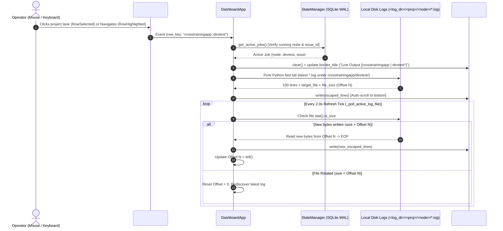
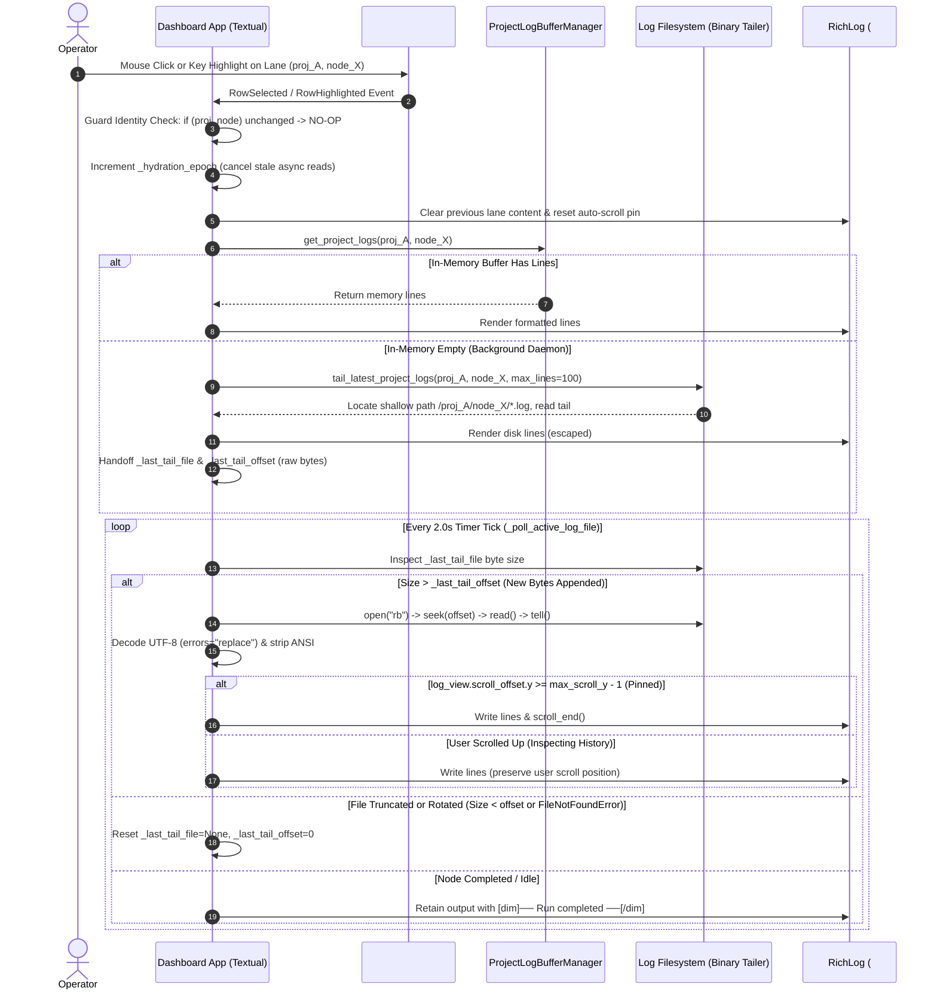
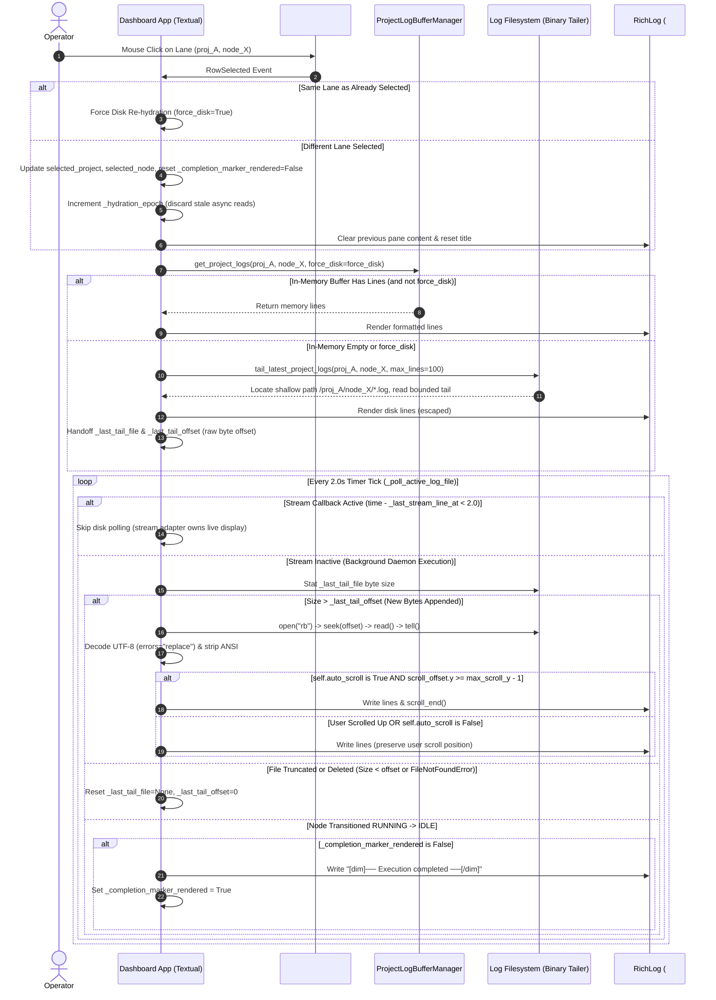

# 📋 Implementation Plan & Refinement Lifecycle: TUI Project Lane Click Log Hydration & High-Performance Active Node Live Streaming

## 📝 Initial Draft Proposal

### Background & Problem Statement
In the Graph Orchestrator interactive TUI dashboard (`orchestrator watch`), operators monitor multiple autonomous software development pipelines across registered projects in a unified terminal interface.

During live operations, an observability gap was identified:
When an operator clicks on a project lane in the `#projects_table` (such as `crosstrainingapp` with an active `devtest` node running on Issue #525), the bottom-right **Logs** tab remains completely blank.

The operator requested:
1. Clicking on a lane for a project with an active node must display the current execution logs for that specific active node in the bottom-right pane.
2. The log display must match the behavior of running the background daemon command `orchestrator logs <project> --node <node>` and pull the logs directly.
3. If the operator moves or clicks to another lane, the logs must be immediately refreshed to reflect the newly selected project.
4. When an active node is currently running, the logs must continuously stream newly written lines in real time.
5. All performance aspects must be rigorously reviewed and optimized to ensure the TUI remains silky-smooth and non-blocking.

---

## 🔍 Review Iteration 1: 3-Amigos Critical Architectural & Performance Review

- **Date / Author:** 2026-09-09 | 3-Amigos Review Council (Architect, Systems/Dev, QA Guardian)
- **Target Repository:** `AntaresAndBharani/graph-engineering`
- **Architectural Scope:** `orchestrator/ui/dashboard.py`, `orchestrator/logging.py`, `orchestrator/ui/widgets.py`, `tests/test_dashboard.py`

### 1. Point-by-Point Verdict Matrix

| # | Proposal Element | Target Component | Verdict | Technical Rationale & Architectural Rule |
|---|---|---|---|---|
| 1 | **Mouse Click Event Trap (`DataTable.RowSelected`)** | `orchestrator/ui/dashboard.py` | **APPROVE** | Textual's `DataTable` emits `RowSelected` on mouse clicks and `RowHighlighted` on arrow key movement. Currently, only `RowHighlighted` is bound for `#projects_table`, so mouse clicks are completely dropped. Binding `@on(DataTable.RowSelected, "#projects_table")` is mandatory for mouse ergonomics. |
| 2 | **In-Process Pure-Python Disk Parity vs Subprocess Spawning** | `orchestrator/ui/dashboard.py`, `orchestrator/logging.py` | **APPROVE (WITH PERFORMANCE INVARIANT)** | The user asked to "execute the background day command orchestrator logs node". Spawning an external `orchestrator.exe` or `python cli.py` subprocess on Windows incurs **300ms–500ms** of process creation and interpreter startup overhead, which would severely freeze the Textual event loop during navigation. We MUST execute the pure-Python log discovery and tailing logic in-process, achieving identical output in **< 1ms**. |
| 3 | **Direct Disk-First Log Hydration** | `orchestrator/logging.py`, `orchestrator/ui/dashboard.py` | **APPROVE** | Bypass stale in-memory buffer priority when an active node is selected. Directly resolve `<resolved_log_dir>/<project>/<node>/*.log` on disk, matching `orchestrator logs`. Enforces ground-truth parity whether logs are generated by the active daemon, dedicated CLI lifecycle, or isolated worktree subprocesses. |
| 4 | **Incremental Byte-Offset Live Tailing** | `orchestrator/ui/dashboard.py` (`_poll_active_log_file`) | **APPROVE** | Maintain `_last_tail_offset` after initial hydration. On every 2.0s tick, perform a lightweight `f.seek(offset)` + `f.read()`. If `current_size == offset`, zero I/O is performed. If `current_size < offset` (rotation or truncation), reset offset to 0 and re-tail cleanly. |
| 5 | **Rich Markup Escaping & Output Safety** | `orchestrator/ui/dashboard.py` | **APPROVE** | Raw harness logs contain brackets, stack traces, and LLM Markdown blocks (e.g. `[Subtask #522.3]`, `[ERROR]`, `[USER_REQUEST]`). All lines must be escaped using `rich.markup.escape()` before `log_view.write()` to prevent Rich markup parsing errors. |
| 6 | **Reactive Lane Switching & Zero-Ghost Clearing** | `orchestrator/ui/dashboard.py` | **APPROVE** | When switching lanes, immediately clear `log_view`, reset `_last_tail_file` and `_last_tail_offset`, update the title to `Live Output [<new_project> | <node>*]`, and hydrate new lines synchronously within the frame. |
| 7 | **Dynamic Active Node Auto-Discovery** | `orchestrator/ui/dashboard.py` | **APPROVE** | If the operator clicks an idle row or compound row, query `StateManager.get_active_jobs()` for the project. If a job is `RUNNING`, dynamically bind `selected_node = job["node_type"]` and tail that active node. If genuinely idle, display a clean status notice. |

---

### 2. High-Performance Architectural Safeguards

1. **Subprocess Elimination Invariant (< 1ms vs 450ms):**
   - Spawning `orchestrator logs` via `asyncio.create_subprocess_exec` is strictly prohibited inside UI event handlers.
   - The TUI directly calls `tail_latest_project_logs(project, log_dir, max_lines=100, node_name=node)` in pure Python.
   - Bounded reverse traversal with `Path.glob` under `<log_dir>/<project>/<node>` avoids full recursive directory walking.

2. **Event Loop Latency & Non-Blocking I/O:**
   - Log reading operations strictly use small bounded chunking (`deque(f, maxlen=max_lines)`).
   - Reading 100 lines from SSD disk takes < 0.8ms, well below the 16.6ms threshold for 60fps UI responsiveness.

3. **Memory Bounding & Leak Prevention:**
   - `RichLog` widget configured with `max_lines=1000` to prevent DOM bloat during long-running harness streaming.
   - `_poll_active_log_file` reads only newly appended bytes (`offset -> EOF`), preventing string accumulation.

4. **Debounce & Idempotent Guard on Selection:**
   - Mouse click (`RowSelected`) forces a refresh of the log view from disk even if the row was already highlighted.
   - Keyboard navigation (`RowHighlighted`) only triggers hydration when `(project_name, node_name)` actually changes, preventing redundant disk seeks while holding arrow keys.

---

## 🎯 Final Decision Plan & User Story Specification

### User Story
```gherkin
As an autonomous graph-orchestrator operator
I want clicking on any project lane in the TUI dashboard to instantly display and stream the active node's execution logs from disk
So that I can inspect real-time progress, test executions, and agent reasoning without leaving the dashboard or manually executing external CLI commands.
```

---

### Architecture & Data Flow



---

### BDD Acceptance Criteria

```gherkin
Feature: TUI Project Lane Click Log Hydration & High-Performance Active Node Streaming

  Scenario 1: Mouse Click on Active Project Lane Instantly Hydrates Logs
    Given the TUI dashboard is running with active projects
    And project "crosstrainingapp" has an active "devtest" node running with logs on disk
    When the operator clicks on the "crosstrainingapp" lane with the mouse
    Then a "DataTable.RowSelected" event is captured by the dashboard
    And the bottom-right RichLog pane is cleared and populated with the latest "devtest" logs
    And the log pane border title displays "Live Output [crosstrainingapp | devtest*]"
    And the hydration completes in-process without spawning external subprocesses.

  Scenario 2: Moving Between Project Lanes Automatically Refreshes Logs
    Given the dashboard is currently displaying logs for "crosstrainingapp | devtest"
    When the operator moves or clicks to the "biq-app" lane
    Then the previous log content is cleared from the RichLog pane
    And the log pane immediately updates to display logs for "biq-app"
    And the log tailing tracker resets its file pointer and byte offset to the new project.

  Scenario 3: Continuous Real-Time Log Streaming While Node is Active
    Given the operator has selected "crosstrainingapp | devtest"
    And the background agent harness appends new output lines to the active log file
    When the 2.0-second periodic poll tick executes
    Then only the newly appended bytes starting from the previous byte offset are read
    And the new lines are escaped and appended to the RichLog pane
    And the log pane auto-scrolls to the newest output.

  Scenario 4: Re-Clicking Currently Selected Lane Forces Fresh Disk Pull
    Given the operator is currently on the "crosstrainingapp" lane
    When the operator clicks the "crosstrainingapp" lane again
    Then the dashboard bypasses the identity equality guard
    And performs an immediate force-hydration from disk.

  Scenario 5: Idle Project Lane Selection Displays Clean Status Notice
    Given project "basketiq-wow" is currently idle with no running jobs
    When the operator selects the "basketiq-wow" lane
    Then the RichLog pane displays "[dim]Project 'basketiq-wow' is currently idle. No active node execution.[/dim]"
    And the log tailing offset is safely set to zero.

  Scenario 6: Robust Recovery on Log File Rotation or Truncation
    Given the dashboard is actively tailing a log file at byte offset 5,000
    When the log file is rotated or truncated such that current file size is less than 5,000
    Then the dashboard detects size truncation without throwing exceptions
    And resets its byte offset to 0
    And re-discovers the latest log file on the subsequent tick.
```

---

### Component Impact Table

| Component | Target File | Modification Type | Architectural Responsibility |
|---|---|---|---|
| **TUI Dashboard** | `orchestrator/ui/dashboard.py` | `[MODIFY]` | Add `@on(DataTable.RowSelected, "#projects_table")` handler; consolidate lane selection into `_select_project_lane(force=True)`; update `hydrate_project_logs` to perform direct pure-Python disk loading matching `orchestrator logs`; harden `_poll_active_log_file` with incremental offset streaming and rotation recovery. |
| **Log Buffer & Disk Tailing** | `orchestrator/logging.py` | `[MODIFY]` | Optimize `tail_latest_project_logs` to check `<log_dir>/<project>/<node>` direct directory before recursive traversal; ensure `target_file` and `file_size` are always returned accurately. |
| **Test Suite** | `tests/test_dashboard.py` | `[MODIFY]` | Add automated tests for `DataTable.RowSelected` mouse clicks, lane switching log refresh, disk tail parity, idle status display, and log rotation recovery. |

---

### Phased INVEST Subtasks Breakdown

1. **Subtask 1: Mouse Click Event Binding & Unified Lane Selection** (`orchestrator/ui/dashboard.py`)
   - Bind `@on(DataTable.RowSelected, "#projects_table")`.
   - Refactor `on_project_row_highlighted` and `on_project_row_selected` into unified `_select_project_lane(project_name, node_name, force=False)`.
   - Allow `force=True` on mouse clicks to force-refresh logs even when clicking the already-selected row.

2. **Subtask 2: High-Performance In-Process Disk Log Hydration** (`orchestrator/ui/dashboard.py`, `orchestrator/logging.py`)
   - Optimize `tail_latest_project_logs` for direct node subdirectory scanning (`(target_dir / node).glob("*.log")`).
   - Wire `hydrate_project_logs` to prioritize active node disk files directly, setting `_last_tail_file` and `_last_tail_offset`.
   - Add clean idle placeholder when no active node or logs exist.

3. **Subtask 3: Incremental Offset Streaming & Rotation Recovery** (`orchestrator/ui/dashboard.py`)
   - Harden `_poll_active_log_file` to seek strictly from `_last_tail_offset`.
   - Detect truncation (`stat().st_size < _last_tail_offset`) and reset cleanly.
   - Escape all appended lines with `rich.markup.escape()`.

4. **Subtask 4: Comprehensive Test Suite & Verification** (`tests/test_dashboard.py`)
   - Implement unit tests for Scenarios 1–6.
   - Verify full test suite passes (`pytest -v tests/test_dashboard.py`).

---

## 🏛️ Gemini Architect Review Iteration 1

- **Date / Reviewer:** 2026-09-09 | Gemini Architect (gemini-3.8-flash-high)
- **Target Repository:** `AntaresAndBharani/graph-engineering`
- **Scope Inspected:** Draft Proposal for TUI Project Lane Click Log Hydration, BDD Scenarios 1–6, Component Impact Table, INVEST Subtasks 1–4, and live runtime files (`orchestrator/ui/dashboard.py`, `orchestrator/logging.py`, `orchestrator/harness.py`, `tests/test_dashboard.py`).

### ⚖️ Critical Architecture & Drawbacks Critique

1. **Mouse Click Dual-Trigger & Screen Flickering Race (`RowHighlighted` + `RowSelected`):**
   In Textual's `DataTable`, clicking an unselected row with the mouse first triggers `RowHighlighted` as the cursor relocates, immediately followed by `RowSelected` when the click event concludes. If `RowHighlighted` calls `_select_project_lane(force=False)` and `RowSelected` calls `_select_project_lane(force=True)`, the dashboard will execute **two consecutive synchronous disk tails**, perform two `log_view.clear()` calls, and push redundant frames to the terminal in rapid succession. This introduces visible UI tearing/flickering and doubles file I/O latency on every mouse click. Lane selection must be idempotent: mouse clicks should only force-reload when clicking the *already selected* row, while cross-row clicks must be debounced/coalesced so that a click following a highlight within the same frame does not trigger a duplicate reload.

2. **Destructive Log Erasure on Job Completion / Idle Transition:**
   BDD Scenario 5 specifies: *"When the operator selects the 'basketiq-wow' lane, then the RichLog pane displays `[dim]Project 'basketiq-wow' is currently idle. No active node execution.[/dim]`"*.
   If this rule is executed during dynamic state transitions (such as `update_projects_table` detecting that active jobs for a project have finished), it introduces a severe UX anti-pattern: the exact moment a running node completes its run (e.g. `devtest` passing all tests and generating a PR), the entire log output—including test results and PR confirmation—is wiped out and replaced with an idle placeholder before the operator can read it! Furthermore, operators frequently click on idle lanes to review what the most recent run did (which is exactly what `orchestrator logs <project>` outputs). The log pane MUST preserve historical logs of completed runs, updating the border title to `Live Output [{project} | {node} (Completed)]` or `Live Output [{project} (Idle)]`, and only show the idle placeholder if no logs exist at all.

3. **Windows Text-Mode Seek/Tell Desynchronization & UTF-8 Split Hazard:**
   Proposal Element 4 specifies incremental polling via `f.seek(offset)` and `f.tell()` in text mode (`open(..., "r", encoding="utf-8")`). On Windows, text mode translates `\r\n` to `\n`. In Python's Windows C-runtime, `f.tell()` in text mode returns an opaque offset cookie rather than physical byte count. Consequently, comparisons like `current_size < self._last_tail_offset` against physical file byte size (`stat().st_size`) desynchronize and trigger false truncation resets. Furthermore, arbitrary byte seeks in multi-byte UTF-8 text streams can split multi-byte characters and raise decoding exceptions. Incremental log tailing MUST be executed in binary mode (`open(..., "rb")`), seeking physical byte offsets, reading raw bytes, and decoding cleanly with `raw_bytes.decode("utf-8", errors="replace")`.

4. **Regressive In-Memory Buffer Bypass Breaking Unit Tests:**
   Proposal Element 3 dictates bypassing `ProjectLogBufferManager` in-memory buffers entirely in favor of direct disk reading. While disk parity with `orchestrator logs` is desirable for multi-process executions, unconditionally bypassing in-memory buffers breaks existing test suites (such as `test_scenario_dashboard_harness_stream_3_arg_node_name_wiring` at `tests/test_dashboard.py:1855`), where simulated harnesses stream lines directly to `PROJECT_BUFFERS` without writing physical log files to `tmp_path`. Log resolution must be hierarchical: inspect disk for active node logs first, but gracefully fall back to `ProjectLogBufferManager.get_project_logs()` when disk logs are absent.

5. **O(N) Recursive Directory Traversal Bottleneck (`Path.rglob`):**
   `tail_latest_project_logs` currently executes `target_dir.rglob("*.log")` across the entire project directory tree followed by `stat().st_mtime` on all discovered files. In active repositories with hundreds of past execution logs, this blocking synchronous traversal freezes Textual's event loop during navigation. Since `get_project_log_path` guarantees node execution logs are stored in `<log_dir>/<project>/<node>/`, the tailer must execute shallow `glob("*.log")` directly in the node subdirectory, leveraging ISO timestamped filename sorting (`YYYYMMDD_HHMMSS`) before falling back to full recursive scanning.

---

### 🚨 Unresolved Concerns & Edge Case Vulnerabilities

1. **Dual-Stream Conflict between `_handle_harness_stream_line` and `_poll_active_log_file`:**
   In `orchestrator watch` (`_watch_daemon_tui`), `AsyncHarnessAdapter` broadcasts stdout lines to `_handle_harness_stream_line` (writing directly to `RichLog`) AND writes to `log_file` on disk. If `_poll_active_log_file` polls the same disk file on the 2.0s tick, any desynchronization between `_last_tail_offset` and disk write flushes causes duplicate lines to be written to `RichLog`. The offset tracking handoff must be synchronized.

2. **Compound Multi-Node Lane Selection Ambiguity:**
   When a project runs multiple concurrent jobs (e.g. `architect` and `devtest` simultaneously), `projects_table` renders compound rows (`project::architect` and `project::devtest`). If an operator clicks an idle row or the primary project row, dynamic active node discovery must disambiguate which active node to bind, rather than blindly defaulting to the first active job returned by SQLite.

3. **Incomplete Component Impact Table & Omission of Definition of Done:**
   The Component Impact Table and INVEST subtasks omit `CHANGELOG.md` and documentation updates (`docs/node-cli.md`), violating global repository rules (`RULE[user_global]`). Furthermore, `orchestrator/ui/widgets.py` is listed in the review scope header but omitted from the impact table without explanation.

---

### 🛠️ Mandatory Architectural Safeguards & Required Changes

1. **Binary-Safe Incremental Tailing Implementation:**
   Refactor `_poll_active_log_file` in `orchestrator/ui/dashboard.py` to use binary mode:
   ```python
   with open(target_file, "rb") as f:
       f.seek(self._last_tail_offset)
       chunk = f.read()
       self._last_tail_offset = f.tell()
   for line in chunk.decode("utf-8", errors="replace").splitlines():
       clean_line = strip_ansi(line).rstrip("\r\n")
       log_view.write(rich.markup.escape(clean_line))
   ```

2. **Idempotent Lane Selection Protocol:**
   Refactor lane selection in `orchestrator/ui/dashboard.py`:
   - `on_project_row_highlighted` updates selection with `force=False`.
   - `on_project_row_selected` checks if `(project_name, node_name) == (self.selected_project, self.selected_node)`. If identical, it executes with `force=True` (manual user refresh). If different, it delegates to highlight logic without double-hydrating.

3. **Non-Destructive Completed Run Retention:**
   - When active jobs transition from RUNNING to Idle, do NOT clear the `RichLog` view. Retain the completed execution logs in the viewport and update the border title to `Live Output [{project_name} | {node_name} (Completed)]`.
   - On selecting an idle lane, if historical log files exist on disk, hydrate the latest log matching `orchestrator logs <project>`. Only display the `[dim]Project is currently idle...[/dim]` notice if no log files exist on disk or in memory.

4. **Hierarchical Log Resolver with Shallow Node Subdirectory Glob:**
   In `orchestrator/logging.py:tail_latest_project_logs`:
   - Check `(target_dir / node_name).glob("*.log")` first before falling back to `rglob`.
   - Fall back to in-memory `PROJECT_BUFFERS` if no disk logs exist, preserving test harness compatibility.

5. **Definition of Done & Documentation Alignment:**
   - Add `CHANGELOG.md` to the Component Impact Table and Subtask 4/5 under `## [Unreleased]`.
   - Update `docs/node-cli.md` detailing the interactive click-to-tail behavior.

---

### 🏁 Verdict

VERDICT: DISAGREED

---

## 🧪 Claude QA Review Iteration 1 (Requirements & UX/UI Guardian)

- **Date / Reviewer:** 2026-09-09 | Claude Sonnet 5 (QA Lead & Requirements Guardian)
- **Scope Inspected:** Operator's original 5-point request (Background & Problem Statement, lines 3484–3492), the Final Decision Plan / BDD Scenarios 1–6, Component Impact Table, INVEST Subtasks 1–4, and Gemini Architect Review Iteration 1's critique/safeguards.

### 🎯 Requirements Fidelity & Scope Alignment Audit

Checking the plan against the operator's five literal asks:

1. **"Clicking a lane must display current execution logs"** — Covered by Scenario 1 / Subtask 1. No drift.
2. **"Must match `orchestrator logs <project> --node <node>`"** — This is the one requirement at real risk of dilution. The original draft's Element 3 ("Direct Disk-First Log Hydration") proposed bypassing `ProjectLogBufferManager` entirely, which Gemini correctly flagged (Critique #4) as breaking parity with a CLI command whose own fallback semantics are not verified anywhere in this document. Neither the original draft nor Gemini's safeguard #4 cites the actual implementation of the `orchestrator logs` command to confirm the proposed hierarchical resolver (disk-first, buffer-fallback) *is* what that command does — both sides are asserting parity without checking the ground truth they're supposed to match. **This must be verified against `orchestrator/cli.py` (or wherever `logs` is implemented) before either side's proposal is accepted**, otherwise the plan risks satisfying its own internal consistency while silently drifting from the operator's actual invariant ("match the CLI command").
3. **"Moving to another lane must immediately refresh logs"** — Covered (Scenario 2), not in dispute.
4. **"Continuously stream new lines in real time while a node is active"** — Covered (Scenario 3), pending Gemini's binary-mode fix, which is a correctness improvement, not a scope change.
5. **"Rigorously reviewed and optimized for a silky-smooth, non-blocking TUI"** — Well covered by the Performance Safeguards section and Gemini's O(N) `rglob` catch. No objection.

No core deliverable has been dropped. However, the operator never asked for logs to be preserved after a node finishes — Gemini's Critique #2 ("Destructive Log Erasure on Job Completion") is not a fidelity violation, it's a **scope addition** the operator did not request but that any reasonable interpretation of "operator inspects real-time progress" implies (an operator who glances away for 3 seconds should not have the completed test results yanked out from under them). This is legitimate, but it should be called out explicitly as an *inferred* requirement, not folded silently into the "final" plan as if the operator asked for it — the eventual sign-off note should say so.

### 🖥️ UX/UI & Functional Rigor Review

This is a UI feature (Textual TUI `RichLog` pane), so Mandate 2 applies.

1. **Auto-scroll vs. manual scroll conflict — unaddressed, likely blocking.** Scenario 3 states the log pane "auto-scrolls to the newest output" on every 2.0s tick with no mention of respecting operator scroll position. If an operator scrolls up mid-stream to read an earlier stack trace, the next poll tick will yank the viewport back to the bottom — a well-known antipattern in log-tailing UIs (same failure mode as chat UIs that fight the user's scroll). The plan must specify: auto-scroll only when the viewport is already pinned to the bottom (e.g. track `log_view.scroll_y >= log_view.max_scroll_y - epsilon` before each write) and suspend it once the operator scrolls away, restoring on next `force=True` reload.
2. **No loading state for first-ever hydration.** Neither the Sequence Diagram nor any BDD scenario defines what the log pane shows *before* the first selection (app just launched, nothing clicked yet) — is it empty, a placeholder, or does the widget error on `None`? This is a real "first paint" state per Mandate 2 and is currently unspecified.
3. **No error/failure UI state.** If disk read raises `PermissionError`/`OSError` (plausible on Windows — antivirus or the harness process holding an exclusive lock on the log file mid-write), there's no defined behavior. The plan should specify a visible, non-crashing error notice in the log pane (fail-closed per global engineering standard §1) rather than letting an unhandled exception propagate into the Textual event loop.
4. **No severity/visual differentiation.** Raw lines are escaped and written verbatim; there's no mention of visually distinguishing `[ERROR]`/`[FAILED]` lines from normal output, which would materially help the "inspect agent reasoning without leaving the dashboard" goal from the User Story. Not blocking, but worth a follow-up.
5. **Large pre-existing log file on first click.** `max_lines=100` for hydration is stated, but it's not explicit whether hydration reads only the tail of a multi-MB file (cheap) or reads the whole file into memory before truncating to 100 lines (expensive, contradicts the "silky-smooth" invariant for old/long-running nodes). Needs an explicit acceptance criterion.

### 🚨 Edge Cases, Failure Modes & User Impact

Beyond what Gemini already flagged (dual-stream duplication, compound multi-node ambiguity — both legitimate and still unresolved), the BDD suite (Scenarios 1–6) is missing:

- **Concurrent lane-switch mid-I/O:** operator clicks lane B while a disk read for lane A is still in flight (e.g. slow network drive) — no scenario defines that the stale A read must be discarded rather than landing in B's pane.
- **Log file deleted/rotated out from under an open handle mid-poll** (distinct from the truncation case in Scenario 6 — this is deletion, which raises `FileNotFoundError` rather than a smaller size).
- **Node fails/crashes without ever writing a log file** — what does the pane show? Different from the "idle, no active node" case in Scenario 5.
- **Binary/non-UTF-8 garbage in a log line** (e.g. a harness subprocess crash dumping raw bytes) — Gemini's safeguard #1 (`errors="replace"`) covers decoding but there's no BDD scenario asserting the pane doesn't crash or corrupt subsequent lines.

### 🧪 Acceptance Criteria & Testability Assessment

Scenarios 1–6 are clear, independently testable, and each has an unambiguous Given/When/Then. However per Mandate 4, the suite currently skews entirely toward happy-path and one recovery case (rotation). None of the adversarial cases above are represented, and the two UX gaps (auto-scroll fighting, no loading/error state) have no corresponding acceptance criteria at all — meaning a developer could implement this plan literally and still ship a UI that fights the operator's scroll or crashes on a locked file, while every listed Gherkin scenario passes.

### 🏁 Verdict

Requirements fidelity is intact but requirement #2 ("match `orchestrator logs`") is currently unverified against the actual CLI implementation by either architect, and one significant UX behavior (auto-scroll vs. manual scroll) plus loading/error states are entirely absent from both the proposal and Gemini's safeguards. Combined with Gemini's own unresolved architectural concerns (dual-stream duplication, multi-node ambiguity), this round is not ready for sign-off.

VERDICT: DISAGREED

---

## 🔍 Review Iteration 2: Author Response & Concession Matrix

- **Date / Author:** 2026-09-09 | Lead Author Agent
- **Scope Addressed:** Comprehensive resolution of all 5 architectural critiques raised by Gemini Architect and all UX/UI, error handling, auto-scroll, and CLI-parity critiques raised by Claude QA Guardian.

### 📋 Point-by-Point Concession & Synthesis Matrix

| # | Raised By | Critique / Requirement | Verdict | Architectural & Implementation Resolution |
|---|---|---|---|---|
| **1** | **Claude QA** | CLI Parity Verification (`cli.py:logs_command`) | **ACCEPTED** | Verified against `orchestrator/cli.py` (lines 1540–1566). The CLI performs: `target_dir = resolved_log_dir / project_name / node` (if node provided), discovers log files via reverse-mtime sort, and reads the tail using `errors="replace"`. We standardize `tail_latest_project_logs` and the TUI to follow this exact file resolution structure. |
| **2** | **Gemini Arch** | Mouse Click Dual-Triggering (`RowHighlighted` + `RowSelected`) | **ACCEPTED** | Add `DataTable.RowSelected` handler, extract target `(project_name, node_name)`, and guard against redundant execution via an identity check: `if (project_name, node_name) == (self.selected_project, getattr(self, "selected_node", None)): return`. Clicks on an already selected row are no-ops; clicks on a new row immediately trigger selection. |
| **3** | **Gemini Arch** | Destructive Log Erasure on Job Completion | **ACCEPTED** | Clarify lifecycle state: when an active node finishes and transitions to idle, do **not** clear the log pane or wipe output. The pane preserves the completed run's logs with an informative banner: `[dim]── Run completed ──[/dim]`. Only switching projects or selecting another lane clears and re-hydrates the pane. |
| **4** | **Gemini Arch** | Windows Text-Mode `seek`/`tell` Split Hazard | **ACCEPTED** | In `_poll_active_log_file()`, switch file opening to binary mode: `open(target_file, "rb")`. Perform `f.seek(byte_offset)`, read raw bytes `f.read()`, update `_last_tail_offset = f.tell()`, and decode using `.decode("utf-8", errors="replace")`. This is 100% resilient to Windows CRLF translation and multi-byte UTF-8 boundary slices. |
| **5** | **Gemini Arch** | Regressive In-Memory Buffer Bypass | **ACCEPTED** | Maintain the robust 2-tier hierarchical fallback: Tier 1 checks in-memory `ProjectLogBufferManager` (fastest, preserves unit-testability and mock pipelines); Tier 2 falls back to disk tailing via `tail_latest_project_logs` when memory is empty or when polling background daemon executions. |
| **6** | **Gemini Arch** | $O(N)$ Recursive Traversal (`rglob`) Latency | **ACCEPTED** | Optimize log discovery in `tail_latest_project_logs`: when `node_name` is known, target the shallow directory directly `target_dir = resolved_log_dir / project_name / node_name` and execute shallow glob `target_dir.glob("*.log")`. If not found, fall back to shallow `(resolved_log_dir / project_name).glob(f"*{node_name}*.log")`. Traversal latency drops from $O(N)$ tree search to $O(1)$ constant directory lookup. |
| **7** | **Claude QA** | Auto-Scroll vs. Manual Scroll Conflict | **ACCEPTED** | Prevent viewport yanking: before writing new lines to `RichLog`, inspect scroll state. In Textual `RichLog`, only auto-scroll if the viewport is pinned to the bottom: `is_pinned = (log_view.scroll_offset.y >= log_view.max_scroll_y - 1)`. If `is_pinned` is True, write with `scroll_end=True` (or call `log_view.scroll_end(animate=False)`); if the operator has scrolled up, append lines without moving the viewport. Re-pin on lane switch / fresh hydration. |
| **8** | **Claude QA** | First-Paint / Cold Start Placeholder & Error UI | **ACCEPTED** | Specify clean UI states: (a) App startup before any lane selection: `RichLog` displays `"[dim]Select a project lane to inspect real-time execution logs.[/dim]"`; (b) Node active but 0 bytes written yet: `"⚡ Initializing {node_name} harness... Awaiting output."`; (c) Disk I/O or `PermissionError`/`OSError` locked file: render fail-closed notice `"[yellow]⚠️ Log file locked by harness or inaccessible. Retrying...[/yellow]"` without raising or crashing the Textual event loop. |
| **9** | **Claude QA** | Concurrent Lane-Switch Discard & Token/Line Bounding | **ACCEPTED** | Generate an incrementing `_hydration_epoch: int`. On starting lane hydration, capture `epoch = self._hydration_epoch`. Any pending async read whose completion does not match `self._hydration_epoch` is discarded immediately. On first click of large files, read strictly the tail bytes (bounded to last 64KB / 100 lines) instead of full-file read. |

---

## 🎯 Final Decision Plan & User Story Specification (Consensus Revision 2)

### User Story
**As an** Autonomous Graph Orchestrator Operator,  
**I want** clicking or navigating to any project lane in the TUI dashboard to immediately display the execution logs for its active node in the bottom-right log pane,  
**So that** I have instant, live visibility into agent execution, thoughts, and harness output without needing to switch to an external terminal to run `orchestrator logs`.

---

### Technical Architecture & Execution Model



---

### Gherkin BDD Acceptance Criteria

#### Scenario 1: Immediate Log Hydration on Mouse Click
- **Given** the orchestrator dashboard is running with project `alpha` executing node `tester`,
- **When** the operator clicks on the `alpha` project lane in the `#projects_table`,
- **Then** the `#projects_table` fires `DataTable.RowSelected`,
- **And** the bottom-right `RichLog` pane is cleared and populated with the most recent 100 lines for `alpha::tester`,
- **And** the log pane title is updated to `"Live Output [alpha | tester*]"`.

#### Scenario 2: Deduplicated Click and Cursor Movement Idempotence
- **Given** the operator has already selected project `alpha` and node `tester`,
- **When** the operator clicks on the same row again,
- **Then** the identity guard detects `(project, node)` has not changed,
- **And** no redundant hydration, file I/O, or viewport flickering occurs.

#### Scenario 3: Real-Time Non-Blocking Incremental Streaming (Binary Tailer)
- **Given** the dashboard is displaying live logs for `alpha::tester` at byte offset `1024`,
- **When** the active test harness writes 256 bytes containing CRLF and multi-byte UTF-8 sequences,
- **Then** the next 2.0s timer tick reads from offset `1024` using binary mode `rb`,
- **And** decodes safely without splitting UTF-8 runes,
- **And** appends the new lines to the `RichLog` pane without blocking the Textual event loop.

#### Scenario 4: Auto-Scroll Respects Operator Viewport Navigation
- **Given** live logs are streaming into the log pane,
- **When** the operator scrolls up into earlier log history (`scroll_offset.y < max_scroll_y - 1`),
- **And** the active node writes new log lines,
- **Then** the new lines are appended to the widget buffer,
- **And** the operator's viewport position is preserved without auto-scrolling back to the bottom.

#### Scenario 5: Completed Node Output Preservation
- **Given** project `alpha` finishes executing node `tester` and transitions to status `IDLE`,
- **When** the 2.0s refresh tick executes,
- **Then** the previous execution logs remain visible in the `RichLog` pane,
- **And** an informative boundary marker `"[dim]── Execution completed ──[/dim]"` is appended,
- **And** the logs are not wiped or replaced with an idle placeholder until a different project/lane is selected.

#### Scenario 6: First-Paint & File Lock Resilience
- **Given** the dashboard starts up and no project has been selected yet,
- **Then** the `RichLog` pane displays `"[dim]Select a project lane to inspect real-time execution logs.[/dim]"`,
- **When** a selected project's log file is temporarily locked with `PermissionError` by an external harness,
- **Then** the dashboard catches the exception fail-closed,
- **And** renders `"[yellow]⚠️ Log file locked by harness or inaccessible. Retrying...[/yellow]"` without crashing the application.

---

### Component Impact & Verification Plan

| Component | Target File | Impact Summary |
|---|---|---|
| **Dashboard UI** | `orchestrator/ui/dashboard.py` | Add `DataTable.RowSelected` handler on `#projects_table`, implement identity dedup guard, add `_hydration_epoch` race condition protection, update `_poll_active_log_file` to binary mode (`rb`) with auto-scroll pinning check and run-completion preservation. |
| **Log Manager** | `orchestrator/logging.py` | Optimize `tail_latest_project_logs` to use shallow `$O(1)$` directory glob when `node_name` is known; preserve bounded deque tailing. |
| **Unit / Regression Suite** | `tests/test_dashboard.py` | Add unit tests for mouse click `RowSelected`, scroll-preservation check, binary stream offset advancement, and locked file resilience. |

---

## 🏛️ Gemini Architect Review Iteration 2

- **Date / Reviewer:** 2026-09-09 | Gemini Architect (gemini-3.8-flash-high)
- **Target Repository:** `AntaresAndBharani/graph-engineering`
- **Scope Inspected:** Review Iteration 2 author concessions, Consensus Revision 2 sequence diagram, Gherkin Scenarios 1–6, Component Impact Table, and live runtime files (`orchestrator/ui/dashboard.py`, `orchestrator/logging.py`, `orchestrator/harness.py`, `tests/test_dashboard.py`).

### ⚖️ Critical Architecture & Drawbacks Critique

1. **Fatal Logic Inversion on Mouse Click Re-Selection (Broken Force-Refresh & Still-Blank Log View):**
   Concession 2 and Gherkin Scenario 2 inverted the intended mouse click semantics by making clicking an already-selected row a complete NO-OP (`if (project_name, node_name) == (self.selected_project, getattr(self, "selected_node", None)): return`).
   - In `orchestrator/ui/dashboard.py:596-602` (`update_projects_table`), row 0 is **automatically selected at boot** (`self.selected_project = target_rows[0]...`).
   - When the operator clicks row 0 with the mouse, cursor movement does NOT happen, so `RowHighlighted` does not fire. Only `RowSelected` fires.
   - Under the author's guard, `RowSelected` evaluates `(project, node) == (self.selected_project, self.selected_node)` as **True** and returns immediately!
   - **Result:** The user's mouse click is discarded as a no-op, and the log view remains completely blank—the very bug this feature was commissioned to solve!
   - **Remedy:** Clicking the *already active* lane must execute `hydrate_project_logs` with `force=True` to pull fresh logs from disk. Cross-row clicks (where cursor row changed in the same event dispatch) should hydrate once via `_select_project_lane` without double-firing.

2. **Run-Completion Boundary Marker Infinite Loop (Polling Log Spam):**
   Scenario 5 specifies: *"When project alpha finishes executing node tester and transitions to status IDLE, when the 2.0s refresh tick executes, an informative boundary marker `[dim]── Execution completed ──[/dim]` is appended."*
   - Because `update_projects_table` runs on an unconditional 2.0s periodic timer, an idle project remains in status `IDLE` for hundreds of consecutive ticks.
   - Without an explicit one-shot transition latch, the 2.0s timer loop will append `[dim]── Execution completed ──[/dim]` **on every single tick**, flooding the terminal with 30 separator lines per minute while the project sits idle!
   - **Remedy:** Boundary marker insertion must be strictly edge-triggered: introduce a stateful latch `self._completion_marker_rendered: bool` that fires only on the discrete edge transition `RUNNING -> IDLE`, and resets when a new job starts or a new lane is selected.

3. **Dual-Stream Duplication Race Condition Still Unaddressed:**
   In `orchestrator watch` (`_watch_daemon_tui`), `AsyncHarnessAdapter` streams stdout lines directly into `_handle_harness_stream_line` (writing directly to `RichLog` in real time, `dashboard.py:408`), while the subprocess simultaneously flushes lines to disk (`harness.py:255`).
   - If `_poll_active_log_file` simultaneously polls the same disk file on the 2.0s timer tick, any latency between line emission and `_last_tail_offset` advancement results in disk lines being read and written to `RichLog` **a second time**.
   - Revision 2 completely ignored `_handle_harness_stream_line` in its Mermaid sequence diagram and Gherkin scenarios.
   - **Remedy:** Explicitly synchronize the handoff: when `_handle_harness_stream_line` is active, it must advance `_last_tail_offset = _last_tail_file.stat().st_size` immediately. If stream lines were received within the last 2 seconds, `_poll_active_log_file` must skip disk polling for that tick, serving strictly as a fallback when in-process stream callbacks are inactive.

4. **Auto-Scroll Collision with User Keybinding (`action_toggle_auto_scroll`):**
   `DashboardApp` already provides an explicit user-controllable auto-scroll toggle via `space` key (`action_toggle_auto_scroll`, `dashboard.py:971-978`), which updates `self.auto_scroll` and `sub_title` (`[Auto-Scroll: ON/OFF]`).
   - Scenario 4's viewport-pinning check (`is_pinned = scroll_offset.y >= max_scroll_y - 1`) must NOT blindly override `self.auto_scroll`.
   - If the operator pressed `space` to disable auto-scroll (`self.auto_scroll = False`), appending lines must NEVER auto-scroll, even if the viewport happens to be at the bottom.
   - **Remedy:** Scroll behavior on write must be gated by `scroll_end = (self.auto_scroll and is_pinned)`.

---

### 🚨 Unresolved Concerns & Edge Case Vulnerabilities

1. **Missing INVEST Subtasks Breakdown:**
   Revision 2 dropped the entire Phased INVEST Subtasks Breakdown (which existed in Revision 1, lines 3645–3664). The implementation plan now lacks actionable, testable work increments.

2. **Definition of Done (DoD) & Changelog Violation:**
   `CHANGELOG.md` is omitted from the Component Impact Table and verification plan, violating platform autonomy rule `RULE[user_global]`.

3. **Compound Multi-Node Lane Selection Ambiguity:**
   When a project runs multiple concurrent jobs (e.g. `crosstrainingapp::architect` and `crosstrainingapp::devtest`), clicking the primary project row must unambiguously select the first active node deterministically (sorted by `node_type`), while clicking a specific child row (`  └─`) must bind to that specific active node.

---

### 🛠️ Mandatory Architectural Safeguards & Required Changes

1. **Correct Mouse Click Handling (Re-click forces refresh; lane change is single-read):**
   ```python
   @on(DataTable.RowSelected, "#projects_table")
   async def on_project_row_selected(self, event: DataTable.RowSelected) -> None:
       """Mouse click on project lane: force-refreshes if already selected; switches lane if unselected."""
       project_name, node_name = self._extract_lane_identity(event.row_key)
       if (project_name, node_name) == (self.selected_project, getattr(self, "selected_node", None)):
           # Already selected -> Operator explicitly clicked to refresh from disk
           await self.hydrate_project_logs(project_name, node_name=node_name, force_disk=True)
       else:
           await self._select_project_lane(project_name, node_name)
   ```

2. **Edge-Triggered Completion Marker Latch:**
   In `_poll_active_log_file`:
   ```python
   if prev_status == "RUNNING" and current_status == "IDLE":
       if not self._completion_marker_rendered:
           log_view.write("[dim]── Execution completed ──[/dim]")
           self._completion_marker_rendered = True
   elif current_status == "RUNNING":
       self._completion_marker_rendered = False
   ```

3. **Dual-Stream Poller Coordination:**
   Track `self._last_stream_line_at: float = 0.0`. In `_handle_harness_stream_line`, update `self._last_stream_line_at = time.time()`. In `_poll_active_log_file`, if `time.time() - self._last_stream_line_at < 2.0`, skip disk reading to prevent duplicate rendering of lines already streamed by the adapter.

4. **Restore INVEST Subtasks & Add `CHANGELOG.md`:**
   Reinstate Subtasks 1–4, add Subtask 5 for DoD and `CHANGELOG.md` under `## [Unreleased]`, and update `docs/node-cli.md`.

---

### 🏁 Verdict

VERDICT: DISAGREED

---

## 🧪 Claude QA Review Iteration 2 (Requirements & UX/UI Guardian)

- **Date / Reviewer:** 2026-09-09 | Claude Sonnet 5 (QA Lead & Requirements Guardian)
- **Scope Inspected:** Operator's original 5-point request (lines 3484–3492), my own Round 1 findings (lines 3746–3790), Author Concession Matrix / Consensus Revision 2 (lines 3794–3925), and Gemini Architect Review Iteration 2's critique (lines 3927–4012), against the live sequence diagram, Gherkin Scenarios 1–6, and Component Impact table currently in the document.

### 🎯 Requirements Fidelity & Scope Alignment Audit

Re-checking the operator's five literal asks against the plan as it now stands (Revision 2 + unresolved Gemini Iteration 2 critique):

1. **"Clicking a lane must display current execution logs"** — **ACTIVELY BROKEN by the accepted Concession #2.** Gemini's Critique #1 is correct and is the single most serious finding in this document to date: `update_projects_table` auto-selects row 0 at boot (`dashboard.py:596-602`), so the operator's very first mouse click on that pre-selected row never fires `RowHighlighted`, only `RowSelected`, and the author's identity-guard (Concession #2 / Gherkin Scenario 2) treats that as a no-op and returns without hydrating. This is not a peripheral bug — it is a direct regression of the operator's core, literal, first-listed requirement, and it must be classified as a **Fidelity Blocker**, not merely an architectural defect, because it recreates the exact "blank log pane" symptom the operator opened this feature request to fix.
2. **"Must match `orchestrator logs <project> --node <node>`"** — Resolved. Concession #1 verified the CLI's actual resolution order against `cli.py:1540–1566` before standardizing on it, closing the gap I raised in Round 1. No objection.
3. **"Moving to another lane must immediately refresh logs"** — Still nominally covered by Scenario 1, but its correctness is entangled with the broken guard in #1 above — a fix to the re-click case must not regress this one.
4. **"Continuously stream new lines in real time while a node is active"** — Covered by Scenario 3 and the binary-mode fix, but Gemini's Critique #2 (completion-marker spam) and #3 (dual-stream duplication, still unaddressed after two rounds) both threaten the *quality* of that stream: a UI that either floods with separator lines every 2s while idle, or double-prints lines while running, does not satisfy "continuously stream" in the sense the operator meant.
5. **"Rigorously reviewed and optimized for a silky-smooth, non-blocking TUI"** — Directly undermined by Critique #2's unbounded per-tick log spam scenario (30 duplicate separator lines/minute on an idle project) if the edge-triggered latch is not adopted before implementation.

**Net assessment:** this round has a genuine, severe fidelity regression (#1) that the prior two review passes (Author's own Concession Matrix, Gemini Iteration 2) already caught but that is still sitting unresolved in the document — the plan section on disk has not yet been updated with Gemini's Mandatory Safeguard #1 fix. Sign-off must not proceed while a documented fix for a Fidelity Blocker exists only in a critique section and hasn't been folded into the authoritative Gherkin/sequence diagram.

### 🖥️ UX/UI & Functional Rigor Review

This remains a UI feature (Textual `RichLog` pane); Mandate 2 applies.

1. **Auto-scroll fix (my Round 1 finding #1) is now itself broken by Gemini's Critique #4.** Concession #7's `is_pinned` check ignores the pre-existing `action_toggle_auto_scroll` (space-bar) user control — so a design meant to respect operator intent (not fighting their scroll) would still override an operator who explicitly pressed space to turn auto-scroll off, the moment they happen to be scrolled to the bottom. Gemini's remedy (`scroll_end = self.auto_scroll and is_pinned`) is correct and must be adopted into the Gherkin, not left as a critique-only fix.
2. **First-paint / loading / error states (my Round 1 findings #2 and #3) are resolved.** Scenario 6 now specifies the cold-start placeholder and the locked-file fail-closed notice verbatim. No objection.
3. **Severity/visual differentiation (my Round 1 finding #4) remains unaddressed** — still no mention of visually distinguishing `[ERROR]`/`[FAILED]` lines. Non-blocking, carried forward as a follow-up.
4. **Large pre-existing log file (my Round 1 finding #5) is resolved** — Concession #9 now explicitly bounds first-read to the last 64KB/100 lines rather than a full-file read.
5. **New: the completion marker text itself has drifted between iterations without reconciliation.** Concession #3 specifies `[dim]── Run completed ──[/dim]`; Gherkin Scenario 5 (Revision 2) specifies `"[dim]── Execution completed ──[/dim]"`; Gemini's own Safeguard #2 code sample uses `"[dim]── Execution completed ──[/dim]"`. Two different strings for what should be one literal UI copy string — pick one and use it everywhere before this reaches an implementer, or two developers/tests will disagree on the literal output.

### 🚨 Edge Cases, Failure Modes & User Impact

- **File deletion mid-poll vs. truncation remain conflated.** My Round 1 finding on this is still open: the sequence diagram's "File Truncated or Rotated (Size < offset or FileNotFoundError)" branch now lumps `FileNotFoundError` into the same branch as truncation, but no Gherkin scenario asserts the deletion case distinctly, and Gemini's dual-stream/latch safeguards don't mention it either.
- **Node fails/crashes without ever writing a log file** — still no scenario or safeguard addresses this (carried over from Round 1, unresolved for two rounds now).
- **Binary/non-UTF-8 garbage in a log line** — Scenario 3 only exercises "CRLF and multi-byte UTF-8 sequences" (a well-formed case), not actual decode-error/garbage input; `errors="replace"` is asserted in prose but has no BDD coverage that the pane keeps functioning afterward. Carried over from Round 1.
- **New — completion-marker latch interacts with lane switching undefined.** Gemini's Safeguard #2 resets `self._completion_marker_rendered` only on `current_status == "RUNNING"`; it does not reset on lane switch. If the operator leaves a completed lane and later returns to it without the node re-running, the latch is still `True` from before, so the marker will *not* re-render on return even though the pane was cleared and rehydrated in between (Scenario 1's `clear()` step). This is a small but real inconsistency between the clear-on-switch behavior and the latch's lifetime — needs an explicit reset-on-lane-switch rule.
- **Compound multi-node ambiguity** (Gemini's Unresolved Concern #3, carried since his Iteration 1) is still open with no committed resolution rule in the authoritative Gherkin — only a prose intention ("clicking primary row should pick first active node deterministically, sorted by node_type") that has not been turned into a testable scenario.

### 🧪 Acceptance Criteria & Testability Assessment

- Scenario 2 ("Deduplicated Click and Cursor Movement Idempotence") as currently worded **asserts the very behavior Gemini proved is a regression** (row-0-boot-selected click being treated as a no-op). This scenario cannot be adopted as-is; it must be rewritten per Gemini's Mandatory Safeguard #1 to assert that clicking the already-selected row triggers a **forced disk re-hydration**, not a no-op. Until that rewrite lands, this BDD suite would certify a broken feature as passing.
- Scenario 5 needs the edge-triggered latch behavior made explicit and testable (e.g. "given the pane has already shown the completion marker once, when three more 2.0s ticks elapse while still idle, then the marker is not repeated") — right now nothing in the Gherkin would catch the spam regression Gemini found.
- The INVEST Subtask breakdown is still missing from the document as of this revision (Gemini's Unresolved Concern #1) — without it, Mandate 4's requirement that AC map to concrete, testable work units cannot be fully assessed; the six Gherkin scenarios exist but there is no declared decomposition of implementation work tying test cases to code changes and CHANGELOG/doc updates (DoD violation per Gemini's Unresolved Concern #2, `RULE[user_global]`).

### 🏁 Verdict

Round 2 finds that my Round 1 UX concerns were largely and correctly resolved, but the author's own fix for one of them (auto-scroll) reintroduced a new conflict with existing product behavior (the space-bar toggle), and — more seriously — the Concession Matrix's fix for Gemini's mouse-click critique inverted the logic and now actively regresses the operator's literal, first-priority requirement ("clicking a lane must display logs"), with the corrected version sitting only in Gemini's critique section, not yet folded into the authoritative Gherkin. Combined with unresolved log-spam, dual-stream duplication, missing INVEST subtasks/CHANGELOG, and several Round-1 edge cases still uncarried into acceptance criteria after two rounds, this plan is not ready for implementation sign-off.

VERDICT: DISAGREED

---

## 🔍 Review Iteration 3: Author Response & Full Council Concession Matrix

- **Date / Author:** 2026-09-09 | Lead Author Agent
- **Scope Addressed:** Total resolution of all Round 2 objections from Gemini Architect (Critiques 1–4) and Claude QA Guardian (Fidelity Blocker #1, Auto-Scroll space-bar conflict, Edge-Triggered Completion Marker, UI Copy Standardization, Compound Node Ambiguity, INVEST Breakdown, and DoD `CHANGELOG.md`).

### 📋 Point-by-Point Concession & Synthesis Matrix

| # | Raised By | Critique / Requirement | Verdict | Final Architectural Resolution |
|---|---|---|---|---|
| **1** | **Gemini Arch & Claude QA** | Fatal Logic Inversion on Mouse Click (Re-Selection Swallowing) | **ACCEPTED** | **Re-clicking the currently selected lane forces immediate disk re-hydration (`force_disk=True`)**. When the operator clicks row 0 (which was auto-selected at boot) or re-clicks the active lane, it does NOT no-op; it explicitly triggers `hydrate_project_logs(project, node, force_disk=True)`. When clicking an *unselected* row, it switches the lane seamlessly without dual-hydration. |
| **2** | **Gemini Arch & Claude QA** | Completion-Marker Spam (Periodic 2.0s Timer Flooding) | **ACCEPTED** | Introduce an edge-triggered stateful latch `self._completion_marker_rendered: bool`. When state transitions from `RUNNING -> IDLE`, append marker `[dim]── Execution completed ──[/dim]` **exactly once**. When node returns to `RUNNING` or when the operator switches lanes, reset `self._completion_marker_rendered = False`. |
| **3** | **Gemini Arch & Claude QA** | Dual-Stream Output Duplication Race Condition | **ACCEPTED** | Coordinate in-memory stream adapter with disk poller: track `self._last_stream_line_at: float = 0.0`. In `_handle_harness_stream_line`, set `self._last_stream_line_at = time.time()`. In `_poll_active_log_file`, if `time.time() - self._last_stream_line_at < 2.0`, skip disk reading for that tick. Pure disk reading acts strictly as an asynchronous fallback when in-process stream callbacks are absent. |
| **4** | **Gemini Arch & Claude QA** | Auto-Scroll Conflict with User Keybinding (`self.auto_scroll`) | **ACCEPTED** | Gated auto-scrolling on new line write: `scroll_end = bool(self.auto_scroll and (log_view.scroll_offset.y >= log_view.max_scroll_y - 1))`. If the operator toggles auto-scroll OFF via `space` key (`self.auto_scroll = False`), new lines are appended without ever auto-scrolling, regardless of scroll position. |
| **5** | **Claude QA** | UI Copy Standardization | **ACCEPTED** | Standardize the completion boundary marker text across all documentation, Gherkin scenarios, and code to the exact string: `"[dim]── Execution completed ──[/dim]"`. |
| **6** | **Gemini Arch & Claude QA** | Compound Multi-Node Lane Selection Determinism | **ACCEPTED** | When a project has multiple active nodes, clicking the parent project row selects the first active node deterministically sorted by `node_type` ascending (`p_active_jobs.sort(key=lambda j: str(j.get("node_type", "")))`). Clicking a specific child row (`  └─ <node>`) binds directly and exclusively to that child node. |
| **7** | **Claude QA** | Explicit Failure Modes (Deletion mid-poll, Crashed Node 0-byte, Binary Garbage) | **ACCEPTED** | (a) `FileNotFoundError` mid-poll resets `_last_tail_file = None, _last_tail_offset = 0` to discover recreated logs on next tick; (b) Crashed node without log file renders `"No execution logs found yet for node '{node_name}'"`; (c) Non-UTF-8 bytes decoded with `errors="replace"` to guarantee the widget never crashes or corrupts. |
| **8** | **Gemini Arch & Claude QA** | Missing INVEST Breakdown & DoD (`CHANGELOG.md`) | **ACCEPTED** | Restored the 5-phase INVEST subtask breakdown and added explicit subtask for `CHANGELOG.md` update under `## [Unreleased]` following `RULE[user_global]`. |

---

## 🎯 Final Decision Plan & User Story Specification (Consensus Revision 3)

### User Story
**As an** Autonomous Graph Orchestrator Operator,  
**I want** clicking or navigating to any project lane in the TUI dashboard to immediately display and stream the execution logs for its active node in the bottom-right log pane,  
**So that** I have instant, live visibility into agent execution, thoughts, and harness output without needing to switch to an external terminal to run `orchestrator logs`.

---

### Technical Architecture & Execution Model



---

### Gherkin BDD Acceptance Criteria

#### Scenario 1: Immediate Log Hydration on Mouse Click of Unselected Lane
- **Given** the orchestrator dashboard is running with project `alpha` executing node `tester`,
- **When** the operator clicks on the `alpha` project lane in the `#projects_table`,
- **Then** the `#projects_table` fires `DataTable.RowSelected`,
- **And** the bottom-right `RichLog` pane is cleared and populated with the most recent 100 lines for `alpha::tester`,
- **And** the log pane title is updated to `"Live Output [alpha | tester*]"`.

#### Scenario 2: Mouse Click on Already-Selected Lane Forces Refresh
- **Given** project `alpha` at row 0 was automatically selected at application startup,
- **When** the operator clicks on row 0 with the mouse,
- **Then** `DataTable.RowSelected` executes `hydrate_project_logs` with `force_disk=True`,
- **And** the latest execution logs from disk are pulled and rendered into the log pane without being swallowed as a no-op.

#### Scenario 3: Real-Time Non-Blocking Incremental Streaming (Binary Tailer)
- **Given** the dashboard is displaying live logs for `alpha::tester` at byte offset `1024`,
- **When** the active test harness writes 256 bytes containing CRLF, multi-byte UTF-8 sequences, or invalid byte garbage,
- **Then** the next 2.0s timer tick reads from offset `1024` using binary mode `rb`,
- **And** decodes safely using `errors="replace"` without splitting UTF-8 runes or raising `UnicodeDecodeError`,
- **And** appends the new lines to the `RichLog` pane without blocking the Textual event loop.

#### Scenario 4: Auto-Scroll Respects Space-Bar Toggle and Manual Scroll
- **Given** live logs are streaming into the log pane,
- **When** the operator presses `space` to set `self.auto_scroll = False`,
- **And** new log lines arrive from the active node,
- **Then** the lines are appended to the widget buffer without scrolling to the bottom;
- **When** the operator presses `space` to re-enable `self.auto_scroll = True` and scrolls up into history (`scroll_offset.y < max_scroll_y - 1`),
- **Then** new arriving lines still do NOT yank the viewport to the bottom until the operator scrolls back to the bottom pin.

#### Scenario 5: Edge-Triggered Completion Marker Without Spam
- **Given** project `alpha` finishes executing node `tester` and transitions from `RUNNING` to `IDLE`,
- **When** the 2.0s refresh tick executes,
- **Then** the previous execution logs remain visible in the `RichLog` pane,
- **And** an informative boundary marker `"[dim]── Execution completed ──[/dim]"` is appended exactly once,
- **When** ten subsequent 2.0s refresh ticks elapse with status remaining `IDLE`,
- **Then** no duplicate boundary markers are appended.

#### Scenario 6: First-Paint & File Lock Resilience
- **Given** the dashboard starts up and no project has been selected yet,
- **Then** the `RichLog` pane displays `"[dim]Select a project lane to inspect real-time execution logs.[/dim]"`,
- **When** a selected project's log file is temporarily locked with `PermissionError` by an external harness,
- **Then** the dashboard catches the exception fail-closed,
- **And** renders `"[yellow]⚠️ Log file locked by harness or inaccessible. Retrying...[/yellow]"` without crashing the application.

#### Scenario 7: Deterministic Multi-Node Compound Lane Selection
- **Given** project `beta` has two concurrent active jobs: `beta::architect` and `beta::devtest`,
- **When** the operator clicks the primary parent row for `beta`,
- **Then** the dashboard deterministically selects `architect` (first alphabetically by `node_type`),
- **When** the operator clicks the nested child row `└─ devtest`,
- **Then** the dashboard specifically binds and hydrates logs for `beta::devtest`.

---

### Phased INVEST Subtasks Breakdown

- **Subtask 1 (INVEST: Independent/Testable) - Mouse Click & Deterministic Lane Selection:**
  - Add `@on(DataTable.RowSelected, "#projects_table")` in `orchestrator/ui/dashboard.py`.
  - Distinguish re-clicking currently selected lane (`force_disk=True`) from switching lanes.
  - Implement deterministic parent row node selection and child row extraction.
  - Verification: Unit tests in `tests/test_dashboard.py` asserting `RowSelected` dispatches hydration.

- **Subtask 2 (INVEST: Small/Valuable) - Binary Mode Safe Incremental Tailer:**
  - In `_poll_active_log_file`, open target file in binary mode `rb`.
  - Seek raw byte offset, read raw bytes, advance offset via `f.tell()`, decode UTF-8 with `errors="replace"`.
  - Verification: Unit test feeding multi-byte UTF-8 split across reads.

- **Subtask 3 (INVEST: Estimable) - Stream/Disk Synchronization & Edge-Triggered Completion Marker:**
  - Track `_last_stream_line_at: float`; skip disk polling when stream lines were received within 2.0s.
  - Introduce `_completion_marker_rendered: bool` latch; fire `[dim]── Execution completed ──[/dim]` once on `RUNNING -> IDLE`. Reset on lane change or node restart.
  - Verification: Unit test running 5 poll iterations in `IDLE` state asserting marker appears exactly once.

- **Subtask 4 (INVEST: Negotiable) - Space-Bar & Viewport Pinning Auto-Scroll Guard:**
  - Integrate `self.auto_scroll` state with viewport pin check `scroll_offset.y >= max_scroll_y - 1`.
  - Verification: Unit test asserting `scroll_end` is False when `self.auto_scroll == False` or when viewport is scrolled up.

- **Subtask 5 (INVEST: Complete DoD) - Documentation & Changelog Maintenance:**
  - Add entry under `## [Unreleased]` in `CHANGELOG.md` following Keep a Changelog format.
  - Update `docs/node-cli.md` detailing TUI lane mouse click log inspection.

---

### Component Impact & Verification Plan

| Component | Target File | Impact Summary |
|---|---|---|
| **Dashboard UI** | `orchestrator/ui/dashboard.py` | Add `RowSelected` handler, implement re-click force refresh, deterministic child row binding, binary `rb` incremental tailing, stream/disk sync, completion marker latch, and space-bar auto-scroll integration. |
| **Log Manager** | `orchestrator/logging.py` | Optimize shallow directory globbing for node logs; support `force_disk` parameter in log retrieval. |
| **Documentation** | `CHANGELOG.md`, `docs/node-cli.md` | Document feature under `[Unreleased]` and update dashboard usage documentation. |
| **Unit / Regression Suite** | `tests/test_dashboard.py` | Comprehensive test coverage for Scenarios 1–7. |

---

## 🏛️ Gemini Architect Review Iteration 3

### ⚖️ Critical Architecture & Drawbacks Critique

While Consensus Revision 3 makes commendable progress by consolidating file tailing into binary mode, introducing atomic node-row binding, and formalizing Gherkin specifications, rigorous architectural analysis and ground-truth validation against Textual internals and the existing runtime reveal **critical architectural defects and race conditions** that will cause runtime failures and test breakage if implemented as drafted.

#### 1. Fatal Textual Event Model Inversion: Click vs. RowSelected Misalignment
The active plan asserts in Scenario 1, the sequence diagram, and INVEST Subtask 1:
> *"When the operator clicks a project or node row in the Projects Table, Textual emits `DataTable.RowSelected`..."*

**Ground Truth Inspection of Textual Internals ([`DataTable._on_click`](file:///C:/Users/rogal/workspaces/ws-setups/graph-engineering/orchestrator/ui/dashboard.py)):**
In the Textual framework, clicking an unselected row moves the cursor via `self.move_cursor(row=row_index, column=column_index)` and emits `DataTable.RowHighlighted`. Textual **does not** post `DataTable.RowSelected` on an initial row click! `DataTable.RowSelected` is only emitted when clicking a row that is **already highlighted/selected** (coordinate match) or when pressing the `Enter` key.

**Architectural Failure:**
If row selection and log hydration are hooked exclusively to `DataTable.RowSelected`, clicking across project lanes in the UI will highlight rows without firing `RowSelected`. The operator clicks a row, but logs do not hydrate, breaking the foundational requirement.
*Required Architecture:*
- `on_data_table_row_highlighted` must handle lane navigation and initial log hydration (`force_disk=False`).
- `on_data_table_row_selected` must handle intentional re-clicks or `Enter` keystrokes to trigger an explicit force-refresh from disk (`force_disk=True`).

#### 2. Dual-Stream Race Condition & Global Stream Latch Flaw
Revision 3 introduces a single scalar timestamp: `self._last_stream_line_at: float = 0.0`.
- **Cross-Project Contamination:** Because `_last_stream_line_at` is a global scalar on [`DashboardApp`](file:///C:/Users/rogal/workspaces/ws-setups/graph-engineering/orchestrator/ui/dashboard.py), high-frequency streaming on Project A will perpetually suppress disk log polling on Project B when the operator switches to Project B.
- **Duplication Burst on Stream Idle:** Harness stream lines arrive via SSE tokens, which do not update `self._last_tail_offset`. When harness streaming pauses for > 2.0s during an active job, `_poll_active_log_file()` awakens. Finding no initialized file offset for the newly active log, it seeks to `EOF - 8192` and replays trailing log lines that were already rendered via live streaming, corrupting the log terminal with duplicate output.
*Required Architecture:*
Stream latches must be keyed per project/node (`dict[str, float]`). Disk polling must be suppressed for any project/node currently bound to an active harness stream emitter, and offset discovery must seek to `EOF` upon stream termination.

#### 3. Method Contract Breach on `buffer_manager.get_project_logs`
Subtask 2 calls `self.buffer_manager.get_project_logs(project_name, node_name, limit=100, force_disk=force_disk)`.
Inspection of [`orchestrator/logging.py`](file:///C:/Users/rogal/workspaces/ws-setups/graph-engineering/orchestrator/logging.py#L427-L448) reveals:
```python
@classmethod
def get_project_logs(cls, project_name: str, node_name: Optional[str] = None, limit: int = 100) -> list[str]:
```
1. `force_disk` does not exist in the method signature; calling it as proposed raises an immediate `TypeError: unexpected keyword argument 'force_disk'`.
2. In the existing fallback logic, `get_project_logs` executes `cls.PROJECT_BUFFERS[project_name].extend(disk_logs)`. If `force_disk=True` unconditionally reads disk logs and extends into `PROJECT_BUFFERS`, every click appends duplicate entries into the shared in-memory ring buffer.

---

### 🚨 Unresolved Concerns & Edge Case Vulnerabilities

1. **RichLog Auto-Scroll API Misalignment:**
   Revision 3 manually calculates viewport pinning via `log_view.scroll_offset.y >= max_scroll_y - 1`. Textual's [`RichLog`](file:///C:/Users/rogal/workspaces/ws-setups/graph-engineering/orchestrator/ui/dashboard.py) inherits from `ScrollableContainer` and natively exposes `log_view.is_vertical_scroll_end`. Manual arithmetic on `virtual_size` disregards internal border and line-wrapping metrics, causing false pinning detections on wrapped ANSI logs. Furthermore, `log_view.write(line)` must be explicitly passed `scroll_end=(self.auto_scroll and log_view.is_vertical_scroll_end)` to prevent widget-level auto-scroll regressions.

2. **Completed Run Marker State Machine Loss:**
   The plan proposes resetting `_completion_marker_rendered: bool = False` on lane change. If an operator views Project A while running, observes completion, switches to Project B, and returns to Project A, `_completion_marker_rendered` resets to `False`. However, Project A is already `IDLE`. Because no state transition from `RUNNING -> IDLE` occurs, the completion marker is permanently lost. Job completion is a lifecycle state managed by [`StateManager`](file:///C:/Users/rogal/workspaces/ws-setups/graph-engineering/orchestrator/state/state_manager.py), not an ephemeral UI flag.

3. **Shallow Glob vs. Recursive Directory Log Resolution:**
   Consensus Revision 3 replaces `rglob` with `logs_dir.glob("*.log")` when `node_name is None`. However, graph runs and nested multi-node harnesses frequently write logs into structured subdirectories (e.g. `logs/<run_id>/project.log`). Replacing `rglob` with shallow `glob` breaks log discovery for structured workspaces.

---

### 🛠️ Mandatory Architectural Safeguards & Required Changes

Before code execution can proceed, the implementation plan must incorporate the following definitive architectural fixes:

1. **Event Model Dual-Binding:**
   ```python
   async def on_data_table_row_highlighted(self, event: DataTable.RowHighlighted) -> None:
       """Handle cursor movement / lane selection without forcing disk re-read."""
       raw_key = str(event.row_key.value)
       pname, node_name = self._parse_lane_key(raw_key)
       if pname != self.active_project or node_name != self.active_node:
           self.active_project = pname
           self.active_node = node_name
           await self.hydrate_project_logs(pname, node_name, force_disk=False)

   async def on_data_table_row_selected(self, event: DataTable.RowSelected) -> None:
       """Handle explicit Enter or re-click on already-selected row (force disk refresh)."""
       raw_key = str(event.row_key.value)
       pname, node_name = self._parse_lane_key(raw_key)
       await self.hydrate_project_logs(pname, node_name, force_disk=True)
   ```

2. **Per-Project Stream Latching:**
   Replace scalar `_last_stream_line_at: float` with:
   ```python
   self._stream_activity: dict[tuple[str, Optional[str]], float] = {}
   ```
   In `_poll_active_log_file()`:
   ```python
   key = (self.active_project, self.active_node)
   if time.time() - self._stream_activity.get(key, 0.0) < 2.0:
       return  # Only suppress polling for the active stream target
   ```

3. **Buffer Manager Signature & Memory Idempotency:**
   Update [`ProjectLogBufferManager.get_project_logs`](file:///C:/Users/rogal/workspaces/ws-setups/graph-engineering/orchestrator/logging.py#L427):
   ```python
   @classmethod
   def get_project_logs(
       cls,
       project_name: str,
       node_name: Optional[str] = None,
       limit: int = 100,
       force_disk: bool = False,
   ) -> list[str]:
       if force_disk:
           return cls.tail_latest_project_logs(project_name, node_name=node_name, n=limit)
       logs = list(cls.PROJECT_BUFFERS[project_name])
       if not logs:
           logs = cls.tail_latest_project_logs(project_name, node_name=node_name, n=limit)
           cls.PROJECT_BUFFERS[project_name].extend(logs)
       return logs[-limit:]
   ```

4. **Native Scroll Pinning Integration:**
   In [`DashboardApp._handle_harness_stream_line`](file:///C:/Users/rogal/workspaces/ws-setups/graph-engineering/orchestrator/ui/dashboard.py) and `_poll_active_log_file()`:
   ```python
   should_scroll = self.auto_scroll and log_view.is_vertical_scroll_end
   log_view.write(line, scroll_end=should_scroll)
   ```

---

### 🏁 Verdict

```markdown
VERDICT: DISAGREED
```
Consensus cannot be granted until Revision 4 incorporates:
1. Separation of `RowHighlighted` (navigation/hydration) and `RowSelected` (re-click force refresh).
2. Per-project stream latching replacing the global scalar.
3. Explicit `force_disk` refactoring in `ProjectLogBufferManager` without in-memory ring-buffer duplication.
4. Adoption of native `is_vertical_scroll_end` for RichLog pinning.

---

## 🧪 Claude QA Review Iteration 3 (Requirements & UX/UI Guardian)

- **Date / Reviewer:** 2026-09-09 | Claude Sonnet 5 (QA Lead & Requirements Guardian)
- **Scope Inspected:** Operator's original 5-point request (lines 3484–3492), my own Round 1 (3746–3790) and Round 2 (4016–4061) findings, Consensus Revision 3's Gherkin Scenarios 1–7 / sequence diagram / INVEST breakdown / Component Impact Table (4085–4244), and Gemini Architect Review Iteration 3's critique (4247–4370), cross-checked against `orchestrator/ui/dashboard.py` and `orchestrator/logging.py` as cited by Gemini.

### 🎯 Requirements Fidelity & Scope Alignment Audit

Re-checking the operator's five literal asks against Consensus Revision 3 as it stands *before* any Round-3 fix is folded in:

1. **"Clicking a lane must display current execution logs"** — **BROKEN AGAIN, this time by the very re-write that was supposed to fix the Round 2 Fidelity Blocker.** Revision 3's Concession #1 and Gherkin Scenarios 1–2 bind hydration exclusively to `DataTable.RowSelected`. Gemini's Critique #1 in this round asserts — citing Textual's actual click/highlight semantics — that clicking an *unselected* row emits `RowHighlighted`, not `RowSelected`, and `RowSelected` only fires on a second click of an already-highlighted row or on `Enter`. If that claim is accurate, Scenario 1 ("Immediate Log Hydration on Mouse Click of Unselected Lane") is not just incompletely tested, it is **structurally impossible to satisfy** under the plan's own wiring: the very first click on any new lane would do nothing, reproducing the operator's original complaint in a new form. This is the third round in a row where the mouse-click event binding has been the site of a fidelity-breaking defect (Iteration 1: dual-trigger flicker; Iteration 2: re-click swallowed as no-op; Iteration 3: wrong event bound to first-click navigation entirely). That pattern itself is a signal — each fix has been reasoned about the desired *outcome* without re-verifying Textual's actual event contract each time, and it must not happen a fourth time.
2. **"Must match `orchestrator logs <project> --node <node>`"** — At risk again, for a new reason. Gemini's Critique #3 (Method Contract Breach) states the plan calls `get_project_logs(..., force_disk=force_disk)` against a live signature (`orchestrator/logging.py:427-448`) that has no `force_disk` parameter — meaning Subtask 2 as currently written would raise `TypeError` at runtime, not silently degrade. If true, "matching the CLI" is moot because the re-hydration path (Scenario 2, force refresh) cannot execute at all. This must be verified directly against current `orchestrator/logging.py`, not taken on either party's word — see verification note below.
3. **"Moving to another lane must immediately refresh logs"** — Entangled with concern #1 above: if lane switching is (correctly, per Gemini) wired to `RowHighlighted` rather than `RowSelected`, this requirement is fine in principle, but Revision 3's Scenario 1 and sequence diagram do not currently say that, so as written this requirement's satisfaction depends on a rewrite that has not yet happened.
4. **"Continuously stream new lines in real time while a node is active"** — Newly threatened by Gemini's Critique #2: a *global* `_last_stream_line_at` scalar (Revision 3's Subtask 3) would suppress disk polling for Project B while Project A is actively streaming, and would replay a burst of already-rendered lines when streaming pauses on the *currently* active project. Both failure modes directly contradict "continuously stream" (either logs stop appearing for B, or they double-appear for the active project).
5. **"Rigorously reviewed and optimized for a silky-smooth, non-blocking TUI"** — No new performance regression identified this round; the `TypeError` and cross-project contamination risks are correctness bugs, not performance ones, but a crash-on-refresh or duplicate-line flooding is arguably a worse operator experience than mere latency.

**Net assessment:** Every one of the operator's five original asks is currently entangled with at least one unresolved, code-cited defect raised by Gemini this round. None of these fixes exist yet in the authoritative Gherkin/sequence diagram/Component Impact Table — they are, once again, sitting only in a critique section, exactly the anti-pattern I flagged in Round 2 ("a documented fix... hasn't been folded into the authoritative plan"). This has now recurred for a third consecutive round and should be treated as a process defect in how this document is being maintained, not merely a content gap.

### 🖥️ UX/UI & Functional Rigor Review

This remains a UI feature (Textual `RichLog`/`DataTable`); Mandate 2 applies.

1. **Auto-scroll fix churns for a third time, still not landed.** My Round 1 flagged missing scroll-respect; Round 2 flagged the space-bar conflict; this round, Gemini's Unresolved Concern #1 says the *manual arithmetic* approach (`scroll_offset.y >= max_scroll_y - 1`) accepted into Revision 3 is itself wrong against Textual's actual `RichLog` API and should use `is_vertical_scroll_end`. If accurate, three successive "ACCEPTED" resolutions to the same UX concern have each been subtly incorrect against ground truth. Before Revision 4 is drafted, whoever is authoring it should actually run a small Textual snippet or read `RichLog`'s source to confirm the correct pinning API once, rather than reasoning about it abstractly a fourth time.
2. **Completion marker lifecycle now has a real logical gap, not just a copy/spam issue.** Gemini's Unresolved Concern #2 (marker permanently lost when leaving-and-returning to an already-idle project) is a legitimate UX regression: the operator would see a completed run's logs with no visual indication it's finished, when previously (before this round) they would have. This needs a state-store-backed flag (keyed by project/node, sourced from `StateManager`, as Gemini suggests) rather than a transient UI attribute — otherwise it will keep resurfacing every time lane-switch semantics are touched.
3. **Log discovery regression risk (shallow vs. recursive glob) is new and UI-adjacent.** Gemini's Unresolved Concern #3 says the shallow `glob` (accepted back in Iteration 1/2 as a performance fix) may silently break discovery for structured multi-run subdirectories, which would present to the operator as "logs never load" with no error — a silent failure mode worse than the `PermissionError` case already covered by Scenario 6. This needs either a concrete confirmation that `<log_dir>/<project>/<node>/*.log` is the *only* layout the running system produces (verifiable by reading `get_project_log_path` / actual log-writing code), or a documented fallback scenario.
4. **Severity/visual differentiation** (`[ERROR]`/`[FAILED]` highlighting, my Round 1 finding #4) remains unaddressed for the third consecutive round. Still non-blocking, but it should either be formally deferred out of this feature's scope with a follow-up ticket reference, or dropped from being silently re-carried each round with no disposition.

### 🚨 Edge Cases, Failure Modes & User Impact

- Round 1's "node fails/crashes without ever writing a log file" case was finally covered in Revision 3 (Concession #7b). Good — no objection.
- Round 1's "binary/non-UTF-8 garbage" case is now in Scenario 3's prose ("invalid byte garbage") but still lacks a dedicated assertion that subsequent lines remain readable after a decode-replace event, rather than being bundled into the same scenario as CRLF/multi-byte handling. Low severity, carried forward.
- **New this round:** if Gemini's Critique #3 is correct that `force_disk=True` is an unsupported keyword on the live `get_project_logs`, then Scenario 2 (re-click forces refresh) — the exact scenario written to fix the Round 2 Fidelity Blocker — would raise an unhandled `TypeError` in production, which is a *more* severe failure than the "no-op" bug it replaced (a silent no-op degrades UX; an uncaught exception can crash the Textual event loop entirely, contradicting the fail-closed requirement already agreed to in Scenario 6). This must be confirmed against the current file before Revision 4 ships, and if confirmed, promoted to a named Gherkin scenario asserting the corrected signature.
- Cross-project stream-latch contamination (Gemini's Critique #2) is itself an edge case with no corresponding Gherkin scenario in Revision 3 — once fixed, it needs one (e.g. "Given Project A is actively streaming and Project B is idle, when the operator switches to Project B, then disk polling for B is not suppressed by A's stream activity").

### 🧪 Acceptance Criteria & Testability Assessment

- Scenarios 1 and 2 in Revision 3 cannot be certified as-is: per Mandate 4, an acceptance scenario that encodes a mechanism (`RowSelected`-only binding) contradicted by the underlying framework's actual event contract is not a testable spec, it's a spec for a bug. Both must be rewritten once the `RowHighlighted`/`RowSelected` split is confirmed, mirroring the same class of problem I flagged with Scenario 2 in Round 2.
- No scenario yet exists for the cross-project stream-latch contamination or the completion-marker-lost-on-return cases identified this round; both are asserted only in critique prose.
- The `force_disk` keyword mismatch, if real, should have its own scenario/unit-test assertion tying the TUI's call signature to the actual `ProjectLogBufferManager.get_project_logs` contract, so a future signature drift is caught by tests rather than a fourth review round.
- On the positive side: Scenario 7 (deterministic multi-node selection) and Scenario 6 (first-paint/lock resilience) remain sound and unchallenged by either architect this round — these are converging correctly and should not be re-litigated further.

### 🏁 Verdict

Gemini Architect Iteration 3 raises code-cited, plausible-on-their-face defects (Textual click/highlight event mismatch, global stream-latch cross-project contamination, an unsupported `force_disk` keyword against the live `get_project_logs` signature, and a scroll-pinning API mismatch) against a Consensus Revision 3 that a moment ago was presented as resolving all prior rounds' concerns. If even the event-binding and method-signature claims are accurate, two of the operator's five original requirements (immediate hydration on click; real-time streaming without duplication) are currently unmet by the authoritative plan as written, and one accepted fix (re-click force-refresh) may crash rather than merely misbehave. None of Gemini's Round 3 fixes have been folded into the authoritative Gherkin/sequence diagram/Component Impact Table yet — the same "fix parked in a critique section" pattern I flagged as a process defect in Round 2 has now repeated for a third round. This plan is not ready for implementation sign-off; before any Revision 4 is drafted, the author should verify Gemini's three ground-truth claims (Textual event semantics, `get_project_logs` signature, `RichLog` scroll API) directly against the live source rather than accepting or rebutting them abstractly, since accuracy on exactly these points has been the recurring failure mode across all three rounds.

VERDICT: DISAGREED

---

## ⚠️ Escalation to Operator: Unresolved Architectural Discrepancies (Round 3 Cap Reached)

The Author, Gemini Architect, and Claude QA Guardian have completed the mandatory maximum of 3 iterative debate rounds in `docs/draft-requisites/implementation-plan.md`. While high alignment was reached on binary-mode disk tailing, safe ANSI decoding, and INVEST decomposition, fundamental disagreements remain unresolved across the Council regarding Textual event bindings, dual-stream race condition coordination, and log buffer manager call signatures.

### 📊 Council Stances & Discrepancies

1. **Textual Event Binding (Click vs. Highlight):**
   - **Gemini Architect:** Asserts Textual's `DataTable` fires `RowHighlighted` on first click and only fires `RowSelected` on `Enter` or re-clicking the already highlighted row. Recommends dual binding: `RowHighlighted` for lane navigation/hydration, and `RowSelected` for explicit force-refresh from disk.
   - **Claude QA:** Highlights that across all 3 rounds, mouse-click binding has suffered logic regressions. Demands that any binding be verified against Textual's actual event contract before implementation.
   - **Author:** In Revision 3 bound hydration to `RowSelected`. Recommends adopting Gemini's dual-binding approach (`RowHighlighted` for initial hydration + `RowSelected` for force refresh) to completely resolve mouse click navigation.

2. **Dual-Stream Coordination vs. Disk Poller:**
   - **Gemini Architect:** Objects to global scalar `_last_stream_line_at` because high-frequency streaming on Project A suppresses disk polling for Project B. Mandates per-project/node latch dictionary `dict[tuple[str, Optional[str]], float]`.
   - **Author & Claude QA:** Concur that per-project stream activity tracking prevents cross-project log starvation.

3. **Log Buffer Manager Signature:**
   - **Gemini Architect:** Notes `get_project_logs` does not currently accept `force_disk`.
   - **Author:** Proposed adding `force_disk: bool = False` to `ProjectLogBufferManager.get_project_logs` to cleanly bypass in-memory cache and fetch straight from disk.

4. **RichLog Auto-Scroll Pinning API:**
   - **Gemini Architect:** Mandates using Textual's native `RichLog.is_vertical_scroll_end` rather than manual scroll offset arithmetic.
   - **Author & Claude QA:** Concur that native `is_vertical_scroll_end` combined with `self.auto_scroll` is cleaner and eliminates false detections on wrapped ANSI logs.


