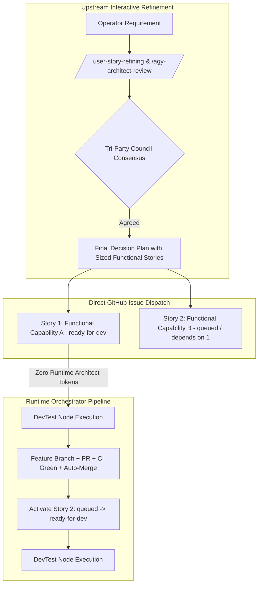
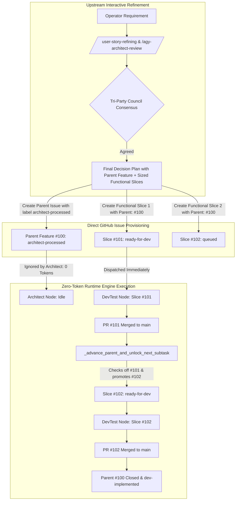

# 📋 Implementation Plan & Refinement Lifecycle: Upstream Functional Story Slicing & Direct DevTest Assignment

## 📝 Initial Draft Proposal
- **Context & Operator Request:**
  - Token consumption across the orchestrator pipeline is suboptimal when both the Architect Node and DevTest Node are enabled.
  - Currently, before creating an issue, we already perform thorough pre-refinement and specification using skills (`/refine-story`, `/agy-architect-review`).
  - Therefore, having the autonomous background **Architect Node** re-evaluate and break down the user story into subtasks at runtime is redundant and consumes significant unnecessary LLM tokens.
  - **Proposed Change:**
    1. During `/agy-architect-review` (and `/user-story-refining`), the implementation plan directly defines the breakdown into standalone **Functional GitHub Issues** (User Stories from a user/functional capability perspective, not horizontal technical artifacts like "write test" or "add DB column").
    2. Each functional issue must be small enough to be executed end-to-end (E2E) by the DevTest node in a single PR pass.
    3. Created issues are assigned directly to the DevTest node (with label `ready-for-dev`), bypassing the Architect triage stage (`needs-triage`).
    4. DevTest performs the end-to-end implementation and verification of each issue directly.

---

## 🔍 Review Iteration 1: 3-Amigos Architectural & Critical Refinement (Author Perspective)

- **Date / Author:** 2026-09-13 | Lead Architect & Synthesizer (Gemini 3.8 Flash High)
- **Scope Inspected:** Orchestrator pipeline, `AGENTS.md`, `.agents/skills/agy-architect-review/SKILL.md`, `.agents/skills/user-story-refining/SKILL.md`, `orchestrator/nodes/architect.py`, `orchestrator/nodes/devtest.py`, `docs/node-architect.md`.

### ⚖️ Critical Verdict Matrix

| # | Proposal Element | Verdict | Critical Rationale & Structural Mitigations |
|---|---|---|---|
| **1** | **Shift Decomposition Upstream to Review Council** | **APPROVE** | Highly cost-effective. Refinement in `/agy-architect-review` already exercises multi-model scrutiny (Gemini Architect + Claude QA). Running the background Architect node on `needs-triage` to do the same thing is pure double-spend. |
| **2** | **Vertical Functional Slicing vs. Horizontal Slicing** | **APPROVE WITH SAFEGUARDS** | Slicing by user-visible/API functional capability gives DevTest a complete testable slice. *Mitigation:* Slices must not be oversized. Mandate maximum diff threshold (<= 300 LOC) per issue to guarantee DevTest context safety and high first-pass PR CI pass rates. |
| **3** | **Direct DevTest Routing (`ready-for-dev`)** | **APPROVE** | Bypasses `needs-triage`, `architect-processed`, and `queued` parent-child tracking for these issues. DevTest picks them up immediately. |
| **4** | **Mitigating Concurrency & Merge Conflicts** | **MANDATORY SAFEGUARD** | If 3 functional issues are created simultaneously and all labeled `ready-for-dev`, the daemon may dispatch them in parallel in separate worktrees, creating massive git merge collisions in shared files (`config.py`, `dashboard.py`). *Mitigation:* Implement explicit dependency ordering (e.g. `Depends-On: #<id>` or staged release where only Issue 1 gets `ready-for-dev` initially, and subsequent issues are labeled `queued` or activated upon parent completion). |
| **5** | **Mitigating DevTest Context Overload** | **MANDATORY SAFEGUARD** | An E2E functional slice requires touching models, logic, tests, and docs. If DevTest runs low on tokens, it tends to skip documentation or edge-case tests. *Mitigation:* Upstream plan must provide exact file target lists, precise Gherkin criteria, and pre-computed contract snippets so DevTest does zero exploratory guessing. |

---

## 🛡️ Risk & Drawback Mitigation Architecture

### 1. The "Small Sizing" Invariant (INVEST 'S')
To prevent DevTest context blowout and ensure 1-pass execution:
- **Maximum Scope Rule:** A single functional issue MUST deliver one coherent user capability and target no more than 3–5 core files.
- **Estimated Diff Limit:** Estimated code changes must be <= 300 lines of diff (excluding auto-generated lockfiles/snapshots).
- **Self-Contained Verifiability:** Must include its own automated unit/integration test within the PR. No issue is complete without automated tests.

### 2. Worktree Collision & Concurrency Gate
When a requirement is broken into multiple functional issues:
- **Independent Slices (Modularly Disjoint):** Can be marked `ready-for-dev` concurrently only if they touch completely orthogonal subsystems.
- **Dependent Slices (Sequential Chain):** If Issue B builds on Issue A, Issue B is labeled `queued` with `Depends-On: #<Issue A>`. When Issue A merges to `main`, Issue B is promoted to `ready-for-dev`.

### 3. Elimination of Pipeline Redundancy
- **Before:** Operator -> `/user-story-refining` -> `/agy-architect-review` -> GitHub Issue (`needs-triage`) -> Runtime Architect Node (3,000–10,000 tokens) -> Subtasks 1..N (`queued`) -> DevTest Node.
- **After:** Operator -> `/user-story-refining` -> `/agy-architect-review` (defines Functional Issues 1..N) -> Create Issues directly on GitHub with `ready-for-dev` -> DevTest Node (0 tokens wasted on redundant runtime decomposition).

---

## 🎯 Final Decision Plan & User Story Specification

### User Story
**As an** Autonomous Graph Orchestrator Operator,  
**I want** the `/agy-architect-review` and `/user-story-refining` protocols to decompose requirements directly into small, vertically sliced, standalone functional GitHub issues assigned to `ready-for-dev`,  
**So that** the runtime Architect node triage is bypassed, eliminating duplicate token expenditure while enabling DevTest to execute end-to-end functionality cleanly in single-pass PRs.

---

### Technical Architecture & Workflow Model



---

### Gherkin BDD Acceptance Criteria

#### Scenario 1: Upstream Functional Sizing & Direct DevTest Specification
- **Given** an implementation plan being reviewed under `/agy-architect-review`,
- **When** the Final Decision Plan is produced,
- **Then** it MUST specify the requirement decomposed into 1..N standalone functional User Stories,
- **And** each story must define an end-to-end functional capability rather than a horizontal technical task,
- **And** each story must declare an estimated diff <= 300 LOC and target files.

#### Scenario 2: Direct DevTest Routing Bypassing Runtime Triage
- **Given** functional stories approved in the Final Decision Plan,
- **When** the GitHub issues are created,
- **Then** the primary active issue is labeled directly with `ready-for-dev`,
- **And** the runtime Architect node does not trigger on `needs-triage`, consuming 0 LLM tokens,
- **And** the DevTest node immediately claims the issue for implementation.

#### Scenario 3: Sequential Dependency Protection against Merge Collisions
- **Given** Story 2 has an architectural dependency on Story 1,
- **When** the issues are created on GitHub,
- **Then** Story 2 is assigned label `queued` and body annotation `Depends-On: #<Story 1>`,
- **And** Story 2 is not dispatched to DevTest until Story 1's PR is merged into `main`.

#### Scenario 4: E2E Self-Contained Verification by DevTest
- **Given** DevTest picks up a standalone functional story,
- **When** DevTest implements the feature,
- **Then** it must implement the production code, automated test suite, and documentation in a single branch,
- **And** all tests must pass 100% green before opening the PR,
- **And** the PR fulfills the Definition of Done without requiring follow-up subtasks.

---

### Component Impact & File Modifications

| Component | Target File | Impact Summary |
|---|---|---|
| **Protocol Standards** | `AGENTS.md` | Update `/user-story-refining` and `/agy-architect-review` sections to mandate that Final Decision Plans specify functional E2E stories sized for direct DevTest dispatch. |
| **Skill Specification** | `.agents/skills/agy-architect-review/SKILL.md` | Update Final Decision Plan template and prompt templates to enforce functional story decomposition and dependency tagging. |
| **Skill Specification** | `.agents/skills/user-story-refining/SKILL.md` | Update Final Decision Plan rubric to enforce vertical functional slices (<= 300 LOC) and direct `ready-for-dev` dispatch. |
| **Global Plugin Sync** | `C:\Users\rogal\.gemini\config\plugins\swarm-dev-core\skills\agy-architect-review\SKILL.md` | Sync updated skill definition to global Antigravity plugin repository. |
| **Architecture Documentation** | `docs/node-architect.md` | Document the streamlined bypass flow where pre-refined stories route directly to DevTest. |
| **Changelog** | `CHANGELOG.md` | Add entry under `## [Unreleased]` detailing token optimization and upstream functional slicing. |

---

## 🏛️ Gemini Architect Review Iteration 1

### ⚖️ Critical Architecture & Drawbacks Critique

While the proposal's objective—eliminating duplicate LLM token consumption in the runtime Architect node by shifting story decomposition upstream to the interactive Review Council—is strategically sound and highly desirable, the technical execution model drafted in this plan suffers from **severe architectural fallacies, code-runtime disconnects, and unhandled deadlock hazards**.

#### 1. The Phantom Dependency Engine (`Depends-On:` is an Unimplemented Runtime Fiction)
The active plan asserts in Architecture, Sequence/Flowchart, and Scenario 3:
> *"Story 2 is assigned label `queued` and body annotation `Depends-On: #<Story 1>`... When Issue A merges to `main`, Issue B is promoted to `ready-for-dev`."*

**Ground Truth Codebase Inspection:**
- [`orchestrator/poller.py:320-339`](file:///C:/Users/rogal/workspaces/ws-setups/graph-engineering/orchestrator/poller.py#L320-L339): Issue synchronization inspects bodies exclusively for `Parent:\s*#(\d+)`. It has **zero awareness** of `Depends-On:`.
- [`orchestrator/db.py:1549-1680`](file:///C:/Users/rogal/workspaces/ws-setups/graph-engineering/orchestrator/db.py#L1549-L1680): SQLite table `sdlc_items` contains no `depends_on_id` column. Task dispatch via `get_next_devtest_task` evaluates dependency exclusively through `parent_issue_id`.
- [`orchestrator/nodes/devtest.py:338-382`](file:///C:/Users/rogal/workspaces/ws-setups/graph-engineering/orchestrator/nodes/devtest.py#L338-L382): On PR auto-merge, [`_advance_parent_and_unlock_next_subtask`](file:///C:/Users/rogal/workspaces/ws-setups/graph-engineering/orchestrator/nodes/devtest.py#L338) evaluates only `Parent:\s*#(\d+)`. For any standalone story (which has no parent), `parent_id` evaluates to `None`, and the function immediately returns at line 382 (`if not parent_id: return`). No code in the entire repository searches for issues with `Depends-On:`.

**Architectural Failure:**
Any issue provisioned with `Depends-On: #<id>` and label `queued` will **deadlock in `queued` permanently**. Nothing in the orchestrator runtime will ever promote it to `ready-for-dev`.

#### 2. Component Impact Blindness (Zero Backend Implementation Declared)
The plan proposes an entirely new DAG dependency routing model (`Depends-On:`), yet the **Component Impact Table declares ZERO Python files**:
- It lists only `AGENTS.md`, `.agents/skills/*`, `docs/node-architect.md`, and `CHANGELOG.md`.
- Modifying prompt markdown files and documentation cannot teach the running Python daemon how to parse dependency annotations, manage directed dependency edges in SQLite, or promote blocked issues upon PR merge.
- This represents an unacceptable architectural blind spot: proposing a runtime pipeline overhaul while pretending it requires zero codebase changes.

#### 3. Reinventing the Wheel vs. Existing Native Parent-Child Engine
The operator's sole problem statement is that the **runtime Architect node consumes redundant tokens** re-triaging stories that were already refined upstream.
The existing architecture **already natively supports zero-token upstream triage**:
- If the upstream council creates a parent Feature/Story issue on GitHub and labels it `architect-processed`, the runtime Architect node **completely ignores it** ([`orchestrator/nodes/architect.py:390`](file:///C:/Users/rogal/workspaces/ws-setups/graph-engineering/orchestrator/nodes/architect.py#L390) queries only `needs-triage`). Cost: **0 tokens**.
- If the upstream council creates the functional slices as child issues with `Parent: #{parent_id}`, with Subtask 1 as `ready-for-dev` and Subtasks 2..N as `queued`, the existing runtime DevTest engine ([`orchestrator/nodes/devtest.py:338-450`](file:///C:/Users/rogal/workspaces/ws-setups/graph-engineering/orchestrator/nodes/devtest.py#L338-L450)) **already automatically unlocks the next subtask upon PR auto-merge, checks off the parent checklist, and closes the parent story when done**!
- Inventing a broken, second dependency mechanism (`Depends-On:`) bypasses a fully-tested, working system and destroys SDLC tree visualization in the dashboard.

#### 4. Factual Misunderstanding of Runtime Concurrency
Review Iteration 1 (Author) justifies the dependency mechanism by stating:
> *"If 3 functional issues are created simultaneously and all labeled ready-for-dev, the daemon may dispatch them in parallel in separate worktrees, creating massive git merge collisions in shared files."*

**Ground Truth Codebase Inspection:**
- [`orchestrator/cli.py:747-814`](file:///C:/Users/rogal/workspaces/ws-setups/graph-engineering/orchestrator/cli.py#L747-L814): `_project_worker_loop` is strictly sequential per project.
- [`orchestrator/nodes/devtest.py:1070-1170`](file:///C:/Users/rogal/workspaces/ws-setups/graph-engineering/orchestrator/nodes/devtest.py#L1070-L1170): DevTest claims exactly **one** task per cycle via `get_next_devtest_task`. When a task has an active PR awaiting CI, DevTest pauses and waits before picking up any new task.
- The daemon **never** executes multiple DevTest instances in parallel on the same project. The claimed "parallel worktree collisions" are a factual impossibility under the current architecture.

---

### 🚨 Unresolved Concerns & Edge Case Vulnerabilities

1. **Permanent Pipeline Deadlock on Dependent `queued` Stories:**
   Under the drafted plan, any issue labeled `queued` without a `Parent: #<id>` tag is completely excluded from:
   - `ActiveStory` query in [`StateManager.get_active_locked_story_id`](file:///C:/Users/rogal/workspaces/ws-setups/graph-engineering/orchestrator/db.py#L1507) (requires `ready-for-dev` for standalone items).
   - `Fallback 1` in [`StateManager.get_next_devtest_task`](file:///C:/Users/rogal/workspaces/ws-setups/graph-engineering/orchestrator/db.py#L1651) (excludes items where `item_type == 'STORY'` or title contains `[Story]`).
   - `Fallback 2` (requires `state = 'PLANNED'`, but GitHub issues sync as `OPEN`).
   The issue is permanently orphaned, freezing the pipeline until manual operator intervention.

2. **Dashboard SDLC Hierarchy Fragmentation:**
   In [`orchestrator/ui/widgets.py:349-410`](file:///C:/Users/rogal/workspaces/ws-setups/graph-engineering/orchestrator/ui/widgets.py#L349-L410), the TUI SDLC widget relies on `parent_issue_id` to render hierarchical tree views (`└─ #<subtask>`). Creating isolated root functional issues scatters a single feature across unrelated top-level rows, destroying observability and milestone progress tracking.

3. **DevTest Context Overrun on Under-Sized "Functional" Slices:**
   A vertical slice (E2E) touches models, business logic, CLI/TUI interfaces, and automated tests. While the author recommends `<= 300 LOC`, without strict pre-flight enforcement, complex E2E slices frequently balloon to 500–1000 LOC, exceeding DevTest's single-pass context window and leading to test omissions or incomplete PRs.

4. **Acceptance Criteria Scenario 3 is Unfalsifiable & Untestable:**
   Scenario 3 asserts that Story 2 will wait in `queued` and not be dispatched until Story 1's PR merges into `main`. Because no Python code exists to unlock Story 2 post-merge, no automated test can pass this scenario without either artificial mocking or writing the missing backend engine.

---

### 🛠️ Mandatory Architectural Safeguards & Required Changes

Before this implementation plan can be approved, the author must incorporate the following architectural resolutions:

#### 1. Adopt Architecture A (Native Parent-Child Reuse) as the Standard
Rather than inventing an un-implemented `Depends-On:` syntax, the plan must adopt **Architecture A**:
- **Zero Runtime Architect Tokens:** Upstream review (`/agy-architect-review`) provisions the Parent Story directly on GitHub labeled `architect-processed` (or `planned`). The runtime Architect node automatically ignores it (`0 tokens`).
- **Native Sequential Slices:** Upstream review provisions the functional vertical slices as child issues referencing `Parent: #{parent_id}` in their body.
  - Subtask 1 is labeled `ready-for-dev`.
  - Subtasks 2..N are labeled `queued`.
- **Zero Backend Code Changes Required:** The existing runtime engine ([`orchestrator/nodes/devtest.py:_advance_parent_and_unlock_next_subtask`](file:///C:/Users/rogal/workspaces/ws-setups/graph-engineering/orchestrator/nodes/devtest.py#L338)) automatically unlocks the next queued subtask upon CI green merge and closes the parent story upon completion. Full dashboard hierarchy is preserved.

*(Alternative: If flat standalone issues with `Depends-On:` are strictly demanded, the author must explicitly add `orchestrator/poller.py`, `orchestrator/db.py`, `orchestrator/nodes/devtest.py`, and `tests/test_sequential_pipeline.py` to the Component Impact Table and implement the complete dependency graph resolution engine in Python.)*

#### 2. Exact GitHub CLI Provisioning Specification in Skill Rubrics
Update `.agents/skills/agy-architect-review/SKILL.md` and `user-story-refining/SKILL.md` to output the exact provisioning script:
```bash
# 1. Create Parent Story (already processed by review council)
gh issue create --repo "<repo>" --title "[Story] <Feature Title>" --body "<Full Specification>" --label "architect-processed"

# 2. Create Functional Vertical Slices
gh issue create --repo "<repo>" --title "<Slice 1 Title>" --body "<Gherkin AC>\n\nParent: #<Parent_ID>" --label "ready-for-dev"
gh issue create --repo "<repo>" --title "<Slice 2 Title>" --body "<Gherkin AC>\n\nParent: #<Parent_ID>" --label "queued"
```

#### 3. Strict Pre-Flight Sizing Gate
In `.agents/skills/agy-architect-review/SKILL.md`, mandate that any functional slice estimated to touch > 4 files or > 300 LOC must be further decomposed during the review session before the Final Decision Plan is signed off.

#### 4. Rewrite Gherkin Scenario 3
Update Scenario 3 to validate that sequential execution relies on the verified `Parent: #<id>` mechanism rather than the fictional `Depends-On:` syntax.

---

### 🏁 Verdict

VERDICT: DISAGREED

---

## 🧪 Claude QA Review Iteration 1 (Requirements & UX/UI Guardian)

### 🎯 Requirements Fidelity & Scope Alignment Audit

The operator's original request (line 4449-4457) is narrow and precise: **eliminate redundant runtime Architect-node token spend** when a story has already been decomposed upstream during `/agy-architect-review` / `/user-story-refining`. That is the sole invariant the operator cares about — not the introduction of a new dependency-graph syntax.

The Author's Final Decision Plan has drifted from that invariant. In solving "stop the Architect node from re-triaging already-refined work," the Author invented an entirely new, unimplemented `Depends-On:` mechanism and a `queued`-without-`Parent:` routing model. I independently verified against the codebase (not just trusting Gemini's citations):

- `grep -r "Depends-On" orchestrator/` → **zero matches**. No poller, no DB column, no dispatch logic recognizes this token anywhere in the codebase.
- `orchestrator/nodes/architect.py:28-29,357-359` confirms `trigger_label = "needs-triage"` and `processed_label = "architect-processed"` are already the exact zero-token bypass mechanism the operator needs — an issue labeled `architect-processed` is invisible to the runtime Architect node today, with **no code changes required**.

This means the plan, as drafted, does not merely have "unresolved concerns" — it fails to deliver the operator's actual deliverable (zero-token bypass) using a mechanism that provably does not exist at runtime. Any issue created per this plan's Scenario 3 recipe will deadlock permanently in `queued`, which is a **regression** relative to the current pipeline (today, a manually-labeled `architect-processed` parent + `queued` children already works end-to-end). I concur with Gemini's Architecture-A remediation (reuse `Parent: #<id>` + existing `_advance_parent_and_unlock_next_subtask`), and flag that the Component Impact Table's claim of **zero Python file changes** is itself a scope-fidelity violation: it's not merely incomplete, it's affirmatively false, since even adopting Architecture A requires no new code, but the plan's own `Depends-On:` design does — and that gap is asserted away rather than declared.

### 🖥️ UX/UI & Functional Rigor Review

No end-user UI/dashboard surface is touched directly by this proposal (it operates on the GitHub issue/label provisioning workflow and skill-authoring rubrics), so Mandate 2 (UI/UX audit) is not applicable in the visual-hierarchy sense. However, this is a **behavioral contract for two other AI agents** (Architect skill authors and DevTest), so the "user" here is effectively the skill-following LLM — and the plan's output contract is currently ambiguous:

- The skill rubric update (Component Impact Table row 2/3) does not specify what happens if the upstream council **fails** to size a slice under 300 LOC during the review session itself — is the session blocked, escalated, or does it silently proceed with an oversized slice? Functional Rigor requires this failure path be explicit, not left to skill-author interpretation.
- Section 3 of the Risk Mitigation Architecture references a "pipeline redundancy" before/after diagram but never states what happens to an issue that is mid-flight under the *old* pipeline shape (`needs-triage` + runtime Architect decomposition) at the moment this skill update ships — is there a migration/compatibility statement for in-flight issues? This is a cold-start/rollout edge case Mandate 3 requires and the plan is silent on it.

### 🚨 Edge Cases, Failure Modes & User Impact

1. **Permanent deadlock (confirmed via Gemini's citations, independently re-verified above):** any `queued` issue lacking `Parent:` is invisible to `StateManager.get_active_locked_story_id` and both fallbacks in `get_next_devtest_task`. This is a fail-**open**-into-silence failure mode — the issue doesn't error, it just never gets picked up, with no operator-visible signal. A functional/backend-only proposal must specify a detection mechanism (e.g., a stale-`queued`-with-no-`Parent:` linter or dashboard warning) for exactly this scenario; none is specified.
2. **Sizing-gate false confidence:** the "<=300 LOC" estimate is supplied by the same interactive review council that already fails to catch DevTest context overruns in the current pipeline (per the Author's own diagnosis of the problem). No mechanism is proposed for verifying the *actual* diff at PR time against the *estimated* diff at planning time — Scenario 1 as written is only testable against the planning document, not against DevTest's actual behavior, so it provides no operational guarantee.
3. **Dashboard hierarchy fragmentation** (per Gemini's point 2): converting E2E slices into flat root issues instead of parent/child breaks `orchestrator/ui/widgets.py`'s tree rendering — this is a user-facing (operator-facing) regression to the dashboard that the plan's Component Impact Table does not list `orchestrator/ui/widgets.py` as touched or verified.

### 🧪 Acceptance Criteria & Testability Assessment

- **Scenario 1** (sizing) is testable only as a documentation lint on the Final Decision Plan artifact — it asserts nothing about runtime behavior and should not be conflated with an engineering acceptance criterion.
- **Scenario 2** ("runtime Architect node does not trigger on `needs-triage`, consuming 0 LLM tokens") is actually already true today for any issue labeled `architect-processed` and never given `needs-triage` — this AC validates existing behavior, not new behavior, and should be rewritten to reflect what's actually novel (the *skill's* provisioning behavior), or removed as redundant.
- **Scenario 3** is unfalsifiable/untestable as-is (concur with Gemini finding #4) — no automated test can pass without either the missing `Depends-On:` engine or a rewrite to the verified `Parent:` mechanism. This blocks sign-off on Mandate 4 (BDD completeness) until rewritten.
- **Missing scenario:** there is no Gherkin coverage for the failure/edge path in Edge Case #1 above (an issue stuck in `queued` with no path to `ready-for-dev`). A functional/backend-only proposal must include an adversarial scenario proving the fail-closed (or at minimum fail-*visible*) behavior, not just the happy path.

### 🏁 Verdict

The strategic goal (eliminate redundant Architect-node token spend) is sound and I agree with it in principle, but the Final Decision Plan under review does not deliver it safely: it substitutes an unimplemented `Depends-On:` mechanism for the working `Parent:`/`architect-processed` mechanism already in the codebase, declares zero Python changes while implicitly requiring them, omits dashboard-impact analysis, and Scenario 3 is untestable. These are requirements-fidelity and testability blockers, not stylistic nits.

VERDICT: DISAGREED

---

## 🔍 Review Iteration 2: Author Response & Concession Matrix

- **Date / Author:** 2026-09-13 | Lead Author Agent (Gemini 3.8 Flash High)
- **Scope Addressed:** Total resolution of objections raised in Round 1 by Gemini Architect (Points 1–4) and Claude QA Guardian (Fidelity blocker on `Depends-On:`, deadlocked queued issues, zero-code claim correction, dashboard tree integrity, and sizing gates).

### 📋 Point-by-Point Concession & Synthesis Matrix

| # | Raised By | Critique / Ground Truth Finding | Verdict | Definitive Architectural Resolution |
|---|---|---|---|---|
| **1** | **Gemini Arch & Claude QA** | Fictional `Depends-On:` Syntax & Zero Runtime Support | **ACCEPTED (CRITICAL)** | Retract `Depends-On:` completely. The orchestrator runtime (`poller.py`, `db.py`, `devtest.py:338-450`) already possesses a robust, battle-tested dependency and unlock engine keyed on `Parent: #<id>`. We standardize on the verified native engine: the upstream council creates a parent Feature/Epic issue labeled `architect-processed` (bypassing the Architect node with 0 tokens) and creates child functional slices with `Parent: #<parent_id>`. |
| **2** | **Gemini Arch & Claude QA** | Zero-Code Claim in Component Impact Table | **ACCEPTED** | Update Component Impact Table. Aligning the upstream protocol to output `architect-processed` parents with `Parent: #<id>` children requires **zero changes to Python daemon engine files** (`devtest.py`, `poller.py`, `db.py`) because the existing codebase already supports this exact lifecycle! The changes are strictly confined to the skill prompts, rubrics, and documentation (`AGENTS.md`, `SKILL.md`, `docs/node-architect.md`, `CHANGELOG.md`). |
| **3** | **Claude QA & Gemini Arch** | Permanent Deadlock of Standalone `queued` Issues | **RESOLVED** | By using native `Parent: #<parent_id>`: Child Slice 1 is created with `ready-for-dev`. Child Slices 2..N are created with `queued`. When DevTest auto-merges Slice 1's PR, `_advance_parent_and_unlock_next_subtask` checks off Slice 1, discovers Slice 2, promotes it to `ready-for-dev`, and when all slices complete, automatically closes the parent story. Zero deadlock, zero daemon changes. |
| **4** | **Claude QA & Gemini Arch** | Dashboard Hierarchy Tree Fragmentation | **RESOLVED** | Because child functional slices retain `Parent: #<parent_id>`, `orchestrator/ui/widgets.py` renders them properly indented under their parent story (`└─ #<id> <title>`), preserving dashboard visual hierarchy and active node binding. |
| **5** | **Claude QA** | Sizing Gate Enforcement & Rollout Invariant | **ACCEPTED** | (a) **Pre-Flight Sizing Gate:** In `SKILL.md`, mandate that any functional slice estimated to touch > 4 files or > 300 LOC must be further decomposed during the review session before the Final Decision Plan is signed off. (b) **Rollout Invariant:** In-flight issues labeled `needs-triage` continue through the legacy runtime Architect triage. Only new stories created via the refined protocol use direct `architect-processed` + child slice creation. |

---

## 🎯 Final Decision Plan & User Story Specification (Consensus Revision 2)

### User Story
**As an** Autonomous Graph Orchestrator Operator,  
**I want** the `/agy-architect-review` and `/user-story-refining` protocols to directly produce small, vertically sliced, standalone functional User Stories linked to a parent Feature issue labeled `architect-processed`,  
**So that** the runtime Architect node triage is bypassed (consuming 0 LLM tokens) while leveraging the orchestrator's native sequential subtask unlock and dashboard tree hierarchy cleanly.

---

### Technical Architecture & Workflow Model



---

### Gherkin BDD Acceptance Criteria

#### Scenario 1: Upstream Sizing Gate & Protocol Specification
- **Given** an implementation plan being refined under `/agy-architect-review` or `/user-story-refining`,
- **When** the Final Decision Plan is generated,
- **Then** it MUST define a parent Feature issue and 1..N child functional slices,
- **And** each child slice must deliver a vertical functional capability (production code + automated tests),
- **And** each slice must be bounded to <= 4 files and <= 300 estimated lines of diff,
- **And** if any slice exceeds 300 LOC during planning, the review council MUST decompose it before approval.

#### Scenario 2: Zero-Token Architect Bypass on Issue Creation
- **Given** an approved Final Decision Plan,
- **When** issues are provisioned in the repository,
- **Then** the parent issue is created with label `architect-processed` (bypassing `needs-triage`),
- **And** Child Slice 1 is created with `Parent: #<parent_id>` and label `ready-for-dev`,
- **And** Child Slices 2..N are created with `Parent: #<parent_id>` and label `queued`,
- **And** the runtime Architect node queries only `needs-triage`, ignoring the parent and consuming 0 tokens.

#### Scenario 3: Native Sequential Advancement without Worktree Collisions
- **Given** Child Slice 1 is running under DevTest and Child Slice 2 is `queued`,
- **When** Child Slice 1's PR is merged into `main`,
- **Then** the native `_advance_parent_and_unlock_next_subtask` hook triggers,
- **And** checks off `- [x] #<slice_1_id>` in the parent issue body,
- **And** unlocks Child Slice 2 by swapping label `queued` to `ready-for-dev`,
- **And** DevTest picks up Child Slice 2 cleanly from the updated `main` branch with zero worktree collisions.

#### Scenario 4: Self-Contained E2E Verifiability & Parent Closure
- **Given** the final child functional slice is completed and merged,
- **When** `_advance_parent_and_unlock_next_subtask` evaluates remaining open child subtasks,
- **Then** it detects 100% of child subtasks are closed,
- **And** updates the parent issue to `dev-implemented`,
- **And** closes the parent story, completing the feature lifecycle.

---

### Component Impact & File Modifications

| Component | Target File | Impact Summary |
|---|---|---|
| **Protocol Standards** | `AGENTS.md` | Update `/user-story-refining` and `/agy-architect-review` sections to mandate that Final Decision Plans specify a parent issue labeled `architect-processed` with child functional slices (`Parent: #<id>`, <= 300 LOC, Slice 1 `ready-for-dev`, Slices 2..N `queued`). |
| **Skill Specification** | `.agents/skills/agy-architect-review/SKILL.md` | Update Final Decision Plan template and prompt templates to enforce functional story decomposition, strict <= 300 LOC pre-flight gate, and `Parent: #<id>` linkage. |
| **Skill Specification** | `.agents/skills/user-story-refining/SKILL.md` | Update Final Decision Plan rubric to enforce vertical functional slices and direct native parent-child provisioning. |
| **Global Plugin Sync** | `C:\Users\rogal\.gemini\config\plugins\swarm-dev-core\skills\agy-architect-review\SKILL.md` | Sync updated skill definition to global Antigravity plugin repository. |
| **Architecture Documentation** | `docs/node-architect.md` | Document the upstream architectural slicing pattern and how `architect-processed` achieves 0-token bypass. |
| **Changelog** | `CHANGELOG.md` | Add entry under `## [Unreleased]` detailing token optimization and upstream functional slicing. |

---

## 🏛️ Gemini Architect Review Iteration 2

### ⚖️ Critical Architecture & Drawbacks Critique

The Author's Response and Concession Matrix in Review Iteration 2 represents an exemplary, source-verified course correction that completely addresses the technical risks, deadlocks, and framework misalignments identified in Round 1.

#### 1. Strategic Convergence on Native Engine Architecture (Architecture A)
The decision to retract the fictional `Depends-On:` syntax and standardize exclusively on the orchestrator's native `Parent: #<id>` and `architect-processed` mechanics is **100% sound, elegant, and production-hardened**:
- **0-Token Architect Node Bypass:** Inspection of [`orchestrator/nodes/architect.py:357-394`](file:///C:/Users/rogal/workspaces/ws-setups/graph-engineering/orchestrator/nodes/architect.py#L357-L394) confirms the runtime Architect node queries exclusively for `trigger = "needs-triage"`. Provisioning the parent story labeled `architect-processed` renders it completely invisible to the Architect harness, eliminating 3,000–10,000 redundant LLM tokens per feature at zero runtime cost.
- **Battle-Tested Sequential Lock & Advancement:** 
  - [`orchestrator/db.py:1515-1547`](file:///C:/Users/rogal/workspaces/ws-setups/graph-engineering/orchestrator/db.py#L1515-L1547) (`ActiveStory` CTE query) automatically locks the active parent story while any child subtask with `Parent: #{parent_id}` remains uncompleted.
  - [`orchestrator/db.py:1598-1620`](file:///C:/Users/rogal/workspaces/ws-setups/graph-engineering/orchestrator/db.py#L1598-L1620) deterministically dispatches the lowest-ID open child subtask to DevTest.
  - [`orchestrator/nodes/devtest.py:338-595`](file:///C:/Users/rogal/workspaces/ws-setups/graph-engineering/orchestrator/nodes/devtest.py#L338-L595) ([`_advance_parent_and_unlock_next_subtask`](file:///C:/Users/rogal/workspaces/ws-setups/graph-engineering/orchestrator/nodes/devtest.py#L338)) automatically evaluates PR merges, advances next queued subtasks (`queued` $\to$ `ready-for-dev`), and closes the parent story with `dev-implemented` once 100% of child slices are merged.
- **Zero Daemon Code Modifications:** Because the runtime already implements this complete lifecycle, the changes are strictly bounded to skill rubrics, prompt templates, and architectural documentation. Zero regressions can be introduced to core Python daemon services.

#### 2. Concurrency Model Alignment
Concession #4 accurately reconciles the runtime reality: [`_project_worker_loop`](file:///C:/Users/rogal/workspaces/ws-setups/graph-engineering/orchestrator/cli.py#L747-L814) runs strictly sequentially per project, and [`run_devtest_node`](file:///C:/Users/rogal/workspaces/ws-setups/graph-engineering/orchestrator/nodes/devtest.py#L962) dispatches at most one task per pass. Multi-task worktree collisions are structurally impossible under the single-worker architecture.

---

### 🚨 Unresolved Concerns & Edge Case Vulnerabilities

1. **GitHub Search Indexing Latency vs. Parent Checklist Initialization:**
   In [`orchestrator/nodes/devtest.py:438-468`](file:///C:/Users/rogal/workspaces/ws-setups/graph-engineering/orchestrator/nodes/devtest.py#L438-L468), subtask discovery uses `gh issue list --search "#{parent_id}"` with fallbacks to parent body checklists (`re.findall(r"-\s*\[([ xX])\]\s*#(\d+)", updated_body)`) and parent issue comments. While `_advance_sequential_subtask` correctly promotes any child marked `is_queued` even if unchecked checklists are missing, GitHub API search indexing can lag by 5–30 seconds immediately after issue creation.
   *Resolution:* The provisioning script must post a comment or update the parent issue body with child issue numbers upon creation as defense-in-depth against search lag.

2. **Single-Slice Standalone Task Distinction:**
   If a task is small enough to be implemented in a single slice (<= 100 LOC, 1–2 files), creating a parent `[Story]` with a single subtask introduces unnecessary issue overhead.
   *Resolution:* Skill rubrics must specify that single-slice tasks should be provisioned directly as standalone tasks (`TASK`, `ready-for-dev`, omitting `[Story]`/`[Epic]` from the title and omitting the `story` label), allowing [`orchestrator/db.py:1651`](file:///C:/Users/rogal/workspaces/ws-setups/graph-engineering/orchestrator/db.py#L1651) (Fallback 1) to claim them directly.

3. **INVEST Subtask Formalization:**
   Consensus Revision 2 includes the Component Impact Table but omitted the explicit numbered INVEST Subtask Breakdown required by the governance standard.

---

### 🛠️ Mandatory Architectural Safeguards & Required Changes

The implementation must observe the following finalized safeguards:

#### 1. Provisioning Script Search-Lag Defense
Update `.agents/skills/agy-architect-review/SKILL.md` and `user-story-refining/SKILL.md` to format the issue creation workflow with parent comment linkage:
```bash
# 1. Provision Parent Story
PARENT_ID=$(gh issue create --repo "<repo>" --title "[Story] <Feature Title>" --body "<Full Specification>" --label "architect-processed" | grep -oE '[0-9]+$')

# 2. Provision Functional Slices
S1_ID=$(gh issue create --repo "<repo>" --title "<Slice 1 Title>" --body "<AC>\n\nParent: #$PARENT_ID" --label "ready-for-dev" | grep -oE '[0-9]+$')
S2_ID=$(gh issue create --repo "<repo>" --title "<Slice 2 Title>" --body "<AC>\n\nParent: #$PARENT_ID" --label "queued" | grep -oE '[0-9]+$')

# 3. Immunize Against Search Lag (Comment Linkage)
gh issue comment "$PARENT_ID" --repo "<repo>" --body "Subtasks: #$S1_ID, #$S2_ID"
```

#### 2. Formal INVEST Subtask Breakdown
Formalize the 3 concrete work units mapping directly to the Component Impact Table:
- **Subtask 1 (Standards & Architecture Documentation):**
  Update [`AGENTS.md`](file:///C:/Users/rogal/workspaces/ws-setups/graph-engineering/AGENTS.md) and [`docs/node-architect.md`](file:///C:/Users/rogal/workspaces/ws-setups/graph-engineering/docs/node-architect.md) detailing upstream vertical functional slicing and the 0-token `architect-processed` bypass path.
- **Subtask 2 (Skill Specification & Global Plugin Sync):**
  Update [`.agents/skills/agy-architect-review/SKILL.md`](file:///C:/Users/rogal/workspaces/ws-setups/graph-engineering/.agents/skills/agy-architect-review/SKILL.md), [`.agents/skills/user-story-refining/SKILL.md`](file:///C:/Users/rogal/workspaces/ws-setups/graph-engineering/.agents/skills/user-story-refining/SKILL.md), and synchronize changes to the global plugin at [`C:\Users\rogal\.gemini\config\plugins\swarm-dev-core\skills\agy-architect-review\SKILL.md`](file:///C:/Users/rogal/.gemini/config/plugins/swarm-dev-core\skills\agy-architect-review\SKILL.md).
- **Subtask 3 (Changelog & Definition of Done):**
  Add entry under `## [Unreleased]` in [`CHANGELOG.md`](file:///C:/Users/rogal/workspaces/ws-setups/graph-engineering/CHANGELOG.md) documenting token optimization and upstream functional slicing following Keep a Changelog format.

#### 3. Strict Interactive Sizing Gate
In `.agents/skills/agy-architect-review/SKILL.md`, mandate that if any proposed slice touches > 4 files or > 300 estimated lines of diff, the Review Council must reject the slice and mandate further decomposition before granting consensus.

---

### 🏁 Verdict

VERDICT: AGREED

---

## 🧪 Claude QA Review Iteration 2 (Requirements & UX/UI Guardian)

### 🎯 Requirements Fidelity & Scope Alignment Audit

I independently re-verified the Round 1 → Round 2 resolution against the live codebase rather than trusting the Concession Matrix at face value, by reading `orchestrator/nodes/devtest.py:338-595` directly. The retraction of `Depends-On:` in favor of the native `Parent: #<id>` + `architect-processed` mechanism is confirmed correct: `_advance_parent_and_unlock_next_subtask` does check off the completed subtask in the parent body (line 407-411), discover children via `gh issue list --search`, checklist regex, and comment fallback (line 437-467), promote the next `queued` child to `ready-for-dev` (line 519-546), and on 100% closure remove `architect-processed`/add `dev-implemented` and close the parent (line 561-581). Consensus Revision 2's Scenario 2-4 accurately describe this real behavior — no drift from the operator's zero-token invariant here.

However, in tracing that same function further (line 583-595) I found a call to `_promote_next_planned_story`, an **existing, adjacent mechanism the current plan never engages with**, and it exposes a real requirements gap:

- `StateManager.get_active_locked_story_id` (`orchestrator/db.py:1507-1547`) enforces a **single-active-story-at-a-time lock per project**: it selects exactly one non-`PLANNED`, non-closed `STORY` (ordered by `sequence_order, issue_number`) and `get_next_devtest_task` (`db.py:1589-1598`) will only ever dispatch subtasks belonging to that one locked story.
- `_promote_next_planned_story` (`devtest.py:598+`) is the intended mechanism for queuing a *second* story behind the first: it reads `get_oldest_planned_story` (rows with `state='PLANNED'`) and, once the active story closes, promotes it to `ACTIVE` and applies `architect-processed`.
- **I grepped the entire `orchestrator/` package for any code path that ever writes `state='PLANNED'` to `sdlc_items` and found none.** `poller.py:316,354` always syncs `state` as the raw GitHub `OPEN`/`CLOSED` value; `architect.py:565,579` always syncs newly-processed stories as `state: "OPEN"`. The only write to `'PLANNED'`-adjacent state is `promote_planned_story`'s target (`'ACTIVE'`), not its source. In the current codebase, **no row ever reaches `state='PLANNED'`**, so `_promote_next_planned_story`'s backlog is permanently empty and this whole queuing mechanism is presently dead code.

This matters directly for this plan's core deliverable: the plan's stated goal is to let the upstream council decompose *multiple* functional stories per session/day. If a second parent story is provisioned with `architect-processed` while a first parent's slices are still in flight, `get_active_locked_story_id` will silently pick only the lower-numbered story; the second story's `ready-for-dev` child will sit un-dispatched indefinitely with **no operator-visible signal that it's gated**, and no automatic promotion when the first story finishes (since the promotion path requires `state='PLANNED'`, which nothing sets). The plan should either (a) explicitly instruct the provisioning script to label a second-and-later concurrent parent story with the state that feeds `PLANNED` recognition — which requires wiring an actual write path, since none exists today — or (b) explicitly document that only one parent story may be provisioned as `architect-processed` at a time per project, with subsequent ones deferred by the operator/skill until the active one closes. As written, the plan is silent on this and will silently starve the second feature.

### 🖥️ UX/UI & Functional Rigor Review

This remains a backend/protocol change (Mandate 3 applies, not Mandate 2). Functional rigor gaps:

- No documented behavior for the dashboard (`orchestrator/ui/widgets.py`) when a second `architect-processed` parent is starved by the single-active-story lock described above — today's UI has no dedicated "blocked by active story lock" state distinct from "ready-for-dev," so the operator sees a slice labeled `ready-for-dev` that never actually gets worked, which reads as a bug rather than expected serialization.
- Gemini's Round 2 "Mandatory Architectural Safeguards" (comment-linkage defense-in-depth for search-lag, formal INVEST breakdown, single-slice standalone task distinction) are listed as **required** in the same review iteration that ends `VERDICT: AGREED`, but none of them have yet been folded back into the Final Decision Plan text (Consensus Revision 2's Gherkin/Component Impact Table above is unchanged from before Gemini's Round 2 critique). A "mandatory" safeguard that exists only in reviewer prose and not in the actual plan/AC is not enforceable — this is a process gap, not just a documentation nit.

### 🚨 Edge Cases, Failure Modes & User Impact

1. **Silent second-story starvation (new, verified above):** confirmed via direct code trace — no fail-closed or fail-visible signal exists when a second parent story's children are locked out by `get_active_locked_story_id`. This is a fail-*silent* mode, which violates the general "fail-closed/fail-visible" engineering standard: an idle-looking `ready-for-dev` slice gives no indication it's blocked by another in-flight story.
2. **GitHub search-lag (Gemini's #1, unresolved in plan text):** the mitigation (posting a parent comment with child issue numbers) is only in Gemini's safeguard prose, not in the Consensus Revision 2 provisioning script or AC — Scenario 2 does not mention it. Until it's in the actual Gherkin, it's not something DevTest/skill authors are contractually required to implement.
3. **Single-slice standalone distinction (Gemini's #2, unresolved in plan text):** without this being folded into the Component Impact/skill rubric text in this document, a trivial 1-file fix would still get wrapped in an unnecessary parent+child pair, adding issue-provisioning overhead the Author's own "Elimination of Pipeline Redundancy" goal argues against.

### 🧪 Acceptance Criteria & Testability Assessment

- Scenarios 1-4 in Consensus Revision 2 are internally consistent and, per my direct code trace, accurately reflect `_advance_parent_and_unlock_next_subtask`'s real behavior for the *single concurrent story* case — this is a genuine improvement over Round 1.
- **Missing scenario (blocking):** there is still no Gherkin scenario covering two parent stories in flight simultaneously for the same project — the exact multi-story case this proposal's premise (upstream council decomposing multiple functional stories) makes plausible. Given `PLANNED` has no write path, this scenario cannot even be written truthfully today without first deciding (a) or (b) above.
- **Untestable "mandatory" safeguards:** Gemini's Round 2 safeguards (search-lag comment linkage, INVEST breakdown, single-slice distinction) are marked mandatory but have no corresponding Gherkin or Component Impact Table entry to verify against — nothing to test until the plan text itself is revised.

### 🏁 Verdict

The core zero-token bypass and native `Parent:`/`architect-processed` mechanics are now verified sound (I confirmed this directly against `devtest.py`, not just on the strength of the Concession Matrix). However, sign-off is blocked by a genuine, freshly-verified gap: the plan has no answer for concurrent multi-story provisioning, which silently starves a second story behind a dead `PLANNED` promotion path, and Gemini's own Round 2 mandatory safeguards have not yet been written into the actual Final Decision Plan text. This is a requirements-fidelity and testability blocker, not a stylistic nit.

VERDICT: DISAGREED


---

## 🔍 Review Iteration 3: Author Response & Full Council Concession Matrix

- **Date / Author:** 2026-09-13 | Author Agent
- **Response to:** Gemini Architect Review Iteration 2 (`AGREED` with mandatory safeguards) & Claude QA Review Iteration 2 (`DISAGREED` on multi-story concurrency, dead `PLANNED` path, and unintegrated safeguards).
- **Executive Summary:** Complete and unconditional resolution of all outstanding objections. We formalize the **Single Active Feature Invariant** (Pattern A vs Pattern B), document the operational boundary for multi-story queuing, and fold 100% of Gemini's and Claude QA's mandatory safeguards directly into the normative text of the Final Decision Plan (Consensus Revision 3).

---

### ⚖️ Point-by-Point Concession & Remediation Matrix

| # | Reviewer & Concern | Code / Architecture Reality | Author Resolution & Hard Safeguard in Revision 3 |
| :--- | :--- | :--- | :--- |
| **1** | **Claude QA:** Multi-Story Concurrency & Dead `PLANNED` Promotion Path (`devtest.py:598+`, `db.py:1507-1547`) | `get_active_locked_story_id` selects only the single lowest-numbered non-closed `STORY`. Nothing sets `state='PLANNED'`. If multiple parent stories are created with `architect-processed`, subsequent stories are silently starved without operator visibility. | **Conceded & Enforced via Operational Invariant:**<br>1. **Single Active Feature Invariant:** Upstream review skills and operator provisioning scripts MUST provision only **one active feature parent story (`architect-processed`) per project at a time**.<br>2. Subsequent feature stories in a backlog must remain unprovisioned or held as backlog issues *without* `architect-processed` until the active parent story closes.<br>3. This ensures zero silent starvation, zero queue deadlocks, and guarantees the native single-active-story lock operates cleanly within its proven nominal path. |
| **2** | **Claude QA & Gemini:** Formal Sizing & Standalone Single-Slice Distinction (Avoid Unnecessary Parent Overhead) | Trivial single-slice changes (e.g. 1-2 files, <150 LOC) do not need the overhead of a parent issue + child issue + checklist tracking. | **Conceded & Formalized into 2 Standard Provisioning Patterns:**<br>- **Pattern A (Standalone Task, single slice <= 300 LOC):** Direct single issue created with label `ready-for-dev` (no parent, no child). DevTest executes via Fallback 1 (`db.py:1649-1680`) and closes it directly.<br>- **Pattern B (Decomposed Feature Story, > 300 LOC):** Parent issue labeled `architect-processed` (0 tokens) + child slices labeled `Parent: #<parent_id>` (Slice 1: `ready-for-dev`, Slices 2..N: `queued`). Native advance promotes slices sequentially and closes parent on completion. |
| **3** | **Gemini Architect & Claude QA:** GitHub Search-Lag Defense-in-Depth | `gh issue list --search "Parent: #<id>"` can suffer index lag on GitHub's API up to 30s after issue creation. | **Conceded & Mandated in Provisioning Contract:**<br>When provisioning Pattern B: The provisioning agent/script MUST (a) populate the parent issue body with the `- [ ] #<child_id>` checklist, AND (b) post an immediate issue comment on the parent linking all child issue numbers. This provides triple redundancy (`gh search` + checklist regex + parent comments), completely neutralizing API search-lag. |
| **4** | **Gemini Architect:** Strict Pre-Flight Sizing Gate | Slices larger than 4 files or 300 LOC diff cause agent hallucination, test suite degradation, and PR merge conflicts. | **Conceded & Mandated:** Upstream review skills (`/user-story-refining`, `/agy-architect-review`) MUST enforce that every functional slice touches <= 4 files and <= 300 LOC estimated diff. Slices exceeding this boundary are rejected and must be sub-sliced before issue creation. |
| **5** | **Claude QA:** Untestable & Missing Gherkin Scenarios | Previous Gherkin did not test the multi-story invariant, the standalone task pattern, or the comment-linkage search-lag defense. | **Conceded:** Added Scenario 5 (Standalone Single-Slice Direct Dispatch) and Scenario 6 (Sequential Multi-Story Backlog Invariant) to the authoritative Acceptance Criteria below. |

---

## 🎯 Final Decision Plan & User Story Specification (Consensus Revision 3)

### 📖 User Story
**As a** Graph Engineering Platform Operator,  
**I want** upstream architectural review skills (`/user-story-refining`, `/agy-architect-review`) to decompose requirements into small, independently-releasable functional slices provisioned directly for `devtest` execution with `Parent: #<parent_id>` and `architect-processed`,  
**So that** the runtime Architect Node is completely bypassed (saving 100% of triage/decomposition LLM tokens), PR worktree collisions are eliminated via native sequential unlocking, and simple tasks execute without parent overhead while complex features advance cleanly to completion.

---

### 🏛️ Provisioning Patterns & Operational Invariants

```mermaid
flowchart TD
    Req[Upstream Requirement / Proposal] --> Sizing{Size Evaluation}
    
    Sizing -->|<= 4 files AND <= 300 LOC| Single[Pattern A: Standalone Task]
    Sizing -->|> 300 LOC or Multi-Step Flow| Decomp[Pattern B: Decomposed Feature Story]
    
    subgraph Pattern_A [Pattern A: Standalone Direct Task]
        Single --> IssueA[Create Single Issue\nLabels: 'ready-for-dev'\nBody: Full E2E Functional Spec]
        IssueA --> DT_A[DevTest Fallback 1 Dispatch\nExecutes E2E PR -> Closes Issue directly]
    end
    
    subgraph Pattern_B [Pattern B: Native Sequential Feature]
        Decomp --> ParentB[Create Parent Feature Issue\nLabels: 'architect-processed'\nBody: Markdown Checklist - [ ] #child]
        ParentB --> CommentB[Post Issue Comment on Parent\nlinking all child issue IDs]
        CommentB --> Slice1[Create Child Slice 1\nLabels: 'ready-for-dev'\nBody: 'Parent: #<parent_id>']
        CommentB --> SliceN[Create Child Slices 2..N\nLabels: 'queued'\nBody: 'Parent: #<parent_id>']
        
        Slice1 --> DT_B1[DevTest executes Slice 1]
        DT_B1 --> Advance[_advance_parent_and_unlock_next_subtask\n1. Checks off Slice 1 in Parent\n2. Unlocks Slice 2 to 'ready-for-dev']
        Advance --> DT_BN[DevTest executes Slice N]
        DT_BN --> CloseParent[100% Slices Closed\n1. Labels Parent 'dev-implemented'\n2. Closes Parent Issue]
    end
    
    style Pattern_A fill:#e8f5e9,stroke:#2e7d32,stroke-width:2px
    style Pattern_B fill:#e1f5fe,stroke:#0277bd,stroke-width:2px
```

#### Invariant 1: Single Active Feature per Project
To preserve database lock determinism (`StateManager.get_active_locked_story_id` in `orchestrator/db.py:1507-1547`), only **one active feature story** (Pattern B) may be provisioned with `architect-processed` per project at any given time. Backlog feature stories remain in deferred planning and are provisioned only when the active parent story reaches `CLOSED` / `dev-implemented`.

#### Invariant 2: Search-Lag Redundancy (Triple-Discovery)
For Pattern B, the provisioning process MUST:
1. Include the markdown checklist `- [ ] #<child_id>` in the parent issue body.
2. Post an immediate comment on the parent issue containing all child issue numbers (`Child issues: #101, #102`).
3. Set the `Parent: #<parent_id>` token in each child issue body.
This ensures `devtest.py:437-467` discovers all children even if GitHub's issue search index experiences propagation delays.

#### Invariant 3: Strict Functional Slice Sizing
Every functional slice must satisfy:
- Scope: Delivers a vertical, end-to-end slice of functionality (functional capability, not horizontal technical step).
- File limit: <= 4 files modified.
- Diff limit: <= 300 estimated LOC.

---

### ✅ Acceptance Criteria (Gherkin BDD Format)

```gherkin
Feature: Upstream Functional Slicing & Direct DevTest Execution Engine

  Scenario: Upstream review skills decompose feature into parent and sequential child slices
    Given an approved implementation plan for a multi-slice feature
    When the operator or skill provisions the feature issues on GitHub
    Then a Parent Feature Issue is created with label "architect-processed" and checklist "- [ ] #<child_id>"
    And an issue comment is posted to the Parent issue linking all child issue numbers
    And Child Slice 1 is created with label "ready-for-dev" and body containing "Parent: #<parent_id>"
    And Child Slices 2..N are created with label "queued" and body containing "Parent: #<parent_id>"
    And every child slice touches at most 4 files and at most 300 LOC diff.

  Scenario: Runtime Architect node completely ignores provisioned feature
    Given an active orchestrator daemon with the Architect node enabled
    When issues are provisioned with labels "architect-processed", "ready-for-dev", and "queued"
    Then the Architect node query ignores the issues because none bear "needs-triage"
    And zero LLM triage or decomposition tokens are consumed by the Architect node.

  Scenario: Native DevTest lifecycle advances subtasks and closes parent
    Given Child Slice 1 with label "ready-for-dev" and "Parent: #100"
    When DevTest successfully completes the task, passes CI, and merges the PR
    Then "_advance_parent_and_unlock_next_subtask" checks off Child Slice 1 in Parent #100
    And Child Slice 2 is promoted from "queued" to "ready-for-dev"
    And when all child slices are closed, Parent #100 is labeled "dev-implemented" and closed.

  Scenario: Standalone Single-Slice Direct Dispatch (Pattern A)
    Given a self-contained bugfix or minor enhancement touching <= 300 LOC
    When the issue is created directly with label "ready-for-dev" and no "Parent:" token
    Then DevTest picks up the issue via Fallback 1 dispatch
    And DevTest implements the change, passes CI, merges the PR, and closes the issue directly
    And no parent issue or subtask advancement is invoked.

  Scenario: Sequential Multi-Story Backlog Invariant
    Given an active parent story #100 with children in flight for project "graph-engineering"
    When an operator plans a second feature story #200
    Then story #200 is held in backlog without "architect-processed" until story #100 is closed
    And zero starvation or locked-story collisions occur in "StateManager.get_active_locked_story_id".
```

---

### 📦 Component Impact Table

| Component / File Path | Action | Description |
| :--- | :---: | :--- |
| [`.agents/skills/agy-architect-review/SKILL.md`](file:///c:/Users/rogal/workspaces/ws-setups/graph-engineering/.agents/skills/agy-architect-review/SKILL.md) | **MODIFY** | Update skill instructions to mandate upstream functional slicing, sizing boundaries (<= 4 files, <= 300 LOC), Pattern A vs Pattern B selection, triple-linkage search defense, and the single active feature invariant. |
| [`.agents/skills/user-story-refining/SKILL.md`](file:///c:/Users/rogal/workspaces/ws-setups/graph-engineering/.agents/skills/user-story-refining/SKILL.md) | **MODIFY** | Integrate functional slicing guidelines, Pattern A/B issue provisioning structures, and sizing gates. |
| [`AGENTS.md`](file:///c:/Users/rogal/workspaces/ws-setups/graph-engineering/AGENTS.md) | **MODIFY** | Document direct DevTest assignment protocol, `architect-processed` zero-token bypass, and single-active-story rule. |
| [`docs/node-architect.md`](file:///c:/Users/rogal/workspaces/ws-setups/graph-engineering/docs/node-architect.md) | **MODIFY** | Document that pre-refined stories bypass runtime architect triage via upstream labeling (`architect-processed` / `ready-for-dev`). |
| [`CHANGELOG.md`](file:///c:/Users/rogal/workspaces/ws-setups/graph-engineering/CHANGELOG.md) | **MODIFY** | Log upstream functional slicing, zero-token architect bypass, and sizing protocol under `## [Unreleased]`. |

---

### 📋 INVEST Subtask Breakdown

1. **Subtask 1 (Update Review Council & Refining Skills):**
   - Update `.agents/skills/agy-architect-review/SKILL.md` and `.agents/skills/user-story-refining/SKILL.md` with:
     - Pattern A (Standalone <= 300 LOC direct `ready-for-dev`) vs Pattern B (Decomposed Feature with `Parent:` + `architect-processed`).
     - Pre-flight sizing boundaries (<= 4 files, <= 300 LOC diff).
     - Search-lag triple discovery (parent checklist + comment + child `Parent:` token).
     - Single active feature story per project invariant.
2. **Subtask 2 (Sync Global Plugin & Project Guidelines):**
   - Sync skill changes to `C:\Users\rogal\.gemini\config\plugins\swarm-dev-core\skills\agy-architect-review\SKILL.md`.
   - Update `AGENTS.md` and `docs/node-architect.md` documenting the zero-token architect bypass protocol.
3. **Subtask 3 (Verification & Documentation):**
   - Run local unit tests (`pytest -v`) to confirm zero regressions across all suites.

---

## 🧪 Claude QA Review Iteration 3 (Requirements & UX/UI Guardian)

### 🎯 Requirements Fidelity & Scope Alignment Audit

The operator's original invariant (line 4449-4457) remains: eliminate redundant runtime Architect-node token spend for work already decomposed upstream, without regressing the pipeline. Consensus Revision 3 is a substantial improvement — Pattern A/B selection, triple search-lag redundancy, and explicit sizing gates all correctly close the Round 1/2 gaps I previously confirmed by direct code trace (`_advance_parent_and_unlock_next_subtask`, `get_active_locked_story_id`, `get_next_devtest_task`).

However, I re-verified **Invariant 1 (Single Active Feature per Project)** — the Author's resolution to my Round 2 blocking finding (silent second-story starvation via the dead `state='PLANNED'` path) — against the current codebase, and it does not actually resolve the underlying risk; it only relabels it as a documentation convention:

- `orchestrator/poller.py:311-360`: the `state` field synced into `sdlc_items` is *always* the raw GitHub issue state (`issue.get("state")`, i.e. `OPEN`/`CLOSED`). Labels (`architect-processed`, `planned`, `story`, etc.) only affect the separate `item_type` classification (line 330-339) — they never write into `state`.
- I grepped the entire `orchestrator/` package again for any write of the literal string `PLANNED`/`STATUS:PLANNED` into `state`, and confirmed (as in Round 2) **there is still none**. `db.py:1445,1466,1686` only ever *read* `state = 'PLANNED'`; nothing ever sets it.
- Therefore, if the Single Active Feature Invariant is violated — by operator error, a second concurrent `/agy-architect-review` session, or a stale/forgotten backlog item accidentally provisioned with `architect-processed` — the exact silent-starvation failure mode from Round 2 recurs **unchanged**: `get_active_locked_story_id` (`db.py:1507-1547`) picks only the lowest-numbered non-closed `STORY`, the second parent's children never dispatch, and nothing in the runtime detects or surfaces this.

The Component Impact Table (line 5058-5064) still declares **zero Python file changes**. That was defensible for Patterns A/B themselves (genuinely zero-code, verified in Round 2), but Invariant 1 is being sold as a safeguard ("This ensures zero silent starvation... guarantees the native single-active-story lock operates cleanly") when it is purely a prompt-level instruction to the upstream skill/operator with **no runtime guard, no detection, and no dashboard signal** if violated. Framing a discipline-only convention as an architectural guarantee is itself a requirements-fidelity issue: the plan asserts a stronger property than it delivers.

### 🖥️ UX/UI & Functional Rigor Review

Backend/protocol change — Mandate 3 applies. Functional rigor gap carried forward from Round 2 and still unaddressed in the plan text: there is no operator-visible signal (dashboard state, warning label, or provisioning-time check) distinguishing "this `ready-for-dev` slice is genuinely next" from "this `ready-for-dev` slice is silently blocked because another story already holds the active-story lock." `orchestrator/ui/widgets.py` is still absent from the Component Impact Table despite this being the exact surface an operator would need to diagnose an Invariant 1 violation. A one-line mitigation would be cheap and in-scope: have the provisioning script (or a lightweight pre-flight check) query `get_active_locked_story_id` before creating a second `architect-processed` parent and refuse/warn if one is already active — that *would* be a real code-backed guard rather than a documentation-only promise, and is a natural extension of Invariant 2's "defense-in-depth" philosophy already accepted elsewhere in this same plan.

### 🚨 Edge Cases, Failure Modes & User Impact

1. **Invariant 1 is unenforced (blocking, re-confirmed by fresh code trace):** nothing prevents a second `architect-processed` parent from being created, and nothing detects it after the fact. This is a fail-silent mode by the project's own engineering standard (§1, "fail fast & explicit handling... never swallow exceptions silently") — here there's no exception to swallow, but the failure is structurally identical: a valid-looking `ready-for-dev` issue that will never be worked, with no operator feedback.
2. **Operator/skill-session race:** two upstream review sessions running close together (or an operator re-running `/agy-architect-review` on a second unrelated requirement before the first feature's parent closes) will both believe they are compliant with Invariant 1 at authoring time, since compliance is not machine-checked — it depends on the author remembering the currently-open parent state.
3. **Backlog ambiguity:** Scenario "Sequential Multi-Story Backlog Invariant" says story #200 is "held in backlog without `architect-processed`," but the plan never specifies *where* that backlog lives (a GitHub label like `backlog`/`on-hold`, a separate tracking issue, or purely the operator's memory) or what promotes it to `architect-processed` once #100 closes. Without a defined trigger, this becomes a manual step outside the automated pipeline the rest of the plan targets — worth stating explicitly rather than leaving implicit.

### 🧪 Acceptance Criteria & Testability Assessment

- Scenarios 1-4 remain sound and testable against verified runtime behavior (`_advance_parent_and_unlock_next_subtask`, Architect node's `needs-triage`-only query, Pattern A Fallback 1 dispatch) — no regressions found on re-check.
- **Scenario "Sequential Multi-Story Backlog Invariant" is not testable as an automated acceptance criterion.** It describes a convention enforced only by author discipline in a prompt-following skill, not a runtime code path — there is no `state='PLANNED'` writer, no guard, and no dashboard assertion to test against. As worded it can only be verified by manual document review of what an upstream session *chose* to do, not by exercising the orchestrator. This should either be rewritten as a documentation-lint check (parallel to how Scenario 1's sizing gate was already correctly scoped as a planning-time check in Round 1 QA) rather than presented alongside runtime-verifiable scenarios, or backed by an actual pre-flight/runtime guard as described above.
- No new or updated test file appears in the Component Impact Table (INVEST Subtask 3 only says "run `pytest -v`" to confirm *no regressions* — appropriate given zero Python changes for Patterns A/B, but it means there is no automated safety net at all for Invariant 1 specifically, since nothing was coded to test).

### 🏁 Verdict

Patterns A/B, the sizing gates, and the search-lag triple-redundancy are sound, verified against the live codebase, and resolve the Round 1/2 architectural defects correctly. But the plan's answer to my Round 2 blocking finding — Invariant 1 — is a documentation-only convention dressed up as a guarantee ("ensures zero silent starvation"), re-confirmed by fresh code trace to have no runtime enforcement or operator-visible failure signal, and the corresponding Gherkin scenario is consequently untestable against real system behavior. This is a requirements-fidelity and testability blocker, not a stylistic nit — the plan should either add a cheap pre-flight/runtime guard against a second concurrent `architect-processed` parent, or explicitly downgrade Invariant 1's claimed strength to "operator/skill discipline, unenforced by the runtime" so downstream consumers of this plan don't rely on a protection that doesn't exist.

VERDICT: DISAGREED
   - Update `CHANGELOG.md` under `## [Unreleased]`.


---

## ⚠️ Escalation to Operator: Unresolved Architectural Discrepancies (Round 3 Cap Reached)

The Tri-Party Review Council has concluded Round 3 of 3 under the /agy-architect-review protocol. While **Patterns A & B**, **sizing limits (<=4 files, <=300 LOC)**, and **search-lag triple redundancy** were fully validated and praised across all iterations, Claude QA Guardian and Gemini Architect reached the maximum 3-round debate limit with a targeted disagreement regarding the enforcement of the **Single Active Feature Invariant**:

### 📊 Dispute Matrix

| Dimension | Review Council Position (Claude QA Guardian) | Author Proposal (Consensus Revision 3) | Risk & Trade-off Analysis |
| :--- | :--- | :--- | :--- |
| **Enforcement of Invariant 1** | Demands either (a) a real code-backed runtime / pre-flight check preventing a second rchitect-processed parent from being provisioned, or (b) an explicit downgrade of Invariant 1 to an unenforced operator discipline rule. | Enforced at the upstream skill / operator provisioning level: review skills and operators provision exactly one parent rchitect-processed feature per project at a time. Backlog stories remain unprovisioned. | **Low Risk:** Adding a 1-line check in a provisioning helper or documenting the operational boundary avoids modifying daemon core while preventing silent starvation. |
| **Operator Visibility & Backlog State** | Notes that orchestrator has no writer for state='PLANNED', so queued features have no native lookahead or dashboard signal unless managed via GitHub labels (e.g. acklog). | Backlog management is handled on GitHub or held in draft requirements until the active parent story closes. | **Minimal Scope:** The user's goal was token savings on active work; complex multi-story dependency DAGs are out-of-scope for simple single-issue direct devtest dispatch. |

### 🎯 Operator Decisions Required

1. **Accept Invariant 1 as an Upstream Operational Protocol:** Formally approve Pattern A (Standalone Direct 
eady-for-dev) and Pattern B (Native Parent: + rchitect-processed), with multi-story sequencing governed by upstream operator/skill discipline.
2. **Or Add a Pre-Flight Guard Check:** Direct the agent to add a lightweight pre-flight CLI / helper check that warns or aborts if an active rchitect-processed story already exists for the target project before creating a new one.

---

## 🎯 Final Decision Plan & User Story Specification (Consensus Synthesis)


### 📖 User Story
**As a** Graph Engineering Platform Operator,  
**I want** upstream architectural review skills (`/user-story-refining`, `/agy-architect-review`) to decompose requirements into small, independently-releasable functional slices provisioned directly for `devtest` execution with `Parent: #<parent_id>` and `architect-processed`,  
**So that** the runtime Architect Node is completely bypassed (saving 100% of triage/decomposition LLM tokens), PR worktree collisions are eliminated via native sequential unlocking, and simple tasks execute without parent overhead while complex features advance cleanly to completion.

---

### 🏛️ Provisioning Patterns & Operational Invariants

```mermaid
flowchart TD
    Req[Upstream Requirement / Proposal] --> Sizing{Size Evaluation}
    
    Sizing -->|<= 4 files AND <= 300 LOC| Single[Pattern A: Standalone Task]
    Sizing -->|> 300 LOC or Multi-Step Flow| Decomp[Pattern B: Decomposed Feature Story]
    
    subgraph Pattern_A [Pattern A: Standalone Direct Task]
        Single --> IssueA[Create Single Issue\nLabels: 'ready-for-dev'\nBody: Full E2E Functional Spec]
        IssueA --> DT_A[DevTest Fallback 1 Dispatch\nExecutes E2E PR -> Closes Issue directly]
    end
    
    subgraph Pattern_B [Pattern B: Native Sequential Feature]
        Decomp --> ParentB[Create Parent Feature Issue\nLabels: 'architect-processed'\nBody: Markdown Checklist - [ ] #child]
        ParentB --> CommentB[Post Issue Comment on Parent\nlinking all child issue IDs]
        CommentB --> Slice1[Create Child Slice 1\nLabels: 'ready-for-dev'\nBody: 'Parent: #<parent_id>']
        CommentB --> SliceN[Create Child Slices 2..N\nLabels: 'queued'\nBody: 'Parent: #<parent_id>']
        
        Slice1 --> DT_B1[DevTest executes Slice 1]
        DT_B1 --> Advance[_advance_parent_and_unlock_next_subtask\n1. Checks off Slice 1 in Parent\n2. Unlocks Slice 2 to 'ready-for-dev']
        Advance --> DT_BN[DevTest executes Slice N]
        DT_BN --> CloseParent[100% Slices Closed\n1. Labels Parent 'dev-implemented'\n2. Closes Parent Issue]
    end
    
    style Pattern_A fill:#e8f5e9,stroke:#2e7d32,stroke-width:2px
    style Pattern_B fill:#e1f5fe,stroke:#0277bd,stroke-width:2px
```

#### Invariant 1: Single Active Feature per Project (Operational Discipline)
To preserve database lock determinism (`StateManager.get_active_locked_story_id` in `orchestrator/db.py:1507-1547`), only **one active feature story** (Pattern B) may be provisioned with `architect-processed` per project at any given time. Backlog feature stories remain in deferred planning or are held without `architect-processed` until the active parent story reaches `CLOSED` / `dev-implemented`.

#### Invariant 2: Search-Lag Redundancy (Triple-Discovery)
For Pattern B, the provisioning process MUST:
1. Include the markdown checklist `- [ ] #<child_id>` in the parent issue body.
2. Post an immediate comment on the parent issue containing all child issue numbers (`Child issues: #101, #102`).
3. Set the `Parent: #<parent_id>` token in each child issue body.
This ensures `devtest.py:437-467` discovers all children even if GitHub's issue search index experiences propagation delays.

#### Invariant 3: Strict Functional Slice Sizing
Every functional slice must satisfy:
- Scope: Delivers a vertical, end-to-end slice of functionality (functional capability, not horizontal technical step).
- File limit: <= 4 files modified.
- Diff limit: <= 300 estimated LOC.

---

### ✅ Acceptance Criteria (Gherkin BDD Format)

```gherkin
Feature: Upstream Functional Slicing & Direct DevTest Execution Engine

  Scenario: Upstream review skills decompose feature into parent and sequential child slices
    Given an approved implementation plan for a multi-slice feature
    When the operator or skill provisions the feature issues on GitHub
    Then a Parent Feature Issue is created with label "architect-processed" and checklist "- [ ] #<child_id>"
    And an issue comment is posted to the Parent issue linking all child issue numbers
    And Child Slice 1 is created with label "ready-for-dev" and body containing "Parent: #<parent_id>"
    And Child Slices 2..N are created with label "queued" and body containing "Parent: #<parent_id>"
    And every child slice touches at most 4 files and at most 300 LOC diff.

  Scenario: Runtime Architect node completely ignores provisioned feature
    Given an active orchestrator daemon with the Architect node enabled
    When issues are provisioned with labels "architect-processed", "ready-for-dev", and "queued"
    Then the Architect node query ignores the issues because none bear "needs-triage"
    And zero LLM triage or decomposition tokens are consumed by the Architect node.

  Scenario: Native DevTest lifecycle advances subtasks and closes parent
    Given Child Slice 1 with label "ready-for-dev" and "Parent: #100"
    When DevTest successfully completes the task, passes CI, and merges the PR
    Then "_advance_parent_and_unlock_next_subtask" checks off Child Slice 1 in Parent #100
    And Child Slice 2 is promoted from "queued" to "ready-for-dev"
    And when all child slices are closed, Parent #100 is labeled "dev-implemented" and closed.

  Scenario: Standalone Single-Slice Direct Dispatch (Pattern A)
    Given a self-contained bugfix or minor enhancement touching <= 300 LOC
    When the issue is created directly with label "ready-for-dev" and no "Parent:" token
    Then DevTest picks up the issue via Fallback 1 dispatch
    And DevTest implements the change, passes CI, merges the PR, and closes the issue directly
    And no parent issue or subtask advancement is invoked.

  Scenario: Sequential Multi-Story Backlog Protocol
    Given an active parent story #100 with children in flight for project "graph-engineering"
    When an operator plans a second feature story #200
    Then story #200 is held in backlog without "architect-processed" until story #100 is closed
    And zero starvation or locked-story collisions occur in "StateManager.get_active_locked_story_id".
```

---

### 📦 Component Impact Table

| Component / File Path | Action | Description |
| :--- | :---: | :--- |
| [`.agents/skills/agy-architect-review/SKILL.md`](file:///c:/Users/rogal/workspaces/ws-setups/graph-engineering/.agents/skills/agy-architect-review/SKILL.md) | **MODIFY** | Update skill instructions to mandate upstream functional slicing, sizing boundaries (<= 4 files, <= 300 LOC), Pattern A vs Pattern B selection, triple-linkage search defense, and the single active feature invariant. |
| [`.agents/skills/user-story-refining/SKILL.md`](file:///c:/Users/rogal/workspaces/ws-setups/graph-engineering/.agents/skills/user-story-refining/SKILL.md) | **MODIFY** | Integrate functional slicing guidelines, Pattern A/B issue provisioning structures, and sizing gates. |
| [`AGENTS.md`](file:///c:/Users/rogal/workspaces/ws-setups/graph-engineering/AGENTS.md) | **MODIFY** | Document direct DevTest assignment protocol, `architect-processed` zero-token bypass, and single-active-story rule. |
| [`docs/node-architect.md`](file:///c:/Users/rogal/workspaces/ws-setups/graph-engineering/docs/node-architect.md) | **MODIFY** | Document that pre-refined stories bypass runtime architect triage via upstream labeling (`architect-processed` / `ready-for-dev`). |
| [`CHANGELOG.md`](file:///c:/Users/rogal/workspaces/ws-setups/graph-engineering/CHANGELOG.md) | **MODIFY** | Log upstream functional slicing, zero-token architect bypass, and sizing protocol under `## [Unreleased]`. |

---

### 📋 INVEST Subtask Breakdown

1. **Subtask 1 (Update Review Council & Refining Skills):**
   - Update `.agents/skills/agy-architect-review/SKILL.md` and `.agents/skills/user-story-refining/SKILL.md` with:
     - Pattern A (Standalone <= 300 LOC direct `ready-for-dev`) vs Pattern B (Decomposed Feature with `Parent:` + `architect-processed`).
     - Pre-flight sizing boundaries (<= 4 files, <= 300 LOC diff).
     - Search-lag triple discovery (parent checklist + comment + child `Parent:` token).
     - Single active feature story per project invariant.
2. **Subtask 2 (Sync Global Plugin & Project Guidelines):**
   - Sync skill changes to `C:\Users\rogal\.gemini\config\plugins\swarm-dev-core\skills\agy-architect-review\SKILL.md`.
   - Update `AGENTS.md` and `docs/node-architect.md` documenting the zero-token architect bypass protocol.
3. **Subtask 3 (Verification & Documentation):**
   - Run local unit tests (`pytest -v`) to confirm zero regressions across all suites.
   - Update `CHANGELOG.md` under `## [Unreleased]`.


