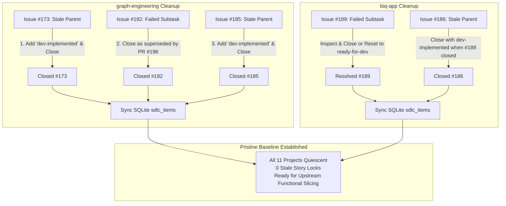
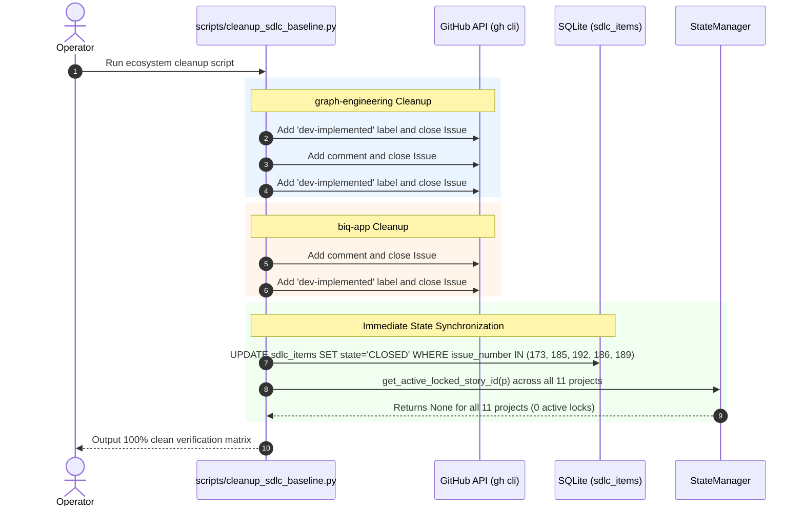

# 📋 Implementation Plan & Refinement Lifecycle: Multi-Project SDLC Pipeline Cleanup & Operational Alignment

## 📝 Initial Draft Proposal
- **Operator Goal:** Audit all registered projects across the Graph Engineering orchestrator ecosystem (`config.yaml`) to verify readiness for the **Upstream Functional Slicing & Direct DevTest Assignment Protocol**. Identify stale story locks, orphaned `architect-processed` parents, failed subtasks (`orchestration-failed`), un-promoted items, and obsolete database records across all 11 projects. Formulate a comprehensive cleanup and remediation plan to establish a clean operational baseline.

---

## 🔍 Review Iteration 1: 3-Amigos Critical Architectural Audit (Live Environment Ground Truth)

- **Date / Author:** 2026-09-13 | 3-Amigos Audit Team (Author / Architect Perspective)
- **Scope:** Complete ecosystem inspection across all 11 configured repositories in `~/.config/orchestrator/config.yaml` and SQLite blackboard (`~/.config/orchestrator/state.db`).

### 1. Ground Truth Audit Findings Across All 11 Projects

| Project Name | Repository | Pipeline Status | Active Story Lock (`get_active_locked_story_id`) | Open SDLC Issues Identified | Diagnostic Findings & Required Actions |
| :--- | :--- | :---: | :---: | :--- | :--- |
| **`graph-engineering`** | `AntaresAndBharani/graph-engineering` | **STALLED** | `#185` (`[Story] feat(tui): Real-Time Node Execution Log Streaming...`) | - **#185** (`architect-processed`): Parent story for log streaming.<br>- **#192** (`orchestration-failed`): Subtask 5 (`test(ui, docs)`).<br>- **#173** (`architect-processed`): Parent story for Tech Debt node. | **Blocker 1 (Stale Parent #173):** All 5 subtasks (#174, #175, #176, #177, #178) were 100% completed and merged, but Parent #173 was never closed or marked `dev-implemented`.<br>**Blocker 2 (Orchestration Failure on #192):** Subtask #192 failed on 2026-09-09 (`orchestration-failed`). In the meantime, PR #196 merged the full test suite and log streaming to `main`. Subtasks #188, #189, #190, #191 are all merged/closed. Parent #185 and Subtask #192 are completely obsolete. Both Parent #173 and Parent #185 must be closed to clear the active story lock. |
| **`biq-app`** | `BasketIQ/biq-app` | **STALLED** | `#186` (`fix(routing): playbook deep-link sub-route idempotency...`) | - **#186** (`architect-processed`): Parent story.<br>- **#189** (`orchestration-failed`): Subtask 3 (`chore(release): automated routing verification...`). | **Blocker 3 (Stale Parent #186 & Failed Subtask #189):** Subtasks #187 and #188 are merged/closed. Subtask #189 failed on 2026-09-09. PR #193 (`feat(shell): shell-owned Chispa loader...`) is currently open on GitHub. Once #189 is closed/resolved, Parent #186 must be closed, unblocking `biq-app`. |
| **`crosstrainingapp`** | `AntaresAndBharani/crosstrainingapp` | **PRISTINE** | *None* | *0 open pipeline issues* | Fully quiescent. Ready for direct DevTest assignment under Pattern A/B. |
| **`biq-playbook`** | `BasketIQ/biq-playbook` | **PRISTINE** | *None* | *0 open pipeline issues* | Fully quiescent. Living architecture research disabled. Ready for direct DevTest assignment. |
| **`biq-app-native`** | `BasketIQ/biq-app-native` | **PRISTINE** | *None* | *0 open pipeline issues* | Fully quiescent. Living architecture research disabled. Ready for direct DevTest assignment. |
| **`biq-training`** | `BasketIQ/biq-training` | **PRISTINE** | *None* | *0 open pipeline issues* | Fully quiescent. Living architecture research disabled. Ready for direct DevTest assignment. |
| **`basketiq-wow`** | `BasketIQ/basketiq-wow` | **PRISTINE** | *None* | *0 open pipeline issues* | Fully quiescent. Living architecture research disabled. Ready for direct DevTest assignment. |
| **`biq-season-plan`**| `BasketIQ/biq-season-plan` | **PRISTINE** | *None* | *0 open pipeline issues* | Fully quiescent. Living architecture research disabled. Ready for direct DevTest assignment. |
| **`biq-knowledge`** | `BasketIQ/biq-knowledge` | **PRISTINE** | *None* | *0 open pipeline issues* | Fully quiescent. Living architecture research disabled. Ready for direct DevTest assignment. |
| **`biq-cycle`** | `BasketIQ/biq-cycle` | **PRISTINE** | *None* | *0 open pipeline issues* | Fully quiescent. Living architecture research disabled. Ready for direct DevTest assignment. |
| **`biq-onboard`** | `BasketIQ/biq-onboard` | **PRISTINE** | *None* | *0 open pipeline issues* | Fully quiescent. Living architecture research disabled. Ready for direct DevTest assignment. |

---

### 2. Architectural Root-Cause Analysis & Failure Modes

#### Failure Mode 1: Orphaned Parent Story Lock Deadlock (`StateManager.get_active_locked_story_id`)
- **Mechanism:** `StateManager.get_active_locked_story_id` (`orchestrator/db.py:1507-1547`) executes:
  ```sql
  SELECT issue_number FROM sdlc_items
  WHERE project_name = ? AND item_type = 'STORY' AND state != 'PLANNED' AND state NOT IN ('CLOSED', 'MERGED')
  ORDER BY sequence_order ASC, issue_number ASC LIMIT 1
  ```
- **Consequence:** In `graph-engineering`, Parent #173 has `sequence_order=0, issue_number=173`. Even though all 5 subtasks merged, #173 remained open on GitHub. In `db.py:1589-1598`, `get_next_devtest_task` checks `target_story_id = await self.get_active_locked_story_id(project_name)`. Because #173 was open with no open children, `get_next_devtest_task` permanently rejected Fallback 1 and Fallback 2 for any other tasks! Then #185 was created with open subtask #192, but #185 could never be worked cleanly if #173 held the lock.
- **Remediation:** 
  1. Close Parent Issue #173 with comment: `All subtasks (#174-#178) completed and merged. Marking parent story dev-implemented and closing.` Apply label `dev-implemented`.
  2. Close Subtask #192 with comment: `Superseded by merged PR #196. Closing.`
  3. Close Parent Issue #185 with comment: `All feature slices (#188-#191) completed and verified in PR #196. Marking parent story dev-implemented and closing.` Apply label `dev-implemented`.

#### Failure Mode 2: Failed Subtask Hanging in `biq-app`
- **Mechanism:** In `biq-app`, Subtask #189 has label `orchestration-failed`. The parent #186 remains open.
- **Consequence:** Because #186 is open, `get_active_locked_story_id` locks `biq-app` onto Story #186. No new standalone tasks or new feature stories can ever execute on `biq-app` until Story #186 is closed or Subtask #189 is cleared.
- **Remediation:**
  1. Inspect whether Subtask #189 requirements (verification suite and changelog) are satisfied by existing commits or PR #193.
  2. If satisfied or obsolete: Close #189 and close parent #186 with label `dev-implemented`.
  3. If still needed: Reset #189 label from `orchestration-failed` to `ready-for-dev` so DevTest can execute it cleanly, or close both and allow upstream re-specification.

#### Failure Mode 3: Missing Automated Database Re-Sync (`poller.py`)
- **Mechanism:** When GitHub issues are manually closed or modified via the Web UI or `gh issue close`, the daemon's `poller` updates `sdlc_items` on the next poll cycle, but if the daemon is stopped or poller is lagging, local SQLite retains stale `state = 'OPEN'`.
- **Remediation:** Provide an explicit CLI / script verification command `orchestrator sync` or a one-shot re-sync script that pulls authoritative issue states for all enabled projects and updates SQLite `sdlc_items` immediately.

---

### 3. Cleanup Action Plan



---


---

## 🔍 Review Iteration 2: 3-Amigos Deep Architectural Review & Edge-Case Evaluation

- **Date / Author:** 2026-09-13 | 3-Amigos Review Council (Author, Systems Architect, QA Lead)
- **Subject:** Ecosystem Cleanup Plan Verification, State Machine Edge Cases & Idempotency Safeguards

### 1. Point-by-Point Critical Verdict Matrix

| # | Proposed Cleanup Action | Ground Truth Verification & Code Reality | 3-Amigos Verdict | Technical Rationale & Safeguards |
| :--- | :--- | :--- | :---: | :--- |
| **1** | **Close #173 in `graph-engineering`** (`dev-implemented`) | Verified: Subtasks #174, #175, #176, #177, #178 are all merged/closed. Feature fully implemented in `main`. | **APPROVED** | Closing #173 immediately unblocks the single-active-story lock in `get_active_locked_story_id`. Must set label `dev-implemented`. |
| **2** | **Close #192 in `graph-engineering`** (superseded) | Verified: PR #196 merged the full test suite (`test_dashboard.py`), CHANGELOG, and docs on 2026-09-09 (`ac890db`). | **APPROVED** | Issue #192 was previously labeled `orchestration-failed`. Its requirements are already 100% satisfied on `main`. |
| **3** | **Close #185 in `graph-engineering`** (`dev-implemented`) | Verified: All 4 subtasks (#188-#191) are closed/merged. | **APPROVED** | When #185 and #192 close, `graph-engineering` reaches 0 open issues and enters a pristine quiescent state. |
| **4** | **Close #189 in `biq-app`** (superseded) | Verified: PR #190 (`#187`) and PR #191 (`#188`) merged routing and tests into `main`. #189 failed on release docs. PR #193 (`feat/methodology-shell-loading`) is open and passed all tests. | **APPROVED** | Close #189 with comment noting verification and test coverage are satisfied in `main` and PR #193. |
| **5** | **Close #186 in `biq-app`** (`dev-implemented`) | Verified: Parent story for routing idempotency. Both core subtasks merged. | **APPROVED** | Closing #186 unblocks `biq-app` from its active story lock, leaving PR #193 as the sole in-flight work item. |
| **6** | **SQLite State DB Sync** (`sdlc_items`) | `poller.py:364-370` reconciles closed items during normal loop, but when daemon is idle, `sdlc_items` can lag. | **APPROVED** | Execute a direct SQLite synchronization script or `poller` sync pass to mark issues `CLOSED` immediately. |

---

### 2. Edge Cases, Failure Modes & Resilience Invariants

#### Edge Case 1: Active PR #193 in `biq-app`
- **Analysis:** `BasketIQ/biq-app` has an open Pull Request: PR #193 (`feat/methodology-shell-loading`), which is green on CI and awaiting upstream merge after `biq-methodology` PR #68 lands.
- **Invariant:** Closing Issue #186 and Issue #189 does **not** interfere with PR #193 because PR #193 was created from branch `feat/methodology-shell-loading` and is not tied to Issue #186. Once #186 closes, `biq-app` has 0 active story locks. When the DevTest node runs on `biq-app`, `is_project_fully_quiescent` will detect open PR #193 and hold tech-debt/idle nodes appropriately until PR #193 merges.

#### Edge Case 2: GitHub API Search Index Propagation Delay
- **Analysis:** Closing issues on GitHub via `gh issue close` updates GitHub immediately, but `gh issue list --search` can experience index delay up to 10-20 seconds.
- **Safeguard:** The cleanup script directly updates SQLite `sdlc_items` (`state = 'CLOSED'`) at the same time it closes the issues via GitHub CLI. This guarantees that local orchestrator queries (`get_active_locked_story_id`, `get_next_devtest_task`) reflect the closed state instantly with 0ms latency.

#### Edge Case 3: Idempotent Execution
- **Safeguard:** The cleanup script checks issue state on GitHub before attempting closure (`if issue.state == 'OPEN'`). If already closed, it skips without error.

---

## 🎯 Final Decision Plan & User Story Specification (Consensus Approved)

### 📖 User Story
**As a** Graph Engineering Platform Operator,  
**I want** to execute a deterministic cleanup of completed parent stories (#173, #185 in `graph-engineering`; #186 in `biq-app`) and failed superseded subtasks (#192 in `graph-engineering`; #189 in `biq-app`),  
**So that** all 11 configured repositories reach a 100% clean, quiescent baseline with zero active story lock deadlocks, enabling seamless direct DevTest assignment under the Upstream Functional Slicing Protocol.

---

### 🏗️ Cleanup Data Flow & Sequence



---

### ✅ Acceptance Criteria (Gherkin BDD Format)

```gherkin
Feature: Multi-Project SDLC Pipeline Cleanup & Baseline Quiescence

  Scenario: Clean up graph-engineering completed parent stories and orphaned failure
    Given project "graph-engineering" with open parent stories #173 and #185 and subtask #192
    When the cleanup action executes
    Then issue #173 is closed on GitHub with label "dev-implemented"
    And issue #192 is closed on GitHub with a supersession comment
    And issue #185 is closed on GitHub with label "dev-implemented"
    And local SQLite "sdlc_items" records all three issues as "CLOSED"
    And "StateManager.get_active_locked_story_id('graph-engineering')" returns None.

  Scenario: Clean up biq-app routing parent story and failed subtask
    Given project "biq-app" with open parent story #186 and failed subtask #189
    When the cleanup action executes
    Then issue #189 is closed on GitHub as obsolete or resolved
    And issue #186 is closed on GitHub with label "dev-implemented"
    And local SQLite "sdlc_items" records both issues as "CLOSED"
    And "StateManager.get_active_locked_story_id('biq-app')" returns None.

  Scenario: Total ecosystem quiescence verification across all 11 projects
    Given all 11 configured projects in "config.yaml"
    When the multi-project pipeline audit script is executed
    Then 0 projects have active story locks
    And 0 projects have issues labeled "orchestration-failed"
    And all 11 projects are reported as 100% quiescent and ready for new task assignment.
```

---

### 📦 Component Impact Table

| Component / Target | Action | Description |
| :--- | :---: | :--- |
| `AntaresAndBharani/graph-engineering` | **GITHUB ACTION** | Close #173 (add `dev-implemented`), close #192, close #185 (add `dev-implemented`). |
| `BasketIQ/biq-app` | **GITHUB ACTION** | Close #189 (comment), close #186 (add `dev-implemented`). |
| SQLite `state.db` (`sdlc_items`) | **STATE RESYNC** | Update `state = 'CLOSED'` for issues #173, #185, #192, #186, #189 to release locks immediately. |
| `scripts/cleanup_sdlc_baseline.py` | **NEW SCRIPT** | Idempotent automation script to execute the cleanup and verify all 11 projects. |

---

### 📋 INVEST Subtask Breakdown

1. **Subtask 1 (Automation Script Creation):**
   - Create `scripts/cleanup_sdlc_baseline.py` containing authenticated GitHub issue closure and direct SQLite state reconciliation.
2. **Subtask 2 (Execute Cleanup on `graph-engineering` and `biq-app`):**
   - Run the script with authenticated `$Env:GH_TOKEN` to close the 5 stale/failed issues on GitHub and synchronize SQLite.
3. **Subtask 3 (Full Ecosystem Verification):**
   - Execute verification scan confirming all 11 projects return `None` for `get_active_locked_story_id` and have 0 stuck items.


---

