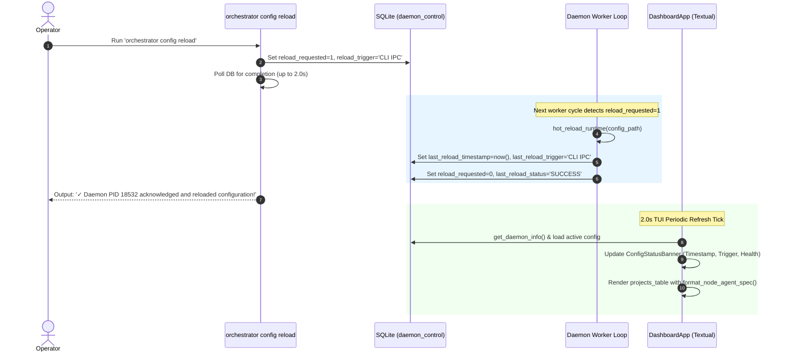

# 📋 Implementation Plan & Refinement Lifecycle: Config Reload Observability, Dynamic Agent Visualization & High-Performance Startup

## 📝 Initial Draft Proposal

### Background & Objective
During live operations of the `graph-orchestrator` across 10 active repositories, two critical UX and observability blind spots and one major startup bottleneck were identified:

1. **Config Reload Blind Spot (`orchestrator config reload`):**
   - When an operator executes `orchestrator config reload`, the CLI currently registers an IPC flag in SQLite and exits immediately without verifying whether the active daemon has picked up or completed the reload.
   - The operator cannot tell if the running daemon actually reloaded the configuration, what configuration path was loaded, or what timestamp the reload occurred at.
   - In the interactive Textual TUI dashboard (`orchestrator watch`), there is zero visual indication of the configuration status, last reload timestamp, or what triggered the reload (e.g., initial daemon boot vs. CLI IPC signal).

2. **Agent / Model & Effort Transparency:**
   - The status tables and dashboard do not clearly convey the active AI agent model and effort.
   - Model specifications differ across harnesses: Claude uses a model plus an explicit reasoning effort parameter (e.g., `claude-sonnet-5` with `effort: medium`), whereas Gemini models embed the effort profile directly into the model designation (e.g., `gemini-3.8-flash-high`).
   - The operator needs unified, intuitive agent/model formatting across both the CLI (`orchestrator list`, startup table) and the TUI dashboard:
     - For Claude harness: `agent + effort` (e.g., `claude-sonnet-5 (medium)`).
     - For Gemini harness: `agent` (e.g., `gemini-3.8-flash-high`, effort omitted).

3. **Startup Freeze (140 Sequential GitHub CLI Calls):**
   - At startup, `sync_all_projects_labels` runs sequentially across all enabled projects before launching the TUI dashboard or worker loops.
   - Across 10 enabled projects, it sequentially issues 7 `gh label delete` commands and 7 `gh label create --force` commands.
   - This results in **140 sequential `gh.exe` subprocesses**, taking over **150 seconds (2.5 minutes)** of synchronous blocking where the process appears frozen before the dashboard can even open.

---

## 🔍 Review Iteration 1: 3-Amigos Critical Architectural Review

- **Date / Author:** 2026-09-03 | Antigravity AI Architect
- **Target Repository:** `AntaresAndBharani/graph-engineering`
- **Architectural Scope:** `orchestrator/cli.py`, `orchestrator/db.py`, `orchestrator/housekeeping.py`, `orchestrator/ui/dashboard.py`, `orchestrator/ui/widgets.py`

### 1. Point-by-Point Verdict Matrix

| # | Proposal Element | Target Component | Verdict | Technical Rationale & Architectural Rule |
|---|---|---|---|---|
| 1 | **Reload Metadata Persistence** | `orchestrator/db.py` (`daemon_control`) | **APPROVE** | Leverage existing SQLite `daemon_control` key-value table. Store `last_reload_timestamp`, `last_reload_trigger`, `last_reload_status`, and `last_reload_config_path`. **Zero schema migrations required**, 100% backward compatible. |
| 2 | **CLI Synchronous Reload Acknowledgement** | `orchestrator/cli.py` (`config reload`) | **APPROVE** | After writing `reload_requested = 1`, poll `daemon_control` with a 2.0s bounded loop (200ms sleep) to detect when the daemon completes the reload and clears the flag. If acknowledged, output green confirmation with PID, config path, and project count; if timeout, report gracefully that the signal is queued. |
| 3 | **TUI Config Reload Observability Banner** | `orchestrator/ui/dashboard.py` | **APPROVE** | Add a dedicated `ConfigStatusBanner(Static)` widget above `#projects_table` (or update Dashboard Header subtitle dynamically). Surfaces: Config path, Last Reload timestamp, Reload trigger (e.g. `CLI IPC` vs `Initial Boot`), and Daemon status. Refreshed on the existing 2.0s tick without blocking the event loop. |
| 4 | **Model & Effort Formatter** | `orchestrator/cli.py`, `orchestrator/ui/dashboard.py` | **APPROVE** | Implement unified pure helper `format_node_agent_spec(harness, model, effort)`. For Claude: returns `<model> (<effort>)` if effort specified, else `<model>`. For Gemini: returns `<model>` (suppressing effort). Surface in both `render_node_status_table`, `orchestrator list`, and TUI project status. |
| 5 | **Non-Blocking Background Label Sync** | `orchestrator/cli.py` (`_watch_daemon_tui`, `_watch_daemon_headless`) | **APPROVE** | Decouple `sync_all_projects_labels` from blocking startup. Launch as an unawaited background task (`asyncio.create_task`) so the Textual dashboard launches **instantly in <0.5s**. |
| 6 | **Smart 1-Call Label Inspection** | `orchestrator/housekeeping.py` | **APPROVE** | Replace 14 blind subprocesses per repo with a single `gh label list --json name` inspection. Only call `gh label delete` if obsolete labels actually exist (0 calls for clean repos); only create missing labels. Execute across projects concurrently via `asyncio.gather(return_exceptions=True)`. |

---

## 🎯 Final Decision Plan & User Story Specification

### 📖 User Story
**As a** Graph Engineering Platform Operator,  
**I want** clear real-time observability of configuration reload events, an intuitive display of active agent models and effort across Claude and Gemini, and an instant non-blocking dashboard startup,  
**So that** I have immediate feedback when reloading configurations, complete visibility into what model and effort each node is executing, and zero startup lag when launching `orchestrator watch`.

---

### 🏗️ Architecture & Data Flow



---

### ✅ Acceptance Criteria (Gherkin BDD Format)

```gherkin
Feature: Config Reload Observability, Agent Model Representation & Non-Blocking Startup

  Scenario: Real-time confirmation upon executing orchestrator config reload
    Given an active orchestrator daemon with PID 18532
    When the operator executes "orchestrator config reload"
    Then the command must register "reload_requested=1" and "reload_trigger='CLI IPC ('orchestrator config reload')'" in "daemon_control"
    And the command must wait up to 2.0s for daemon acknowledgement
    And upon acknowledgement it must display the confirmed reload timestamp, daemon PID, and number of reloaded projects.

  Scenario: TUI Dashboard surfaces last config reload timestamp and trigger
    Given the Textual TUI dashboard is active
    When the daemon completes a configuration reload
    Then the "ConfigStatusBanner" in the dashboard must display the canonical config file path
    And it must display the exact local timestamp of the last reload
    And it must display the trigger that caused the reload (e.g. "CLI IPC" or "Daemon Startup").

  Scenario: Clean agent and effort representation across Claude and Gemini
    Given a project node configured with harness "claude", model "claude-sonnet-5", and effort "medium"
    When formatting the node agent specification
    Then the output string must be "claude-sonnet-5 (medium)"
    Given a project node configured with harness "antigravity" and model "gemini-3.8-flash-high"
    When formatting the node agent specification
    Then the output string must be "gemini-3.8-flash-high" without any trailing effort designation.

  Scenario: TUI Dashboard and Node Status Table display active agent and effort
    Given projects configured with both Claude and Gemini models
    When inspecting the CLI "render_node_status_table" or TUI "projects_table"
    Then each node row must display the formatted agent specification showing model and effort for Claude and model for Gemini.

  Scenario: Instant non-blocking TUI dashboard startup (<1.0s)
    Given 10 enabled projects in "config.yaml"
    When the operator executes "orchestrator watch"
    Then the Textual TUI dashboard must render and become interactive within 1.0 second
    And repository workflow label synchronization must execute concurrently in the background without blocking the UI.

  Scenario: Smart single-pass repository label synchronization
    Given a target repository with standard labels already configured
    When the background label synchronization runs
    Then it must fetch existing labels via a single "gh label list --json name" call
    And it must issue 0 "gh label delete" calls when no legacy labels exist.
```

---

### 📦 Component Impact Table

| Component / File Path | Action | Description |
| :--- | :---: | :--- |
| [`orchestrator/db.py`](file:///c:/Users/rogal/workspaces/ws-setups/graph-engineering/orchestrator/db.py) | **MODIFY** | Equip `request_reload`, `clear_reload_request`, and `get_daemon_info` with `last_reload_timestamp`, `last_reload_trigger`, `last_reload_status`, and `last_reload_config_path` metadata in `daemon_control`. |
| [`orchestrator/cli.py`](file:///c:/Users/rogal/workspaces/ws-setups/graph-engineering/orchestrator/cli.py) | **MODIFY** | Enhance `config reload` command to poll for synchronous daemon acknowledgement (up to 2.0s). Add pure `format_node_agent_spec(harness, model, effort)`. Decouple startup label sync into an unawaited background task. |
| [`orchestrator/housekeeping.py`](file:///c:/Users/rogal/workspaces/ws-setups/graph-engineering/orchestrator/housekeeping.py) | **MODIFY** | Optimize `sync_repository_labels` with 1-call `gh label list --json name` inspection and parallel `asyncio.gather` execution. |
| [`orchestrator/ui/dashboard.py`](file:///c:/Users/rogal/workspaces/ws-setups/graph-engineering/orchestrator/ui/dashboard.py) | **MODIFY** | Add `ConfigStatusBanner(Static)` widget above `#projects_table` to render reload timestamp, trigger, and config path. Update `update_projects_table` to display formatted agent/model specs. |
| [`orchestrator/ui/widgets.py`](file:///c:/Users/rogal/workspaces/ws-setups/graph-engineering/orchestrator/ui/widgets.py) | **MODIFY** | Add styling and layout rules for `ConfigStatusBanner`. |
| [`tests/test_reloader.py`](file:///c:/Users/rogal/workspaces/ws-setups/graph-engineering/tests/test_reloader.py) | **MODIFY** | Add tests asserting reload metadata tracking, acknowledgement polling, and trigger recording. |
| [`tests/test_dashboard.py`](file:///c:/Users/rogal/workspaces/ws-setups/graph-engineering/tests/test_dashboard.py) | **MODIFY** | Add BDD tests covering `ConfigStatusBanner` hydration, agent formatting, and zero-lag rendering. |
| [`CHANGELOG.md`](file:///c:/Users/rogal/workspaces/ws-setups/graph-engineering/CHANGELOG.md) | **MODIFY** | Log features under `## [Unreleased]`. |

---

### 📋 INVEST Subtask Breakdown

1. **Subtask 1 (DB & CLI Reload Metadata with Synchronous Acknowledgement):**
   - Update `StateManager.request_reload` and `record_reload_complete` to store timestamp, trigger, config path, and status in `daemon_control`.
   - Update `orchestrator.cli.config_reload_command` to wait up to 2.0s for daemon acknowledgement and print verified confirmation.
   - Update `tests/test_reloader.py` with unit tests for metadata recording and polling acknowledgement.

2. **Subtask 2 (Agent & Effort Formatter in CLI & Startup Tables):**
   - Implement `format_node_agent_spec(harness, model, effort)`.
   - Update `render_node_status_table` and `orchestrator list` to format Claude models as `<model> (<effort>)` and Gemini models as `<model>`.
   - Update `tests/test_cli.py` with unit tests asserting correct model/effort string formatting across harnesses.

3. **Subtask 3 (Instant Startup & Smart 1-Call Label Sync):**
   - Refactor `sync_repository_labels` in `housekeeping.py` to inspect existing labels in 1 `gh label list` call before issuing deletes/creates.
   - Refactor `_watch_daemon_tui` and `_watch_daemon_headless` in `cli.py` to launch label sync as a non-blocking background task.
   - Update `tests/test_housekeeping.py` to verify non-blocking launch and 0 redundant subprocess executions.

4. **Subtask 4 (TUI Dashboard Config Reload Status Banner & Table Integration):**
   - Implement `ConfigStatusBanner` widget in `dashboard.py` and `widgets.py`.
   - Wire `ConfigStatusBanner` to hydrate reload timestamp, trigger, and config path on the 2.0s refresh tick.
   - Update `projects_table` to include active agent/model specifications.
   - Update `tests/test_dashboard.py` with BDD scenarios verifying banner reactivity and table formatting.

5. **Subtask 5 (End-to-End Verification & Changelog):**
   - Execute full test suite (`pytest -v`) to confirm 100% green pass rate across all 337+ tests.
   - Update `CHANGELOG.md` under `## [Unreleased]`.
