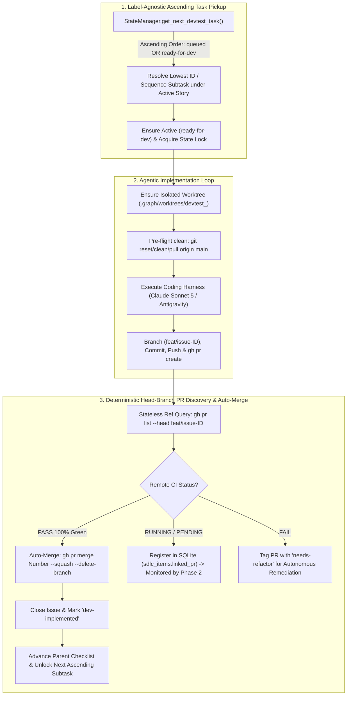

# 📋 Implementation Plan & Refinement Lifecycle: DevTest Node Clean-Up, Ascendant Task Pickup & Autonomous End-to-End CI Auto-Merge

## 📝 Initial Draft Proposal

### Background & Objective
Perform a complete architectural clean-up of the **DevTest Node** (`orchestrator/nodes/devtest.py`) and its documentation (`docs/node-devtest.md`):
1. **Label-Agnostic Ascendant Order Pickup Invariant**: DevTest resolves actionable issues in ascending ID / sequence order (`queued` or `ready-for-dev`—the specific label is irrelevant). It resolves the lowest open subtask under the active parent story (or standalone tasks if no story is active) and activates it upon pickup.
2. **Autonomous End-to-End PR Creation, Remote CI Waiting & Auto-Merge**:
   - Executes coding harness (Claude Sonnet 5 or Antigravity) to implement requirements with TDD tests.
   - Pushes branch (`feat/issue-<id>`) and opens PR via GitHub CLI (`gh pr create`).
   - Discovers PR deterministically via exact head-branch ref (`gh pr list --head feat/issue-<id>`), eliminating brittle text search indexing lag.
   - Evaluates remote CI checks (`PASS` $	o$ squash auto-merge with `--delete-branch`, close issue as `dev-implemented`, advance parent story, and unlock the next sequential subtask; `RUNNING` $	o$ wait/monitor in Phase 2; `FAIL` $	o$ flag `needs-refactor` for autonomous remediation).
3. **Dead-Code & Legacy Feature Removal**:
   - Replace all occurrences of `gh pr list --search` and `gh issue list --search` with deterministic ref lookups and SQLite SDLC hierarchy.
   - Remove obsolete Blackboard `pr_artifacts` conflict resolution code.
   - Remove legacy labels (`planned`, `needs-po-review`, `tech-debt`).
   - Enforce `GH_PROMPT_DISABLED="1"` and bounded 10.0s async timeouts on all GitHub CLI and Git subprocess executions.
4. **Harmonize Living Documentation (`docs/node-devtest.md`)**:
   - Document the label-agnostic ascending pickup invariant, end-to-end CI auto-merge lifecycle, and Claude Sonnet / Antigravity harness configuration.

---

## 🔍 Review Iteration 1: 3-Amigos Critical Architectural Review

- **Date / Author:** 2026-09-02 | Antigravity AI Architect
- **Target Subsystems:** `orchestrator/nodes/devtest.py`, `docs/node-devtest.md`, `orchestrator/db.py`, `tests/test_nodes.py`, `tests/test_sequential_pipeline.py`

### 1. Point-by-Point Deprecation & Clean-Up Matrix

| # | Item / Code Path | Current State & Weakness | Verdict | Action & Clean-Up Rationale |
|---|---|---|---|---|
| 1 | **PR Discovery Method (Line 1326)** | Uses `gh pr list --search "#{issue_id}"` which fails due to GitHub search API indexing lag, falsely recording 0 diff failures. | **MODIFY** | Replace with deterministic `gh pr list --head f"{branch_prefix}{issue_id}" --state open --json number,title,labels,headRefName,statusCheckRollup,mergeable`. |
| 2 | **Task Pickup Ordering & Label Agnosticism** | `StateManager.get_next_devtest_task` resolves lowest ID / sequence order subtask under the active story (`queued` or `ready-for-dev`). | **APPROVE** | Reaffirm and preserve the label-agnostic ascending pickup invariant. When picked up, DevTest activates the task to `ready-for-dev` on GitHub and locks it in SQLite. |
| 3 | **Phase 2 CI Auto-Merge Pipeline** | Phase 2 currently queries `fetch_open_prs(label="dev-implemented")`, missing PRs awaiting CI without explicit labels. | **MODIFY** | Broaden Phase 2 to evaluate all open PRs matching branch prefix `feat/issue-` or linked to open subtasks. If CI is `PASS`, squash merge, mark `dev-implemented`, and advance the parent story. |
| 4 | **Blackboard PR Conflict Code (Lines 1228-1257)** | Queries `state_manager.get_pr_artifact` for `APPROVED_WITH_CONFLICT` from disabled Reviewer node. | **DELETE** | Remove dead conflict resolution prompt branches. DevTest performs clean autonomous TDD implementation directly. |
| 5 | **Subprocess Safety & Timeouts** | Subprocesses lack `GH_PROMPT_DISABLED="1"` and bounded timeouts. | **APPROVE** | Standardize all `gh` CLI executions across `devtest.py` to enforce `GH_PROMPT_DISABLED="1"` with strict 10s async timeout protection. |
| 6 | **Living Documentation Synchronization** | `docs/node-devtest.md` contains outdated manual review handoffs. | **MODIFY** | Update `docs/node-devtest.md` with the label-agnostic ascending pickup invariant, end-to-end CI auto-merge pipeline, and Claude Sonnet / Antigravity config examples. |

---

## 🎯 Final Decision Plan & User Story Specification

### 📖 User Story
**As a** Graph Engineering Platform Operator,  
**I want** the DevTest execution node (`orchestrator/nodes/devtest.py`) and documentation (`docs/node-devtest.md`) refactored to pick up actionable tasks in ascending ID/sequence order regardless of whether they are labeled `queued` or `ready-for-dev`, execute implementation via the configured coding harness (Sonnet/Antigravity), discover PRs deterministically via exact head-branch refs, and autonomously wait for CI completion to squash-merge and advance the story,  
**So that** software development is fully autonomous, deterministic, immune to search indexing lag, and free from dead legacy code.

---

### 🏗️ Streamlined End-to-End DevTest Architecture



---

### ✅ Acceptance Criteria (Gherkin BDD Format)

```gherkin
Feature: DevTest Node Ascendant Task Pickup, Head-Branch PR Discovery and End-to-End CI Auto-Merge

  Scenario: DevTest picks up actionable tasks in ascending order regardless of queued or ready-for-dev label
    Given an active User Story with Subtask #10 ("queued") and Subtask #11 ("queued")
    When DevTest queries for the next actionable task
    Then it must resolve Subtask #10 (lowest ascending ID / sequence order)
    And activate Subtask #10 to "ready-for-dev"
    And begin implementation without requiring manual label changes.

  Scenario: Post-execution PR discovery resolves immediately via head branch without search lag
    Given DevTest has executed a task for Issue #10 on branch "feat/issue-10"
    When DevTest verifies PR creation via "gh pr list --head feat/issue-10"
    Then it must locate the open PR immediately in a single REST query
    And record the integer "linked_pr" foreign key into "sdlc_items" in SQLite
    And avoid executing full-text string search "--search '#10'".

  Scenario: DevTest autonomously auto-merges PRs upon passing CI and advances parent story
    Given an open PR on branch "feat/issue-10" with remote CI status "PASS"
    When DevTest evaluates the PR
    Then it must execute squash auto-merge with "gh pr merge <pr_number> --squash --delete-branch"
    And transition Issue #10 to "CLOSED" with label "dev-implemented"
    And check off Issue #10 in the parent story body checklist
    And unlock the next ascending subtask (Issue #11) from "queued" to "ready-for-dev".

  Scenario: Subprocess execution enforces non-interactive timeout guard
    Given any GitHub CLI subprocess execution within "orchestrator/nodes/devtest.py"
    When the subprocess is launched
    Then it must execute with environment variable "GH_PROMPT_DISABLED=1"
    And terminate cleanly with a TimeoutError if execution exceeds 10.0 seconds.

  Scenario: Documentation accurately depicts the label-agnostic ascending pickup and E2E auto-merge
    Given the documentation file "docs/node-devtest.md"
    When inspected by an operator or test suite
    Then it must describe the ascending task pickup invariant for "queued" and "ready-for-dev" labels
    And document the full end-to-end CI auto-merge and sequential story progression lifecycle.
```

---

### 📦 Component Impact Table

| File Path | Component / Layer | Nature of Change |
|---|---|---|
| `orchestrator/nodes/devtest.py` | Domain Core (DevTest) | Replace `--search f"#{issue_id}"` with `--head f"{branch_prefix}{issue_id}"` across all PR discovery sites. Wrap subprocesses in `GH_PROMPT_DISABLED="1"` and 10s async timeouts. Broaden Phase 2 auto-merge sweep to inspect feature branches (`feat/issue-*`). Remove obsolete Blackboard conflict logic. |
| `docs/node-devtest.md` | Documentation | Update to describe the label-agnostic ascending pickup invariant, end-to-end CI auto-merge pipeline, Sonnet/Antigravity configuration, and sequential story progression. |
| `tests/test_nodes.py` | Testing (Unit & BDD) | Add unit and BDD tests verifying head-branch PR discovery, non-interactive environment isolation, and branch-prefix Phase 2 auto-merge. |
| `tests/test_sequential_pipeline.py` | Testing (Sequential) | Verify ascendant task pickup across queued/ready-for-dev labels and end-to-end auto-merge progression. |
