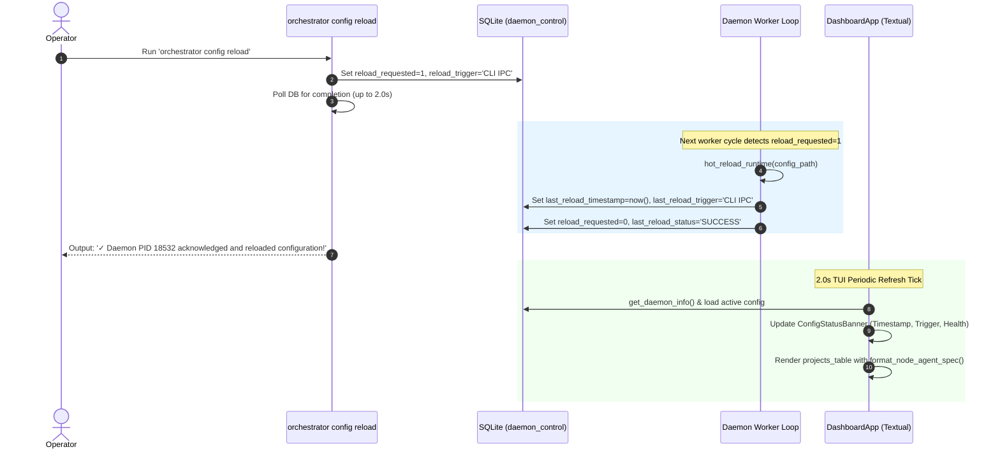

# 📋 Implementation Plan & Refinement Lifecycle: Config Reload Observability, Dynamic Agent Visualization & High-Performance Startup

## 📝 Initial Draft Proposal

### Background & Objective
During live operations of the `graph-orchestrator` across 10 active repositories, two critical UX and observability blind spots and one major startup bottleneck were identified:

1. **Config Reload Blind Spot (`orchestrator config reload`):**
   - When an operator executes `orchestrator config reload`, the CLI currently registers an IPC flag in SQLite and exits immediately without verifying whether the active daemon has picked up or completed the reload.
   - The operator cannot tell if the running daemon actually reloaded the configuration, what configuration path was loaded, or what timestamp the reload occurred at.
   - In the interactive Textual TUI dashboard (`orchestrator watch`), there is zero visual indication of the configuration status, last reload timestamp, or what triggered the reload (e.g., initial daemon boot vs. CLI IPC signal).

2. **Agent / Model & Effort Transparency:**
   - The status tables and dashboard do not clearly convey the active AI agent model and effort.
   - Model specifications differ across harnesses: Claude uses a model plus an explicit reasoning effort parameter (e.g., `claude-sonnet-5` with `effort: medium`), whereas Gemini models embed the effort profile directly into the model designation (e.g., `gemini-3.8-flash-high`).
   - The operator needs unified, intuitive agent/model formatting across both the CLI (`orchestrator list`, startup table) and the TUI dashboard:
     - For Claude harness: `agent + effort` (e.g., `claude-sonnet-5 (medium)`).
     - For Gemini harness: `agent` (e.g., `gemini-3.8-flash-high`, effort omitted).

3. **Startup Freeze (140 Sequential GitHub CLI Calls):**
   - At startup, `sync_all_projects_labels` runs sequentially across all enabled projects before launching the TUI dashboard or worker loops.
   - Across 10 enabled projects, it sequentially issues 7 `gh label delete` commands and 7 `gh label create --force` commands.
   - This results in **140 sequential `gh.exe` subprocesses**, taking over **150 seconds (2.5 minutes)** of synchronous blocking where the process appears frozen before the dashboard can even open.

---

## 🔍 Review Iteration 1: 3-Amigos Critical Architectural Review

- **Date / Author:** 2026-09-03 | Antigravity AI Architect
- **Target Repository:** `AntaresAndBharani/graph-engineering`
- **Architectural Scope:** `orchestrator/cli.py`, `orchestrator/db.py`, `orchestrator/housekeeping.py`, `orchestrator/ui/dashboard.py`, `orchestrator/ui/widgets.py`

### 1. Point-by-Point Verdict Matrix

| # | Proposal Element | Target Component | Verdict | Technical Rationale & Architectural Rule |
|---|---|---|---|---|
| 1 | **Reload Metadata Persistence** | `orchestrator/db.py` (`daemon_control`) | **APPROVE** | Leverage existing SQLite `daemon_control` key-value table. Store `last_reload_timestamp`, `last_reload_trigger`, `last_reload_status`, and `last_reload_config_path`. **Zero schema migrations required**, 100% backward compatible. |
| 2 | **CLI Synchronous Reload Acknowledgement** | `orchestrator/cli.py` (`config reload`) | **APPROVE** | After writing `reload_requested = 1`, poll `daemon_control` with a 2.0s bounded loop (200ms sleep) to detect when the daemon completes the reload and clears the flag. If acknowledged, output green confirmation with PID, config path, and project count; if timeout, report gracefully that the signal is queued. |
| 3 | **TUI Config Reload Observability Banner** | `orchestrator/ui/dashboard.py` | **APPROVE** | Add a dedicated `ConfigStatusBanner(Static)` widget above `#projects_table` (or update Dashboard Header subtitle dynamically). Surfaces: Config path, Last Reload timestamp, Reload trigger (e.g. `CLI IPC` vs `Initial Boot`), and Daemon status. Refreshed on the existing 2.0s tick without blocking the event loop. |
| 4 | **Model & Effort Formatter** | `orchestrator/cli.py`, `orchestrator/ui/dashboard.py` | **APPROVE** | Implement unified pure helper `format_node_agent_spec(harness, model, effort)`. For Claude: returns `<model> (<effort>)` if effort specified, else `<model>`. For Gemini: returns `<model>` (suppressing effort). Surface in both `render_node_status_table`, `orchestrator list`, and TUI project status. |
| 5 | **Non-Blocking Background Label Sync** | `orchestrator/cli.py` (`_watch_daemon_tui`, `_watch_daemon_headless`) | **APPROVE** | Decouple `sync_all_projects_labels` from blocking startup. Launch as an unawaited background task (`asyncio.create_task`) so the Textual dashboard launches **instantly in <0.5s**. |
| 6 | **Smart 1-Call Label Inspection** | `orchestrator/housekeeping.py` | **APPROVE** | Replace 14 blind subprocesses per repo with a single `gh label list --json name` inspection. Only call `gh label delete` if obsolete labels actually exist (0 calls for clean repos); only create missing labels. Execute across projects concurrently via `asyncio.gather(return_exceptions=True)`. |

---

## 🎯 Final Decision Plan & User Story Specification

### 📖 User Story
**As a** Graph Engineering Platform Operator,  
**I want** clear real-time observability of configuration reload events, an intuitive display of active agent models and effort across Claude and Gemini, and an instant non-blocking dashboard startup,  
**So that** I have immediate feedback when reloading configurations, complete visibility into what model and effort each node is executing, and zero startup lag when launching `orchestrator watch`.

---

### 🏗️ Architecture & Data Flow



---

### ✅ Acceptance Criteria (Gherkin BDD Format)

```gherkin
Feature: Config Reload Observability, Agent Model Representation & Non-Blocking Startup

  Scenario: Real-time confirmation upon executing orchestrator config reload
    Given an active orchestrator daemon with PID 18532
    When the operator executes "orchestrator config reload"
    Then the command must register "reload_requested=1" and "reload_trigger='CLI IPC ('orchestrator config reload')'" in "daemon_control"
    And the command must wait up to 2.0s for daemon acknowledgement
    And upon acknowledgement it must display the confirmed reload timestamp, daemon PID, and number of reloaded projects.

  Scenario: TUI Dashboard surfaces last config reload timestamp and trigger
    Given the Textual TUI dashboard is active
    When the daemon completes a configuration reload
    Then the "ConfigStatusBanner" in the dashboard must display the canonical config file path
    And it must display the exact local timestamp of the last reload
    And it must display the trigger that caused the reload (e.g. "CLI IPC" or "Daemon Startup").

  Scenario: Clean agent and effort representation across Claude and Gemini
    Given a project node configured with harness "claude", model "claude-sonnet-5", and effort "medium"
    When formatting the node agent specification
    Then the output string must be "claude-sonnet-5 (medium)"
    Given a project node configured with harness "antigravity" and model "gemini-3.8-flash-high"
    When formatting the node agent specification
    Then the output string must be "gemini-3.8-flash-high" without any trailing effort designation.

  Scenario: TUI Dashboard and Node Status Table display active agent and effort
    Given projects configured with both Claude and Gemini models
    When inspecting the CLI "render_node_status_table" or TUI "projects_table"
    Then each node row must display the formatted agent specification showing model and effort for Claude and model for Gemini.

  Scenario: Instant non-blocking TUI dashboard startup (<1.0s)
    Given 10 enabled projects in "config.yaml"
    When the operator executes "orchestrator watch"
    Then the Textual TUI dashboard must render and become interactive within 1.0 second
    And repository workflow label synchronization must execute concurrently in the background without blocking the UI.

  Scenario: Smart single-pass repository label synchronization
    Given a target repository with standard labels already configured
    When the background label synchronization runs
    Then it must fetch existing labels via a single "gh label list --json name" call
    And it must issue 0 "gh label delete" calls when no legacy labels exist.
```

---

### 📦 Component Impact Table

| Component / File Path | Action | Description |
| :--- | :---: | :--- |
| [`orchestrator/db.py`](file:///c:/Users/rogal/workspaces/ws-setups/graph-engineering/orchestrator/db.py) | **MODIFY** | Equip `request_reload`, `clear_reload_request`, and `get_daemon_info` with `last_reload_timestamp`, `last_reload_trigger`, `last_reload_status`, and `last_reload_config_path` metadata in `daemon_control`. |
| [`orchestrator/cli.py`](file:///c:/Users/rogal/workspaces/ws-setups/graph-engineering/orchestrator/cli.py) | **MODIFY** | Enhance `config reload` command to poll for synchronous daemon acknowledgement (up to 2.0s). Add pure `format_node_agent_spec(harness, model, effort)`. Decouple startup label sync into an unawaited background task. |
| [`orchestrator/housekeeping.py`](file:///c:/Users/rogal/workspaces/ws-setups/graph-engineering/orchestrator/housekeeping.py) | **MODIFY** | Optimize `sync_repository_labels` with 1-call `gh label list --json name` inspection and parallel `asyncio.gather` execution. |
| [`orchestrator/ui/dashboard.py`](file:///c:/Users/rogal/workspaces/ws-setups/graph-engineering/orchestrator/ui/dashboard.py) | **MODIFY** | Add `ConfigStatusBanner(Static)` widget above `#projects_table` to render reload timestamp, trigger, and config path. Update `update_projects_table` to display formatted agent/model specs. |
| [`orchestrator/ui/widgets.py`](file:///c:/Users/rogal/workspaces/ws-setups/graph-engineering/orchestrator/ui/widgets.py) | **MODIFY** | Add styling and layout rules for `ConfigStatusBanner`. |
| [`tests/test_reloader.py`](file:///c:/Users/rogal/workspaces/ws-setups/graph-engineering/tests/test_reloader.py) | **MODIFY** | Add tests asserting reload metadata tracking, acknowledgement polling, and trigger recording. |
| [`tests/test_dashboard.py`](file:///c:/Users/rogal/workspaces/ws-setups/graph-engineering/tests/test_dashboard.py) | **MODIFY** | Add BDD tests covering `ConfigStatusBanner` hydration, agent formatting, and zero-lag rendering. |
| [`CHANGELOG.md`](file:///c:/Users/rogal/workspaces/ws-setups/graph-engineering/CHANGELOG.md) | **MODIFY** | Log features under `## [Unreleased]`. |

---

### 📋 INVEST Subtask Breakdown

1. **Subtask 1 (DB & CLI Reload Metadata with Synchronous Acknowledgement):**
   - Update `StateManager.request_reload` and `record_reload_complete` to store timestamp, trigger, config path, and status in `daemon_control`.
   - Update `orchestrator.cli.config_reload_command` to wait up to 2.0s for daemon acknowledgement and print verified confirmation.
   - Update `tests/test_reloader.py` with unit tests for metadata recording and polling acknowledgement.

2. **Subtask 2 (Agent & Effort Formatter in CLI & Startup Tables):**
   - Implement `format_node_agent_spec(harness, model, effort)`.
   - Update `render_node_status_table` and `orchestrator list` to format Claude models as `<model> (<effort>)` and Gemini models as `<model>`.
   - Update `tests/test_cli.py` with unit tests asserting correct model/effort string formatting across harnesses.

3. **Subtask 3 (Instant Startup & Smart 1-Call Label Sync):**
   - Refactor `sync_repository_labels` in `housekeeping.py` to inspect existing labels in 1 `gh label list` call before issuing deletes/creates.
   - Refactor `_watch_daemon_tui` and `_watch_daemon_headless` in `cli.py` to launch label sync as a non-blocking background task.
   - Update `tests/test_housekeeping.py` to verify non-blocking launch and 0 redundant subprocess executions.

4. **Subtask 4 (TUI Dashboard Config Reload Status Banner & Table Integration):**
   - Implement `ConfigStatusBanner` widget in `dashboard.py` and `widgets.py`.
   - Wire `ConfigStatusBanner` to hydrate reload timestamp, trigger, and config path on the 2.0s refresh tick.
   - Update `projects_table` to include active agent/model specifications.
   - Update `tests/test_dashboard.py` with BDD scenarios verifying banner reactivity and table formatting.

5. **Subtask 5 (End-to-End Verification & Changelog):**
   - Execute full test suite (`pytest -v`) to confirm 100% green pass rate across all 337+ tests.
   - Update `CHANGELOG.md` under `## [Unreleased]`.

---

## 🔍 Review Iteration 2: Three Amigos Critical Review — Source-Verified Feasibility Pass

- **Date / Reviewer:** 2026-09-03 | Three Amigos (Business / Dev / QA)
- **Scope reviewed:** Whole document, including Iteration 1. Every file path, count, timing and "already exists" claim was checked against working-tree `HEAD` (`fee6763`) and the live operator config `~/.orchestrator/config.yaml`.
- **Baseline established:** `python -m pytest -q` → **337 passed in 68.58s**. Suite is green before any change.
- **Verdict:** ❌ **REWORK REQUIRED** — the direction is right and Subtask 3's optimisation is genuinely worth ~30x, but three of the four headline claims are unachievable as specified against the real runtime, and the startup arithmetic is wrong in a way that would produce the wrong implementation.

> **Note on Iteration 1:** it is *not* stale leftover from the previous draft — it does review this requirement. But it is an all-APPROVE pass with six APPROVE verdicts and no dissent, and every one of the blockers below sits inside a component it approved. Treat its verdict matrix as a design sketch, not as clearance.

### Findings

| # | Severity | Perspective | Finding | Evidence | Recommended action |
|---|---|---|---|---|---|
| 1 | **Blocker** | Dev | **The 2.0s synchronous acknowledgement can essentially never succeed.** Reload is detected only at the top of `_project_worker_loop`, which sleeps `interval` between passes. Live `poll_interval_seconds` is **180**; the default is 300. Worst-case ack latency is 180s *plus* a full `run_project_cycle`, which invokes AI harnesses with `timeout_minutes: 45`. A 2.0s bounded poll times out on every realistic invocation, so AC scenario 1's "upon acknowledgement it must display…" branch is dead in production. | `orchestrator/cli.py:424` (check site), `orchestrator/cli.py:452` (`await asyncio.sleep(interval)`), `~/.orchestrator/config.yaml:3` (`poll_interval_seconds: 180`), `orchestrator/config.py:141` (default 300) | Add a dedicated lightweight reload-watcher `asyncio.Task` in `_watch_daemon_tui`/`_watch_daemon_headless` polling `is_reload_requested()` every ~1s, independent of the worker sleep. Only then is a 2.0s CLI wait meaningful. Without it, delete the sync-ack acceptance criterion and keep the current "signal queued" message. |
| 2 | **Blocker** | Dev | **Reload is per-worker and the IPC flag is single-consumer, so "number of reloaded projects" is not a real quantity.** `config` and `project` are locals of `_project_worker_loop`. The first of the 10 workers to reach the check calls `clear_reload_request()`; the other 9 never observe the flag and keep running the pre-reload config until the *next* reload. Reporting a project count, and writing `last_reload_status='SUCCESS'`, asserts a global fact the runtime does not produce. | `orchestrator/cli.py:404-441` (`config = hot_reload_runtime(...)` at :428 rebinds a local; `clear_reload_request()` at :429) | Centralise the reload in the single watcher task from Blocker 1: rebuild config once, publish it to all workers via a shared mutable holder, then record one authoritative `last_reload_status` / project count. Do not report a count until this holds. |
| 3 | **Blocker** | Dev / Business | **The dashboard renders stale config after a reload — which defeats the feature's own headline.** `DashboardApp` captures `config` at construction and `update_projects_table` reads `self.config.projects`; `_watch_daemon_tui` passes no `config_path`. After a reload the new `ConfigStatusBanner` would announce "reloaded at HH:MM:SS" while the adjacent agent/model column still shows **pre-reload** models. The sequence diagram's `TUI->>DB: get_daemon_info() & load active config` describes behaviour that does not exist. | `orchestrator/ui/dashboard.py:84-90` (ctor), `:286` (`self.config.projects`), `orchestrator/cli.py:602-608` (ctor call omits `config_path`) | Plumb `config_path` into `DashboardApp`; on observing a changed `last_reload_timestamp`, re-run `load_config(config_path)` and rebind `self.config` **and** `HarnessQuotaWidget.config`. Add `orchestrator/config.py` and this rebinding to the Component Impact Table. |
| 4 | **Blocker** | Dev | **The startup arithmetic is wrong and will misdirect the implementation.** The delete loop iterates the hardcoded `LEGACY_OBSOLETE_LABELS` (**23** entries), not 7. Live `managed_labels` is 7. So it is **23 + 7 = 30 gh calls per repo × 10 enabled = 300 sequential subprocesses**, not 140, and "replace 14 blind subprocesses per repo" would leave the 23-entry purge list untouched. Measured single `gh` round trip on this machine: **546 ms** → 300 × 0.546 ≈ **164 s**, which corroborates the ~150s freeze while invalidating the count. | `orchestrator/housekeeping.py:9-32` (23 labels), `:36-56` (delete loop), `:76-101` (create loop), `~/.orchestrator/config.yaml:13-34` (7 managed labels), verified via `load_config()` → `projects: 10 enabled: 10` | Restate as **300** calls, and scope Subtask 3 to collapse *both* loops (23 deletes + 7 creates) behind the single inspection. |
| 5 | **Blocker** | Dev / QA | **`gh label list --json name` is under-specified in two ways that break correctness.** (a) `--limit` defaults to **30** (`gh 2.93.0`), so a repo with >30 labels silently returns a truncated set and the "does it exist?" decision becomes wrong. (b) `--json name` cannot detect colour/description drift, which today's `gh label create --force` silently corrects on every boot — "only create missing labels" abandons that, and `.graph/architecture.md:380` records it as an architectural invariant ("must use `gh label create --force` to prevent duplicate or conflicting label definitions"). | `gh label list --help` → `-L, --limit int  Maximum number of labels to fetch (default 30)`; `.graph/architecture.md:380` | Specify `gh label list --json name,color,description --limit 200`. Issue `gh label create --force` when the name is absent **or** colour/description differ. Amend `.graph/architecture.md:380` to record the new rule. |
| 6 | Major | Dev | **Fire-and-forget task lifetime and silent failure.** A bare `asyncio.create_task` whose result is never referenced can be garbage-collected mid-flight. In `_watch_daemon_headless` the no-enabled-projects branch returns immediately and the loop closes, so the sync never completes and Python emits "Task was destroyed but it is pending". `asyncio.gather(return_exceptions=True)` then discards every per-repo failure — labels silently stop being provisioned with no operator signal, contradicting the global rule against swallowing exceptions. | `orchestrator/cli.py:543-546` (early `return` path), Iteration 1 verdict rows 5 and 6 | Hold a reference; attach `add_done_callback` logging exceptions via `_logger.error`; await the task in the `finally` teardown with a bounded timeout. Surface failures in the Alerts tab. |
| 7 | Major | Dev | **Removing the blocking sync removes a real ordering guarantee.** Today the awaited sync guarantees every managed label exists before any worker issues `gh issue edit --add-label`. Backgrounding it means a fresh or newly-added repo can have the architect attempt `--add-label needs-triage` against a label that does not yet exist. | `orchestrator/cli.py:541`, `:599` (sync precedes worker spawn at `:546-549`, `:614-617`) | Keep the TUI launch immediate, but gate each `_project_worker_loop`'s **first** cycle on a per-project `asyncio.Event` set when that project's sync completes. Cost is zero perceived latency; the guarantee is preserved. |
| 8 | Major | Dev | **Unbounded concurrency against the GitHub API.** `asyncio.gather` over 10 repos issuing up to 30 mutating `gh` calls each, fired simultaneously with 10 worker loops that also call `gh`, invites GitHub secondary rate limiting — whose failure mode under finding 6 is total silence. | Iteration 1 verdict row 6 | Bound with `asyncio.Semaphore(4)` across repos. |
| 9 | Major | Dev / Business | **The plan inherits a live, irreversible destructive purge without questioning it.** `LEGACY_OBSOLETE_LABELS` includes `tech-debt`, `planned`, `needs-architect-review`, `architect-approved`, `needs-po-review`. A live `gh label list` on `AntaresAndBharani/graph-engineering` returns 16 labels — the 9 GitHub defaults plus the 7 managed — and **none of those five**: they have already been deleted from the live repo. Deleting a GitHub label removes it from every issue and PR carrying it, with **no recovery path**. Worse, under `DEFAULT_MANAGED_LABELS` five of those names are simultaneously in the managed list (verified overlap: `architect-approved`, `needs-architect-review`, `needs-po-review`, `planned`, `tech-debt`), so any default-config user delete-then-recreates them on **every daemon boot**, stripping them from issues each time. Subtask 3 rewrites exactly this function and preserves the behaviour. | `orchestrator/housekeeping.py:9-32` vs `orchestrator/config.py:173-185`; live `gh label list --repo AntaresAndBharani/graph-engineering --json name --limit 100` | (a) Assert `set(LEGACY_OBSOLETE_LABELS) & {l.name for l in labels} == set()` and skip the intersection — a label that is both managed and obsolete is a config bug, not a delete target. (b) Guard the purge behind a one-shot `daemon_control` key (e.g. `legacy_purge_done`) so it runs once, not on every startup. |
| 10 | Major | Dev | **`format_node_agent_spec` branching on harness name contradicts the commit that just landed.** `17df801` enforced "100% config-driven model resolution with zero hardcoded model strings"; this reintroduces a hardcoded harness switch. The registry is an open dict — `claude`, `antigravity`, `devin` ship by default and users may add more — so a 2-branch spec covers 2 of 3 and no user-defined harness. Also "Gemini" is not a harness name anywhere in the codebase; the harness is `antigravity` (the Gherkin has it right, the Background and verdict row 4 do not). | `orchestrator/config.py:188-212` (3 harnesses), `:263-264` (open dict), commit `17df801` | Delete the harness switch: `f"{model} ({effort})" if effort else model`. This yields byte-identical output for **both** Gherkin cases with zero harness knowledge, and stays config-driven for any future harness. |
| 11 | Major | Business | **The Claude/effort half of the feature has zero users in the live deployment.** `~/.orchestrator/config.yaml` contains **no** `effort:`, `research_effort:` or `conflict_effort:` key anywhere, and all 10 projects use `harness: antigravity` with `model: gemini-3.8-flash-high` on every node. Every cell this feature renders will read `gemini-3.8-flash-high`. The Gherkin's Claude scenario describes a configuration that exists nowhere. | grep over `~/.orchestrator/config.yaml`: `effort_flag` at :43 and :72 only, no `effort:`; 30 `harness: antigravity` occurrences, 0 `harness: claude` in nodes | Confirm the real request before building. If the actual pain is "the table shows the harness where I want the model", that is a ~2-line change at `orchestrator/cli.py:144-146` and finding 10's one-liner delivers 100% of the observable value. Do not build a branching formatter for a branch nothing exercises. |
| 12 | Major | Dev / QA | **Both CLI tables lose information under the proposed change.** `orchestrator list` has columns literally headed "Architect Harness" / "DevTest Harness" that currently render harness names — putting model strings in them makes the headers false. `render_node_status_table`'s "Harness" column currently renders `harness (model)`; replacing it with `model (effort)` removes any indication of which binary actually runs. | `orchestrator/cli.py:666-667`, `:673-674`; `orchestrator/cli.py:125`, `:144-146` | Keep "Harness" and **add** a separate "Agent (Model/Effort)" column to both tables rather than overwriting. |
| 13 | Major | QA | **A known test regression is absent from the plan, and the TUI acceptance criterion is undefined for the common case.** `tests/test_dashboard.py` hard-asserts the exact 6-element column list **twice**. Adding an agent column breaks it. Separately, `projects_table` rows are keyed `{project}::{node_type}` derived from **RUNNING** jobs, with a single `{project}::Idle` row when nothing is running — so "each node row must display the formatted agent specification" is undefined for an idle project, which is the steady state. | `tests/test_dashboard.py:148-176` (`assert column_labels == expected_columns`, `assert app.TABLE_COLUMNS == expected_columns`); `orchestrator/ui/dashboard.py:297-340` | Specify the idle-row rendering explicitly (show the architect/devtest models, or `—`), and list the column-assertion update in Subtask 4. |
| 14 | Major | Dev / QA | **Six file-level inaccuracies in the Component Impact Table / subtasks.** (a) `tests/test_housekeeping.py` **does not exist** — Subtask 3 says "Update"; it is a CREATE, and it is missing from the impact table entirely. (b) `tests/test_cli.py` is used by Subtask 2 but missing from the impact table. (c) `orchestrator/ui/widgets.py` is listed for "styling and layout rules" but contains **no CSS at all** — it holds three `DataTable` subclasses; all CSS lives in `DashboardApp.CSS`. (d) `orchestrator/config.py` is missing, yet the banner needs the resolved config path and `load_config` **discards** it (only `find_config_file` knows it). (e) `StateManager.record_reload_complete` **does not exist** in `db.py` — only `request_reload`, `is_reload_requested`, `clear_reload_request`, `get_daemon_info`. (f) `docs/node-cli.md:83` (node table columns) and `:138-142` (reload behaviour) both go stale, and the standing rule is that graph-engineering docs are synced with every change. | `ls tests/` (no `test_housekeeping.py`); `orchestrator/ui/widgets.py:126,250,349` (no CSS/`DEFAULT_CSS`); `orchestrator/ui/dashboard.py:37-63`; `orchestrator/config.py:297-350`; `orchestrator/db.py:284-340`; `docs/node-cli.md:83,138-142` | Correct all six in the impact table before implementation starts. |
| 15 | Major | Dev | **The banner will overflow the screen.** `#projects_table { height: 40% }` + `#bottom_container { height: 60% }` already sums to 100%. Inserting a `ConfigStatusBanner` above `#projects_table` without adjusting those pushes the layout past the viewport. | `orchestrator/ui/dashboard.py:41-47` | Banner `height: 3`; change `#projects_table` to `height: 1fr`. |
| 16 | Minor | Dev / QA | **Every `config reload` invocation gains a 2.0s penalty when no daemon is running.** `request_reload()` returns `None` when no PID is registered — the poll is pointless in that case. Two existing CLI tests would each get 2s slower. | `orchestrator/db.py:300-307`; `tests/test_reloader.py:64-88` | Short-circuit: skip the poll entirely when `request_reload()` returns `None`. |
| 17 | Minor | QA | **"337+ tests" is a moving target, and the startup target is stated twice with different numbers.** Baseline is verified at exactly 337, but this plan *adds* tests. Separately, Iteration 1 verdict row 5 says "**<0.5s**" while the Gherkin says "**within 1.0 second**". | `pytest -q` → `337 passed`; verdict row 5 vs Gherkin scenario 5 | Pin the exit criterion as "0 failures, ≥337 tests". Pick one startup number and use it in both places. |
| 18 | Minor | QA | **The startup-latency criterion is unfalsifiable by the tests that will be written.** `tests/test_dashboard.py:427` already monkeypatches `sync_all_projects_labels` away, so a wall-clock assertion in that harness proves nothing about the real 300-call path. | `tests/test_dashboard.py:427` | Replace the timing assertion with a structural one: assert the sync coroutine has **not** completed at the moment `on_mount` finishes — that is what "non-blocking" actually means and it is deterministic. |
| 19 | Minor | Dev | `CHANGELOG.md` `## [Unreleased]` mixes bare top-level bullets with a nested `### Added` subsection. | `CHANGELOG.md:7-20` | Pick one structure while adding this entry. |

### Concerns & drawbacks

**1. Three of four headline promises are runtime-infeasible as written, and they share one root cause.**
Blockers 1, 2 and 3 are not independent. All three stem from the same architectural fact: **the reload has no owner**. It is a flag that ten independent, long-sleeping loops race to consume, and the UI is a fourth party holding a snapshot none of them update. Bolting metadata columns onto `daemon_control` makes the *reporting* richer without making the *event* real — you would ship a banner that confidently displays a timestamp and a trigger for a reload that reached 1 of 10 workers, next to a model column showing the values from before it. **Verdict: the observability layer must not be built on top of the current reload mechanism.** Introduce the single reload-owner task first (it is small — one `while True: sleep(1)` coroutine and a shared config holder), then Blockers 1, 2 and 3 all collapse into ordinary work. Evidence: `orchestrator/cli.py:404-441`, `orchestrator/ui/dashboard.py:84-90` and `:286`, `orchestrator/cli.py:602-608`.

**2. Subtask 3 is the only part carrying most of the value, and it is the part sized wrong.**
Stripped of the two observability features, the plan's measurable outcome is: 300 sequential `gh` calls at 546 ms each (≈164 s) reduced to 10 concurrent calls (≈1 s). That is real, and worth doing on its own. But the plan describes it as "replace 14 blind subprocesses per repo", which points an implementer at the 7-label create loop and leaves the 23-label purge loop — **77% of the cost** — in place. **Verdict: Subtask 3 is approved in direction and wrong in specification.** Restate against the verified numbers (23 + 7 per repo, 10 repos, 300 total) and it becomes the single highest-value item here. Evidence: `orchestrator/housekeeping.py:9-32`, `:36-56`, `:76-101`; measured 546 ms/call.

**3. Nobody asked whether the purge should be running at all, and it is destroying data right now.**
This is the most serious thing found and it is invisible in the plan, because the plan treats `sync_repository_labels` as a performance problem rather than a behavioural one. The function unconditionally deletes 23 named labels from all 10 live repositories on every daemon startup. `gh label list` on `graph-engineering` confirms `tech-debt`, `planned`, `needs-architect-review`, `architect-approved` and `needs-po-review` are already gone. GitHub label deletion is not reversible and takes the label off every issue and PR that carried it — there is no recovery path, and no audit record of what was stripped. Under `DEFAULT_MANAGED_LABELS` the situation is worse still: five names are in *both* the obsolete list and the managed list, so a default-config user deletes and recreates them on every boot, silently clearing them from live issues each time. **Verdict: fix the destructiveness in the same change that touches this function — a one-shot guard plus an intersection assertion — or explicitly record the accepted data loss.** Doing a performance pass over an unsafe operation, and thereby making it faster and more reliable at deleting, is the wrong order. Evidence: `orchestrator/housekeeping.py:9-32` vs `orchestrator/config.py:173-185`; live `gh label list` returning 16 labels.

**4. The agent-visualisation feature is specified for a deployment that does not exist.**
The plan's premise is that operators need to reconcile two model-spec conventions. The live config has one: every node of every project is `antigravity` / `gemini-3.8-flash-high`, and the string `effort:` appears nowhere. The Claude-with-effort branch — the entire reason the formatter has branches — has no production input and cannot be validated except by a synthetic fixture. Meanwhile the branching itself reintroduces harness-name hardcoding into a codebase that removed hardcoded model resolution one commit ago. **Verdict: the feature is over-specified for its evidence.** `f"{model} ({effort})" if effort else model` satisfies both Gherkin scenarios exactly, needs no harness knowledge, works for `devin` and for harnesses that do not exist yet, and is one line. Evidence: `~/.orchestrator/config.yaml` (no `effort:` key; 30 `harness: antigravity`), `orchestrator/config.py:188-212`, commit `17df801`.

**5. The verification section will report green while proving very little.**
Subtask 5's criterion is "full suite green", but the three claims that matter — the daemon acknowledges within 2s, the dashboard shows post-reload state, startup is non-blocking — are each either mocked away (`tests/test_dashboard.py:427`), unreachable at a 180s poll interval, or not modelled at all (there is no multi-worker reload test; `tests/test_reloader.py` exercises the flag lifecycle with a single synthetic PID and no worker loop). A green 337 proves the refactor did not regress; it does not prove any acceptance criterion holds. **Verdict: at least one test must drive `_project_worker_loop` with ≥2 concurrent workers and assert both observe the reload** — that is the assertion that would have caught Blocker 2, and it is absent. Evidence: `tests/test_reloader.py:27-46`, `tests/test_dashboard.py:427`.

### Open questions for the author

1. **Is the real request "show the model instead of the harness"?** If yes (finding 11), Subtask 2 shrinks to a one-line formatter plus one added column and the Claude/effort branching disappears. This single answer changes the size of the subtask by an order of magnitude — answer it before implementing.
2. **Was the deletion of `tech-debt`, `planned`, `architect-approved`, `needs-architect-review` and `needs-po-review` from the 10 live repos intended?** If yes, the purge should be one-shot and recorded, not re-run every boot. If no, this is a live incident that outranks everything else in this document.
3. **Is a reload that reaches only one of ten workers acceptable?** If yes, the CLI must say so and the project count must be dropped. If no, the reload-owner task is a prerequisite, not an enhancement.

### Unverified claims

- **"over 150 seconds (2.5 minutes)"** — not reproduced directly; doing so would require 300 live mutating `gh` calls against production repos. Corroborated indirectly: 300 calls × 546 ms measured = ≈164 s. The duration is credible; the call count of 140 is not (see Blocker 4).
- **Iteration 1's `orchestrator/db.py` verdict, "Zero schema migrations required" — RE-TESTED AND CONFIRMED.** `daemon_control` is `(key TEXT PRIMARY KEY, value TEXT NOT NULL, updated_at REAL NOT NULL)` and `get_daemon_info` does `SELECT key, value FROM daemon_control` returning a plain dict, so arbitrary new keys require no DDL and old databases remain readable. This is the one Iteration 1 approval that survives review unchanged. Evidence: `orchestrator/db.py:54-59`, `:331-338`.
- **"the existing 2.0s tick" — CONFIRMED.** `self.set_interval(2.0, self.update_projects_table)` at `orchestrator/ui/dashboard.py:159`.
- **File existence — CONFIRMED for all impact-table entries except two.** `db.py`, `cli.py`, `housekeeping.py`, `ui/dashboard.py`, `ui/widgets.py`, `tests/test_reloader.py`, `tests/test_dashboard.py`, `CHANGELOG.md` all exist. `tests/test_housekeeping.py` does not (finding 14a); `StateManager.record_reload_complete` does not (finding 14e).

### Note on document edits

The plan body was left **unmodified** — this iteration is append-only. The factually wrong sections (Component Impact Table, Subtask 1 and Subtask 3 method names, the 140/7+7 counts, the "Gemini" harness name) are each corrected inline in findings 4, 10 and 14 so the author can apply them in one pass.
