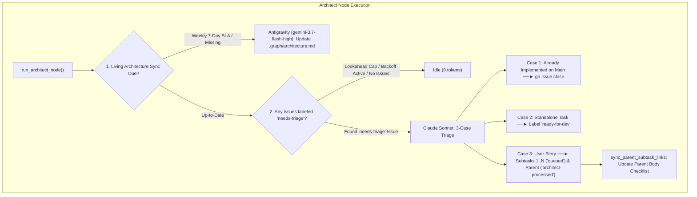

# 📋 Implementation Plan & Refinement Lifecycle: Architect Node Refactoring, Simplification & Dead-Code Removal

## 📝 Initial Draft Proposal

### Background & Objective
Perform a complete architectural clean-up of the **Architect Node** (`orchestrator/nodes/architect.py`) and its documentation (`docs/node-architect.md`):
1. **Eliminate all unused/legacy labels** (`planned`, `needs-po-review`, `tech-debt`, `enhancement`, `needs-architect-review`, `architect-approved`, `needs-refactor`).
2. **Eliminate dead PO Blackboard coupling** (`po_tracking` / `po_record` from disabled Supervisor node).
3. **Eliminate legacy `.architecture` folder references** (strictly standardizing on `.graph/architecture.md`).
4. **Streamline triage into 3 essential cases** (Already Implemented $	o$ Close, Standalone $	o$ `ready-for-dev`, Story $	o$ Subtasks `queued` + Parent `architect-processed`).
5. **Harden subprocess execution** with `GH_PROMPT_DISABLED="1"` and 10s async timeouts.
6. **Harmonize living documentation** (`docs/node-architect.md`) with the clean 2-node parallel topology.

---

## 🔍 Review Iteration 1: 3-Amigos Critical Architectural Review

- **Date / Author:** 2026-09-02 | Antigravity AI Architect
- **Target Subsystems:** `orchestrator/nodes/architect.py`, `docs/node-architect.md`, `tests/test_architect_governance.py`

### 1. Point-by-Point Deprecation & Clean-Up Matrix

| # | Item / Code Path | Current State | Verdict | Action & Clean-Up Rationale |
|---|---|---|---|---|
| 1 | **Legacy Labels (`planned`, `needs-po-review`, `tech-debt`, `enhancement`)** | Used in complex 6-case triage routing for disabled nodes (Supervisor, BAU). | **DELETE** | Remove all legacy label routings. Streamline triage into 3 clean outcomes: (1) Close if implemented, (2) Standalone $	o$ `ready-for-dev`, (3) Story $	o$ `queued` subtasks + `architect-processed` parent. |
| 2 | **PO Blackboard Coupling (`po_tracking`)** | Queries `state_manager.get_po_tracking` for pre-approved Gherkin AC from disabled Supervisor node. | **DELETE** | Remove `po_tracking` lookup from `architect.py`. The Architect triages directly from issue descriptions and project context. |
| 3 | **`.architecture` Folder References** | Legacy folder convention across older repositories. | **DELETE** | Standardize exclusively on `.graph/architecture.md`. Ensure zero references or creation of `.architecture/` directories. |
| 4 | **PR Review Pillar (`_review_pr_architecture`)** | PR review branch using `needs-architect-review`, `architect-approved`, `needs-refactor`. | **DELETE / DEPRECATE** | Remove PR architectural review loop from default Architect execution. DevTest handles autonomous CI verification and merge. |
| 5 | **Subtask Link Synchronization (`sync_parent_subtask_links`)** | Duplicate comments (lines 42-43) and tempfile editing. | **MODIFY** | Clean up duplicate comments, streamline comment parsing, and wrap all GitHub CLI subprocesses in non-interactive timeout guards. |
| 6 | **Subprocess Timeouts & Non-Interactive Safety** | Subprocesses lack `GH_PROMPT_DISABLED="1"` and timeout bounds. | **APPROVE** | Standardize all `gh` CLI executions across `architect.py` to enforce `GH_PROMPT_DISABLED="1"` and 10s async timeouts. |

---

## 💬 Review Iteration 2: Operator Directives & Scope Expansion

- **Date / Author:** 2026-09-02 | Platform Operator
- **Directives:**
  - *"I want to also remove anything that the current architect's functionality is not using, for example, different labels or whatever. And this includes the .architecture folder."*
  - Remove all unused labels, obsolete node handoffs (PO, BAU, Reviewer), and legacy folder paths.
  - Simplify Architect responsibilities strictly to: (1) Architecture standards sync (`.graph/architecture.md`) and (2) Clean 1-pass story triage & INVEST decomposition.

---

## 🎯 Final Decision Plan & User Story Specification

### 📖 User Story
**As a** Graph Engineering Platform Operator,  
**I want** the Architect governance node (`orchestrator/nodes/architect.py`) and documentation (`docs/node-architect.md`) stripped of all unused labels (`planned`, `needs-po-review`, `tech-debt`, `enhancement`, `needs-architect-review`), PO blackboard coupling, and `.architecture` legacy paths,  
**So that** the Architect node is lean, robust, 100% focused on architecture standards and 1-pass INVEST decomposition, and fully aligned with the 2-node parallel topology.

---

### 🏷️ Simplified Label Taxonomy for Architect Node

| Label | Role | Lifecycle Stage |
|---|---|---|
| **`needs-triage`** | **Trigger** | Applied to raw issues/stories awaiting Architect evaluation. |
| **`ready-for-dev`** | **Output (Standalone)** | Applied to small standalone tasks routed directly to DevTest. |
| **`architect-processed`** | **Output (Parent Story)** | Applied to parent user stories once decomposed into subtasks. |
| **`queued`** | **Output (Child Subtasks)** | Applied to all newly created subtasks (1..N) awaiting DevTest pickup. |
| **`orchestration-failed`** | **Failure Escalation** | Applied if the Architect AI harness exits with an error. |

---

### 🏗️ Streamlined Architect Architecture



---

### ✅ Acceptance Criteria (Gherkin BDD Format)

```gherkin
Feature: Architect Node Streamlining, Dead-Code Removal and Documentation Harmonization

  Scenario: Triage routes cleanly into 3 essential cases without legacy labels
    Given an issue labeled "needs-triage"
    When the Architect node executes triage
    Then it must classify into exactly one of three cases:
      | Case | Action | Output Label / State |
      | Case 1: Already Implemented | Close Issue | CLOSED |
      | Case 2: Standalone Task | Route to DevTest | ready-for-dev |
      | Case 3: User Story | Decompose Subtasks | Subtasks: queued, Parent: architect-processed |
    And it must not use legacy labels ("planned", "needs-po-review", "tech-debt", "enhancement").

  Scenario: Subprocess calls in Architect enforce non-interactive timeout protection
    Given any GitHub CLI subprocess execution within "orchestrator/nodes/architect.py"
    When the subprocess is launched
    Then it must execute with environment variable "GH_PROMPT_DISABLED=1"
    And terminate cleanly with a TimeoutError if execution exceeds 10.0 seconds.

  Scenario: Architecture standards reside strictly in .graph/architecture.md
    Given the Architect Living Architecture sync
    When checking or updating standards
    Then it must operate exclusively on ".graph/architecture.md"
    And must not reference or create any ".architecture" directory.

  Scenario: Documentation accurately depicts the streamlined 2-pillar Architect node
    Given the documentation file "docs/node-architect.md"
    When inspected by an operator or test suite
    Then it must depict only the 2 active pillars (Living Architecture Plane & Story Triage)
    And document the simplified label taxonomy without legacy labels.
```

---

### 📦 Component Impact Table

| File Path | Component / Layer | Nature of Change |
|---|---|---|
| `orchestrator/nodes/architect.py` | Domain Core (Architect) | Remove unused labels (`planned`, `needs-po-review`, `tech-debt`, `enhancement`), remove `po_tracking` Blackboard queries, remove PR review loop, streamline 3-case triage prompt, add `GH_PROMPT_DISABLED="1"` and 10s async timeouts, clean up `sync_parent_subtask_links`. |
| `docs/node-architect.md` | Documentation | Update to depict the 2 streamlined pillars (Architecture Plane & Story Triage), document the clean label taxonomy, remove references to legacy labels and obsolete reviewer handoffs. |
| `tests/test_architect_governance.py` | Testing (Unit & BDD) | Update tests to reflect clean 3-case triage, test timeout protections, and remove obsolete Blackboard/legacy label tests. |
