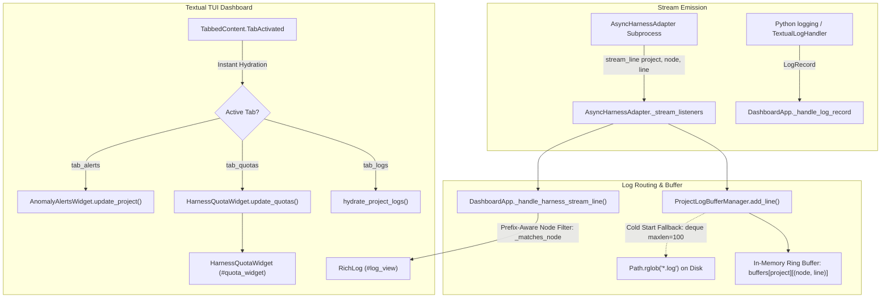

# 📋 Implementation Plan & Refinement Lifecycle: TUI Quota Limits Observability & Reactive Log Stream

## 📝 Initial Draft Proposal

### Phase 1: Functional & DX (Developer Experience) Review

#### 1. Workflow Analysis & Multi-Pane Observability Journey

The screenshots reveal two critical failures in the reactive Textual TUI (`orchestrator/ui/dashboard.py`):

1. **Empty Quota Limits Pane:** Selecting the `Quota Limits` tab renders an entirely blank container instead of displaying multi-window progress bars, percentage indicators, reset countdown timers, and runway forecasts.
2. **Silent Log Viewer Pane:** Selecting the `Logs` tab while an active project/node is highlighted (`biq-playbook` with `architect_research`) renders nothing.

```
[Agent Subprocess / Python Loggers]                 [SQLite `token_usage_events`]
              │                                                     │
              ▼                                                     ▼
  [ProjectLogBufferManager]                                   [QuotaManager]
  (In-Memory Ring Buffer:                                     (Rolling 5h & 168h
   `buffers[proj][node]`)                                      Aggregations)
              │                                                     │
              └───────────────────────┬─────────────────────────────┘
                                      ▼
                        [orchestrator/ui/dashboard.py]
                           (2.0s Timer & Tab Events)
                                      │
               ┌──────────────────────┴──────────────────────┐
               ▼                                             ▼
     [Logs Tab: RichLog]                         [Quota Limits Tab: Static/Grid]
     • Read In-Memory Deque                      • Render 5h & Weekly Gauges
     • Disk-Tail Fallback if Empty               • Render Forecast & Reset Timers
     • Live Node-Scoped Stream                   • Dynamic Color Thresholds
```

* **Friction Points Identified:**
* **Tab Content Mounting Gap:** `TabbedContent` in `orchestrator/ui/dashboard.py` initializes tab panes, but `QuotaLimitsWidget` is either not mounted into `#tab_quota` or fails silently during render due to `None` values returned on a cold database.
* **Event Disconnection on Tab Switching:** Clicking between `Logs` and `Quota Limits` does not trigger an immediate redraw event (`TabbedContent.TabActivated`). The UI stays blank until the next 2.0s background timer tick.
* **Custom Node Identifier Mismatch:** Node names with custom suffixes (e.g., `architect_research`) are not mapped to standard log buffers if string parsing expects strict enum values (`architect`, `devtest`).
* **Subprocess Stream Listener Decoupling:** `AsyncHarnessAdapter` stdout streams in `orchestrator/harness.py` are not broadcasting live lines to the active project's log buffer.

---

#### 2. Edge Cases & Resilience Strategy

* **Cold-Start Token Quota State:** If `token_usage_events` has zero records, `QuotaManager` queries return `None` or `0`. The UI must explicitly render `100% Remaining (0 / <limit>)` with full green bars rather than collapsing or failing to render.
* **Custom / Dynamic Node Names:** The log router must accept arbitrary node string identifiers (e.g., `architect_research`, `devtest_review`, `bau_triage`) without dropping lines.
* **Cold-Start Disk Tail Fallback:** If `biq-playbook` has no active in-memory lines, the dashboard must read the last 100 lines from disk (`~/.config/orchestrator/logs/biq-playbook/*.log` or `<local_path>/.graph/logs/`) upon tab or project selection.
* **Thread-Safe Textual Execution:** Log appends from background async workers must be routed exclusively through `self.app.call_from_thread()` to prevent race conditions and widget lockouts.

---

#### 3. Acceptance Criteria (BDD Format)

```gherkin
Scenario: Quota Limits tab renders live dual-window gauges on selection
  Given the TUI dashboard is active
  When the operator clicks on the "Quota Limits" tab
  Then the widget must immediately render 5-hour and weekly capacity progress bars for all configured harnesses
  And each harness section must display the remaining tokens, percentage, reset countdown, and burn-rate forecast
  And fresh databases with 0 recorded tokens must render full 100% capacity bars without crashing.

Scenario: Logs pane streams active node output for the selected project
  Given the project "biq-playbook" is highlighted with active node "architect_research"
  When the operator selects the "Logs" tab
  Then the "RichLog" widget must display the execution logs scoped to "biq-playbook" and "architect_research"
  And live stdout emitted by the harness subprocess must append in real time.

Scenario: Tab switching immediately triggers view hydration
  Given the operator switches between the "Logs" and "Quota Limits" tabs
  When the "TabActivated" event fires
  Then the dashboard must refresh the active tab pane synchronously without waiting for the next 2.0s background polling tick.

Scenario: Cold-start disk fallback hydrates logs when in-memory buffer is empty
  Given a project row is selected but the daemon was recently launched (in-memory buffer is empty)
  When the log view renders
  Then it must tail the last 100 lines from the latest log file on disk and populate the view.
```

---

## 🔍 Review Iteration 1: 3-Amigos Critical Architectural Review

- **Date / Author:** 2026-09-01 | Antigravity AI Architect
- **Target Subsystems:** `orchestrator/ui/dashboard.py`, `orchestrator/ui/widgets.py`, `orchestrator/logging.py`, `orchestrator/quota.py`

### 1. Point-by-Point Verdict Matrix

| # | Proposed Item | Initial Proposal | Verdict | Technical Rationale & Architectural Reconciliation |
|---|---|---|---|---|
| 1 | **Quota Limits Widget Architecture** | Create a new `QuotaLimitsWidget(VerticalScroll)` with nested `ProgressBar` widgets. | **MODIFY** | **Anti-Pattern (Class Duplication):** The codebase already has `HarnessQuotaWidget(DataTable)` in `orchestrator/ui/widgets.py` which renders dual progress gauges (5h + weekly), token balances, percentages, threshold colors (`[green]`, `[yellow]`, `[bold red]`), runway forecast, reset countdown, and breakdown columns. Creating a redundant `QuotaLimitsWidget` introduces duplicate rendering logic. We should retain and optimize `HarnessQuotaWidget`, ensuring smooth hydration on mount and tab switch. |
| 2 | **Instant Tab Switch Hydration** | Add `@on(TabbedContent.TabActivated)` to `DashboardApp` to trigger synchronous tab redrawing. | **APPROVE** | **Critical DX Fix:** Currently `DashboardApp` lacks a `TabActivated` listener. When switching between `Logs`, `Quota Limits`, and `Alerts`, the user sees stale or unrendered panes until the next 2.0s polling interval. Adding `on_tab_activated` triggers instant, non-blocking refresh of the active pane. |
| 3 | **Dynamic / Compound Node Name Log Filtering** | Relax strict node name equality in `ProjectLogBufferManager` and `DashboardApp` for composite names like `architect_research`. | **APPROVE** | **Bug Remediation:** In `DashboardApp._handle_harness_stream_line` and `_handle_log_record`, lines are dropped when `line_node != self.selected_node`. When the project table highlights `architect` but the subprocess logs `architect_research` (or vice versa), strict inequality silently discards the stream. We must implement prefix/family matching and aggregate fallback. |
| 4 | **Cold-Start Disk Log Fallback** | Tail the last 100 lines from disk when in-memory deque is empty for a selected project/node. | **APPROVE** | **Resilience Invariant:** `ProjectLogBufferManager.tail_latest_project_logs` must inspect `<log_dir>/<project_name>/**/*.log` if node-specific directories (e.g., `architect_research`) do not exist on disk, falling back gracefully without returning empty arrays. |
| 5 | **Cold-Start Zero-Token Resilience** | Ensure fresh databases with 0 token events render 100% capacity and "Runway: Idle (∞)". | **APPROVE** | `QuotaManager.calculate_dashboard_metrics` and `StateManager.get_multi_window_usage` already handle 0 token sums safely without `ZeroDivisionError`. We will reinforce explicit tests for empty databases. |

---

## 💬 Review Iteration 2: Operator / Stakeholder Feedback & Directives

- **Date / Author:** 2026-09-01 | Platform Operator
- **Key Directives & Guidance Provided:**
  1. **Strict Class Reuse:** Explicitly confirmed that no new `QuotaLimitsWidget` should be created. Retain and harden `HarnessQuotaWidget`.
  2. **Prefix-Aware Node Filtering:** Implement `.startswith()` / prefix matching in `_handle_harness_stream_line` and `_handle_log_record` to bridge the gap between base node names (e.g. `architect`) and variant/sub-phase identifiers (e.g. `architect_research`).
  3. **Non-Blocking Tail Mechanism:** Use bounded deque reads (`deque(file, maxlen=100)`) or tail slice logic to ensure reading cold-start disk logs never blocks the asyncio event loop or the Textual UI.
  4. **Dynamic Wildcard Scope Headers:** Format the `RichLog` border title to display `Logs [Scope: biq-playbook | architect*]` to clarify active wildcard filtering.

---

## 🔍 Review Iteration 3: Architectural Reconciliation & Alignment

- **Date / Author:** 2026-09-01 | Antigravity AI Architect
- **Reconciliation & Technical Invariants:**
  1. **Event Binding (`TabbedContent.TabActivated`):**
     - Map `tab_quotas` to `HarnessQuotaWidget.update_quotas(config=self.config, state_manager=self.state_manager, quota_manager=self.quota_manager)`.
     - Map `tab_logs` to `self.hydrate_project_logs(self.selected_project, node_name=self.selected_node)`.
     - Map `tab_alerts` to `AnomalyAlertsWidget.update_project(self.selected_project, hours=24.0)`.
  2. **Fuzzy Prefix Matching Utility (`_matches_node`):**
     - A helper `_matches_node(selected_node, target_node)` evaluates `True` if `selected_node is None`, `selected_node == target_node`, `target_node.startswith(selected_node)`, `selected_node.startswith(target_node)`, or root family prefixes match (`selected_node.split('_')[0] == target_node.split('_')[0]`).
  3. **Thread-Safe Subprocess Log Pipeline:**
     - All live streaming callbacks continue using `self.call_from_thread(log_view.write, line)` to prevent UI thread contention.
  4. **Cold-Start Disk Tailing:**
     - `ProjectLogBufferManager.tail_latest_project_logs` uses `Path.rglob("*.log")` bounded to the last 100 lines using `collections.deque(f, maxlen=max_lines)`.

---

## 🎯 Final Decision Plan & User Story Specification

### 📖 User Story
**As a** Graph Engineering Platform Operator,  
**I want** the Textual TUI dashboard (`orchestrator watch`) to instantly render dual-window quota progress gauges in the "Quota Limits" tab upon tab selection and stream real-time logs for active nodes (including compound node sub-phases like `architect_research`) in the "Logs" tab,  
**So that** I have immediate, uninterrupted observability across AI token capacities and active agent executions without blank panes or dropped logs.

---

### 🏗️ Architecture & Component Flow



---

### ✅ Acceptance Criteria (Gherkin BDD Format)

```gherkin
Feature: TUI Quota Limits Observability and Reactive Node-Scoped Log Stream

  Scenario: Quota Limits tab renders immediately upon tab activation
    Given the TUI dashboard is active with configured harnesses
    When the operator clicks on the "Quota Limits" tab (id="tab_quotas")
    Then the "TabActivated" event must immediately invoke "HarnessQuotaWidget.update_quotas"
    And the widget must render 5-hour and weekly capacity progress bars with threshold coloring
    And fresh databases with 0 recorded tokens must render 100% capacity without errors.

  Scenario: Logs tab streams compound and sub-phase node logs without dropping
    Given project "biq-playbook" is selected with active node "architect"
    When the harness emits subprocess logs tagged with node "architect_research"
    Then the log filter must recognize the node family prefix "architect"
    And the "RichLog" widget must display the line in real time
    And the buffer manager must record the line under "biq-playbook".

  Scenario: Tab switching immediately triggers synchronous view hydration
    Given the operator switches between the "Logs", "Quota Limits", and "Alerts (24h)" tabs
    When the "TabActivated" event fires
    Then the dashboard must refresh and redraw the active pane immediately without waiting for the 2.0s timer.

  Scenario: Cold-start disk fallback recovers logs when memory buffer is empty
    Given a project is selected but the daemon was recently restarted (in-memory buffer is empty)
    When "hydrate_project_logs" executes for that project
    Then it must tail the last 100 lines using a bounded deque from disk logs under "<log_dir>/<project_name>/**/*.log"
    And populate the "RichLog" widget.
```

---

### 📦 Component Impact Table

| File Path | Component / Layer | Nature of Change |
|---|---|---|
| `orchestrator/ui/dashboard.py` | Presentation (TUI) | Add `@on(TabbedContent.TabActivated)` handler for instant pane hydration. Relax node matching in `_handle_harness_stream_line` and `_handle_log_record` using `_matches_node()` to support compound node names (`architect_research`). Update border title with wildcard indicator. |
| `orchestrator/logging.py` | Domain Core (Logging) | Update `ProjectLogBufferManager.get_project_logs` and `tail_latest_project_logs` to support prefix matching (`architect` matches `architect_research`) and bounded deque tailing across `<project_name>/**/*.log`. |
| `orchestrator/ui/widgets.py` | Presentation (Widgets) | Ensure `HarnessQuotaWidget` handles cold-start / unmounted redraws gracefully with smooth keyed in-place diffing. |
| `tests/test_dashboard.py` | Testing (TUI Integration) | Add BDD unit and integration tests verifying `TabActivated` hydration, compound node log streaming, and zero-token quota rendering. |
| `tests/test_logging.py` | Testing (Logging) | Add test cases verifying prefix node log filtering and bounded deque disk log tailing. |

---

### 📋 INVEST-Compliant Subtask Decomposition

1. **Subtask 1: Instant Tab Activation Hydration in `DashboardApp` (`orchestrator/ui/dashboard.py`)**
   - Bind `@on(TabbedContent.TabActivated)`.
   - Dispatch immediate refresh to `hydrate_project_logs()` for `#tab_logs`, `HarnessQuotaWidget.update_quotas()` for `#tab_quotas`, and `AnomalyAlertsWidget.update_project()` for `#tab_alerts`.

2. **Subtask 2: Compound Node Prefix Matching & Log Resilience (`orchestrator/logging.py`, `orchestrator/ui/dashboard.py`)**
   - Implement `_matches_node()` helper supporting prefix and family matching (e.g. `architect` matches `architect_research`).
   - Relax `_handle_harness_stream_line` and `_handle_log_record` so sub-phase node logs stream live into the selected project's `RichLog` view.
   - Update `tail_latest_project_logs` with bounded `deque(f, maxlen=max_lines)` and recursive `<project_name>/**/*.log` fallback.

3. **Subtask 3: Unit & BDD Integration Test Suite (`tests/test_dashboard.py`, `tests/test_logging.py`)**
   - Test tab activation triggering instant widget updates.
   - Test streaming and retrieval of compound node logs (`architect_research`).
   - Test cold-start disk fallback and 100% capacity quota rendering on empty databases.
