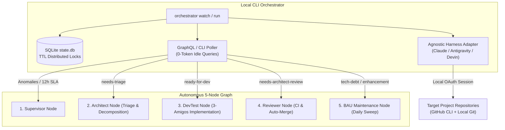

# Local CLI Pipeline & Multi-Agent Orchestrator (`graph-orchestrator`)

The Python Orchestrator CLI (`graph-orchestrator`) is the unified execution engine for the Graph Engineering autonomous SDLC. It operates directly on the developer's local machine, orchestrating autonomous AI agents (`claude`, `agy`, `devin`) via local OAuth sessions without paying per-token cloud API charges.

---

## 🏛️ Architectural Overview



---

## 🔑 Core Capabilities

1. **Zero-Token Gating**:
   - The poller queries GitHub issue and PR metadata using `gh` CLI JSON output before invoking any LLM.
   - When no work is waiting, nodes idle with **0 LLM tokens consumed**.

2. **Agnostic AI Harness Adapter**:
   - Seamlessly switches between **Claude Code CLI** (`claude`), **Antigravity CLI** (`agy`), or **Devin CLI** (`devin`) via YAML configuration without altering application code.
   - Leverages active local developer subscriptions (`Claude Pro/Max`, `Google Antigravity`).

3. **Concurrency Control & TTL State Database (`state.db`)**:
   - SQLite WAL database (`~/.config/orchestrator/state.db` or `%USERPROFILE%\.orchestrator\state.db`) manages atomic run locks.
   - Locks automatically expire after node timeouts (`ttl_minutes`), preventing deadlocks from abrupt process termination.

4. **Multi-Project Support**:
   - Concurrently monitors and processes multiple repositories defined in `config.yaml`.

---

## ⚙️ Configuration Schema (`config.yaml`)

Configuration is stored at `~/.config/orchestrator/config.yaml` (Linux/macOS) or `%USERPROFILE%\.orchestrator\config.yaml` (Windows).

```yaml
version: "1.0"

settings:
  poll_interval_seconds: 300          # 5 minutes polling interval for daemon
  supervisor_interval_seconds: 3600   # 1 hour supervisor check interval
  bau_interval_seconds: 86400         # 24 hours BAU maintenance interval
  db_path: "~/.config/orchestrator/state.db"
  log_dir: "~/.config/orchestrator/logs"

harnesses:
  claude:
    command: "claude"
    args: ["-p", "{prompt}", "--dangerously-skip-permissions"]
    timeout_minutes: 30
  antigravity:
    command: "agy"
    args: ["-p", "{prompt}", "--dangerously-skip-permissions", "--print-timeout", "45m"]
    timeout_minutes: 45

managed_labels:
  - name: "needs-triage"
    color: "E2B7E1"
  - name: "ready-for-dev"
    color: "0E8A16"
  - name: "needs-architect-review"
    color: "FBCA04"
  - name: "dev-implemented"
    color: "C2E0C6"
  - name: "orchestration-failed"
    color: "B60205"
  - name: "needs-po-review"
    color: "D93F0B"
  - name: "architect-processed"
    color: "D4C5F9"
  - name: "tech-debt"
    color: "FBCA04"
  - name: "enhancement"
    color: "A2EEEF"

projects:
  - name: "crosstrainingapp"
    repo: "AntaresAndBharani/crosstrainingapp"
    local_path: "c:/Users/rogal/workspaces/ws-setups/crosstrainingapp"
    context_files:
      - "architecture.md"
    nodes:
      supervisor:
        enabled: true
        harness: "antigravity"
        model: "gemini-3.7-flash-low"
      architect:
        enabled: true
        harness: "claude"
        model: "claude-sonnet-5"
        effort: "medium"
        label_trigger: "needs-triage"
        label_output: "ready-for-dev"
      devtest:
        enabled: true
        harness: "antigravity"
        model: "gemini-3.7-flash-medium"
        label_trigger: "ready-for-dev"
        label_output: "needs-architect-review"
        branch_prefix: "feat/issue-"
        auto_merge_approved: true
      reviewer:
        enabled: true
        harness: "claude"
        model: "claude-sonnet-5"
        effort: "medium"
        label_trigger: "needs-architect-review"
        auto_merge_approved: true
      bau:
        enabled: true
        harness: "antigravity"
        model: "gemini-3.7-flash-low"
```

---

## 💻 CLI Commands & Usage

### 1. Installation
Install the CLI in editable mode inside your Python virtual environment:
```bash
git clone https://github.com/AntaresAndBharani/graph-engineering.git
cd graph-engineering
pip install -e .
```

### 2. System Diagnostics (`doctor`)
Inspect prerequisite binaries (`git`, `gh`, `claude`, `agy`), authentication status, database, and repository paths:
```bash
orchestrator doctor
```

### 3. Initialize & Synchronize Labels (`labels`, `init`)
Automatically create or synchronize all 9 taxonomy labels across all configured GitHub repositories:
```bash
# Provision config and labels
orchestrator init

# Synchronize labels on GitHub
orchestrator labels
```

### 4. Single On-Demand Run (`run`)
Execute an immediate single pass across all projects (or target a specific project / node):
```bash
# Run all projects
orchestrator run

# Run specific project
orchestrator run --project crosstrainingapp

# Force run a specific node
orchestrator run --project crosstrainingapp --node bau --force
```

### 5. Continuous Autonomous Daemon (`watch`)
Start the multi-agent orchestration daemon:
```bash
orchestrator watch
```

---

## 🗄️ Lock Management & Self-Healing

The SQLite database (`state.db`) prevents concurrency races across nodes:
- **Lock Acquisition**: When a node picks up an issue, it inserts a record with a TTL (`CURRENT_TIMESTAMP + ttl_minutes`).
- **Orphan Lock Expiration**: If a node crashes, subsequent evaluations automatically evict stale expired locks.
- **Fail-safe Transitions**: If a harness returns a non-zero exit code, the job is recorded as `FAILED` and the issue is labeled `orchestration-failed` with a link to the execution log in `~/.config/orchestrator/logs/`.
