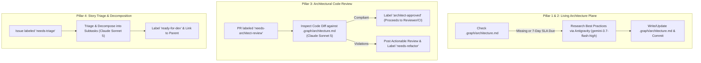

# Architect & Governance Node (`node-architect`)

**Module**: [`orchestrator/nodes/architect.py`](file:///c:/Users/rogal/workspaces/ws-setups/graph-engineering/orchestrator/nodes/architect.py)

The **Architect Node** acts as the primary technical authority, living architecture custodian, and quality gatekeeper in the graph engineering pipeline.

---

## 🏛️ The 3 Pillars of Architectural Governance



---

## 💡 Dual-Model Specialization

To maximize reasoning depth while drastically minimizing token costs:

| Responsibility | Model / Harness | Why |
|---|---|---|
| **Living Architecture Plane Sync** | **Antigravity (`gemini-3.7-flash-high`)** | High-volume web research, massive context ingestion, and cost-effective writing of `.graph/architecture.md`. |
| **PR Architectural Code Review** | **Claude Sonnet (`claude-sonnet-5`)** | Deep reasoning on code diffs, contract verification, and identifying architectural anti-patterns. |
| **Story Triage & Decomposition** | **Claude Sonnet (`claude-sonnet-5`)** | High-precision classification, INVEST decomposition, and Gherkin specification. |

---

## 🔑 Operational Capabilities

### 1. Living Architecture Plane Custodian (`.graph/architecture.md`)
- If `.graph/architecture.md` is missing from the repository, the Architect automatically inspects the codebase and bootstraps the baseline standards.
- Every 7 days (weekly SLA tracked in `state.db`), Antigravity performs a modern best-practice sweep of the web and updates `.graph/architecture.md`.

### 2. Architectural PR Code Review (`needs-architect-review`)
- Inspects code diffs exclusively through an **architectural lens**:
  - *Are Clean Architecture layers and domain boundaries respected?*
  - *Are there circular dependencies or inappropriate coupling?*
  - *Does the implementation adhere to package and pattern rules in `.graph/architecture.md`?*
- **Approved**: Labels `architect-approved`, signaling the `Reviewer` node to verify CI and auto-merge.
- **Refactoring Required**: Posts detailed review comments and returns the task to `DevTest` with `needs-refactor`.

### 3. Story Triage, INVEST Decomposition & Lookahead Gating (`needs-triage`)
- **Zero-Token Lookahead Gating**: Queries SQLite WAL state (`StateManager.count_planned_stories`) before dispatching AI harnesses. If the planned stories count reaches `max_planned_stories` (default `2`), decomposition is paused with zero token consumption.
- **Isolated Worktree Execution**: Operates inside an isolated git worktree (`.graph/worktrees/architect_<project>`) managed by `WorktreeManager`, preserving DevTest and primary workspace integrity.
- **Active-Story Concurrency Awareness**:
  - If no active story is currently running: Subtask 1 is labeled `ready-for-dev` (active) and Subtasks 2..N are labeled `queued`.
  - If an active story is currently running: All subtasks (1..N) are labeled `queued` and the parent story is labeled `planned` and recorded in `PLANNED` state.
- Ingests pre-approved **Gherkin Acceptance Criteria** from the `po_tracking` Blackboard table when available (status `PO_APPROVED`), preventing redundant requirement re-derivation.
- Decomposes complex user stories into minimal, testable technical subtasks following INVEST principles.
- Links the parent story (`Parent: #<issue_id>`) and synchronizes the parent checklist.

---

## ⚙️ Configuration

Configured in `~/.config/orchestrator/config.yaml`:

```yaml
projects:
  - name: "crosstrainingapp"
    repo: "AntaresAndBharani/crosstrainingapp"
    local_path: "~/workspaces/crosstrainingapp"
    context_files:
      - ".graph/architecture.md"
      - ".graph/testing-standards.md"
      - ".graph/git-workflow.md"
    nodes:
      architect:
        enabled: true
        # Primary Harness for PR Review & Story Decomposition
        harness: "claude"
        model: "claude-sonnet-5"
        effort: "medium"
        label_trigger: "needs-triage"
        label_output: "ready-for-dev"
        review_trigger: "needs-architect-review"
        # Specialized Research Harness for Weekly Architecture Modernization
        research_harness: "antigravity"
        research_model: "gemini-3.7-flash-high"
        research_interval_seconds: 604800  # 7 days (weekly)
```
