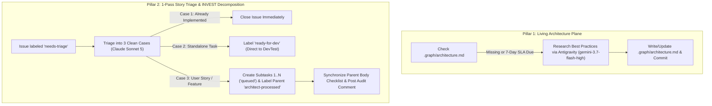

# Architect & Governance Node (`node-architect`)

**Module**: [`orchestrator/nodes/architect.py`](file:///c:/Users/rogal/workspaces/ws-setups/graph-engineering/orchestrator/nodes/architect.py)

The **Architect Node** acts as the primary technical authority, living architecture custodian, and quality gatekeeper in the graph engineering pipeline.

---

## 🏛️ The 2 Core Pillars of Architectural Governance



---

## 💡 Dual-Model Specialization

To maximize reasoning depth while drastically minimizing token costs:

| Responsibility | Model / Harness | Why |
|---|---|---|
| **Living Architecture Plane Sync** | **Antigravity (`gemini-3.7-flash-high`)** | High-volume web research, massive context ingestion, and cost-effective authoring of `.graph/architecture.md`. |
| **Story Triage & INVEST Decomposition** | **Claude Sonnet (`claude-sonnet-5`)** | High-precision classification, INVEST subtask decomposition, and Gherkin specification. |

---

## 🔑 Operational Capabilities

### 1. Living Architecture Plane Custodian (`.graph/architecture.md`)
- If `.graph/architecture.md` is missing from the repository, the Architect automatically inspects the codebase and bootstraps the baseline standards.
- Every 7 days (weekly SLA tracked in `state.db`), Antigravity performs a modern best-practice sweep of the web and updates `.graph/architecture.md`.
- Operates strictly on `.graph/architecture.md` with zero legacy `.architecture/` directories.

### 2. 1-Pass Story Triage & INVEST Decomposition (`needs-triage`)
- **Zero-Token Lookahead Gating**: Queries SQLite WAL state (`StateManager.count_planned_stories`) before dispatching AI harnesses. If the planned stories count reaches `max_planned_stories` (default `2`), decomposition is paused with zero token consumption.
- **Restart-Resilient Idle Backoff**: Backs off during idle periods (`lookahead_backoff_seconds`, default `1200s`) to minimize GitHub API rate limits.
- **Isolated Worktree Execution**: Operates inside an isolated git worktree (`.graph/worktrees/architect_<project>`) managed by `WorktreeManager`, preserving DevTest and primary workspace integrity.
- **1-Pass All-Queued Invariant**:
  - All newly created subtasks (1..N) are labeled **`queued`** with `Parent: #<issue_id>` in their bodies.
  - The parent story is transitioned to **`architect-processed`**.
  - DevTest sequentially activates Subtask 1 (`queued` $	o$ `ready-for-dev`) on pickup, preventing race conditions.
- **Parent Subtask Checklist Sync**: Automatically updates the parent issue body with a structured `- [ ] #<subtask_id> - <title>` markdown checklist and posts an audit comment.

---

## 🏷️ Label Taxonomy

| Label | Role | Lifecycle Stage |
|---|---|---|
| **`needs-triage`** | **Trigger** | Applied to raw issues/stories awaiting Architect evaluation. |
| **`ready-for-dev`** | **Output (Standalone)** | Applied to small standalone tasks routed directly to DevTest. |
| **`architect-processed`** | **Output (Parent Story)** | Applied to parent user stories once decomposed into subtasks. |
| **`queued`** | **Output (Child Subtasks)** | Applied to all newly created subtasks (1..N) awaiting DevTest pickup. |
| **`orchestration-failed`** | **Failure Escalation** | Applied if the Architect AI harness exits with an error. |

---

## ⚙️ Configuration

Configured in `~/.config/orchestrator/config.yaml`:

```yaml
projects:
  - name: "crosstrainingapp"
    repo: "AntaresAndBharani/crosstrainingapp"
    local_path: "~/workspaces/crosstrainingapp"
    context_files:
      - ".graph/architecture.md"
      - ".graph/testing-standards.md"
      - ".graph/git-workflow.md"
    nodes:
      architect:
        enabled: true
        # Primary Harness for Story Triage & INVEST Decomposition
        harness: "claude"
        model: "claude-sonnet-5"
        effort: "medium"
        label_trigger: "needs-triage"
        label_output: "ready-for-dev"
        processed_label: "architect-processed"
        queued_label: "queued"
        # Lookahead Gating & Backoff (seconds)
        lookahead_backoff_seconds: 1200
        # Specialized Research Harness for Weekly Architecture Modernization
        research_harness: "antigravity"
        research_model: "gemini-3.7-flash-high"
        research_interval_seconds: 604800  # 7 days (weekly)
```
