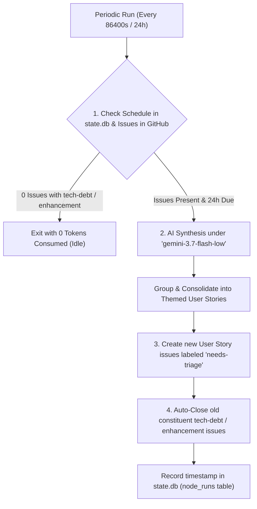

# BAU Maintenance Node (`node-bau`)

> [!NOTE]
> **Status: Optional / Disabled by Default** (`enabled: false`).  
> In the streamlined 2-node parallel topology, the daily 24-hour BAU maintenance sweep is dormant by default. It can be enabled in `config.yaml` (`nodes.bau.enabled: true`) or invoked on demand via `orchestrator run --node bau --force`.

**Module**: [`orchestrator/nodes/bau.py`](file:///c:/Users/rogal/workspaces/ws-setups/graph-engineering/orchestrator/nodes/bau.py)

The **BAU (Business-As-Usual) Node** acts as Node 4 in the pipeline—a continuous maintenance and technical debt consolidation engine running on a periodic daily schedule (every 24 hours).

---

## 🏛️ Operational Flow



---

## 🔑 Operational Capabilities

1. **24-Hour Interval Enforcement**:
   - Backed by the `node_runs` table in SQLite (`state.db`).
   - Ensures the maintenance consolidation pass runs only once every 24 hours (`bau_interval_seconds: 86400`), even during rapid daemon polling.
   - Can be triggered manually on demand via `orchestrator run --project <name> --node bau --force`.

2. **Zero-Token Idle Gating**:
   - Queries GitHub CLI for open issues carrying `tech-debt` or `enhancement` labels.
   - When no backlog items exist, exits instantly consuming **0 tokens**.

3. **Structured User Story Synthesis**:
   - Uses `gemini-3.7-flash-low` (harness: `antigravity`) for fast, lightweight synthesis.
   - Groups related issues into cohesive User Stories complete with **Gherkin acceptance criteria**.

4. **Automated Lifecycle & Hand-off**:
   - Tags newly synthesized User Stories with **`needs-triage`**, automatically ready for the **Architect Node** on its next sweep.
   - Closes the constituent source issues with an audit comment linking to the new parent story.

---

## ⚙️ Configuration

Configured in `~/.config/orchestrator/config.yaml`:

```yaml
settings:
  bau_interval_seconds: 86400         # 24 hours interval

projects:
  - name: "crosstrainingapp"
    repo: "AntaresAndBharani/crosstrainingapp"
    nodes:
      bau:
        enabled: false               # Optional / Disabled by default
        harness: "antigravity"
        model: "gemini-3.7-flash-low"
```
