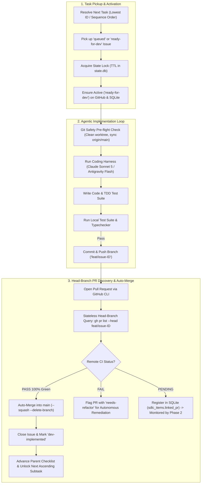

# 3-Amigos DevTest Node (`node-devtest`)

**Module**: [`orchestrator/nodes/devtest.py`](file:///c:/Users/rogal/workspaces/ws-setups/graph-engineering/orchestrator/nodes/devtest.py)

The **DevTest Node** acts as Node 2 in the autonomous pipeline—responsible for test-driven code implementation, local test suite verification, pull request creation, remote CI monitoring, and autonomous squash-merging.

---

## 🏛️ Operational Flow



---

## 🔑 Operational Capabilities

### 1. Label-Agnostic Ascendant Order Task Pickup
- Resolves actionable tasks in **ascending ID / sequence order** via SQLite CTE queries (`StateManager.get_next_devtest_task`).
- It is **label-agnostic**: whether tasks are labeled `queued` or `ready-for-dev`, it deterministically resolves the lowest open subtask under the active User Story (or standalone tasks if no story is active).
- Upon pickup, DevTest ensures the task is activated to `ready-for-dev`, acquires the state lock, and begins execution.

### 2. Ephemeral Worktree Isolation & Git Pre-Flight Safety
- Operates in its dedicated ephemeral git worktree (`.graph/worktrees/devtest_<project>`) managed via `WorktreeManager`.
- Executes non-destructive `clean_worktree` with stash protection before and after runs.

### 3. Agnostic Coding Harness Execution
- Executes via the configured harness adapter:
  - **Claude Sonnet 5 (`claude-sonnet-5`)** for deep architectural reasoning, large code refactors, and complex multi-file implementations.
  - **Antigravity (`gemini-3.7-flash-medium`)** for rapid, cost-effective TDD batch implementation.

### 4. Deterministic Head-Branch PR Discovery (Zero Search Lag)
- Queries PRs directly via exact Git head branch ref (`gh pr list --head feat/issue-<id>`), bypassing GitHub full-text search indexing delays.
- Stores the integer `linked_pr` foreign key in SQLite `sdlc_items` for instant, query-free lifecycle management.

### 5. Autonomous E2E Remote CI Verification & Squash-Merge
- Validates remote GitHub Actions CI checks (`check_pr_ci_status`).
- When CI passes **100% Green**:
  - Approves and squash-merges into `main` (`gh pr merge <pr_number> --squash --delete-branch`).
  - Closes the issue with label **`dev-implemented`**.
  - Checks off `- [x] #<id>` in the parent story body checklist.
  - Unlocks the next ascending subtask (`queued` $	o$ `ready-for-dev`).
  - When 100% of child subtasks are merged, automatically closes the parent story and promotes the next planned story.
- When remote CI fails:
  - Tags the PR with **`needs-refactor`** with details on failing checks for autonomous remediation.

---

## ⚙️ Configuration

Configured in `~/.config/orchestrator/config.yaml`:

```yaml
projects:
  - name: "crosstrainingapp"
    repo: "AntaresAndBharani/crosstrainingapp"
    local_path: "~/workspaces/crosstrainingapp"
    nodes:
      devtest:
        enabled: true
        # Coding Harness (Claude Sonnet 5 or Antigravity)
        harness: "claude"
        model: "claude-sonnet-5"
        effort: "medium"
        label_trigger: "ready-for-dev"
        label_output: "dev-implemented"
        queued_label: "queued"
        branch_prefix: "feat/issue-"
        auto_merge_approved: true
```
