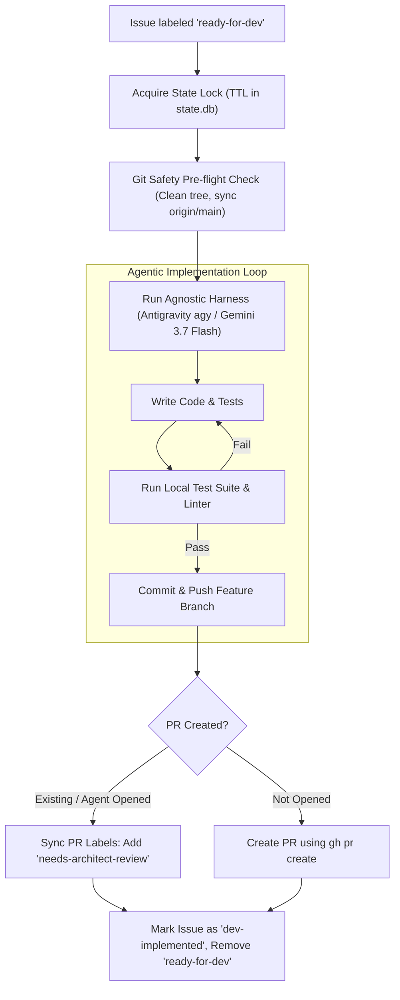

# 3-Amigos DevTest Node (`node-devtest`)

**Module**: [`orchestrator/nodes/devtest.py`](file:///c:/Users/rogal/workspaces/ws-setups/graph-engineering/orchestrator/nodes/devtest.py)

The **DevTest Node** acts as Node 2 in the pipeline—responsible for test-driven code implementation, local test suite verification, and pull request creation.

---

## 🏛️ Operational Flow



---

## 🔑 Operational Capabilities

1. **Deterministic Git Safety Pre-Flight**:
   - Verifies the local working directory is clean (`git status --porcelain`).
   - Checks out the default branch (`main`) and pulls the latest remote commits (`git pull origin main`).
   - Aborts safely with an alert if uncommitted changes or dirty working trees are detected.

2. **Agnostic Harness & Local OAuth Execution**:
   - Executes via the configured harness adapter (`antigravity`, `claude`, or `devin`).
   - Configured with extended print timeouts (`--print-timeout 45m`) for long multi-step compilation and testing runs.

3. **Autonomous PR Detection**:
   - If the AI harness autonomously branches (`feat/issue-<id>`), commits, and creates a Pull Request via GitHub CLI, the DevTest node automatically discovers the open PR.
   - Automatically synchronizes PR metadata: attaches **`needs-architect-review`** and transitions the subtask issue to **`dev-implemented`**.

4. **Context-Aware Conflict Resolution (Blackboard Pattern)**:
   - Queries the local SQLite Blackboard (`pr_artifacts` table) before execution.
   - If the task is flagged with `APPROVED_WITH_CONFLICT`, DevTest skips full code rewrites and focuses exclusively on reconciling git merge conflicts against `origin/main` without modifying pre-approved architectural contracts.
   - Upon a clean push, marks the PR directly with `architect-approved`, avoiding duplicate review passes.

5. **Self-Healing & Error Isolation**:
   - If the build or tests cannot be resolved, the issue is labeled **`orchestration-failed`** or **`needs-po-review`** with a direct pointer to the execution log in `~/.config/orchestrator/logs/`.

---

## ⚙️ Configuration

Configured in `~/.config/orchestrator/config.yaml`:

```yaml
projects:
  - name: "crosstrainingapp"
    repo: "AntaresAndBharani/crosstrainingapp"
    local_path: "c:/Users/rogal/workspaces/ws-setups/crosstrainingapp"
    nodes:
      devtest:
        enabled: true
        harness: "antigravity"
        model: "gemini-3.7-flash-medium"
        label_trigger: "ready-for-dev"
        label_output: "needs-architect-review"
        branch_prefix: "feat/issue-"
        auto_merge_approved: true
```
