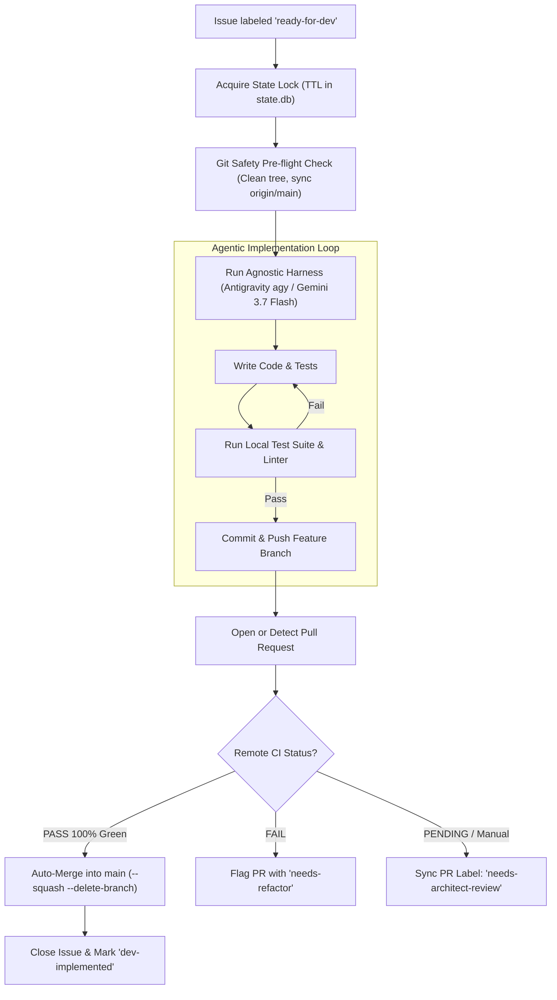

# 3-Amigos DevTest Node (`node-devtest`)

**Module**: [`orchestrator/nodes/devtest.py`](file:///c:/Users/rogal/workspaces/ws-setups/graph-engineering/orchestrator/nodes/devtest.py)

The **DevTest Node** acts as Node 2 in the pipeline—responsible for test-driven code implementation, local test suite verification, and pull request creation.

---

## 🏛️ Operational Flow



---

## 🔑 Operational Capabilities

1. **Deterministic Git Safety Pre-Flight & Worktree Isolation**:
   - Verifies that `local_path` is a valid git repository whose remote origin matches `project.repo`.
   - Operates in its dedicated ephemeral git worktree (`.graph/worktrees/devtest_<project>`) managed via `WorktreeManager`, ensuring parallel non-destructive execution without index locking collisions.
   - Cleans the worktree, checks out `main`, and pulls latest upstream commits prior to execution.

2. **Agnostic Harness & Local OAuth Execution**:
   - Executes via the configured harness adapter (`antigravity`, `claude`, or `devin`).
   - Configured with extended print timeouts (`--print-timeout 45m`) for long multi-step compilation and testing runs.

3. **Autonomous E2E Verification & Auto-Merge**:
   - If the AI harness autonomously branches (`feat/issue-<id>`), commits, and creates a Pull Request via GitHub CLI (or via fallback commit/push), DevTest validates remote GitHub Actions CI checks (`check_pr_ci_status`).
   - If CI checks pass **100% Green** and `auto_merge_approved: true`, DevTest approves the PR and immediately executes **squash-and-merge** into `main` (`gh pr merge --squash --delete-branch`), closes the parent issue, and records the item as `MERGED` in SDLC memory.
   - If remote CI fails, DevTest tags the PR with **`needs-refactor`** with details on failing checks for autonomous remediation.
   - If manual review is explicitly configured (`auto_merge_approved: false`), attaches **`needs-architect-review`**.

4. **Sequential Subtask Progression & Autonomous Planned Story Promotion**:
   - Checks off completed subtasks in the parent story checklist.
   - Unlocks the next sequential child subtask (transitions label from `queued` to `ready-for-dev`).
   - When 100% of child subtasks are completed and merged, closes the parent story with label `dev-implemented`.
   - Automatically queries SQLite for the oldest planned story (`get_oldest_planned_story`), promotes it to `ACTIVE` (`promote_planned_story`), updates GitHub labels from `planned` to `architect-processed`, and promotes its first child subtask from `queued` to `ready-for-dev`.

5. **Context-Aware Conflict Resolution (Blackboard Pattern)**:
   - Queries the local SQLite Blackboard (`pr_artifacts` table) before execution.
   - If the task is flagged with `APPROVED_WITH_CONFLICT`, DevTest skips full code rewrites and focuses exclusively on reconciling git merge conflicts against `origin/main` without modifying pre-approved architectural contracts.
   - Upon a clean push, marks the PR directly with `architect-approved`, avoiding duplicate review passes.

6. **Self-Healing & Error Isolation**:
   - If the build or tests cannot be resolved, the issue is labeled **`orchestration-failed`** or **`needs-po-review`** with a direct pointer to the execution log in `~/.config/orchestrator/logs/`.

---

## ⚙️ Configuration

Configured in `~/.config/orchestrator/config.yaml`:

```yaml
projects:
  - name: "crosstrainingapp"
    repo: "AntaresAndBharani/crosstrainingapp"
    local_path: "c:/Users/rogal/workspaces/ws-setups/crosstrainingapp"
    nodes:
      devtest:
        enabled: true
        harness: "antigravity"
        model: "gemini-3.7-flash-medium"
        label_trigger: "ready-for-dev"
        label_output: "needs-architect-review"
        branch_prefix: "feat/issue-"
        auto_merge_approved: true
```
