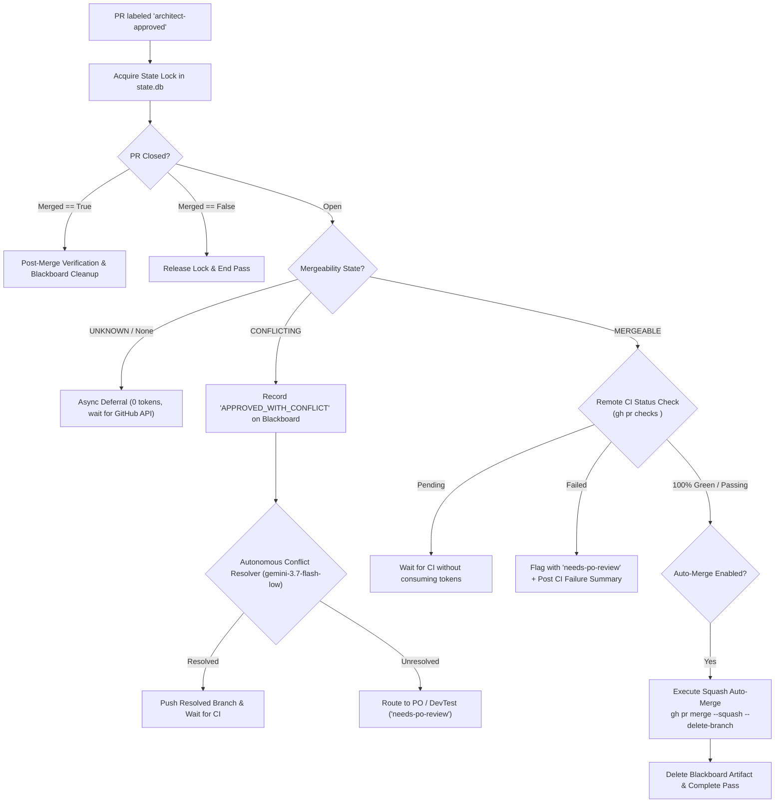

# Reviewer & Gatekeeper Node (`node-reviewer`)

> [!NOTE]
> **Status: Optional / Disabled by Default** (`enabled: false`).  
> In the streamlined 2-node parallel topology, `node-devtest` autonomously handles pre-flight validation, TDD implementation, local test suite execution, remote GitHub Actions CI verification, and squash auto-merge (`auto_merge_approved: true`). `node-reviewer` is dormant by default and can be optionally enabled in `config.yaml` for dedicated dual-pass review gates.

**Module**: [`orchestrator/nodes/reviewer.py`](file:///c:/Users/rogal/workspaces/ws-setups/graph-engineering/orchestrator/nodes/reviewer.py)

The **Reviewer Node** acts as Node 3 in the pipeline—a deterministic quality gatekeeper and Blackboard recorder that verifies remote CI test suites, checks git mergeability, and merges approved PRs into `main`.

---

## 🏛️ Operational Flow & Decoupled Blackboard



---

## 🔑 Operational Capabilities

1. **Zero-Token Idle Gating & Async Deferral**:
   - Queries open pull requests matching `architect-approved` via GitHub CLI.
   - If GitHub is calculating mergeability (`mergeable == UNKNOWN`), cleanly defers with **0 tokens consumed**.

2. **Decoupled Blackboard Integration (`pr_artifacts` table)**:
   - Records structured review decisions (`APPROVED_WITH_CONFLICT`, `CONFLICT_RESOLVED`) into local SQLite blackboard.
   - Allows downstream nodes like DevTest to read pre-approved context and perform targeted git conflict resolution without rewriting code.

3. **Cost-Effective Autonomous Conflict Resolution**:
   - Delegates git merge conflicts specifically to **`antigravity`** using **`gemini-3.7-flash-low`**, saving Claude Sonnet tokens.

4. **Deterministic CI Quality Gate & Squash Auto-Merge**:
   - Evaluates all GitHub Actions CI checks on the PR (`gh pr checks <pr_number>`).
   - Once all CI checks are **100% Green** and mergeable, executes `gh pr merge <pr_number> --squash --delete-branch` and clears the blackboard artifact.

---

## ⚙️ Configuration

Configured in `~/.config/orchestrator/config.yaml`:

```yaml
projects:
  - name: "crosstrainingapp"
    repo: "AntaresAndBharani/crosstrainingapp"
    nodes:
      reviewer:
        enabled: false               # Optional / Disabled by default
        harness: "claude"
        model: "claude-sonnet-5"
        effort: "medium"
        label_trigger: "architect-approved"
        auto_merge_approved: true
        conflict_harness: "antigravity"
        conflict_model: "gemini-3.7-flash-low"
```
