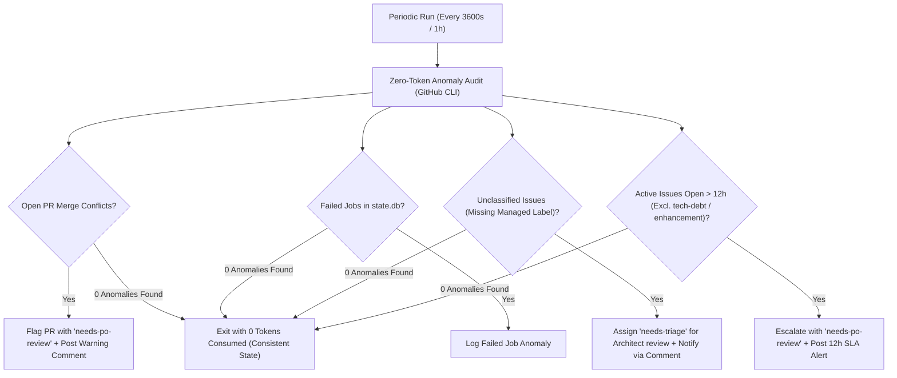

# Consistency Supervisor Node (`node-supervisor`)

**Module**: [`orchestrator/nodes/supervisor.py`](file:///c:/Users/rogal/workspaces/ws-setups/graph-engineering/orchestrator/nodes/supervisor.py)

The **Consistency Supervisor** acts as Node 0 in the pipeline—an autonomous watchdog responsible for repository health verification, taxonomy validation, and SLA enforcement.

---

## 🏛️ Operational Flow



---

## 🔑 Core Capabilities

1. **Deterministic Zero-Token Audits**:
   - Queries GitHub metadata for open PRs and issues via `gh` CLI JSON format.
   - Evaluates rules purely deterministically in Python with zero LLM token consumption.

2. **Issue Status & Taxonomy Validation**:
   - Validates that every open issue carries a valid managed label (`needs-triage`, `ready-for-dev`, `dev-implemented`, `architect-processed`, `needs-po-review`, `orchestration-failed`, `tech-debt`, `enhancement`).
   - If an unclassified issue is opened without labels, the Supervisor automatically assigns **`needs-triage`** so the **Architect Node** can triage and classify it.

3. **12-Hour Stale Issue SLA Monitoring**:
   - Evaluates issue age based on `createdAt`.
   - **Excludes** `tech-debt` and `enhancement` issues (which are safely queued for the daily BAU Node).
   - If an active workflow item remains open for **longer than 12 hours**, the Supervisor flags it with **`needs-po-review`** and posts a diagnostic warning comment.

4. **PR Merge Conflict Detection**:
   - Checks `mergeable` status of all open pull requests.
   - If a PR encounters git merge conflicts (`CONFLICTING`), it attaches `needs-po-review` to prevent review node deadlock.

---

## ⚙️ Configuration

Configured under `nodes.supervisor` in `~/.config/orchestrator/config.yaml`:

```yaml
projects:
  - name: "crosstrainingapp"
    repo: "AntaresAndBharani/crosstrainingapp"
    nodes:
      supervisor:
        enabled: true
        harness: "antigravity"
        model: "gemini-3.7-flash-low"
```
