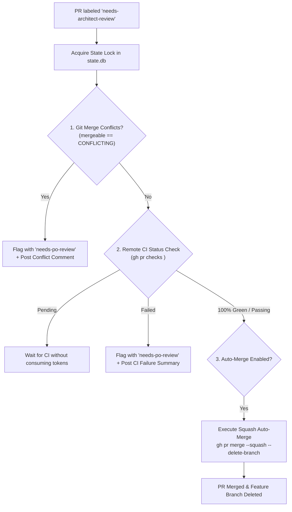

# Reviewer & Gatekeeper Node (`run_reviewer_node`)

The **Reviewer Node** is the deterministic gatekeeper and auto-merge engine of the Graph Engineering pipeline. It verifies remote CI test suites, checks git mergeability, and merges approved PRs into `main`.

---

## 🏛️ Operational Flow



---

## 🔑 Operational Capabilities

1. **Zero-Token Idle Gating**:
   - Queries open pull requests matching `needs-architect-review` via GitHub CLI.
   - When no PRs are waiting, exits with **0 tokens consumed**.

2. **Deterministic CI Quality Gate**:
   - Evaluates all GitHub Actions CI checks on the PR (`gh pr checks <pr_number>`).
   - If any workflow check is failing, the PR is immediately flagged with **`needs-po-review`** with an actionable summary of the failed jobs.
   - If workflows are still running (`PENDING`), the node cleanly pauses and checks again on the next polling cycle.

3. **Deterministic Conflict Detection**:
   - Verifies the PR's mergeability status (`mergeable == "CONFLICTING"`).
   - Prevents stale branches from breaking `main` by escalating conflicted PRs to the developer/PO.

4. **Squash Auto-Merge & Branch Cleanup**:
   - Once all CI checks are **100% Green** and the PR is mergeable, executes `gh pr merge <pr_number> --squash --delete-branch`.
   - Handles GitHub's GraphQL self-review constraints gracefully (bypassing self-approval errors and proceeding directly to squash merge).

---

## ⚙️ Configuration Example

Configured in `~/.config/orchestrator/config.yaml`:

```yaml
projects:
  - name: "crosstrainingapp"
    repo: "AntaresAndBharani/crosstrainingapp"
    nodes:
      reviewer:
        enabled: true
        harness: "claude"
        model: "claude-sonnet-5"
        effort: "medium"
        label_trigger: "needs-architect-review"
        auto_merge_approved: true
```
