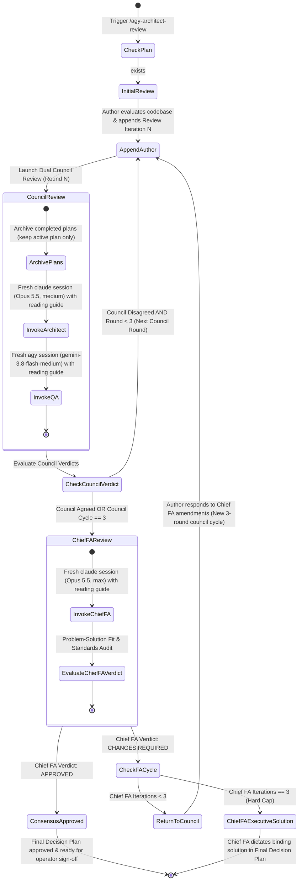

# Two-Tier Architect & QA Cross-Review Workflow (/agy-architect-review)

Use this workflow whenever the user explicitly issues `/agy-architect-review`, `/agy-review`, `/gemini-architect-review`, or asks for an architectural cross-review of an implementation plan. The review protocol is structured into a **Two-Tier Review Council**:
1. **Tier 1: Tri-Party Council:**
   - **Author Agent:** Synthesizes revisions in the plan.
   - **Principal Architect:** **Claude Opus 5.5 (`claude-opus-5-5`, `effort: medium`)** via headless `claude` CLI.
   - **QA Guardian:** **Gemini 3.8 Flash Medium (`gemini-3.8-flash-medium`)** via headless `agy` CLI.
2. **Tier 2: Chief Functional Architect Validation Gate:**
   - **Chief Functional Architect:** **Claude Opus 5.5 (`claude-opus-5-5`, `effort: max`)** via headless `claude` CLI.
   - Audits problem-solution root cause and compliance with industry standards in the *most critical way possible*.

> **Global skill — never copy it into a project.** This skill is shared by every project. Its single source of truth is
> `graph-engineering/skills/agy-architect-review/`, exposed globally through a directory junction at
> `$HOME\.gemini\config\plugins\swarm-dev-core\skills\agy-architect-review` (run `graph-engineering/scripts/link-global-skills.ps1` to recreate it).
> Always invoke the helper script through that global path from the target project's root and pass `--plan "<PLAN>"`.

---

## 📄 Plan File Argument (`--plan <path>`)
Usage: `/agy-architect-review [--plan <path>]` (also `/agy-review`, `/gemini-architect-review`); `--path` and `--file` are accepted as aliases of `--plan`.
- **`<PLAN>`** in this document means the plan file for the current run: the file the operator named for this run (see *Resolving `<PLAN>`* below; absolute, or relative to the target project's root), or `docs/draft-requisites/implementation-plan.md` when no path is given.
- `<PLAN>` must already exist for a council review; if it does not, stop and ask the operator, or run `/refine-story --plan <path>` first to create it.
- Completed plans are archived to an `archive/` folder **next to `<PLAN>`**.

### Resolving `<PLAN>` (mandatory, before any other step)
1. **Any file the operator names for this run IS `<PLAN>`** — whether passed as `--plan <path>`, `--path <path>`, `--file <path>`, or mentioned in the request text (e.g. "review the requirement in `docs/.../impl_x.md`"). That file is both the input and the output: refine it **in place**.
2. Use the default `docs/draft-requisites/implementation-plan.md` **only when the operator names no file at all**.
3. **Hard rule:** when `<PLAN>` is not the default file, never create, write, append to, or archive `docs/draft-requisites/implementation-plan.md` (or any other plan file). Every helper-script call gets `--plan "<PLAN>"` with exactly that path.
4. **Raw requirement files:** if `<PLAN>` has no `# 📋 Implementation Plan` heading, it has not been refined yet: run `/refine-story --plan "<PLAN>"` first (which converts it in place) instead of reviewing it or writing a plan elsewhere.
5. State the resolved `<PLAN>` path at the start of your first reply, and confirm the exact file you wrote at the end.

---

## 🎯 Purpose & Core Value: Two-Tier Review Council

In complex software design, deep architectural debates between author and systems architects often risk **requirements drift**—technical optimizations, deep refactorings, or abstractions can inadvertently drop, dilute, or over-complicate the operator's original user requirements or neglect user experience. Furthermore, technical consensus within a working council can develop tunnel vision, failing to step back and critically verify whether the architecture actually solves the root problem or adheres to best-in-class industry standards.

To solve this, the review protocol establishes a **Two-Tier Review Council**:

### Tier 1: Tri-Party Council (Working Group)
1. **Author Agent (Synthesizer):** Drafts the initial proposal and synthesizes revisions in response to critiques.
2. **Principal Architect (`claude-opus-5-5`, `effort: medium`):** Scrutinizes systems architecture, concurrency, pipe/lock safety, DB schema integrity, performance, and failure modes.
3. **QA Guardian (`gemini-3.8-flash-medium` via `agy`):** Acts as the **Requirements & UX/UI Guardian**. Strictly enforces that the plan remains 100% faithful to the operator's original requirements, audits the UX/UI experience (or functional correctness if no UI), and verifies Gherkin BDD testability.

### Tier 2: Chief Functional Architect Validation Gate (Executive Validation)
4. **Chief Functional Architect (`claude-opus-5-5`, `effort: max`):** Evaluates the proposal in the *most critical way possible*:
   - **Problem-Solution Fit & Root Cause:** Does the proposed architecture/solution genuinely fix the initial problem, root causes, and user requirements?
   - **Industry Standards & Best Practices:** Does it strictly adhere to modern software architecture, engineering standards, reliability, and security practices?
   - **Iterative Return & Executive Authority:** If changes are required, sends actionable amendments back to the Council for a fresh 3-iteration cycle. If agreement is still not reached after 3 Chief FA iterations (hard cap), the Chief Functional Architect exercises executive authority and **unilaterally dictates the definitive solution**.

### Key Invariants:
1. **Single Medium of Truth:** All communication happens **exclusively** through `<PLAN>` in the target project workspace.
2. **Live File Holds Only the Active Plan:** Completed plans are moved verbatim to `archive/<timestamp>-NN-<slug>.md` next to `<PLAN>` (one file per plan). The audit trail is preserved in the archive; the live file stays small so no reviewer re-reads finished features.
3. **Fresh Session Per Round (No Resume):** Every reviewer invocation is a new session (`claude -p --no-session-persistence` for Architect and Chief FA, `agy -p` without `-c` for QA).
4. **Scoped Reading:** The helper script hands each reviewer exact line ranges to read instead of the whole file. Codebase inspection is limited to files the plan names (~8 files max) and targeted greps.
5. **Blocking vs Non-Blocking Objections:** Reviewers tag every objection `[BLOCKING]` or `[NON-BLOCKING]`. `VERDICT: AGREED` or `VERDICT: APPROVED` is given when no BLOCKING objections remain.
6. **Two-Tier Cadence Gate:** Council debates up to 3 rounds per cycle. Every 3 council rounds (or upon dual council consensus), the proposal advances to the Chief Functional Architect.
7. **Hard 3-Iteration Chief FA Cap:** Capped at 3 Chief Functional Architect review iterations before unilateral executive determination.

---

## 🔄 Lifecycle & State Machine



---

## 🎯 Role Mandates & Rubrics

### 🏛️ Tier 1 - Party 1: Principal Architect (`claude-opus-5-5`, `effort: medium`)
- **Lens:** Systems Architecture, Performance, Scalability & Safety
- **Core Checks:**
  - Database schema, locking, index efficiency, migrations.
  - Subprocess pipe deadlocks, Windows buffer saturation, timeout process killing.
  - Concurrency, race conditions, async task boundaries.
  - Backward compatibility, regression risks on existing pipelines.
- **Section Appended:** `## 🏛️ Architect Review Iteration N` (legacy `## 🏛️ Gemini Architect Review Iteration N` headings are still recognized)

### 🧪 Tier 1 - Party 2: QA Guardian (`gemini-3.8-flash-medium` via `agy`)
- **Lens:** Requirements Fidelity, UX/UI Experience & Functional Correctness
- **Core Checks:**
  - **Anti-Drift Requirement Guardian:** Cross-checks the proposal against the **user's original prompt and stated constraints**. Disallows dropping, over-abstracting, or altering the user's intent.
  - **UX/UI Experience Audit (If UI exists):** Audits layout ergonomics, interactive states (loading, empty, error, active cursor), visual hierarchy, Rich tables, and user feedback.
  - **Functional Correctness Audit (If no UI exists):** Audits behavioral correctness, input validation, error messages returned to user/logs, edge cases (cold-start, network drop, zero-division), and fail-closed safety.
  - **BDD Acceptance Criteria & Testability:** Confirms Gherkin scenarios are complete, unambiguous, and cover nominal and adversarial paths.
- **Section Appended:** `## 🧪 QA Review Iteration N (Requirements & UX/UI Guardian)` (legacy `## 🧪 Claude QA Review Iteration N (Requirements & UX/UI Guardian)` headings are still recognized)

### 🏛️ Tier 2 - Party 3: Chief Functional Architect (`claude-opus-5-5`, `effort: max`)
- **Lens:** Hyper-Critical Problem-Solution Fit, Root Cause & Industry Standards Compliance
- **Core Checks:**
  - **Problem-Solution Fit & Root Cause:** Does the proposed architecture/solution genuinely fix the initial problem, root causes, and user requirements? Has anything essential been omitted, diluted, or swept under the rug?
  - **Industry Standards & Best Practices:** Does the design strictly adhere to modern software architecture standards, robust engineering principles, separation of concerns, testability, and operational resilience?
  - **Executive Authority:** If after 3 Chief FA iterations agreement is still not reached, the Chief Functional Architect unilaterally dictates the definitive solution directly in the Final Decision Plan.
- **Section Appended:** `## 🏛️ Chief Functional Architect Review Iteration M: Problem-Solution & Standards Audit`

---

## 🛠️ Step-by-Step Execution Protocol

### Step 1: Target Plan Verification
Resolve `<PLAN>` following *Resolving `<PLAN>`* above (a file named via `--plan`, `--path`, `--file`, or in the request text; the default path only when no file is named) and ensure it exists:
```powershell
<PLAN>   # e.g. docs/specs/checkout-redesign.md, or the default docs/draft-requisites/implementation-plan.md
```
If the file does not exist, prompt the user or run `/refine-story --plan "<PLAN>"` first to establish the initial proposal.
If it has no `# 📋 Implementation Plan` heading, it is still a raw requirement: run `/refine-story --plan "<PLAN>"` first.

**Never run `--archive` in this workflow.** `--archive` moves *every* plan out of the file, including the one you are about to review. Starting a new feature (and archiving the previous one) belongs to `/refine-story`. The council run below already archives older, finished plans automatically while keeping the active one.

### Step 2: Pre-Review / Counter-Proposal (Round N)
Before council review:
1. Inspect the live codebase (`grep_search`, `view_file`) to verify ground truth — only the files the plan touches.
2. Append the author's iteration to `<PLAN>`:
   ```markdown
   ## 🔍 Review Iteration N (Author Perspective)
   ### 1. Ground Truth Codebase Inspection
   ### 2. Architectural Trade-offs & Proposals
   ### 3. Edge Cases & Resilience Strategy
   ```
3. Keep **exactly one** `## 🎯 Final Decision Plan & User Story Specification` section in the active plan. When revising it, replace that section (and move it to the end of the file) instead of appending another full copy. It is the only section that may be edited in place; all iteration and review sections stay append-only, so the history of what changed lives in the iterations.

### Step 3: Two-Tier Review Execution

#### Option A: Via Python Helper Script (Recommended)
```powershell
python "$HOME\.gemini\config\plugins\swarm-dev-core\skills\agy-architect-review\scripts\agy_cross_review.py" --plan "<PLAN>"
```
The helper script automatically:
- Uses exactly the file given by `--plan` (aliases `--path`, `--file`).
- Archives every completed plan except the active one into `archive/` next to the plan file.
- Builds a per-reviewer reading guide (exact line ranges) for the active plan.
- Runs the Principal Architect (`claude --model claude-opus-5-5 --effort medium`) and QA Guardian (`agy --model gemini-3.8-flash-medium`).
- Upon council dual agreement or reaching 3 council rounds in the cycle, automatically elevates the proposal to the **Chief Functional Architect** (`claude --model claude-opus-5-5 --effort max`).
- Parses verdicts, surfaces `[BLOCKING]` objections and mandated amendments, and manages the two-tier cycle transitions.
- Emits structured JSON summary (`status`, `council_verdict`, `architect_verdict`, `qa_verdict`, `chief_fa_verdict`, `overall_verdict`, `unresolved_points`).

Overrides & Flags:
- `--chief-fa` / `--run-chief-fa`: Force running Chief Functional Architect review directly.
- `--max-rounds <N>`: Maximum council rounds per cycle (default: 3).
- `--max-chief-fa-rounds <M>`: Maximum Chief Functional Architect iterations (default: 3).
- `--skip-chief-fa`: Run council only.
- `--check-status`: Inspect round counts and cycle progress without invoking LLMs.

#### Option B: Direct Shell Invocations
Only when the script cannot be used.

**1. Principal Architect Invocation:**
```powershell
$architect_prompt = @"
You are the Principal Architect conducting Round N of the Architectural Review of '<PLAN>'.
1. Read ONLY: the original proposal, current Final Decision Plan, latest author iteration, and previous review.
2. Tag every objection [BLOCKING] or [NON-BLOCKING].
3. Append a new section: ## 🏛️ Architect Review Iteration N
Conclude with VERDICT: AGREED if no BLOCKING objections, otherwise VERDICT: DISAGREED.
"@
claude -p $architect_prompt --model claude-opus-5-5 --effort medium --no-session-persistence --dangerously-skip-permissions
```

**2. QA Guardian Invocation:**
```powershell
$qa_prompt = @"
You are the QA Lead & Requirements Guardian conducting Round N of the Review of '<PLAN>'.
1. Read ONLY: the original proposal, current Final Decision Plan, latest author iteration, and previous review.
2. Audit Requirements Fidelity (Anti-Drift), UX/UI ergonomics, and BDD testability.
3. Tag every objection [BLOCKING] or [NON-BLOCKING], then append: ## 🧪 QA Review Iteration N (Requirements & UX/UI Guardian)
Conclude with VERDICT: AGREED if no BLOCKING objections, otherwise VERDICT: DISAGREED.
"@
agy -p $qa_prompt --model gemini-3.8-flash-medium --dangerously-skip-permissions --print-timeout 15m
```

**3. Chief Functional Architect Invocation (Every 3 Council Rounds or Council Agreement):**
```powershell
$chief_fa_prompt = @"
You are the Chief Functional Architect conducting Iteration M of the Two-Tier Architectural Review of '<PLAN>'.
Evaluate the proposed solution in the MOST CRITICAL WAY POSSIBLE:
1. Problem-Solution Fit & Root Cause: Does the solution genuinely fix the initial problem and root causes?
2. Industry Standards & Best Practices: Does it strictly adhere to modern software architecture and engineering standards?
3. Append: ## 🏛️ Chief Functional Architect Review Iteration M: Problem-Solution & Standards Audit
Conclude with VERDICT: APPROVED or VERDICT: CHANGES REQUIRED.
If M == 3 and unagreed, provide ### 🎯 Definitive Executive Resolution and dictate final solution in Final Decision Plan.
"@
claude -p $chief_fa_prompt --model claude-opus-5-5 --effort max --no-session-persistence --dangerously-skip-permissions
```

### Step 4: Two-Tier Convergence & Decision Logic

#### Case 1: Council Debates in Progress (Council Disagreed, Round < 3)
- Address `[BLOCKING]` objections under Architect & QA review sections.
- Append `## 🔍 Review Iteration N+1 (Author Response)` and replace the Final Decision Plan section.
- Re-invoke the helper script for Round N+1.

#### Case 2: Chief Functional Architect Approval (`VERDICT: APPROVED`)
- Chief FA confirms problem-solution fit and industry standards compliance.
- Update `## 🎯 Final Decision Plan & User Story Specification` with `Resolution Type: Consensus Agreement (Validated by Chief Functional Architect)`.
- Mark status: **✅ APPROVED BY ARCHITECT, QA & CHIEF FUNCTIONAL ARCHITECT**.
- Present approved plan to the operator.

#### Case 3: Chief Functional Architect Mandates Amendments (Iteration M < 3)
- Chief FA identifies functional deficiencies or standards non-compliance.
- Proposal is returned to the Council for a fresh 3-iteration cycle.
- Author addresses Chief FA amendments in `## 🔍 Review Iteration N+1 (Author Response to Chief Functional Architect)`.
- Return to **Step 3** for the new council cycle.

#### Case 4: Chief Functional Architect Executive Determination (Iteration M == 3 Hard Cap)
- If after 3 Chief FA iterations no agreement has been reached across the council and Chief FA:
- Chief Functional Architect exercises executive authority and **unilaterally dictates the definitive solution**.
- Section `### 🎯 Definitive Executive Resolution` is appended and the Final Decision Plan is updated with `Resolution Type: Chief Functional Architect Executive Determination (3-Round Cap Triggered)`.
- No further debates occur. The definitive solution is presented directly to the operator.

---

## 📋 Document Section Naming Standards

In `<PLAN>`, sections MUST strictly use these headers:
- Plan title (one per feature): `# 📋 Implementation Plan: <feature>`
- Initial plan: `## 📋 Initial Implementation Proposal` (or `## 📝 Initial Draft Proposal`)
- Author reviews: `## 🔍 Review Iteration N (Author Perspective)`
- Principal Architect reviews: `## 🏛️ Architect Review Iteration N`
- QA reviews: `## 🧪 QA Review Iteration N (Requirements & UX/UI Guardian)`
- Chief Functional Architect reviews: `## 🏛️ Chief Functional Architect Review Iteration M: Problem-Solution & Standards Audit`
- Final decision (exactly one, replaced in place): `## 🎯 Final Decision Plan & User Story Specification`

---

## ⚡ Upstream Functional Slicing & Direct DevTest Assignment Protocol

When decomposing requirements during `/agy-architect-review` or `/refine-story`, the Tri-Party Council directly provisions issues for `devtest` execution to bypass runtime Architect triage, completely eliminating runtime token consumption.

### 1. Zero-Token Architect Bypass Invariant
- Runtime Architect Node only activates on issues with label `needs-triage`.
- Pre-refined issues are provisioned with labels `architect-processed`, `ready-for-dev`, and `queued`, consuming **0 LLM tokens** at runtime from the Architect Node.

### 2. Pattern Selection
- **Pattern A (Standalone Task, $\le 300$ LOC, $\le 4$ files):**
  - Create a single issue labeled `ready-for-dev` (no parent, no child).
  - DevTest executes directly via Fallback 1 dispatch and closes the issue upon PR merge.
- **Pattern B (Decomposed Feature Story, $> 300$ LOC):**
  - **Parent Feature Issue:** Created with label `architect-processed` and a markdown checklist `- [ ] #<child_id>` in the body.
  - **Parent Audit Comment:** Post an immediate issue comment on the parent linking all child issue numbers (`Child issues: #101, #102`) for search-lag defense.
  - **Child Slice 1:** Created with label `ready-for-dev` and body starting with `Parent: #<parent_id>`.
  - **Child Slices 2..N:** Created with label `queued` and body starting with `Parent: #<parent_id>`.
  - DevTest executes Slice 1, advances the parent checklist via native `_advance_parent_and_unlock_next_subtask`, unlocks Slice 2 to `ready-for-dev`, and marks the parent `dev-implemented` upon completion.

### 3. Strict Pre-Flight Sizing Gate
- Every functional slice must deliver a vertical capability and touch $\le 4$ files with $\le 300$ estimated LOC diff.
- If any slice exceeds this boundary, the Review Council MUST raise a BLOCKING objection and mandate further sub-slicing prior to consensus approval.

### 4. Single Active Feature Invariant (Operational Protocol)
- Only **one active feature parent story** (`architect-processed`) may be provisioned per project at a time.
- Backlog feature stories remain deferred or unprovisioned without `architect-processed` until the active feature merges and closes, preventing SQLite active story lock starvation.

### 5. Deterministic CLI Automation (`/provision-story`)
- Do NOT provision issues manually. Use the companion skill `/provision-story` or run the deterministic CLI command:
  ```powershell
  python -m orchestrator.cli story provision <project_name>
  ```
- Supports `--dry-run` for pre-flight verification, `--pattern A|B` overrides, and automatic triple-redundant comment posting.
