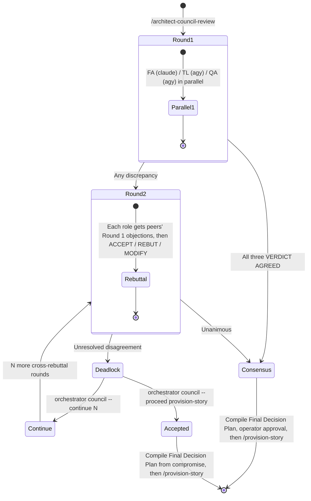

# Architect Council Review (/architect-council-review)

Use this skill when the user runs `/architect-council-review`, `/council-review` or `/council`, or asks for an Architect Council (FA / TL / QA) review of a requirement, draft plan, or git diff.

> **Global skill: never copy it into a project.** The only source of truth is
> `graph-engineering/skills/architect-council-review/`. `graph-engineering/scripts/link-global-skills.ps1` mirrors it to
> `$HOME\.gemini\config\plugins\swarm-dev-core\skills\architect-council-review`.
> Always run the helper script through that global path from the target project's root, or use `orchestrator council`.

---

## 👥 Council Composition

| Role | Harness | Model | Effort | Focus |
|---|---|---|---|---|
| **Functional Architect (FA)** | `claude` (Claude Code CLI) | `claude-opus-5-5` | `high` | Problem fidelity, user story completeness, Given-When-Then precision, scope creep elimination. |
| **Technical Lead (TL)** | `agy` (Antigravity CLI) | `claude-opus-5-5` | `medium` | Implementation feasibility, architectural patterns, minimal change set strictly necessary for the requirements. |
| **Quality Assurance (QA)** | `agy` (Antigravity CLI) | `gemini-3.8-flash-high` | `high` (in the model name) | Regression surface analysis, backwards compatibility, test matrix completeness, contract stability. |

Exact invocations (the script builds them; every round starts a fresh session, never `-c`/`-r`):
- **FA:** `claude -p --model claude-opus-5-5 --effort high --tools "Read,Grep,Glob" --strict-mcp-config --output-format json --no-session-persistence --dangerously-skip-permissions`. The prompt goes through stdin with the plan excerpts inlined.
- **TL:** `agy -p <prompt> --model claude-opus-5-5 --effort medium --dangerously-skip-permissions --print-timeout 20m`
- **QA:** `agy -p <prompt> --model gemini-3.8-flash-high --dangerously-skip-permissions --print-timeout 20m`

Override with `--fa-model/--fa-effort`, `--tl-model/--tl-effort`, `--qa-model/--qa-effort`.

---

## 📄 Plan File (`--plan <path>`)

- `<PLAN>` is the file the operator names for this run (`--plan`, `--path`, `--file`, or a path in the request text). Use the default `docs/draft-requisites/implementation-plan.md` **only when no file is named**. Never touch the default file while another plan file is in use.
- `<PLAN>` is the **only medium**. Every round, the consensus or dossier, and every operator decision is appended to it. The round counter comes from its headings, so a run can be resumed from any machine.
- The input may be a raw task description, a draft requisite, or a refined plan. To review a **git diff**, add `--diff-range <range>` (for example `main...HEAD`). At the start of a session the script appends the diff as `## 🧾 Council Subject: git diff <range>`.
- State the resolved `<PLAN>` at the start of your first reply, and check that the JSON `plan_path` matches it.

---

## 🔄 Deliberation Protocol



### Round 1: Independent Review
1. The script reads the subject from `<PLAN>`. The subject is every non-council section plus the latest `🧾 Council Subject` diff.
2. FA, TL and QA run **in parallel** on their own harnesses. Each one reviews only through its own lens.
3. If all three return `VERDICT: AGREED` with no `[BLOCKING]` objection, the script appends `## ✅ Council Consensus (Round 1)` and stops. Otherwise it continues to Round 2.

### Round 2: Cross-Rebuttal
1. Each role receives its peers' Round 1 reviews (and its own), and must ACCEPT, REBUT or MODIFY every peer objection.
2. A unanimous result appends `## ✅ Council Consensus (Round 2)`.
3. Unresolved disagreement appends `## ⚠️ Council Deadlock Escalation Report (Round 2)` and exits with code `2`.

### Verdict rules (shared by all roles)
- Every objection is tagged `[BLOCKING]` or `[NON-BLOCKING]`. BLOCKING is only for things that would ship a wrong or unsafe result: correctness bugs, data loss, broken contracts or backwards compatibility, dropped or altered requirements, scope creep, or untestable acceptance criteria.
- `VERDICT: AGREED` means the role has no BLOCKING objection. The script treats a missing verdict as `DISAGREED`, and also downgrades `AGREED` to `DISAGREED` when the reply lists a `[BLOCKING]` objection.
- Reviewers reply with fixed `###` sections: `Agreed Points`, `Objections`, `Rebuttals` (Round 2+), `Position`, `Proposed Compromise`, then the verdict. Reviewers **never edit files**. The script appends their replies in FA, TL, QA order, and reverts the plan if a reviewer modified it during the round.

---

## 🛠️ Execution Steps

### Step 1: Resolve `<PLAN>` and inspect the ground truth
Resolve `<PLAN>` as described above. Read the files the subject names (only those) so you can explain the council's findings.

### Step 2: Run the council
```powershell
python "$HOME\.gemini\config\plugins\swarm-dev-core\skills\architect-council-review\scripts\council_review.py" --plan "<PLAN>"
# or, from any project with the orchestrator installed:
orchestrator council --plan "<PLAN>"
# review a git diff instead of / in addition to the plan text:
orchestrator council --plan "<PLAN>" --diff-range main...HEAD
```
The script prints a JSON result: `status`, `round`, `max_rounds`, `verdicts`, `unresolved_points`, `review_flags`, `fa_metrics`, `warnings`, `plan_path`, `plan_source` and `next_action`.

| Exit | `status` | Meaning | What you do |
|---|---|---|---|
| `0` | `consensus` | Unanimous agreement | Compile `## 🎯 Final Decision Plan & User Story Specification` (exactly one, replaced in place) from the subject and the non-blocking notes. Present it for **explicit operator approval**, then run `/provision-story`. |
| `2` | `deadlocked` | No agreement after the round cap | Show the operator the Escalation Report **verbatim** and **stop**. Do not choose for them. |
| `0` | `compromise_accepted` | Operator ran `--proceed` | Compile the Final Decision Plan from the Recommended Compromise, then run `/provision-story`. |
| `1` | `error` | CLI missing, timeout, bad arguments | Report `failures` / `error`. The failed round is **not recorded**, so re-running is safe. |

### Step 3: Operator decision after a deadlock
- `orchestrator council --continue 2` runs 2 more cross-rebuttal rounds. The script appends `## ⏩ Council Continuation: +2 rounds` and raises the cap from 2 to 4.
- `orchestrator council --proceed provision-story` accepts the compromise. The script appends `## ✅ Council Compromise Accepted` and hands off to `/provision-story`.
- Both commands are rejected unless the council is deadlocked. Running the council again while deadlocked, without one of these flags, only repeats the deadlock status (exit `2`).

### Other flags
- `--check-status`: report the council state (`idle`, `in_progress`, `consensus`, `deadlocked`, `compromise_accepted`), rounds completed and the cap, without invoking any LLM.
- `--max-rounds <N>`: rounds before a deadlock is declared (default `2`).
- `--claude-timeout`, `--agy-timeout`: per-reviewer timeouts in seconds (default `1200`).
- `--max-diff-chars`: truncation limit for `--diff-range` (default `200000`).

After a consensus or an accepted compromise, running the council again on the same `<PLAN>` starts a new session at Round 1 (for example, after the plan is revised).

---

## ⚠️ Escalation Dossier Format (Deadlock after Round 2)

The script writes the dossier one heading level lower than the format below, so that it nests inside `<PLAN>`. When reporting it to the operator, use this format:

```markdown
# ⚠️ Council Deadlock Escalation Report

## 1. Consensus Items (Agreed)
- [List of points where FA, TL, and QA agree]

## 2. Disputed Items (Unresolved)
- **FA Position:** [Functional Architect argument]
- **TL Position:** [Technical Lead argument]
- **QA Position:** [QA Lead argument]

## 3. Recommended Compromise
[Council's majority or synthesized mitigation plan]

## 4. Required Action
Select one of the following commands:
- `orchestrator council --continue 2` (Run 2 additional deliberation rounds)
- `orchestrator council --proceed provision-story` (Accept compromise and invoke provision-story)
```

- **Consensus items:** the `Agreed Points` from the last round. Points not endorsed by all three roles show which roles endorsed them.
- **Recommended compromise:** if 2 of 3 roles agree, the majority position is adopted and the dissenters' `Proposed Compromise` is listed as the fix. Without a majority, every role's minimal compromise is combined into one mitigation plan.
- When `<PLAN>` is not the default file, the commands include `--plan "<PLAN>"`.

---

## 📋 Section Naming Standards (in `<PLAN>`)
- Diff subject: `## 🧾 Council Subject: git diff <range>`
- Reviews: `## ⚖️ Council Round N: Functional Architect (FA)` / `Technical Lead (TL)` / `Quality Assurance (QA)`
- Consensus: `## ✅ Council Consensus (Round N)`
- Deadlock: `## ⚠️ Council Deadlock Escalation Report (Round N)`
- Operator continuation: `## ⏩ Council Continuation: +N rounds`
- Operator acceptance: `## ✅ Council Compromise Accepted (Round N)`
- Final spec (written by the agent, exactly one): `## 🎯 Final Decision Plan & User Story Specification`

---

## 🔗 Relationship to Other Skills
- `/refine-story` and `/agy-architect-review` are long, multi-cycle refinement councils. `/architect-council-review` is the **fast triage and gating** council: one parallel round, one rebuttal round, then a human decision.
- The output feeds `/provision-story` (Pattern A / B, Single Active Feature Invariant). Never provision without a consensus or an operator `--proceed`.
