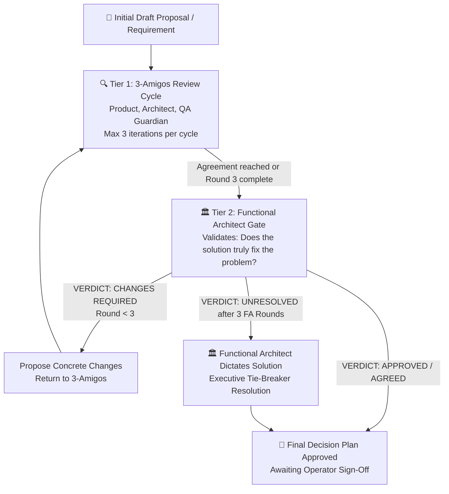

# User Story Refining Workflow (/refine-story, /user-story-refining, --boost)

Use this workflow whenever the user issues `/refine-story`, `/user-story-refining`, `/refine-story --boost`, `/boost`, or asks to critically review and refine a draft user story, requirement, or implementation plan.

## 🤖 Recommended Model
- **Model:** **Gemini 3.8 Flash (High)** (`gemini-3.8-flash-high`)
- **Profile:** Deep analytical reasoning for 3-Amigos critical review, Boost swarm evaluation, Functional Architect problem-solution validation, edge-case vulnerability detection, and pristine BDD Gherkin synthesis.

## 🎯 Purpose
Serves as an uncompromising, hyper-critical **Two-Tier 3-Amigos & Functional Architect Review Gate**. It maintains a persistent, multi-iteration audit trail inside `<PLAN>`—capturing the initial plan, successive 3-Amigos reviews, Functional Architect validations, operator feedback, multi-perspective boost analyses, and the consolidated **Final Decision Plan** from which GitHub Epic stories are produced.

---

## 🏛️ Two-Tier Review Hierarchy & Functional Architect Protocol

The refinement workflow operates across two complementary tiers:



### 👥 Roles & Responsibilities

1. **Tier 1: The 3-Amigos (Implementation & Quality Feasibility)**
   - **Product Owner / Business (Operator / Stakeholder):** Originates requirements, defines user intent, business constraints, and holds the final human approval gate.
   - **Software Architect / Developer (Technical & Ground Truth Lead):** Inspects live codebase ground truth, validates SQLite schemas/Pydantic models, detects anti-patterns (data/class redundancy, breaking changes), designs data flow, and formulates the technical Verdict Matrix (`APPROVE` / `MODIFY` / `REJECT`).
   - **QA Guardian & Tester (Quality & Resilience Lead):** Probes edge cases, failure states, cold-starts, rate limits, non-interactive execution, INVEST slicing (<= 300 LOC, <= 4 files), and formulates rigorous Given/When/Then Gherkin BDD criteria.

2. **Tier 2: The Functional Architect (Problem-Solution Efficacy & Architectural Authority)**
   - **Mission:** High-level problem-solution alignment and systemic fidelity.
   - **Key Evaluative Questions:**
     - *Does the proposed architecture and design actually fix the root problem or business need, or does it merely solve superficial symptoms?*
     - *Does the solution faithfully deliver the user's intent without distortion, omission, or unnecessary architectural bloat?*
     - *Are there unintended operational side-effects, workflow deadlocks, or user experience degradations?*
   - **Verdicts & Transition Paths:**
     - **`VERDICT: APPROVED / AGREED`:** The Functional Architect certifies that the proposed design directly and robustly solves the problem. The plan proceeds to final operator presentation and sign-off.
     - **`VERDICT: CHANGES REQUIRED`:** The Functional Architect details why the proposal fails to solve the problem, proposes concrete structural/functional changes (`## 🏛️ Functional Architect Review Iteration M`), and **sends the plan back to the 3-Amigos for 3 new iterations**.
   - **Hard 3-Round Cap for Functional Architect & Executive Tie-Breaker:**
     - The Functional Architect review gate is strictly capped at **3 review iterations**.
     - If after 3 review cycles by the Functional Architect agreement has still not been reached between the 3-Amigos and the Functional Architect:
       - The iteration loop halts immediately.
       - The **Functional Architect unilaterally provides and dictates the definitive solution**.
       - The Functional Architect directly authors the binding `## 🎯 Final Decision Plan & User Story Specification` (tagged `[Executive Resolution: Dictated by Functional Architect]`), resolving all disputes and unblocking implementation.

---

## 📄 Plan File Argument (`--plan <path>`)
Usage: `/refine-story [--plan <path>] [--boost]` (also `/user-story-refining`, `/boost`). The flags can be combined in any order; `--path` and `--file` are accepted as aliases of `--plan`.
- **`<PLAN>`** in this document means the plan file for the current run: the file the operator named for this run (see *Resolving `<PLAN>`* below; absolute, or relative to the target project's root), or `docs/draft-requisites/implementation-plan.md` when no path is given.
- If `<PLAN>` does not exist yet, create it (including parent folders) and start it with the `# 📋 Implementation Plan` heading from the Living Document Standard below.
- Completed plans are archived to an `archive/` folder **next to `<PLAN>`**.

### Resolving `<PLAN>` (mandatory, before any other step)
1. **Any file the operator names for this run IS `<PLAN>`** — whether passed as `--plan <path>`, `--path <path>`, `--file <path>`, or mentioned in the request text (e.g. "review the requirement in `docs/.../impl_x.md`"). That file is both the input and the output: refine it **in place**.
2. Use the default `docs/draft-requisites/implementation-plan.md` **only when the operator names no file at all**.
3. **Hard rule:** when `<PLAN>` is not the default file, never create, write, append to, or archive `docs/draft-requisites/implementation-plan.md` (or any other plan file). Every helper-script call gets `--plan "<PLAN>"` with exactly that path.
4. **Raw requirement files:** if `<PLAN>` has no `# 📋 Implementation Plan` heading (e.g. it only holds the operator's free-text request), convert it in place: add `# 📋 Implementation Plan: <feature title>` at the top, keep the operator's original text verbatim under `## 📝 Initial Draft Proposal`, then append review iterations and the Final Decision Plan to the same file. Only archive `<PLAN>` when it already holds a *finished* plan and the operator starts a new feature in that same file.
5. State the resolved `<PLAN>` path at the start of your first reply, and confirm the exact file you wrote at the end.

---

## 🚀 Modes of Operation

### 1. Standard Mode (`/refine-story`, `/user-story-refining`)
Executes the rigorous 3-Amigos review: inspecting live codebase ground truth, generating point-by-point verdict matrices, detecting anti-patterns, resolving edge cases, and formulating BDD acceptance criteria with INVEST subtask decomposition.

### 2. Boost Mode (`/refine-story --boost`, `/user-story-refining --boost`, `/boost`)
Activates a deep **360° Multi-Perspective & Adversarial Analysis Swarm**:
- **Lens 1: Architectural & Data Integrity:** Scrutinizes database schemas, CTE query performance, SQLite WAL lock contention, hot-reload safety, and backward compatibility.
- **Lens 2: Adversarial QA & Resilience:** Probes race conditions, zero-token cold-starts, rate-limit replenishment edge cases, timeout hangs, and failure-cascade containment.
- **Lens 3: Security & Governance:** Evaluates non-interactive subprocess security (`GH_PROMPT_DISABLED="1"`), token isolation, and least-privilege worktree sandboxing.
- **Lens 4: Product & INVEST Decomposition:** Enforces strict single-responsibility subtasks with full Given/When/Then Gherkin acceptance criteria.
- **Sequential Thinking State Simulation:** Methodically traces state transitions across normal execution, 3-retry transient failure, and terminal failure quarantine.
- **Adversarial Red-Team Critique:** Identifies the top failure modes of the proposal and mandates concrete structural safeguards.

---

## 🛡️ Core Principles & Golden Rules

1. **Persistent Evolutionary Audit Trail:**
   - Never overwrite or erase prior review iterations in `<PLAN>`.
   - Append each review as a distinct `## 🔍 Review Iteration N` or `## 🚀 Boost Review Iteration N` section and keep the `## 🎯 Final Decision Plan` updated at the bottom as the single source of truth for GitHub issue creation.

2. **Uncompromising Critical Scrutiny:**
   - Never rubber-stamp or provide passive approval.
   - Be relentlessly skeptical: challenge assumptions, unearth hidden complexity, detect redundant tables/classes, and identify potential regressions.

3. **Ground Truth Codebase Verification:**
   - **Never evaluate in a vacuum.** Always inspect the live codebase (`grep_search`, `view_file`) to check existing SQLite schemas, Pydantic models, and method signatures before agreeing to any proposed changes.

4. **No Premature Approval Gate:**
   - **Strict Rule:** **DO NOT** declare approval or suggest moving to implementation unless every technical detail, edge case, schema migration, and backward-compatibility concern is completely resolved and thoroughly documented.

---

## 📂 Living Document Standard: `<PLAN>`

Every refined user story must be tracked in `<PLAN>` following this structure:

```markdown
# 📋 Implementation Plan & Refinement Lifecycle: [Topic / Feature]

## 📝 Initial Draft Proposal
[The original, raw proposal or requisite from the operator/stakeholder]

---

## 🔍 3-Amigos Review Iteration 1: Technical & Implementation Architecture
- **Date / Author:** [YYYY-MM-DD | 3-Amigos Council]
- **Verdict Matrix:** Table of proposed items with APPROVE / MODIFY / REJECT verdicts and technical rationale.
- **Identified Weak Points & Anti-Patterns:** Specific data duplications, class redundancies, or schema flaws.
- **Edge Cases & Resilience Invariants:** Cold starts, zero-division, concurrency, and UTC normalization.

---

## 🚀 Boost Review Iteration [N]: 360° Multi-Perspective Deep Analysis (When in Boost Mode)
- **Date / Author:** [YYYY-MM-DD | Boost Swarm Architect]
- **Architecture & Data Integrity Lens:** [Schema, CTE efficiency, WAL locks, hot-reload safety]
- **Adversarial QA & Resilience Lens:** [Cold-start, timeout, 3-retry budget, zero-token gating]
- **Security & Subprocess Lens:** [Non-interactive flags, environment isolation, worktree safety]
- **Sequential Thinking State Simulation:** [Step-by-step state transition trace]
- **Adversarial Red-Team Critique:** [Top failure vectors and safeguards]

---

## 🏛️ Functional Architect Review Iteration [M]: Problem-Solution Validation
- **Date / Author:** [YYYY-MM-DD | Functional Architect]
- **Verdict:** [APPROVED / CHANGES REQUIRED]
- **Problem-Solution Fit Assessment:** [Does the technical solution genuinely solve the root problem and user intent?]
- **Identified Deficiencies & Functional Gaps:** [Shortcomings, misaligned assumptions, or missing requirements]
- **Mandated Functional Changes:** [Explicit directives for the 3-Amigos to address in the next 3-iteration cycle]

---

## 💬 Review Iteration [N]: Operator / Stakeholder Feedback
- **Date / Author:** [YYYY-MM-DD | Operator]
- [Feedback, adjustments, new constraints, and clarifications added by the user]

---

## 🎯 Final Decision Plan & User Story Specification
[The consolidated, approved source of truth for GitHub Issue creation]
- **Resolution Type:** [Consensus Agreement | Functional Architect Executive Determination (3-Round Cap Triggered)]
- **User Story:** As a... I want... So that...
- **Architecture & Data Flow:** Diagram of data lifecycle and components.
- **BDD Acceptance Criteria:** Minimum 4 Given/When/Then Gherkin scenarios.
- **Component Impact Table:** Exact file paths and modifications.
- **INVEST Subtask Breakdown:** Granular, independently testable subtasks.
```

---

## 📋 Execution Procedure

### Step 1: Ingestion & Ground Truth Research
1. Resolve `<PLAN>` and view it (or the draft prompt/issue). If a finished plan is still in it, archive it first with `python "$HOME\.gemini\config\plugins\swarm-dev-core\skills\agy-architect-review\scripts\agy_cross_review.py" --plan "<PLAN>" --archive`.
2. Cross-reference proposed tables, models, and classes against existing files in `orchestrator/` to detect:
   - **Data Duplication:** Existing tables or ledger structures that already capture the requested telemetry.
   - **Class Duplication:** Existing managers or engines that should be extended rather than duplicated.
   - **Breaking Schema Changes:** Proposed config fields that break legacy configurations.

### Step 2: Tier 1 - 3-Amigos Review Cycle (Up to 3 Iterations)
1. Evaluate each proposal point against architectural invariants, performance, backward compatibility, and resilience.
2. If **Boost Mode** is active:
   - Execute the **4 Analytical Lenses** (Architecture, Adversarial QA, Security, INVEST).
   - Trace sequential state transitions and simulate edge-case failure loops.
   - Formulate the **Adversarial Red-Team Critique**.
3. Append a new section `## 🔍 3-Amigos Review Iteration N` or `## 🚀 Boost Review Iteration N` to `<PLAN>`.
4. The 3-Amigos iterate until consensus is achieved or Round 3 is reached.

### Step 3: Tier 2 - Functional Architect Problem-Solution Gate
1. Once the 3-Amigos reach agreement or finish 3 iterations, evaluate the plan under the **Functional Architect** persona.
2. **Audit Problem-Solution Fit:** Specifically verify whether the proposed architecture/solution **actually fixes the problem or not**:
   - Does it address the fundamental requirement and root cause?
   - Does it omit any critical user journeys or introduce negative side effects?
3. Append `## 🏛️ Functional Architect Review Iteration M`.
4. **Determine Next Step:**
   - **If Approved:** Proceed directly to Step 4.
   - **If Changes Required and FA Iterations < 3:** Document the required changes and return the plan to the 3-Amigos for a fresh 3-iteration cycle (repeat Step 2).
   - **If Unresolved after 3 FA Iterations (Hard Cap):** The Functional Architect exercises executive authority and **unilaterally dictates the definitive solution** directly in the Final Decision Plan (`[Executive Resolution: Dictated by Functional Architect]`).

### Step 4: Synthesize Final Decision Plan & Enforce Approval Gate
1. Update `## 🎯 Final Decision Plan & User Story Specification` at the bottom of `<PLAN>`.
2. Ensure it contains:
   - Resolution Type (Consensus vs Functional Architect Executive Determination).
   - User Story (*As a... I want... So that...*).
   - System Architecture & Data Flow sequence.
   - Full Gherkin BDD Acceptance Criteria (Given / When / Then).
   - Component-by-Component Impact Table.
   - INVEST-compliant subtask breakdown.
3. Present the critical review and updated Final Decision Plan in your chat response.
4. Highlight any unresolved trade-offs or decisions requiring operator input.
5. **STOP and request explicit operator approval.** Do NOT create GitHub issues, branches, or code modifications until the user explicitly confirms approval of the Final Decision Plan.

### Step 5: Issue Creation (Post-Approval & Direct DevTest Provisioning)
Once the user explicitly approves:
1. **Deterministic CLI Provisioning (`/provision-story`):**
   - Execute deterministic provisioning using the companion skill `/provision-story` or directly via CLI:
     ```powershell
     python -m orchestrator.cli story provision <project_name> --file "<PLAN>"
     ```
   - Pre-flight dry run is available via `--dry-run`.
   - The CLI parses `<PLAN>` (always pass `--file "<PLAN>"`; without it the CLI falls back to the default path), verifies the Single Active Feature Invariant, creates issues via `gh` CLI, posts the triple-redundancy comment, and synchronizes SQLite `state.db` with 0 runtime LLM tokens.
2. **Zero-Token Runtime Architect Bypass:** Pre-refined requirements do NOT use `needs-triage` (saving 100% of runtime Architect LLM tokens).
3. **Provisioning Pattern Selection:**
   - **Pattern A (Standalone Task, $\le 300$ LOC, $\le 4$ files):** Single issue labeled `ready-for-dev` directly (no parent, no child). DevTest executes directly via Fallback 1.
   - **Pattern B (Decomposed Feature Story, $> 300$ LOC):**
     - Parent Feature Issue labeled `architect-processed` with markdown checklist `- [ ] #<child_id>` in the body.
     - Immediate comment on Parent issue listing all child issue numbers (`Child issues: #101, #102`) for search-lag defense.
     - Child Slice 1 labeled `ready-for-dev` with `Parent: #<parent_id>` in the body.
     - Child Slices 2..N labeled `queued` with `Parent: #<parent_id>` in the body.
     - DevTest executes Slice 1, advances the parent checklist via native `_advance_parent_and_unlock_next_subtask`, unlocks Slice 2, and closes the parent upon completion.
4. **Single Active Feature Invariant:** Provision only **one active feature parent story** (`architect-processed`) per project at a time. The CLI fails closed if an active story lock is detected. Backlog feature stories remain deferred or unprovisioned without `architect-processed` until the active feature merges.

